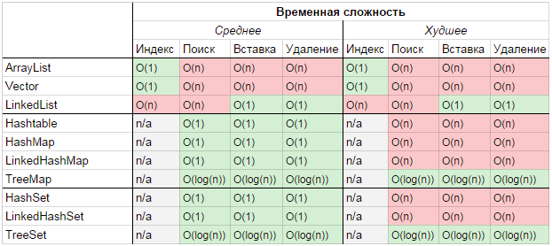

+ [Interface Collection](src/main/java/kovteba/interfacecollection)
    + [Interface List](src/main/java/kovteba/interfacecollection/interfacelist)
        + [Class ArrayList](src/main/java/kovteba/interfacecollection/interfacelist/classarraylist)
        + [Class LinkedList](src/main/java/kovteba/interfacecollection/interfacelist/classlinkedlist)
        + [Class Stack](src/main/java/kovteba/interfacecollection/interfacelist/classstack)
        + [Class Vector](src/main/java/kovteba/interfacecollection/interfacelist/classvector)
        
        
# Java Collection Framework
- __java.util.Collections__ - набор статических методов для работы с коллекциями.
- __java.util.Collection__ - один из основных интерфейсов Java Collections Framework.

На ввершине иерархи __Iterable__

На вершине иерархии в Java Collection Framework располагаются 2 интерфейса: 
1. __Collection__ - простые последовательные наборы элементов. 
2. __Map__ - наборы пар «ключ — значение».

#### Interface Collection
Этот интерфейс находится в составе `JDK 1.2` и определяет основные методы работы с простыми наборами элементов, 
которые будут общими для всех его реализаций (например `size()`, `isEmpty()`, `add(E e)` и др.). Интерфейс был слегка 
доработан с приходом дженериков в `Java 1.5`. Так же в версии `Java 8` было добавлено несколько новых метода для 
работы с лямбдами (такие как `stream()`, `parallelStream()`, `removeIf(Predicate<? super E> filter)` и др.).

#### Interface Map
Данный интерфейс также находится в составе `JDK 1.2` и предоставляет разработчику базовые методы для работы с 
данными вида «ключ — значение». Также как и Collection, он был дополнен дженериками в версии `Java 1.5`и 
в версии `Java 8` появились дополнительные методы для работы с лямбдами, а также методы, которые зачастую 
реализовались в логике приложения (`getOrDefault(Object key, V defaultValue)`, `putIfAbsent(K key, V value)`).

## **Интерфейс "Collection" расширяют интерфейсы:**
+ __Interface List__ Реализации:
    + __ArrayList__
    + __LinkedList__
    + __Vector__
    + __Stack__ 
    
+ __Interface Set__ Реализации:
    + __HashSet__
    + __LinkedHashSet__ 
    + __TreeSet__

+ __Interface Queue__ Реализации:
    + __PriorityQueue__ 
    + __ArrayDeque__ 
    

    

## Interface Set 
- представляет набор уникальных элементов
- описывает неупорядоченную коллекцию

### Class HashSet
- использует HashMap для хранения данных
- порядок элементов не гарантируется при добавлении.
- Class HashSet представляет хеш-таблицу. Он наследует свой функционал от`Class AbstractSet`, а также реализует `Interface Set`.
- Class HashSet не добавляет новых методов, реализуя лишь те, что объявлены в родительских классах и применяемых интерфейсах.

Хеш-таблица представляет такую структуру данных, в которой все объекты имеют уникальный ключ или хеш-код. 
Данный ключ позволяет уникально идентифицировать объект в таблице.

Для создания объекта __HashSet__ можно воспользоваться одним из следующих конструкторов:
- __HashSet()__: создает пустой список
- __HashSet(Collection<? extends E> col)__: создает хеш-таблицу, в которую добавляет все элементы коллекции `col`
- __HashSet(int capacity)__: параметр `capacity` указывает начальную емкость таблицы, которая по умолчанию равна `16`
- __HashSet(int capacity, float koef)__: параметр `koef` или коэффициент заполнения, значение которого должно быть 
    в пределах от 0.0 до 1.0, указывает, насколько должна быть заполнена емкость объектами прежде чем произойдет 
    ее расширение. Например, коэффициент 0.75 указывает, что при заполнении емкости на 3/4 произойдет ее расширение.

### Class LinkedHashSet
- Класс __LinkedHashSet__ расширяет __HashSet__, не добавляя никаких новых методов.
- __LinkedHashSet__ поддерживает связный список элементов набора в том порядке, в котором они вставлялись. 
Это позволяет организовать упорядоченную итерацию вставки в набор.

### Class TreeSet
- предоставляет возможность управлять порядком элементов в коллекции при помощи объекта `Comparator`, либо сохраняет 
    элементы с использованием __«natural ordering»__.

## Interface Queue 
- предназначена для хранения элементов с предопределённым способом вставки и извлечения __FIFO (first-in-first-out)__

### Class PriorityQueue
- предоставляет возможность управлять порядком элементов в коллекции при помощи объекта `Comparator`, 
    либо сохраняет элементы с использованием __«natural ordering»__.

### Class ArrayDeque
- реализация `Interface Deque`, который расширяет `Interface Queue` методами, позволяющими реализовать конструкцию 
    вида __LIFO (last-in-first-out)__.

## Interface "Map" реализован классами:
+ __Hashtable__
+ __HashMap__
+ __LinkedHashMap__
+ __TreeMap__ 
+ __WeakHashMap__

### Class Hashtable 
Реализация такой структуры данных, как хэш-таблица. Она не позволяет использовать `null` в качестве значения или 
ключа и не является упорядоченной. Эта коллекция была реализована раньше, чем Java Collection Framework, 
но в последствии была включена в его состав. Как и другие коллекции из Java 1.0, Hashtable является с
инхронизированной (почти все методы помечены как synchronized). Из-за этой особенности у неё имеются существенные 
проблемы с производительностью и, начиная с Java 1.2, в большинстве случаев рекомендуется использовать другие 
реализации интерфейса Map ввиду отсутствия у них синхронизации.

### Class HashMap
Коллекция является альтернативой Hashtable. Двумя основными отличиями от Hashtable являются то, 
что HashMap не синхронизирована и HashMap позволяет использовать `null` как в качестве ключа, так и значения. 
Так же как и Hashtable, данная коллекция не является упорядоченной: порядок хранения элементов зависит от хэш-функции. 
Добавление элемента выполняется за константное время `O(1)`, но время удаления, получения 
зависит от распределения хэш-функции. В идеале является константным, но может быть и линейным `O(n)`.

### Class LinkedHashMap
Это упорядоченная реализация хэш-таблицы. Здесь, в отличии от HashMap, порядок итерирования равен порядку добавления 
элементов. Данная особенность достигается благодаря двунаправленным связям между элементами (аналогично LinkedList). 
Но это преимущество имеет также и недостаток — увеличение памяти, которое занимет коллекция. 
Более подробная информация изложена в этой статье.

### Class TreeMap
реализация Map основанная на красно-чёрных деревьях. Как и LinkedHashMap является упорядоченной. 
По-умолчанию, коллекция сортируется по ключам с использованием принципа `"natural ordering"`, но это поведение 
может быть настроено под конкретную задачу при помощи объекта Comparator, которые указывается в качестве параметра 
при создании объекта TreeMap.

### Class WeakHashMap
Реализация хэш-таблицы, которая организована с использованием weak references. Другими словами, `Garbage Collector` 
автоматически удалит элемент из коллекции при следующей сборке мусора, если на ключ этого элеметна нет жёстких ссылок.