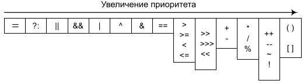
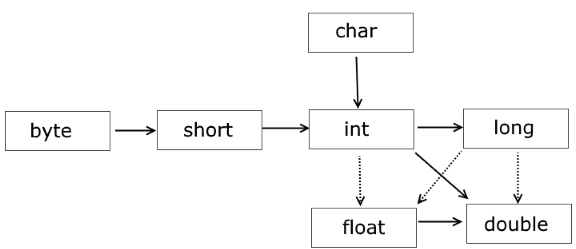
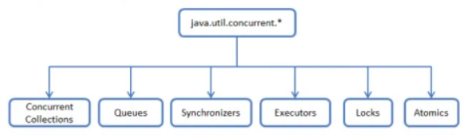
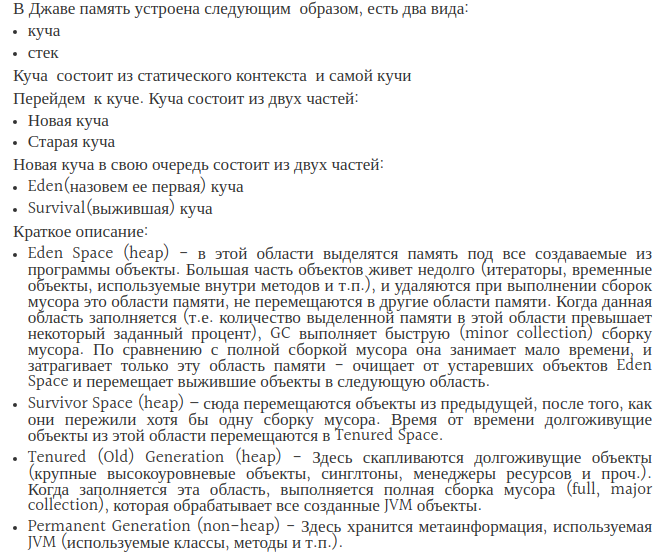
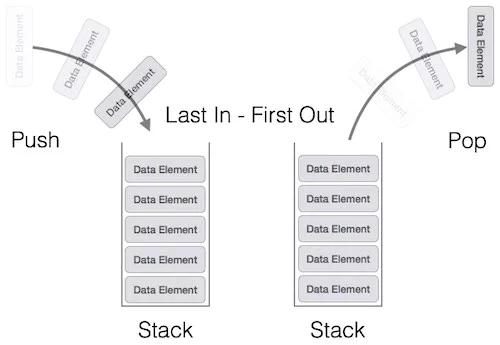
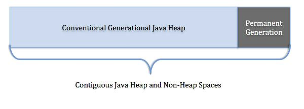
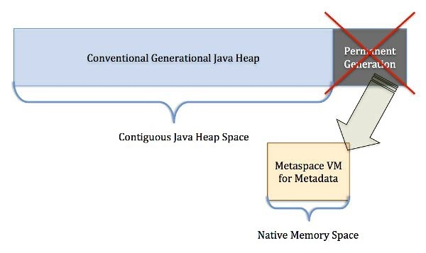
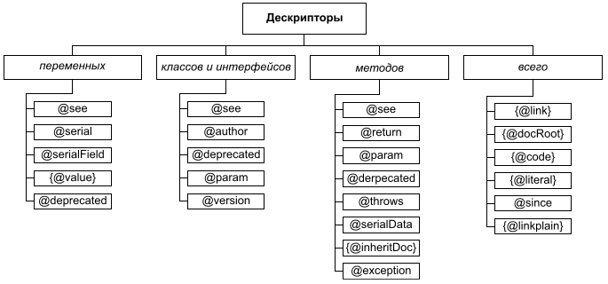

# Java Core.

- [Введение](#Введение)
- [ООП](#ООП)
    - [Инкапсуляция](#Инкапсуляция)
    - [Наследование](#Наследование)
    - [Полиморфизм](#Полиморфизм)
- [Связывание](#Связывание)
    - [Динамическое связывание](#Динамическое-связывание)
- [Ассоциация](#Ассоциация)
    - [Агрегация](#Агрегация)
    - [Композиция](#Композиция)
- [Class](#Class)
- [Объект](#Объект)
- [Структура заголовка объекта](#Структура-заголовка-объекта)
- [SOLID](#SOLID)
- [Coupling](#Coupling)
- [Приоритеты операторов](#Приоритеты-операторов)
- [Логические операции и операторы](#Логические-операции-и-операторы)
- [Побитовые операции](#Побитовые-операции)
- [Class Object. Objects methods](#Class-Object.-Objects-methods)
    - [HashCode](#HashCode)
        - [Назначение HashCode](#Назначение-HashCode)
        - [Контракт HashCode](#Контракт-HashCode)
        - [Правила переопределения HashCode](#Правила-переопределения-HashCode)
    - [Equals](#Equals)
        - [Назначение Equals](#Назначение-Equals)
        - [Контракт Equals](#Контракт-Equals)
        - [Правила переопределения Equals](#Правила-переопределения-Equals)
    - [Реализация hashCode() и equals() в Object](#Реализация-hashCode()-и-equals()-в-Object)
    - [Equals() без hashCode()](#Equals()-без-hashCode())
- [Stateless и Immutable](#Stateless-и-Immutable) - ?????
- [JVM](#JVM)
    - [Функции JVM](#Функции-JVM)
    - [Classloader](#Classloader)
    - [Области данных времени выполнения](#Области-данных-времени-выполнения)
    - [Frames](#Frames)
    - [Execution Engine](#Execution-Engine)
- [Data types](#Data-types)
- [Значения переменных по умолчанию](#Значения-переменных-по-умолчанию)
- [Модификаторы доступа](#Модификаторы-доступа)
- [Модификатор Final](#Модификатор-Final)
- [Модификатор abstract](#Модификатор-abstract)
- [This и Super](#This-и-Super)
- [Оператор break](#Оператор-break)
- [Оператор continue](#Оператор-continue)
- [instanceof](#instanceof)
- [Generics](#Generics)
- [Exception](#Exception)
- [Class types](#Class-types)
- [Garbage Collector](#Garbage-Collector)
- [Concurrency](#Concurrency)
- [Java Collection Framework](#Java-Collection-Framework)
    + [Interface Collection](src/main/java/kovteba/collectionframework/interfacecollection)
        + [Interface List](src/main/java/kovteba/collectionframework/interfacecollection/interfacelist)
            + [Class ArrayList](src/main/java/kovteba/collectionframework/interfacecollection/interfacelist/classarraylist)
            + [Class LinkedList](src/main/java/kovteba/collectionframework/interfacecollection/interfacelist/classlinkedlist)
            + [Class Stack](src/main/java/kovteba/collectionframework/interfacecollection/interfacelist/classstack)
            + [Class Vector](src/main/java/kovteba/collectionframework/interfacecollection/interfacelist/classvector)
        + [Interface Set](src/main/java/kovteba/collectionframework/interfacecollection/interfaceset)
            + [Class HashSet](src/main/java/kovteba/collectionframework/interfacecollection/interfaceset/classhashset)
            + [Class LinkedHashSet](src/main/java/kovteba/collectionframework/interfacecollection/interfaceset/classlinkedhashset)
            + [Class TreeSet](src/main/java/kovteba/collectionframework/interfacecollection/interfaceset/classtreeset)
        + [Interface Queue](src/main/java/kovteba/collectionframework/interfacecollection/interfacequeue)
            + [Interface Deque](src/main/java/kovteba/collectionframework/interfacecollection/interfacequeue/interfacedeque)
                + [Class ArrayDeque](src/main/java/kovteba/collectionframework/interfacecollection/interfacequeue/interfacedeque/classarraydeque)
            + [Class PriorityQueue](src/main/java/kovteba/collectionframework/interfacecollection/interfacequeue/classpriorityqueue)
    + [Interface Map](src/main/java/kovteba/collectionframework/interfacemap)
        + [Class HashMap](src/main/java/kovteba/collectionframework/interfacemap/classhashmap)
        + [Class HashTable](src/main/java/kovteba/collectionframework/interfacemap/classhashtable)
        + [Class LinkedHashMap](src/main/java/kovteba/collectionframework/interfacemap/classlinkedhashmap)
        + [Class TreeMap](src/main/java/kovteba/collectionframework/interfacemap/classtreemap)
        + [Class WeakHashMap](src/main/java/kovteba/collectionframework/interfacemap/classweakhashmap)
- [Блоки инициализации](#Блоки-инициализации)
- [Порядок вызова конструкторов и блоков инициализации с учётом иерархии классов](#Порядок-вызова-конструкторов-и-блоков-инициализации-с-учётом-иерархии-классов)
- [Что произойдёт, если в блоке инициализации возникнет исключительная ситуация?](#Что-произойдёт,-если-в-блоке-инициализации-возникнет-исключительная-ситуация?)
- [Heap и Stack](#Heap-и-Stack)
    - [Heap](Heap#)
    - [Stack](#Stack)
    - [PermGen и Metaspace](#PermGen-и-Metaspace)
- [InputStream, OutputStream](#InputStream,-OutputStream)
- [Reflection](#Reflection)
    - [Reflection Examples](#Reflection-Examples)
        - [Свойства класса](src/main/java/kovteba/reflection#Свойства-класса)
        - [Определение интерфейсов и конструкторов класса](src/main/java/kovteba/reflection#Определение-интерфейсов-и-конструкторов-класса)
        - [Определение полей класса](src/main/java/kovteba/reflection#Определение-полей-класса)
        - [Определение методов класса](src/main/java/kovteba/reflection#Определение-методов-класса)
        - [Вызов метода класса](src/main/java/kovteba/reflection#Вызов-метода-класса)
- [Аннотации](#Аннотации)
    - [List Annotation](#List-Annotation)
    - [Жизненный цикл аннотации](#Жизненный-цикл-аннотации)
    - [К каким элементам можно применять аннотации](#К-каким-элементам-можно-применять-аннотации)
    - [Своя аннотация](#Своя-аннотация)
- [Java 8](#Java-8)
    - [Lambda](#Lambda)
    - [Functional interface](#Functional-interface)
    - [Stream API](#Steam-API)
    - [Optional](#Optional)
    - [Nashorn](#Nashorn)
    - [jjs](#jjs)
    - [LocalDateTime](#LocalDateTime)
    - [ZonedDateTime](#ZonedDateTime)
        - [Examples](src/main/java/kovteba/java8/dateclasses)
    - [Class Java 8 для декодирования, кодирования данных](#Class-Java-8-для-декодирования,-кодирования-данных)
    - [Effectively final](#Effectively-final)
- [Java 9](#Java-9)
    - [Модули (проект Jigsaw)](#Модули-(проект-Jigsaw))
- [RegEx](#RegEx)

---

## Other questions    
- [Чем различаются JRE, JVM и JDK?](#Чем-различаются-JRE,-JVM-и-JDK?)
- [Модификатор volatile](#Модификатор-volatile)
- [Что вы знаете о функции main()?](#Что-вы-знаете-о-функции-main()?)
- [Тернарный оператор](#Тернарный-оператор)
- [Может ли объект получить доступ к члену класса объявленному как private? Если да, то каким образом?](#Может-ли-объект-получить-доступ-к-члену-класса-объявленному-как-private?-Если-да,-то-каким-образом?)
- [К каким конструкциям Java применим модификатор static?](#К-каким-конструкциям-Java-применим-модификатор-static?)
- [Может ли статический метод быть переопределён или перегружен?](#Может-ли-статический-метод-быть-переопределён-или-перегружен?)
- [Могут ли нестатические методы перегрузить статические?](#Могут-ли-нестатические-методы-перегрузить-статические?)
- [Возможно ли при переопределении метода изменить: модификатор доступа, возвращаемый тип, тип аргумента или их количество, имена аргументов или их порядок; убирать, добавлять, изменять порядок следования элементов секции throws?](#Возможно-ли-при-переопределении-метода-изменить:-модификатор-доступа,-возвращаемый-тип,-тип-аргумента-или-их-количество,-имена-аргументов-или-их-порядок;-убирать,-добавлять,-изменять-порядок-следования-элементов-секции-throws?)
- [Можно ли объявить метод абстрактным и статическим одновременно?](#Можно-ли-объявить-метод-абстрактным-и-статическим-одновременно?)
- [В чем разница между членом экземпляра класса и статическим членом класса?](#В-чем-разница-между-членом-экземпляра-класса-и-статическим-членом-класса?)
- [Где разрешена инициализация статических/нестатических полей?](#Где-разрешена-инициализация-статических/нестатических-полей?)
- [Для чего используется оператор assert?](#Для-чего-используется-оператор-assert?)
- [Верно ли утверждение, что примитивные типы данных всегда хранятся в стеке, а экземпляры ссылочных типов данных в куче?](#Верно-ли-утверждени,-что-примитивные-типы-данных-всегда-хранятся-в-стеке,-а-экземпляры-ссылочных-типов-данных-в-куче?)
- [Каким образом передаются переменные в методы, по значению или по ссылке?](#Каким-образом-передаются-переменные-в-методы,-по-значению-или-по-ссылке?)
- [Чем отличаются _final_, _finally_ и _finalize()_?](#Чем-отличаются-_final_,-_finally_-и-_finalize()_?)
- [Приведение типов. Что такое понижение и повышение типа?](#Приведение-типов.-Что-такое-понижение-и-повышение-типа?)
- [Можно ли использовать строки в конструкции switch?](#Можно-ли-использовать-строки-в-конструкции-switch?)
- [«конструктор»](#«конструктор»)
    - [Что такое _«конструктор по умолчанию»_?](#Что-такое-_«конструктор-по-умолчанию»_?)
    - [Чем отличаются конструктор по-умолчанию, конструктор копирования и конструктор с параметрами?](#Чем-отличаются-конструктор-поумолчанию,-конструктор-копирования-и-конструктор-с-параметрами? )
    - [Где и как вы можете использовать приватный конструктор?](#Где-и-как-вы-можете-использовать-приватный-конструктор?)
- [Расскажите про клонирование объектов.](#Расскажите-про-клонирование-объектов.)
    - [В чем отличие между _поверхностным_ и _глубоким_ клонированием?](#В-чем-отличие-между-_поверхностным_-и-_глубоким_-клонированием?)
    - [Какой способ клонирования предпочтительней?](#Какой-способ-клонирования-предпочтительней?)
    - [Почему метод clone() объявлен в классе Object, а не в интерфейсе Cloneable?](#Почему-метод-clone()-объявлен-в-классе-Object,-а-не-в-интерфейсе-Cloneable?)
- [Что такое _«интернационализация»_, _«локализация»_?](#Что-такое-_«интернационализация»_,-_«локализация»_?)
- [Наследует ли класс конструкторы своего суперкласса? НЕТ](#Наследует-ли-класс-конструкторы-своего-суперкласса?-НЕТ)
- [В чем проблемы Random? ](#В-чем-проблемы-Random?)
- [type-erasure](#type-erasure)
- [Какие существуют типы ссылок (reference) на объекты в Java?](#Какие-существуют-типы-ссылок-(reference)-на-объекты-в-Java?)
- [Какими способами можно сконструировать объект в Java? ](#Какими-способами-можно-сконструировать-объект-в-Java? )
- [Serializable, serialVersionUID](#Serializable,-serialVersionUID)
- [HotSpot](#HotSpot)
- [JRockit](#JRockit)
- [OpenJDK](#OpenJDK)
- [Документирование кода](#Документирование-кода)
- [ClassPath](#ClassPath)
- [Атомарность](#Атомарность)
- [](#)
- [-----](#-----)

## Введение
Язык программирования Java был разработан компанией и был представлен как ключевой компонент 
Sun Microsystems Java platform в 1995 году. Этот и год и считается годом выпуска Java 1.0.
С развитием Java были созданы её различные типы:

- J2SE – ключевой функционал языка Java.
- J2EE – для разработки корпоративных приложений
- J2ME – для разработки мобильных приложений

Девизом Java является: `"Write Once, Rune Anywhere"`. Другими словами, речь идёт о кроссплатформенности. 
Они достигается за счёт использования вирутальной машины Java (Java Virtual Machine – JVM).

Сильными сторонами можем назвать такие:

- __Платформо-независимость__
    Наш класс, написанный на Java компилируется в платформо-независимый байт-код, который интерпретируется 
    и исполняется JVM.
- __Простота__
    Синтаксис языка крайне прост в изучении. От нас требуется лишь понимание основ ООП, потому что Java является 
    полностью объекто-ориентированной.
- __Переносимость__
    Тот факт, что Java не реализовывает специфичных аспектов для каждого типа машин, делает программы, написанные 
    с её использованием переносимыми.
- __Объекто-ориентированность__
    Всё сущности в Java являются объектами, что позволяет нам использовать всю мощь ООП.
- __Безопасность__
    Безопасность Java позволяет разрабатывать ситсемы, защищённые от вирусов и взломов. Авторизация в Java основана 
    на шифровании открытого ключа.
- __Устойчивость__
    Защита от ошибок обеспечивается за счёт проверок во время компиляции и во время непосредственного 
    выполнения программ.
- __Интерпретируемость__
    Байт-код Java транслируется в машинные команды “на лету” и нигде не хранится.
- __Распределённость__
    Java разработана для распредёленного окружения Internet.
- __Многопоточность__
    Язык поддерживает многопоточность (одновременное выполнение нескольких задач), что позволяет нам создавать 
    хорошо отлаженные приложения
- __Производительность__
    Использование JIT (Just-In-Time) компилятора, позволяет достигать высоких показателей.

---

## ООП 
Методология программирования, основанная на представлении программного продукта в виде совокупности объектов, каждый 
из которых является экземпляром конкретного класса. __ООП__ использует в качестве базовых элементов взаимодействие объектов.

- Инкапсуляции;
- Наследования;
- Полиморфизма;
- Абстракция;

Краеугольным камнем наследования и полиморфизма предстает следующая парадигма: __«объект подкласса может 
использоваться всюду, где используется объект суперкласса»__.

### Инкапсуляция
__Инкапсуляция__ (_encapsulation_) — принцип, объединяющий данные и код, манипулирующий этими данными, а также 
защищающий данные от прямого внешнего доступа и неправильного использования. Другими словами, доступ к данным класса 
возможен только посредством методов этого же класса.

```java
public class Encapsulation {
   public static void main(String[] args) {
      Car car = new Car();
      //user does not know how, but it works
      car.accelerator();
      car.brake();
   }
}

class Car {

   //Data hiding
   private String carBrand;

   public String getCarBrand() {
      return carBrand;
   }

   public void setCarBrand(String carBrand) {
      this.carBrand = carBrand;
   }

   //Concealment of implementation
   public void accelerator() {
      //Some kind of complex and incomprehensible process
   }

   public void brake() {
      //Some kind of complex and incomprehensible process
   }
}
```

__Для сокрытия данных используем:__
1. Модификаторы доступа (private, protected, package default)
2. Геттеры и сеттеры

__Пруимущества инкапсуляции:__
1. Контроль за вводимыми данными (В сеттерах можно добавить проверку данных на коректность)
2. Удобно для пользователя, при замене реализации, для пользователя интерфейс взаимодействия не поменяется

### Наследование
__Наследование__ (_inheritance_) — процесс, посредством которого один класс может наследовать свойства другого 
класса и добавлять к ним свойства и методы, характерные только для него.   
Наследование если есть отношение __IS-A__ Car extends Transport

### Полиморфизм
__Полиморфизм__ (_polymorphism_) — механизм, использующий одно и то же имя метода для решения похожих, но 
несколько отличающихся задач в различных объектах при наследовании из одного суперкласса. Целью полиморфизма 
является использование одного имени при выполнении общих для суперкласса и подклассов действий.

**Один интерфейс - много методов**

```java
   public void someMethod(int i){}
   public void someMethod(String s){}
```

---

## Связывание
Виды связывания: 
1. Ранее (статическое)
2. Позднее (динамическое)

__Связывание__ - означает наличие связи между ссылкой и кодом. Например, переменная, на которую вы ссылаетесь, 
привязана к коду, в котором она определена. Аналогично, вызываемый метод привязан к месту в коде, где он определен.

### Динамическое связывание
Механизм __«позднего или динамическое связывания»__ в процессе выполнения программы определяет принадлежность 
объекта конкретному классу и производит вызов метода, относящегося к классу, объект которого был использован. 
Механизм «позднего связывания» позволяет определять версию полиморфного (виртуального) метода во время 
выполнения программы.  
```java
public class Binding {
   public static void main(String[] args) {
      Scanner scanner = new Scanner(System.in);
      do {
         Run run = null;
         System.out.print("Enter value (dog, cat, exit) : ");
         String answer = scanner.next();
         if (answer.equals("exit")) break;
         if (answer.equals("dog")) run = new Dog();
         if (answer.equals("cat")) run = new Cat();
         assert run != null;
         run.run();
      } while (true);
   }
}

interface Run {
   void run();
}

class Cat implements Run {

   @Override
   public void run() {
      System.out.println("Cat run");
   }
}

class Dog implements Run {

   @Override
   public void run() {
      System.out.println("Dog Run");
   }
}
```
```java
class Main {
   public static void main(String[] args) {

      // Пример статического и динамического связывания в Java
      Insurance current = new CarInsurance();

      // Динамическое связывание на основе объекта
      int premium = current.premium();

      // Статическое связывание на основе класса
      String category = current.category();

      System.out.println("premium : " + premium);
      System.out.println("category : " + category);
   }
}

class Insurance {
   public static final int LOW = 100;

   public int premium() {
      return LOW;
   }

   public static String category() {
      return "Insurance";
   }

}

class CarInsurance extends Insurance {
   public static final int HIGH = 200;

   public int premium() {
      return HIGH;
   }

   public static String category() {
      return "Car Insurance";
   }

}
```

---

## Ассоциация
__Ассоциация__ - это отношение, при котором объекты одного типа определенным образом связаны с объектами другого типа. 
Так объект одного типа может содержать или использовать объект другого типа. Например, игрок Player играет в 
определенной команде Team. В этом случае класс Player будет связан отношением ассоциации с классом Team. Таким 
образом, идея ассоциации достаточно простая — два объекта могут быть между собой связаны и это надо как-либо образом 
описать.

В ООП объекты находятся в различных отношениях друг с другом. Один объект может использовать функциональность, которую 
ему предоставляет другой объект. Данный вид отношений __HAS-A__ между объектами называется __ассоциацией__. Существует 
две разновидности __ассоциации__ — __композиция__ и __агрегация__.

Агрегация и композиция являются частными случаями ассоциации. __Агрегация__ - отношение когда один объект является 
частью другого. А __композиция__ - еще более тесная связь, когда объект не только является частью другого объекта, но 
и вообще не может принадлежат другому объекту. Разница будет понятна при рассмотрении реализации этих отношений.

### Агрегация 
Объект класса Halter создается извне Horse и передается в конструктор для установления связи. Если объект класса 
Horse будет удален, объект класса Halter может и дальше использоваться, если, конечно, на него останется ссылка:
```java
public class Horse {
    private Halter halter;
    public Horse(Halter halter) {
        this.halter = halter;
    }
}
```

### Композиция
Теперь посмотрим на реализацию композиции. Объект класса Halter создается в конструкторе, что означает более тесную 
связь между объектами. Объект класса Halter не может существовать без создавшего его объекта Horse
```java
public class Horse {
    private Halter halter;
    public Horse() {
        this.halter = new Halter();
    }
}
```

---

## Class
__Класс (Class)__ – это шаблон описания одного или нескольких объектов. Шаблон (класс) включает свойства, 
определяемые характеристиками объектов (полями объекта) и методами их управления. Поля класса определяют, 
например, такие характеристики объекта, как вес, размер, цвет, площадь и т.д. Методы класса позволяют 
«оперировать» его полями – определять значение (методы set), выдавать значение (методы get) и т.д.

---

## Объект 
Объект представляет экземпляр класса.   
- Именнованная модель реальной сущности, обладающая конкретными значениями свойств и проявляющая свое поведение.
- Обладающий именем набор данных (полей и свойств объекта), физически находящихся в памяти компьютера, и методов, 
    имеющих доступ к ним. Имя используется для работы с полями и методами объекта.
- Любой объект относится к определенному классу. В классе дается обобщенное описание некоторого набора родственных объектов.
- Конкретный экземпляр класса.

---

## Структура заголовка объекта
Каждый экземпляр класса содержит заголовок. Каждый заголовок для большинства JVM(Hotspot, openJVM) состоит из двух 
машинных слов. Если речь идет о _32-х_ разрядной системе, то размер заголовка — __8 байт__, если речь о _64-х_ 
разрядной системе, то соответственно — __16 байт__. Каждый заголовок может содержать следующую информацию:   
- __Маркировочное слово (mark word)__ — ??????
- __Hash Code__ — каждый объект имеет хеш код. По умолчанию результат вызова метода `Object.hashCode()` вернет адрес 
    объекта в памяти, тем не менее некоторые сборщики мусора могут перемещать объекты в памяти, но хеш код всегда 
    остается одним и тем же, так как место в заголовке объекта как раз может быть использовано для хранения 
    оригинального значения хеш кода.
- __Garbage Collection Information__ — каждый java объект содержит информацию нужную для системы управления памятью. 
    Зачастую это один или два бита-флага, но также это может быть, например, некая комбинация битов для хранения 
    количества ссылок на объект.
- __Type Information Block Pointer__ — содержит информацию о типе объекта. Этот блок включает информацию о таблице 
    виртуальных методов, указатель на объект, который представляет тип и указатели на некоторые дополнительные 
    структуры, для более эффективных вызовов интерфейсов и динамической проверки типов.
- __Lock__ — каждый объект содержит информацию о состоянии блокировки. Это может быть указатель на объект 
    блокировки или прямое представление блокировки.
- __Array Length__ — если объект — массив, то заголовок расширяется 4 байтами для хранения длины массива.

---

## SOLID
__Принцип единственной ответственности (The Single Responsibility Principle)__
Каждый класс должен иметь одну и только одну причину для изменений.

__Принцип открытости/закрытости (The Open Closed Principle)__
«программные сущности … должны быть открыты для расширения, но закрыты для модификации». Следуя этому принципу, 
классы разрабатываются так, чтобы для подстройки класса к конкретным условиям применения было достаточно расширить 
его и переопределить некоторые функции.
	
__Принцип подстановки Барбары Лисков (The Liskov Substitution Principle)__
«объекты в программе должны быть заменяемыми на экземпляры их подтипов без изменения правильности выполнения 
программы».  Наследующий класс должен дополнять, а не изменять базовый.  Идея Лисков о «подтипе» дает определение 
понятия замещения: если `S` является подтипом `T`, тогда объекты типа `T` в программе могут быть замещены объектами 
типа `S` без каких-либо изменений желательных свойств этой программы.

__Принцип разделения интерфейса (The Interface Segregation Principle)__
«много интерфейсов, специально предназначенных для клиентов, лучше, чем один интерфейс общего назначения».
	
__Принцип инверсии зависимостей (The Dependency Inversion Principle)__
«Зависимость на Абстракциях. Нет зависимости на что-то конкретное». Модули верхнего уровня не зависят от модулей 
нижнего уровня. Абстракции не должны зависеть от деталей. Детали должны зависеть от абстракций.

---

## Coupling
__Зацепление, сцепление, сопряжение__ способ и степень взаимозависимости между программными модулями; 
сила взаимосвязей между модулями; мера того, насколько взаимозависимы разные подпрограммы или модули.
                                      
Сильное зацепление рассматривается как серьёзный недостаток, поскольку затрудняет понимание логики модулей, их 
модификацию, автономное тестирование, а также переиспользование по отдельности. Слабое зацепление, напротив, 
является признаком хорошо структурированной и хорошо спроектированной системы, и, когда оно комбинируется с 
сильной связностью, соответствует общим показателям хорошей читаемости и сопровождаемости.

Типы зацепления, согласно стандарту ISO/IEC/IEEE 24765-2010, включают:
- зацепление по общей области (англ. common-environment coupling, common coupling);
- зацепление по содержимому (англ. content coupling);
- зацепление по управлению (англ. control coupling);
- зацепление по данным (англ. data coupling, input-output coupling);
- смешанное зацепление (англ. hybrid coupling);
- патологическое зацепление (англ. pathological coupling).

__Зацепление по общей области__   
Тип зацепления, при котором два программных модуля совместно используют общую область данных.

__Зацепление по содержимому__  
Тип зацепления, при котором некоторые или все программные модули включены в некоторый модуль как составные части.   

__Зацепление по управлению__   
Тип зацепления, при котором один программный модуль обменивается данными с другим модулем с явной целью повлиять 
на его последующее выполнение.   

__Зацепление по данным__   
Тип зацепления, при котором выходные данные одного программного модуля служат входными данными другого модуля.   

__Смешанное зацепление__
Тип зацепления, при котором различные подмножества значений некоторого элемента данных используются в нескольких 
программных модулях для разных и несвязанных целей.    

__Патологическое зацепление__   
Тип зацепления, при котором один программный модуль зависит от деталей внутренней реализации другого модуля или влияет на них.

---

## Приоритеты операторов
 

---

## Логические операции и операторы
+ `&`: Логическое _AND_ (И);
+ `&&`: Сокращённое _AND_;
+ `|`: Логическое _OR_ (ИЛИ);
+ `||`: Сокращённое _OR_;
+ `^`: Логическое _XOR_ (исключающее _OR_ (ИЛИ));
+ `!`: Логическое унарное _NOT_ (НЕ);
+ `&=`: _AND_ с присваиванием;
+ `|=`: _OR_ с присваиванием;
+ `^=`: _XOR_ с присваиванием;
+ `==`: Равно;
+ `!=`: Не равно;
+ `?:`: Тернарный (троичный) условный оператор.


---
    
## Побитовые операции
+ `~`: Побитовый унарный оператор NOT;
+ `&`: Побитовый AND;
+ `&=`: Побитовый AND с присваиванием;
+ `|`: Побитовый OR;
+ `|=`: Побитовый OR с присваиванием;
+ `^`: Побитовый исключающее XOR;
+ `^=`: Побитовый исключающее XOR с присваиванием;
+ `>>`: Сдвиг вправо (деление на 2 в степени сдвига);
+ `>>=`: Сдвиг вправо с присваиванием;
+ `>>>`: Сдвиг вправо без учёта знака;
+ `>>>=`: Сдвиг вправо без учёта знака с присваиванием;
+ `<<`: Сдвиг влево (умножение на 2 в степени сдвига);
+ `<<=`: Сдвиг влево с присваиванием.    

---
    
## Class Object. Objects methods
`Object` это базовый класс для всех остальных объектов в Java. Любой класс наследуется от `Object` и, соответственно, 
наследуют его методы:  
- `public boolean equals(Object obj)` – служит для сравнения объектов по значению;
- `int hashCode()` – возвращает hash код для объекта;
- `String toString()` – возвращает строковое представление объекта;
- `Class getClass()` – возвращает класс объекта во время выполнения;
- `protected Object clone()` – создает и возвращает копию объекта;
- `void notify()` – возобновляет поток, ожидающий монитор;
- `void notifyAll()` – возобновляет все потоки, ожидающие монитор;
- `void wait()` – остановка вызвавшего метод потока до момента пока другой поток не вызовет метод `notify()` или 
    `notifyAll()` для этого объекта;
- `void wait(long timeout)` – остановка вызвавшего метод потока на определённое время или пока другой поток не вызовет 
    метод `notify()` или `notifyAll()` для этого объекта;
- `void wait(long timeout, int nanos)` – остановка вызвавшего метод потока на определённое время или пока другой поток 
    не вызовет метод `notify()` или `notifyAll()` для этого объекта;
- `protected void finalize()` – может вызываться сборщиком мусора в момент удаления объекта при сборке мусора.

---

## HashCode
Число значений следует из сигнатуры int hashCode() и равно диапазону типа int — 2^32.
### Назначение HashCode
Метод `hashCode()` необходим для вычисления хэш кода переданного в качестве входного параметра объекта.   
__hashCode__ - в Java это целое число, в более широком смыле - битовая строка фиксированной длины, полученная из 
массива произвольной длины.   
Этот метод реализован таким образом, что для одного и того же входного объекта, хэш код всегда будет 
одинаковым. Следует понимать, что в Java множество возможных хэш кодов ограничено типом `int`, а множество объектов 
ничем не ограничено. Из-за этого, вполне возможна ситуация, что хэш коды разных объектов могут совпасть:  
+ если хэш коды разные, то и объекты гарантированно разные;
+ если хэш коды равны, то объекты могут не обязательно равны.

### Контракт HashCode
- для одного и того-же объекта, хеш-код всегда будет одинаковым.
- если объекты одинаковые, то и хеш-коды одинаковые (но не наоборот, см. правило 3).
- если хеш-коды равны, то входные объекты не всегда равны _коллизия_. Вероятность возникновения коллизии зависит от 
    используемого алгоритма генерации хэш кода.
- если хеш-коды разные, то и объекты гарантированно разные; 

### Правила переопределения HashCode
Общий совет: выбирать поля, которые с большой долью вероятности будут различаться. Для этого необходимо 
использовать уникальные, лучше всего примитивные поля, например такие как `id`, `uuid`. При этом нужно следовать 
правилу, если поля задействованы при вычислении `hashCode()`, то они должны быть задействованы и 
при выполнении `equals()`.

---

## Equals
### Назначение Equals
Метод `equals()` - определяет отношение эквивалентности объектов.  
При сравнение объектов с помощью `==` сравнение происходит лишь между ссылками. При сравнении по переопределённому 
разработчиком `equals()` - по внутреннему состоянию объектов. 

### Контракт Equals
- __Рефлексивность__: a==a
- __Симметричность__: a==b, b==a
- __Транзитивность__: a==b, b==c, a==c
- __Консистентность(Непротиворечивость)__: Множественные вызовы equals должны возвращать один и тот же результат при
    условии что никакая информация, используемая при сравнении объектов, не поменялась. 
    
### Правила переопределения Equals
1. Использование оператора `==` для проверки, является ли аргумент ссылкой на указанный объект. Если является, 
    возвращается `true`. Если сравниваемый объект `== null`, должно вернуться `false`.
2. Использование оператор `instanceof` и вызова метода `getClass()` для проверки, имеет ли аргумент правильный тип. 
    Если не имеет, возвращается `false`.
3. Приведение аргумента к правильному типу. Поскольку эта операция следует за проверкой `instanceof` она 
    гарантированно будет выполнена.
4. Обход всех значимых полей класса и проверка того, что значение поля в текущем объекте и значение того же 
    поля в проверяемом на эквивалентность аргументе соответствуют друг другу. Если проверки для всех полей прошли 
    успешно, возвращается результат `true`, в противном случае - `false`.  
По окончанию переопределения метода `equals()` следует проверить: является ли порождаемое отношение эквивалентности 
рефлексивным, симметричным, транзитивным и непротиворечивым? Если ответ отрицательный, метод подлежит 
соответствующей правке.  

---

## Реализация hashCode() и equals() в Object
Реализация метода `Object.equals()` сводится к проверке на равенство двух ссылок:
```java
public boolean equals(Object obj) {
  return (this == obj);
}
```  
Реализация метода `Object.hashCode()` описана как `native`, т.е. определенной не с помощью Java кода и обычно 
возвращает адрес объекта в памяти:  
```java 
public native int hashCode();
```

---

## Equals() без hashCode()
Классы и методы, которые используют правила этого контракта могут работать некорректно. Так для `HashMap` это 
может привести к тому, что пара «ключ-значение», которая была в неё помещена при использовании нового экземпляра 
ключа не будет в ней найдена.    

--- 

## JVM
__Виртуальная машина Java (Java Virtual Machine)__ - это механизм, предоставляющий среду выполнения для управления 
Java-кодом или приложениями. Виртуальная машина является независимой оболочкой исполнения кода, благодаря которой 
возможен её запуск на любой ОС, без влияния ОС на выполняемую программу.   

JVM работает с 2мя типами данных: примитивные типы (primitive types) и ссылочные типы (reference types).

**Примитивы**

JVM работает с примитивными значениями (целыми числами и числами с плавающей точкой). По сути, JVM - это 32-битная машина. 
Типы `long` и `double`, которые являются 64-битными, поддерживаются изначально, но занимают две единицы памяти в 
`frame's local` или стеке операндов, поскольку каждая единица составляет 32 бита.
Типы `boolean`, `byte`, `short` и `char` имеют расширенный знак (кроме `char` с нулевым расширением) и работают как 
32-разрядные целые числа, так же как и типы `int`.
Меньшие типы имеют только несколько специфических для типа инструкций для загрузки, хранения и преобразования типов.
`boolean` значение работает как 8-битное `byte` значения, где 0 представляет значение **false**, а 1 - значение **true**.

**Типы ссылок и значения**

Существует три типа ссылочных типов: типы классов, типы массивов и типы интерфейсов.
Их значения являются ссылками на динамически создаваемые экземпляры классов, массивы или экземпляры классов или массивы, 
которые реализуют интерфейсы соответственно.

### Функции JVM
- Загрузка, проверка и исполнение байт кода;
- Предоставление среды выполнения для выполнения байт-кода;
- Управление памятью и очисткой мусора (Garbage collection);

### Classloader
Загрузчик классов является частью JRE, которая динамичиски закгружает Java классы в JVM. 
Обычно классы загружаются только по запросу. Система исполнения в Java не должна знать о файлах и файловых системах
благодаря загрузчику классов. __Делегирование является важной концепцией__, которую выполняет загрузчик. Загрузчик 
классов отвечает за поиск библиотек, чтение их содержимого и загрузку классов, содержащихся в библиотеках. 
Эта загрузка обычно выполняется «по требованию», поскольку она не происходит до тех пор, пока программа не вызовет класс.
Класс с именем может быть загружен только один раз данным загрузчиком классов.

При запуске JVM, используются три загрузчика классов:
- Bootstrap class loader (Загрузчик класса Bootstrap)
- Extensions class loader (Загрузчик класса расширений)
- System class loader (Системный загрузчик классов)

__Базовый загрузчик класса (bootstrap/primordial)__ загружает основные библиотеки Java, расположенные в папке 
`<JAVA_HOME>/jre/lib`. Этот загрузчик является частью ядра JVM, написан на нативном коде.
Загружает основные системные и внутренние классы JDK (_Core API_ - пакеты `java.*` (`rt.jar` и `i18n.jar`) . 
Важно заметить, что базовый загрузчик является _«Изначальным»_ или _«Корневым»_ и частью JVM, вследствие чего его 
нельзя создать внутри кода программы.

__Загрузчик класса расширений (extention)__ загружает код в каталоги расширений.
Загружает различные пакеты расширений, которые располагаются в директории `<JAVA_HOME>/lib/ext` или другой 
директории, описанной в системном параметре `java.ext.dirs`. 
Это позволяет обновлять и добавлять новые расширения без необходимости модифицировать настройки используемых 
приложений. Загрузчик расширений реализован классом `sun.misc.Launcher$ExtClassLoader`.  

__Системный загрузчик(system/application)__. Загружает классы, пути к которым указаны в переменной окружения 
`CLASSPATH` или пути, которые указаны в командной строке запуска JVM после ключей `-classpath` или `-cp`. 
Системный загрузчик реализован классом `sun.misc.Launcher$AppClassLoader`.

Загрузчик классов выполняет три основных действия в строгом порядке: 
* Загрузка: находит и импортирует двоичные данные для типа. 
* Связывание: выполняет проверку, подготовку и (необязательно) разрешение. 
    - Проверка: обеспечивает правильность импортируемого типа. 
    - Подготовка: выделяет память для переменных класса и инициализация памяти значениями по умолчанию. 
    - Разрешение: преобразует символические ссылки из типа в прямые ссылки. 
* Инициализация: вызывает код Java, который инициализирует переменные класса их правильными начальными значениями.

__Пользовательский загрузчик классов__     
Загрузчик классов написан на Java. Поэтому возможно создать свой собственный загрузчик классов, не понимая тонких 
деталей JVM.
У каждого загрузчика классов Java есть родительский загрузчик классов, определенный при создании экземпляра нового 
загрузчика классов или в качестве системного загрузчика классов по умолчанию для виртуальной машины.

Что делает возможным следующее:
* загружать или выгружать классы во время выполнения (например, динамически загружать библиотеки во время выполнения, 
даже из ресурса HTTP).

Это важная особенность для:
    - реализация скриптовых языков;
    - использование bean builders;
    - добавить пользовательскую расширение;
    - позволяя нескольким пространствам имен общаться. Например, это одна из основ протоколов CORBA / RMI;
* изменить способ загрузки байт-кода (например, можно использовать зашифрованный байт-код класса Java);
* модифицировать загруженный байт-код (например, для переплетения аспектов во время загрузки при использовании 
    аспектно-ориентированного программирования);


Загрузчики классов являются иерархическими: каждый из них (кроме базового) имеет родительский загрузчик и в 
большинстве случаев, перед тем как попробовать загрузить класс самостоятельно, он посылает вначале запрос 
родительскому загрузчику загрузить указанный класс. Такое делегирование позволяет загружать классы тем загрузчиком, 
который находится ближе всего к базовому в иерархии делегирования. Как следствие поиск классов будет происходить в 
источниках в порядке их доверия: сначала в библиотеке _Core API_, потом в папке расширений, потом в локальных 
файлах `CLASSPATH`.   


Процесс загрузки класса состоит из трех частей:  
+ _Loading_ – на этой фазе происходит поиск и физическая загрузка файла класса в определенном источнике 
    (в зависимости от загрузчика). Этот процесс определяет базовое представление класса в памяти. На этом этапе 
    такие понятия как «методы», «поля» и т.д. пока не известны.
+ _Linking_ – процесс, который может быть разбит на 3 части:  
    + _Bytecode verification_ – проверка байт-кода на соответствие требованиям определенным в спецификации JVM.
    + _Class preparation_ – создание и инициализация необходимых структур, используемых для представления полей, 
        методов, реализованных интерфейсов и т.п., определенных в загружаемом классе.
    + _Resolving_ – загрузка набора классов, на которые ссылается загружаемый класс.
+ _Initialization_ – вызов статических блоков инициализации и присваивание полям класса значений по умолчанию.  


Динамическая загрузка классов в Java имеет ряд особенностей:  
+ _отложенная (lazy) загрузка и связывание классов_. Загрузка классов производится только при необходимости, 
    что позволяет экономить ресурсы и распределять нагрузку.
+ _проверка корректности загружаемого кода (type safeness)_. Все действия связанные с контролем использования 
    типов производятся только во время загрузки класса, позволяя избежать дополнительной нагрузки во время 
    выполнения кода.
+ _программируемая загрузка_. Пользовательский загрузчик полностью контролирует процесс получения запрошенного 
    класса — самому ли искать байт-код и создавать класс или делегировать создание другому загрузчику. 
    Дополнительно существует возможность выставлять различные атрибуты безопасности для загружаемых классов, 
    позволяя таким образом работать с кодом из ненадежных источников.
+ _множественные пространства имен_. Каждый загрузчик имеет своё пространство имён для создаваемых классов. 
    Соответственно, классы, загруженные двумя различными загрузчиками на основе общего байт-кода, в системе 
    будут различаться.   
Существует несколько способов инициировать загрузку требуемого класса:  
+ явный: вызов `ClassLoader.loadClass()` или `Class.forName()` (по умолчанию используется загрузчик, создавший 
    текущий класс, но есть возможность и явного указания загрузчика);
+ неявный: когда для дальнейшей работы приложения требуется ранее не использованный класс, JVM инициирует его загрузку.

`NoClassDefFoundError` может возникнуть, если нужной библиотеки с этим классом нет в `classpath`
`NoSuchMethodError` может возникнуть из-за несовместимости ваших библиотек, если зависимая библиотека A вызывает 
метод из старой версии библиотеки B, но в classpath есть более новая версия библиотеки B, c другой 
сигнатурой этого метода

### Области данных времени выполнения
Run-Time Data Areas. JVM выделяет множество областей данных во время выполнения, к-рые используются во время 
выполнения программы. Некоторые участки данных созданы JVM во время старта и уничтожаются во время её выключения. 
Другие создаются для каждого потока и уничтожаются когда поток уничтожается.

__The pc Register (PCR)__   
Виртуальная машина Java может поддерживать много потоков исполнения одновременно. Каждый поток виртуальной машины 
Java имеет свой собственный регистр PC (programm counter). В любой момент каждый поток виртуальной машины Java 
выполняет код одного метода, а именно текущий метод для этого потока. Если этот метод не является native, регистр 
pc содержит адрес инструкции виртуальной машины Java, выполняемой в настоящее время.

Коротко говоря: для одного потока существует один PCR, который создается при запуске потока. PCR хранит адрес 
выполняемой сейчас инструкции JVM.

__Java Virtual Machine Stacks__     
Каждый поток в JVM имеет собственный стек, созданный одновременно с потоком. Стек в JVM хранит frames. Cтеки в JVM 
могут иметь фиксированный размер или динамически расширяться и сжиматься в соответствии с требованиями вычислений.

__Heap__    
JVM имеет heap (кучу), которая используется всеми потоками виртуальной машины Java. Куча - это область данных 
времени выполнения, из которой выделяется память для всех экземпляров и массивов классов. Куча создается при 
запуске виртуальной машины. Хранилище для объектов восстанавливается автоматической системой управления данными 
(известной как сборщик мусора); объекты никогда не освобождаются явно. JVM не предполагает какого-либо конкретного 
типа системы автоматического управления хранением данных, и метод управления может быть выбран в соответствии с 
системными требованиями разработчика. Куча может иметь фиксированный размер или может быть расширена в соответствии 
с требованиями вычислений и может быть сокращена, если большая куча становится ненужной. Память для кучи не должна 
быть смежной.

__Method Area__     
JVM имеет область методов, которая является общей для всех потоков. Она хранит структуры для каждого класса, 
такие как пул констант, данные полей и методов, а также код для методов и конструкторов, включая специальные 
методы, используемые при инициализации классов и экземпляров и инициализации интерфейса. Хотя область метода 
является логически частью кучи, простые реализации могут не обрабатываться собиращиком мусора. Область метода 
может иметь фиксированный размер или может быть расширена в соответствии с требованиями вычислений и может 
быть сокращена, если большая область метода становится ненужной.

__Run-Time Constant Pool__       
A run-time constant pool существует для каждого класса или интерфейса в рантайме и представленно constant_pool 
таблицей в *.class файле. Он содержит несколько видов констант: от числовых литералов, известных во время 
компиляции, до ссылок на методы и поля, которые должны быть разрешены во время выполнения. Сам run-time constant 
pool выполняет функцию, аналогичную функции таблицы символов для обычного языка программирования, хотя он содержит 
более широкий диапазон данных, чем типичная таблица символов. Каждый run-time constant pool отделён от 
JVM's method area. JVM создаёт run-time constant pool вместе с созданием class или interface.

__Native Method Stacks__    
Реализация виртуальной машины Java может использовать обычные стеки, обычно называемые «стеки Си», для поддержки 
native methods (методов, написанных на языке, отличном от языка программирования Java).

### Frames
Frame используется для хранения данных и частичных результатов, а также для выполнения динамического связывания, 
возврата значений для методов и отправки исключений. Новый frame создается каждый раз, когда вызывается метод. 
Frame уничтожается, когда завершается вызов метода, является ли это завершение нормальным или резким (он 
генерирует неперехваченное исключение). Frames выделяются из стека потока, создающего frame. Каждый frame имеет 
свой собственный массив локальных переменных, свой собственный стек операндов и ссылку на пул констант во время 
выполнения класса текущего метода. Размеры массива локальных переменных и стека операндов определяются во время 
компиляции и предоставляются вместе с кодом для метода, связанного с фреймом. Таким образом, размер структуры 
данных frame-а зависит только от реализации виртуальной машины Java, и память для этих структур может быть 
выделена одновременно при вызове метода.

Только один frame активен в любой точке данного потока управления - метода выполнения, и это frame называется 
текущим, а его метод известен как текущий метод. Класс, в котором определен текущий метод, является текущим классом. 
Операции над локальными переменными и стеком операндов обычно выполняются со ссылкой на текущий frame.

Frame перестает быть текущим, если его метод вызывает другой метод или если его метод завершается. Когда метод 
вызывается, новый frame создается и становится текущим, когда управление переходит к новому методу. При 
возврате метода текущий frame передает результат вызова метода, если таковой имеется, в предыдущий frame. 
Текущий frame затем отбрасывается, так как предыдущий frame становится текущим. Обратите внимание, что frame, 
созданный потоком, является локальным для этого потока и на него не может ссылаться ни один другой поток.

__Локальные переменные__    
Каждый frame содержит массив переменных, известных как его локальные переменные. Длина массива локальных переменных 
frame определяется во время компиляции и предоставляется в двоичном представлении класса или интерфейса вместе 
с кодом для метода, связанного с frame-ом. Еденичная локальная переменная может хранить значение типа: boolean, 
byte, char, short, int, float, reference, or returnAddress. Пара локальных переменных может хранить значение 
типов: long или double.

Локальные переменные адресуются путем индексации. Индекс первой локальной переменной равен нулю.   
Значение типа long или типа double занимает две последовательные локальные переменные.

JVM использует локальные переменные для передачи параметров при вызове метода. При вызове метода класса все 
параметры передаются в последовательных локальных переменных, начиная с локальной переменной 0. При вызове 
метода экземпляра локальная переменная 0 всегда используется для передачи ссылки на объект, для которого 
вызывается метод экземпляра (this в Java). Любые параметры впоследствии передаются в последовательных 
локальных переменных, начиная с локальной переменной 1.

__Стеки операндов (Operand Stacks)__    
Каждый frame содержит стек «последний вошел - первый вышел» (LIFO), известный как стек операндов. Максимальная 
глубина стека операндов frame-a определяется во время компиляции и предоставляется вместе с кодом для метода, 
связанного с frame-ом.

Стек операнда пуст при создании frame-a, который его содержит. JVM предоставляет инструкции для загрузки 
констант или значений из локальных переменных или полей в стек операндов. Другие инструкции JVM берут 
операнды из стека операндов, оперируют с ними и помещают результат обратно в стек операндов. Стек операндов 
также используется для подготовки параметров для передачи в методы и для получения результатов метода.

Для примера, инструкция iadd суммирует два int-вых значения. От стека операндов требуется, чтобы два int-вых 
значения были наверху стека. Значения удаляются из стека, операция pop. Суммируются и их сумма помещается в 
стек операндов.

__Динамическое связывание (Dynamic Linking)__    
Каждый frame содержит ссылку на run-time constant pool для типа текущего метода для поддержки динамического 
связывания кода метода. Доступ к вызываемым методам и переменным осуществляется через символические ссылки 
из class файла. Динамическое связывание преобразует эти символьные ссылки на методы в конкретные ссылки на 
методы, загружая классы по мере необходимости для разрешения пока еще не определенных символов, и преобразует 
обращения к переменным в соответствующие смещения в структурах хранения, связанных с расположением этих 
переменных во время выполнения.

Позднее связывание методов и переменных вносит изменения в другие классы, которые метод использует с меньшей 
вероятностью нарушить этот код.

__Нормальное завершение вызова метода__     
Вызов метода завершается нормально, если этот вызов не вызывает исключение, либо непосредственно из JVM, либо 
в результате выполнения явного оператора throw. Если вызов текущего метода завершается нормально, то значение 
может быть возвращено вызывающему методу. Это происходит, когда вызванный метод выполняет одну из инструкций 
возврата, выбор которых должен соответствовать типу возвращаемого значения (если оно есть).

Текущий frame используется в этом случае для восстановления состояния инициатора, включая его локальные 
переменные и стек операндов, с соответствующим образом увеличенным программным счетчиком инициатора, чтобы 
пропустить инструкцию вызова метода. Затем выполнение обычно продолжается в frame вызывающего метода с 
возвращенным значением (если оно есть), помещаемым в стек операндов этого frame.

__Резкое завершение вызова метода__    
Вызов метода завершается преждевременно, если при выполнении инструкции JVM в методе выдает исключение, 
и это исключение не обрабатывается в методе. Выполнение команды athrow также приводит к явному выбрасыванию 
исключения, и если исключение не перехватывается текущим методом, приводит к неожиданному завершению вызова 
метода. Вызов метода, который завершается внезапно, никогда не возвращает значение своему вызывающему.

### Execution Engine
Байт-код, назначенный run-time data areas, будет выполнен __execution engine__. Механизм выполнения считывает 
байт-код и выполняет его по частям.

__Interpreter__    
Интерпретатор интерпретирует байт-код быстро, но выполняется медленно. Недостаток интерпретатора заключается 
в том, что когда один метод вызывается несколько раз, каждый раз требуется новая интерпретация.

__JIT Compiler__   
JIT-компилятор устраняет недостатки интерпретатора. Механизм выполнения будет использовать помощь интерпретатора 
при преобразовании байт-кода, но когда он находит повторный код, он использует JIT-компилятор, который 
компилирует весь байт-код и изменяет его на собственный код. Этот нативный код будет использоваться 
непосредственно для повторных вызовов методов, которые улучшают производительность системы.

- Генератор промежуточного кода (Intermediate Code Generator). Производит промежуточный код.
- Code Optimizer. Отвечает за оптимизацию промежуточного кода, сгенерированного выше.
- Генератор целевого кода (Target Code Generator). Отвечает за генерацию машинного кода или родной код.
- Профилировщик (Profiler). Специальный компонент, отвечающий за поиск горячих точек, то есть, вызывается ли метод несколько раз или нет.

---

## Data types
  
+ [Data types](src/main/java/kovteba/datatypes):
    + [Byte (byte)](src/main/java/kovteba/datatypes/byte) : `8bit` : `min: -128 max: 127` 
    + [Short (short)](src/main/java/kovteba/datatypes/short) : `16bit` : `min: -32768 max: 32767`
    + [Character (char)](src/main/java/kovteba/datatypes/character) : `16bit`book
    + [Integer (int)](src/main/java/kovteba/datatypes/integer) : `32bit` : `min: -2147483648 max: 2147483647`
    + [Long (long)](src/main/java/kovteba/datatypes/long) : `64bit` : `min -9223372036854775808L max 9223372036854775807L`
    + [Float (float)](src/main/java/kovteba/datatypes/float) : `32bit` : `min: 1.4e-45f max: 3.4e+38f`
    + [Double (double)](src/main/java/kovteba/datatypes/double) : `64nit` : `min: 4.9e-324 max: 1.7e+308`
    + [Boolean (boolean)](src/main/java/kovteba/datatypes/boolean)
    + [String](src/main/java/kovteba/datatypes/string)
    
---
    
## Значения переменных по умолчанию
+ Числа инициализируются `0` или `0.0`; 
+ `char` — `\u0000`;
+ `boolean` — `false`;
+ Объекты (в том числе `String`) — `null`.

---
    
## Модификаторы доступа
__private__ (приватный): члены класса доступны только внутри класса. Для обозначения используется служебное 
    слово `private`.

__default__, package-private, package level (доступ на уровне пакета): видимость класса/членов класса только 
    внутри пакета. Является модификатором доступа по умолчанию - специальное обозначение не требуется.

__protected__ (защищённый): члены класса доступны внутри пакета и в наследниках. Для обозначения используется   
    служебное слово `protected`.

__public__ (публичный): класс/члены класса доступны всем. Для обозначения используется служебное слово `public`.

Последовательность модификаторов по возрастанию уровня закрытости: public, protected, default, private.  
Во время наследования возможно изменения модификаторов доступа в сторону большей видимости 
(для поддержания соответствия _принципу подстановки Барбары Лисков_).

---

## Модификатор Final
Модификатор `final` может применяться к переменным, параметрам методов, полям и методам класса или самим классам.

+ Класс не может иметь наследников;
+ Метод не может быть переопределен в классах наследниках;
+ Поле не может изменить свое значение после инициализации; (Инициализировано один раз, в логическом блоке 
    инициализации, при объявлении или в конструкторе класса)
+ Параметры методов не могут изменять своё значение внутри метода;
+ Локальные переменные не могут быть изменены после присвоения им значения.

---

## Модификатор abstract
Класс помеченный модификатором `abstract` называется абстрактным классом. Такие классы могут выступать только предками 
для других классов. Создавать экземпляры самого абстрактного класса не разрешается. При этом наследниками абстрактного 
класса могут быть как другие абстрактные классы, так и классы, допускающие создание объектов.

Метод помеченный ключевым словом `abstract` - абстрактный метод, т.е. метод, который не имеет реализации. Если в классе 
присутствует хотя бы один абстрактный метод, то весь класс должен быть объявлен абстрактным.

Использование абстрактных классов и методов позволяет описать некий шаблон объекта, который должен быть реализован в 
других классах. В них же самих описывается лишь некое общее для всех потомков поведение.

---

## This и Super
С помощью ключевого слова `super` мы можем обратиться к любому члену родительского класса - методу или полю, 
если они не определены с модификатором `private`.
```java
super.method();
```
Использование :  
- Задать нижнюю границу generics
- Обратиться к члену родителя который перекриыт
- вызвать конструктор в конструкторе родителя
- в случае неопределенности уточнить тип
```java
interface F1 {
   default void foo(){
      System.out.println("f1");
   }
}
interface F2 {
   default void foo(){
      System.out.println("f1");
   }
}

class C1 implements F1, F2 {
   @Override
   public void foo() {
      F2.super.foo();
   }
}
```

Чтобы обратиться к свойству текущего класса используют this, а к свойству базового класса — super.
```java
class Animal {
   public void eat() {
      System.out.println("animal eat");
   }
}
class Dog extends Animal {
   @Override
   public void eat() {
      System.out.println("Dog eat");
   }

   public void thisEat() {
      this.eat();
   }

   public void superEat() {
      super.eat();
   }
}
```

---

## Оператор break
- завершает последовательность операторов в операторе __switch__   
- позволяет выйти из цикла и в качестве оператора безусловного перехода (goto)
- break как замена goto

```java
for(int i = 0; i < 100; i++) {
    if(i == 5) break; // выходим из цикла, если i равно 5
	mInfoTextView.append("i: " + i + "\n");
}
mInfoTextView.append("Цикл завершён");
```
или
```java
int i = 0;
while(i < 100) {
    if(i == 5) break; // выходим из цикла, если i равно 5
	mInfoTextView.append("i: " + i + "\n");
	i++;
}
mInfoTextView.append("Цикл завершён");
```
При использовании вложенных циклов оператор break осуществляет выход только из самого внутреннего цикла, не 
оказывая влияния на внешний цикл.
```java
for (int i = 1; i < 4; i++) {
	mInfoTextView.append("Проход " + i + ": ");
	for (int j = 0; j < 100; j++) {
		if (j == 5)
			break; // выходим из цикла, если j равно 5
		mInfoTextView.append(j + " ");
	}
	mInfoTextView.append("\n");
}
mInfoTextView.append("Циклы завершёны");
```   
Получим следующий результат:   
```
Проход 1: 0 1 2 3 4
Проход 2: 0 1 2 3 4
Проход 3: 0 1 2 3 4
Циклы завершёны
```

---

## Оператор continue
В циклах while и do-while оператор continue вызывает передачу управления непосредственно управляющему условному 
выражению цикла. В цикле for управление передаётся вначале итерационной части цикла for, а потом условному 
выражению. При этом во всех циклах промежуточный код пропускается.
```java
for (int i = 0; i < 10; i++) {
	mInfoTextView.append(i + " ");
	if (i % 2 == 0)
		continue;
	mInfoTextView.append("\n");
}
```
В этом коде оператор % служит для проверки чётности значения переменной i. Если значение чётное, выполнение 
цикла продолжится дальше, а если нечётное, то произойдёт переход на новую строку. В результате мы получим 
следующий текст:   
```
0 1
2 3
4 5
6 7
8 9
```

---

## instanceof
Оператор `instanceof` позволяет проверить принадлежность объекта к определенному классу/родителю. Выражение 
возвращает `true`, если объект является экземпляром класса или его потомком. В следующем примере демонстрируется 
использование оператора instanceof в различных условиях :
```java
String str = "Hello";
int    i   = 0;
String gstr;

if (str instanceof java.lang.String) {
    // сообщение будет выведено в консоль, 
    // т.к. выражение будет true
    System.out.println("str is String");
}

if (i instanceof Integer) {
    // сообщение будет выведено в консоль, 
    // т.к. i будет упакована в Integer
    System.out.println("i is Integer");
}

if (gstr instanceof java.lang.String) {
    // gstr не инициализирована и поэтому проверка 
    // вернет false для null
    System.out.println("gstr is a String");
}
```

---

## Generics
[__Generics__](src/main/java/kovteba/generics) - это технический термин, обозначающий набор свойств языка позволяющих 
определять и использовать обобщенные типы и методы.   
Обобщенные типы или методы отличаются от обычных тем, что имеют типизированные параметры.  
Примером использования обобщенных типов может служить _Java Collection Framework_.  
Так, класс `LinkedList<E>` - типичный обобщенный тип. Он содержит параметр `E`, который представляет тип элементов, 
которые будут храниться в коллекции. Создание объектов обобщенных типов происходит посредством замены 
параметризированных типов реальными типами данных. Вместо того, чтобы просто использовать `LinkedList`, 
ничего не говоря о типе элемента в списке, предлагается использовать точное указание типа `LinkedList<String>`, 
`LinkedList<Integer>` и т.п.  

---

## Exception
[__Exception__](src/main/java/kovteba/exception) - это проблема(ошибка) возникающая во время выполнения программы. 
Исключения могут возникать во многих случаях, например:  
- Пользователь ввел некорректные данные.
- Файл, к которому обращается программа, не найден.
- Сетевое соединение с сервером было утеряно во время передачи данных. И т.д.
Все исключения в Java являются объектами. Поэтому они могут порождаться не только автоматически при возникновении 
исключительной ситуации, но и создаваться самим разработчиком.

---

## Class types
+ [__Class Types:__](src/main/java/kovteba/classtypes)
    + [Top level class (Обычный класс).](src/main/java/kovteba/classtypes/toplevelclass)
    + [Abstract class (Абстрактный класс).](src/main/java/kovteba/classtypes/abstractclass)
    + [Final class (Финализированный класс).](src/main/java/kovteba/classtypes/finalclass)
    + [Interfaces (Интерфейс).](src/main/java/kovteba/classtypes/interface)
    + [Enum (Перечисление).](src/main/java/kovteba/classtypes/enums)
    + [Nested class (Вложенный класс):](src/main/java/kovteba/classtypes/nestedclass)
        + [Static nested class (Статический вложенный класс);](src/main/java/kovteba/classtypes/nestedclass#Static-nested-class)
        + [Member inner class (Простой внутренний класс);](src/main/java/kovteba/classtypes/nestedclass#Member-inner-class)
        + [Local inner class (Локальный класс);](src/main/java/kovteba/classtypes/nestedclass#Local-inner-class)
        + [Anonymous inner class (Анонимный класс).](src/main/java/kovteba/classtypes/nestedclass#Anonymous-inner-class)
    
---

## Garbage Collector
[Garbage Collector](src/main/java/kovteba/garbagecollector) - это программа, которая работает на виртуальной машине 
Java, который избавляется от объектов, которые больше не используются Java-приложением. Это форма 
автоматического управления памятью.

---

## Concurrency
[__Concurrency__](src/main/java/kovteba/concurrency) – это библиотека классов в Java, в которой собрали специальные 
классы, оптимизированные для работы из нескольких нитей. Эти классы собраны в пакете java.util.concurrent. Их можно 
схематично поделить по функциональному признаку следующим образом: 


---

## Java Collection Framework
[__Java Collection Framework__](src/main/java/kovteba/collectionframework) — иерархия интерфейсов и их реализаций, 
которая является частью `JDK` и позволяет разработчику пользоваться большим количесвом структур данных из «коробки».  

---

## Блоки инициализации
Блоки инициализации представляют собой код, заключенный в фигурные скобки и размещаемый внутри класса вне объявления 
методов или конструкторов.  

__Существует всего два типа блоков__:   
- нестатический (instance initializer)
- статический (class initializer)

__Статический блок используется для инициализации статических переменных, а "обычный"  - для всех остальных.__
 
Несколько блоков инициализации выполняются в порядке следования в коде класса.   
Блок инициализации способен генерировать исключения, если их объявления перечислены в `throws` всех конструкторов класса.  
Блок инициализации возможно создать и в анонимном классе.

Статические блоки инициализация используются для выполнения кода, который должен выполняться один раз при инициализации 
класса загрузчиком классов, в момент предшествующий созданию объектов этого класса при помощи конструктора. Такой блок 
(в отличие от нестатических, принадлежащих конкретном объекту класса) принадлежит только самому классу (объекту 
метакласса `Class`).

---

## Порядок вызова конструкторов и блоков инициализации с учётом иерархии классов
Сначала вызываются все статические блоки в очередности от первого статического блока корневого предка и выше по 
цепочке иерархии до статических блоков самого класса. 

Затем вызываются нестатические блоки инициализации корневого предка, конструктор корневого предка и так далее вплоть 
до нестатических блоков и конструктора самого класса.

>Parent static block(s) → Child static block(s) → Grandchild static block(s)
>
> → Parent non-static block(s) → Parent constructor →
>
> → Child non-static block(s) → Child constructor →
>
> → Grandchild non-static block(s) → Grandchild constructor

Пример 1:

```java
public class MainClass {
    public static void main(String args[]) {
        System.out.println(TestClass.v);
        new TestClass().a();
    }
}
public class TestClass {
    public static String v = "Some val";
    {
        System.out.println("!!! Non-static initializer");
    }
    static {
        System.out.println("!!! Static initializer");
    }
    public void a() {
        System.out.println("!!! a() called");
    }
}
```
Результат выполнения:

```
!!! Static initializer
Some val
!!! Non-static initializer
!!! a() called
```

Пример 2:

```java
public class MainClass {
    public static void main(String args[]) {        
        new TestClass().a();
    }
}
public class TestClass {
    public static String v = "Some val";
    {
        System.out.println("!!! Non-static initializer");
    }
    static {
        System.out.println("!!! Static initializer");
    }
    public void a() {
        System.out.println("!!! a() called");
    }
}
```
Результат выполнения:

```
!!! Static initializer
!!! Non-static initializer
!!! a() called
```

---

## Что произойдёт, если в блоке инициализации возникнет исключительная ситуация?
Для нестатических блоков инициализации, если выбрасывание исключения прописано явным образом требуется, чтобы 
объявления этих исключений были перечислены в `throws` всех конструкторов класса. Иначе будет ошибка компиляции. 
Для статического блока выбрасывание исключения в явном виде, приводит к ошибке компиляции.

В остальных случаях, взаимодействие с исключениями будет проходить так же как и в любом другом месте. Класс не будет 
инициализирован, если ошибка происходит в статическом блоке и объект класса не будет создан, если ошибка возникает в 
нестатическом блоке.

---

## Heap и Stack
### Heap



__Heap (куча)__ используется `Java Runtime` для выделения памяти под объекты и классы. Создание нового объекта также 
происходит в куче. Это же является областью работы сборщика мусора. Любой объект, созданный в куче, имеет глобальный 
доступ и на него могут ссылаться из любой части приложения.

__Основные особенности кучи__:   
- Когда эта область памяти полностью заполняется, Java бросает java.lang.OutOfMemoryError
- Доступ к ней медленнее, чем к стеку
- Эта память, в отличие от стека, автоматически не освобождается. Для сбора неиспользуемых объектов используется 
    сборщик мусора
- В отличие от стека, куча не является потокобезопасной и ее необходимо контролировать, правильно синхронизируя код

### Stack
  
__Stack (стек)__ это область хранения данных также находящееся в общей оперативной памяти (_RAM_). Всякий раз, 
когда вызывается метод, в памяти стека создается новый блок, который содержит примитивы и ссылки на другие объекты 
в методе. Как только метод заканчивает работу, блок также перестает использоваться, тем самым предоставляя доступ 
для следующего метода.
Размер стековой памяти намного меньше объема памяти в куче. Стек в Java работает по схеме 
_LIFO_ (Последний-зашел-Первый-вышел)

__Основные особенности стека__:   
- Он заполняется и освобождается по мере вызова и завершения новых методов
- Переменные в стеке существуют до тех пор, пока выполняется метод в котором они были созданы
- Если память стека будет заполнена, Java бросит исключение java.lang.StackOverFlowError
- Доступ к этой области памяти осуществляется быстрее, чем к куче
- является потокобезопасным, поскольку для каждого потока создается свой отдельный стек

__Различия между _Heap_ и _Stack_ памятью:__
+ Куча используется всеми частями приложения в то время как стек используется только одним потоком исполнения программы.
+ Всякий раз, когда создается объект, он всегда хранится в куче, а в памяти стека содержится лишь ссылка на него. 
    Память стека содержит только локальные переменные примитивных типов и ссылки на объекты в куче.
+ Объекты в куче доступны с любой точке программы, в то время как стековая память не может быть доступна для других потоков.
+ Стековая память существует лишь какое-то время работы программы, а память в куче живет с самого начала до конца 
    работы программы.
+ Если память стека полностью занята, то `Java Runtime` бросает исключение `java.lang.StackOverflowError`. Если 
    заполнена память кучи, то бросается исключение `java.lang.OutOfMemoryError: Java Heap Space`.
+ Размер памяти стека намного меньше памяти в куче. 
+ Из-за простоты распределения памяти, стековая память работает намного быстрее кучи.

Для определения начального и максимального размера памяти в куче используются `-Xms` и `-Xmx` опции JVM. Для стека 
определить размер памяти можно с помощью опции `-Xss`.

### PermGen и Metaspace
Начиная с Java 8, Metaspace заменил PermGen, привнеся некоторые существенные изменения.

__PermGen (Permanent Generation)__ – это специальное место в куче, отделенное от основной памяти.

    

В PermGen виртуальная машина хранит метаданные загруженных классов.   

> ?????? Также здесь находятся всё статическое содержимое приложения, переменные примитивных типов и ссылки на статические объекты.

Более того __PermGen__ хранит данные о байткоде и __JIT__ информацию. До __Java 7__ пул строк также являлся 
частью __PermGen__.

По умолчанию, максимальный размер этой области памяти для _32-х_ битной JVM равен _64 Мб_, а для _64-х_ битной 
версии – _82 Мб_. Однако, вы можете изменять эти значения, используя следующие параметры JVM:   
- `-XX:PermSize=[размер]` для установки минимального размера PermGen области
- `-XX:MaxPermSize=[размер]` для установки максимального размера

Из-за своего ограниченного размера, PermGen является причиной возникновения ошибки 
`java.lang.OutOfMemoryError: PermGen space`. Проще говоря, загрузчики классов не обрабатываются сборщиком 
мусора должным образом, в результате чего появляются утечки памяти. Чаще всего это происходит при создании 
новых загрузчиков.

Эта область памяти была полностью удалена в __JDK 8__.

__Metaspace__ – новая область памяти, появившаяся в 8 версии Java и заменившая устаревшую PermGen. Основное их 
отличие заключается в способе распределения памяти.


По умолчанию, Metaspace увеличивается автоматически. Однако и здесь у нас есть возможность управления памятью:   
- При помощи `MetaspaceSize` и `MaxMetaspaceSize` можно задать границы Metaspace области
- `MinMetaspaceFreeRatio` – минимальный зарезервированный размер памяти для метаданных классов после сборки мусора. 
    Выражается в процентах от общего размера Metaspace области
- `MaxMetaspaceFreeRatio` – максимальный зарезервированный размер памяти для метаданных классов после сборки 
    мусора. Используется для предотвращения сокращения объема пространства, заполнение которого вызывает сборку 
    мусора. Также выражается в процентах от общего размера Metaspace
    
В результате появления __Metaspace__, процесс очистки памяти получил некоторые преимущества. Теперь сборщик мусора 
автоматически удаляет из памяти ненужные классы, когда емкость, выделенная для хранения метаданных, достигает 
максимального значения. Вместе с этим, уменьшилась вероятность получения ошибки `OutOfMemoryError`.

Несмотря на все плюсы, нам все равно необходимо контролировать и, при необходимости, настраивать Metaspace 
чтобы избежать утечек памяти.

__Итоги__    
В этом кратком руководстве мы познакомились с областями памяти PermGen и Metaspace и описали их основные различия.   
PermGen все еще используется в JDK 7 версии и ниже, однако, начиная с JDK 8 эта область памяти была удалена и 
заменена на Metaspace, которая предлагает более гибкое и надежное использование памяти приложениями.

---

## InputStream, OutputStream
[__InputStream, OutputStream__](src/main/java/kovteba/io) - это абстрактное понятие источника или приёмника данных, 
которые способны передавать информацию. Имеется два вида потоков ввода/вывода : байтовые и символьные. К байтовым 
потокам относятся `java.io.InputStream`, `java.io.OutputStream`. Символьные потоки – `java.io.Reader`, `java.io.Writer`. 
Данные потоки включены в пакет java.io.

Базовый класс InputStream и его наследники получают данные из различных источников : массив байтов, строки (String), 
файлы, каналы pipe, у которых одна из сторон является входом, а вторая сторона играет роль выхода и т.д.

Абстрактный класс OutputStream определяет байтовый поток вывода. К этой категории относятся классы, определяющие 
выходные данные, помещаемые в массив байтов, в файл или канал. Напрямую в объект String вывести данные из OutputStream 
нельзя, можно создать текстовую строку (String) из массива байтов.

Символьные потоки включают два основных абстрактных класса Reader и Writer, управляющие потоками Unicode символов. 
Класс Reader определяет символьный поток ввода. Класс Writer определяет символьный поток вывода. При возникновении 
ошибки методы данных классов вызывают исключение IOException.

Потоки ввода данных включают методы read () для чтения отдельных байтов или массива байтов. Потоки вывода данных 
включают методы write () для записи одиночных байтов или массива байтов.

---

## Reflection
__Рефлексия (Reflection)__- это механизм получения данных о программе во время её выполнения (runtime).   
В Java _Reflection_ осуществляется с помощью _Java Reflection API_, состоящего из классов пакетов 
`java.lang` и `java.lang.reflect`.  
Возможности Java Reflection API:   
+ Определение класса объекта;
+ Получение информации о модификаторах класса, полях, методах, конструкторах и суперклассах;
+ Определение интерфейсов, реализуемых классом;
+ Создание экземпляра класса;
+ Получение и установка значений полей объекта;
+ Вызов методов объекта;
+ Создание нового массива.

### Reflection Examples  
- [Свойства класса](src/main/java/kovteba/reflection#Свойства-класса)
- [Определение интерфейсов и конструкторов класса](src/main/java/kovteba/reflection#Определение-интерфейсов-и-конструкторов-класса)
- [Определение полей класса](src/main/java/kovteba/reflection#Определение-полей-класса)
- [Определение методов класса](src/main/java/kovteba/reflection#Определение-методов-класса)
- [Вызов метода класса](src/main/java/kovteba/reflection#Вызов-метода-класса)

---

## Аннотации
__Аннотации__ - это своего рода метатеги, которые добавляются к коду и применяются к объявлению пакетов, классов, 
конструкторов, методов, полей, параметров и локальных переменных. Аннотации всегда обладают некоторой информацией 
и связывают эти "дополнительные данные" и все перечисленные конструкции языка.
Фактически аннотации представляют собой их дополнительные модификаторы, применение которых не влечет за собой 
изменений ранее созданного кода.

__Аннотация выполняет следующие функции:__   
- дает необходимую информацию для компилятора;
- дает информацию различным инструментам для генерации другого кода, конфигураций и т. д.;
- может использоваться во время работы кода;

Самая часто встречаемая аннотация, которую встречал любой программист, даже начинающий это `@Override`.

---

## List Annotation
__java.lang.annotation__:   
- `@Retention` - эта аннотация предназначена для применения только в качестве аннотации к другим аннотациям, 
    позволяет указать жизненный цикл аннотации: будет она присутствовать только в исходном коде, в скомпилированном 
    файле, или она будет также видна и в процессе выполнения. Выбор нужного типа зависит от того, как вы хотите 
    использовать аннотацию.
- `@Documented` - это маркер-интерфейс, который сообщает инструменту, что аннотация должна быть документирована.
- `@Target` - эта аннотация задает тип объявления, к которым может быть применима аннотация. Принимает один аргумент, 
    который должен быть константой из перечисления ElementType, это может быть поле, метод, тип и т.д. Например, 
    чтобы указать, что аннотация применима только к полям и локальным переменным: @Targer({ ElementType.FIELD, 
    ElementTyle.LOCAL_VARIABLE } )
- `@Inherited` - это аннотация-маркер, которая может применяться в другом объявление аннотации, она касается только 
    тех аннотаций, что будут использованы в объявлениях классов. Эта аннотация позволяет аннотации супер класса быть 
    унаследованной в подклассе.

__java.lang__:   
- `@Override` - аннотация-маркер, которая может применяться только к методам. Метод, аннотированный как @Override, 
    должен переопределять метод супер класса.
- `@Deprecated` - указывает, что объявление устарело и должно быть заменено более новой формой.
- `@SafeVarargs` - аннотация-маркер, применяется к методам и конструкторам. Она указывает, что никакие небезопасные 
    действия, связанные с параметром переменного количества аргументов, недопустимы. Применяется только к методам и 
    конструкторам с переменным количеством аргументов, которые объявлены как static или final.
- `@SuppressWarnings` - эта аннотация указывает, что одно или более предупреждений, которые могут быть выданы 
    компилятором следует подавить.
    
---
    
## Жизненный цикл аннотации
Существует 3 возможные варианты чтобы указать где аннотация будет жить. Они инкапсулированы в перечисление 
java.lang.annotation.RetentionPolicy. Это _SOURSE_, _CLASS_, _RUNTIME_.   
- __SOURCE__ - содержаться только в исходном файле и отбрасываются при компиляции.
- __CLASS__ - сохраняются в файле, однако они недоступны JVM во время выполнения.
- __RUNTIME__ - сохраняются в файле во время компиляции и остаются доступными JVM во время выполнения.

---

## К каким элементам можно применять аннотации
Для того чтобы ограничить использование аннотации её нужно проаннотировать.   
Для этого существует аннотация `@Target`.  
- `@Target(ElementType.PACKAGE)` - только для пакетов;
- `@Target(ElementType.TYPE)` - только для классов;
- `@Target(ElementType.CONSTRUCTOR)` - только для конструкторов;
- `@Target(ElementType.METHOD)` - только для методов;
- `@Target(ElementType.FIELD)` - только для атрибутов(переменных) класса;
- `@Target(ElementType.PARAMATER)` - только для параметров метода;
- `@Target(ElementType.LOCAL_VARIABLE)` - только для локальных переменных. 

В случае если вы хотите, что бы ваша аннотация использовалась больше чем для одного типа параметров, то можно 
указать @Target следующим образом:
```java
import java.lang.annotation.ElementType;
import java.lang.annotation.Target;
@Target({ElementType.PARAMETER, ElementType.LOCAL_VARIABLE})
```
тут мы говорим, аннотацию можно использовать только для параметров метода и для локальных переменных.

---

## Своя аннотация
Написать свою аннотацию не так сложно, как могло бы казаться. В следующем коде приведено объявление аннотации.   
```java
public @interface About{
   String info() default "";
}
```
на месте где обычно пишут class или interface у нас написано `@interface`.
Структура практически та же, что и у интерфейсов, только пишется `@interface`.
- @interface - указывает на то, что это аннотация
- default - говорит про то, что метод по умолчанию будет возвращать определённое значение.
Аннотация готова теперь ею можно пользоваться, также аннотацию можно сконфигурировать.

---

## Java 8
## Lambda
[__Лямбда-выражение__](src/main/java/kovteba/java8/lambda) или просто __лямбда__ в Java — упрощённая запись анонимного 
класса, реализующего функциональный интерфейс.

---

## Functional interface
[__Функциональный интерфейс__](src/main/java/kovteba/functionalinterface) в Java — интерфейс, в котором объявлен 
только один абстрактный метод. Однако, методов по умолчанию (default) такой интерфейс может содержать сколько 
угодно, что можно видеть на примере `java.util.function.Function`. Функциональный интерфейс может быть отмечен 
аннотацией `@FunctionalInterface`, но это не обязательное условие, так как JVM считает функциональным любой 
интерфейс с одним абстрактным методом.

---

## Steam API
Начиная с _JDK 8_ в Java появился новый API - [__Stream API__](src/main/java/kovteba/java8/streamapi). Его задача - 
упростить работу с наборами данных, в частности, упростить операции фильтрации, сортировки и другие манипуляции 
с данными. Вся основная функциональность данного API сосредоточена в пакете java.util.stream.

---

## Optional
В релизе Java 8 появился новый класс [`Optional`](src/main/java/kovteba/java8/optional) призванный помочь 
разработчикам в обработке `NullPointerException`. Это контейнер объекта, он может содержать значение или 
некоторый тип `Т`, или просто быть `null`. 

---

## Nashorn
__Nashorn__ - это движок JavaScript, разрабатываемый полностью на Java компанией Oracle.  Он призван дать возможность 
встраивать код JavaScript в приложения Java. В сравнении с Rhino, который поддерживается Mozilla  Foundation, Nashorn 
обеспечивает от 2 до 10 раз более высокую производительность, так как он непосредственно компилирует код в памяти и 
передает байт-код виртуальной машине Java. Nashorn умеет компилировать код JavaScript и генерировать классы Java, 
которые загружаются специальным загрузчиком. Возможен вызов кода Java прямо из JavaScript.

---

## jjs
Nashorn поставляется с cmd-утилитой jjs, которая позволяет исполнять JavaScript прямо в консоли. jjs принимает список 
JavaScript файлов исходного кода и запускает их. Чтобы запустить файл давайте передадим его как аргумент в jjs:
jjs fileName.js

---

## LocalDateTime
LocalDateTime объединяет вместе LocaleDate и LocalTime и содержит дату и время, но без часового пояса в календарной 
системе ISO-8601. Время хранится с точностью до наносекунды, так что в LocalTime можно хранить, например, величину 
"13:45.30.123456789". Есть множество удобных методов, таких как plusMinutes, plusHours, isAfter, toSecondOfDay и т.д.

---

## ZonedDateTime
__ZonedDateTime__ - аналог java.util.Calendar. Это самый мощный класс с полной информацией о временном контексте, 
включает временную зону. Он содержит дату и время в календарной системе ISO-8601.   
- [Examples](src/main/java/kovteba/java8/dateclasses)

---

## Class Java 8 для декодирования, кодирования данных
В _Java 8_ для этого появился класс `public static class Base64.Decoder` - этот класс реализует декодер для 
декодирования байт данных, используя схему кодирования __Base64__ как указано в _RFC 4648_ и _RFC 2045_, класс 
безопасен для использования несколькими параллельными потоками.

В _Java 8_ для этого появился класс `public static class Base64.Encoder` - этот класс реализует  кодер для 
кодирования байт данных, используя схему кодирования Base64 как указано в _RFC 4648_ и _RFC 2045_, класс 
безопасен для использования несколькими параллельными потоками.

__Создать декодеровщик__:   
Используя метод getDecoder() класса Base64 он возвращает декодировщик Base64.Decoder, который декодирует данные с 
помощью схемы кодирования base64.

__Создать кодировщик__:   
Используя метод getEncoder() класса Base64 он возвращает кодировщик Base64.Encoder, который кодирует данные с 
помощью схемы кодирования base64.

---

## Effectively final
С __java 8__ появилось понятие — `effectively final`. Применяется оно только к переменным (в том числе аргументам 
методов). Суть в том, что не смотря на явное отсутствие ключевого слова `final`, значение переменной не изменяется 
после инициализации. Другими словами, к такой переменной можно подставить слово `final` без ошибки компиляции. 
`effectively final` переменные могут быть использованы внутри локальных классов (_Local Inner Classes_), 
анонимных классов (_Anonymous Inner Classes_), стримах (_Stream API_).

---

## Java 9
## Модули (проект Jigsaw)
В __Java 9__ появился долгожданный Project Jigsaw, или же просто модули. Они позволяют сделать приложение меньше в 
обьеме, более инкапсулированным и совершенным.   
Для того чтобы модуль был полноценным, ему нужно добавить `module-info.java`, при чем создан он должен быть строго в 
папке `src`. Содержимое файла, в нашем случае, будет выглядеть так 
```xml
module nodulName {
    exports packageName;
    exports packageName.nextLevelPackageName;
    .....
}
```
Ключевое слово exports используется, чтобы указать какие пакеты из модуля могут использоваться в других модулях.
```xml
module human {
    requires knowledge.base;
}
```
Ключевое слово requires используется, чтобы указать какие модули нужны для работы данного модуля.
```java
import modulName.packageName;
```

---

## RegEx
[__RegEx__](src/main/java/kovteba/regex) – это шаблон для поиска строки в тексте.


## Чем различаются JRE, JVM и JDK?
__JVM__, Java Virtual Machine (Виртуальная машина Java) — основная часть среды времени исполнения Java (JRE). 
    Виртуальная машина Java исполняет байт-код Java, предварительно созданный из исходного текста Java-программы 
    компилятором Java. JVM может также использоваться для выполнения программ, написанных на других языках п
    рограммирования.

__JRE__, Java Runtime Environment (Среда времени выполнения Java) - минимально-необходимая реализация виртуальной 
    машины для исполнения Java-приложений. Состоит из JVM и стандартного набора библиотек классов Java.

__JDK__, Java Development Kit (Комплект разработки на Java) - JRE и набор инструментов разработчика приложений на 
    языке Java, включающий в себя компилятор Java, стандартные библиотеки классов Java, примеры, документацию, 
    различные утилиты.

Коротко: __JDK__ - среда для разработки программ на Java, включающая в себя __JRE__ - среду для обеспечения запуска 
    Java программ, которая в свою очередь содержит __JVM__ - интерпретатор кода Java программ.


## Модификатор volatile
Если вы пометите любую переменную как `volatile`, эта переменная будет считываться из основной памяти, а не из кэша 
центрального процессора, поэтому каждый поток будет иметь обновленное значение в переменной.


## Что вы знаете о функции main()?

Метод `main()` — точка входа в программу. В приложении может быть несколько таких методов. Если метод отсутствует, 
то компиляция возможна, но при запуске будет получена ошибка `Error: Main method not found`.

```java 
public static void main(String[] args) {}
public static void main(Strinп... args) {}

```


## Тернарный оператор
Тернарный условный оператор `?:` == `if-then-else`.

Выражение записывается в следующей форме:
>условие ? выражение1 : выражение2

Если `условие` выполняется, то вычисляется `выражение1` и его результат становится результатом выполнения всего 
оператора. Если же `условие` равно `false`, то вычисляется `выражение2` и его значение становится результатом работы 
оператора. Оба операнда `выражение1` и `выражение2` должны возвращать значение одинакового (или совместимого) типа.


## Может ли объект получить доступ к члену класса объявленному как private? Если да, то каким образом?
+ Внутри класса доступ к приватной переменной открыт без ограничений;
+ Вложенный класс имеет полный доступ ко всем (в том числе и приватным) членам содержащего его класса;
+ Доступ к приватным переменным извне может быть организован через отличные от приватных методы, которые предоставлены 
    разработчиком класса. Например: `getX()` и `setX()`.
+ Через механизм рефлексии `Reflection API`:

```java
class Victim { 
    private int field = 42;
}
//...
Victim victim = new Victim(); 
Field field = Victim.class.getDeclaredField("field"); 
field.setAccessible(true); 
int fieldValue = (int) field.get(victim);
//...
```


## К каким конструкциям Java применим модификатор static?
+ полям;
+ методам;
+ вложенным классам;
+ членам секции `import`.

## Может ли статический метод быть переопределён или перегружен?
Перегружен - да. Всё работает точно так же как и с обычными методами - 2 статических метода могут иметь одинаковое имя, 
если количество их параметров или типов различается. 

Переопределён - нет. Выбор вызываемого статического метода происходит при раннем связывании (на этапе компиляции, 
а не выполнения) и выполняться всегда будет родительский метод, хотя синтаксически переопределение статического метода 
это вполне корректная языковая конструкция.

В целом, к статическим полям и методам рекомендуется обращаться через имя класса, а не объект.

## Могут ли нестатические методы перегрузить статические?
Да. В итоге получится два разных метода. Статический будет принадлежать классу и будет доступен через его имя, 
а нестатический будет принадлежать конкретному объекту и доступен через вызов метода этого объекта.

## Возможно ли при переопределении метода изменить: модификатор доступа, возвращаемый тип, тип аргумента или их количество, имена аргументов или их порядок; убирать, добавлять, изменять порядок следования элементов секции throws?
При переопределении метода сужать модификатор доступа не разрешается, т.к. это приведёт к нарушению принципа 
подстановки Барбары Лисков. Расширение уровня доступа возможно.

Можно изменять все, что не мешает компилятору понять какой метод родительского класса имеется в виду:

+ Изменять тип возвращаемого значения при переопределении метода разрешено только в сторону сужения типа 
    (вместо родительского класса - наследника).
+ При изменении типа, количества, порядка следования аргументов вместо переопределения будет происходить 
    _overloading_ (перегрузка) метода.
+ Секцию `throws` метода можно не указывать, но стоит помнить, что она остаётся действительной, если уже определена 
    у метода родительского класса. Так же, возможно добавлять новые исключения, являющиеся наследниками от уже объявленных 
    или исключения `RuntimeException`. Порядок следования таких элементов при переопределении значения не имеет.

## Можно ли объявить метод абстрактным и статическим одновременно?
Нет. В таком случае компилятор выдаст ошибку: _"Illegal combination of modifiers: ‘abstract’ and ‘static’"_. 
Модификатор `abstract` говорит, что метод будет реализован в другом классе, а `static` наоборот указывает, 
что этот метод будет доступен по имени класса.

## В чем разница между членом экземпляра класса и статическим членом класса?
Модификатор `static` говорит о том, что данный метод или поле принадлежат самому классу и доступ к ним возможен 
даже без создания экземпляра класса. Поля помеченные `static` инициализируются при инициализации класса. 
На методы, объявленные как `static`, накладывается ряд ограничений:  
+ Они могут вызывать только другие статические методы.
+ Они должны осуществлять доступ только к статическим переменным.
+ Они не могут ссылаться на члены типа `this` или `super`.

В отличии от статических, поля экземпляра класса принадлежат конкретному объекту и могут иметь разные значения 
для каждого. Вызов метода экземпляра возможен только после предварительного создания объекта класса.

Пример:
```java
public class MainClass {
	public static void main(String args[]) {
		System.out.println(TestClass.v);
		new TestClass().a();
		System.out.println(TestClass.v);
	}
}
public class TestClass {
	public static String v = "Initial val";
	{
		System.out.println("!!! Non-static initializer");
		v = "Val from non-static";
	}
	static {
		System.out.println("!!! Static initializer");
		v = "Some val";
	}
	public void a() {
		System.out.println("!!! a() called");
	}
}
```
Результат:

```
!!! Static initializer
Some val
!!! Non-static initializer
!!! a() called
Val from non-static

```

## Где разрешена инициализация статических/нестатических полей?
+ Статические поля можно инициализировать при объявлении, в статическом или нестатическом блоке инициализации. 
+ Нестатические поля можно инициализировать при объявлении, в нестатическом блоке инициализации или в конструкторе.


## Для чего используется оператор assert?
__Assert__ (Утверждение) — это специальная конструкция, позволяющая проверять предположения о значениях произвольных 
данных в произвольном месте программы. Утверждение может автоматически сигнализировать об обнаружении некорректных 
данных, что обычно приводит к аварийному завершению программы с указанием места обнаружения некорректных данных.

Утверждения существенно упрощают локализацию ошибок в коде. Даже проверка результатов выполнения очевидного кода может 
оказаться полезной при последующем рефакторинге, после которого код может стать не настолько очевидным и в него может 
закрасться ошибка. 

Обычно утверждения оставляют включенными во время разработки и тестирования программ, но отключают в релиз-версиях программ.

Т.к. утверждения могут быть удалены на этапе компиляции либо во время исполнения программы, они не должны менять 
поведение программы. Если в результате удаления утверждения поведение программы может измениться, то это явный признак 
неправильного использования _assert_. Таким образом, внутри _assert_ нельзя вызывать методы, изменяющие состояние 
программы, либо внешнего окружения программы. 

В Java проверка утверждений реализована с помощью оператора `assert`, который имеет форму:

>`assert [Выражение типа boolean];` или `assert [Выражение типа boolean] : [Выражение любого типа, кроме void];`

Во время выполнения программы в том случае, если поверка утверждений включена, вычисляется значение булевского выражения, 
и если его результат `false`, то генерируется исключение `java.lang.AssertionError`. В случае использования второй формы 
оператора `assert` выражение после двоеточия задаёт детальное сообщение о произошедшей ошибке (вычисленное выражение будет 
преобразовано в строку и передано конструктору `AssertionError`).


## Верно ли утверждение, что примитивные типы данных всегда хранятся в стеке, а экземпляры ссылочных типов данных в куче?
Не совсем. Примитивное поле экземпляра класса хранится не в стеке, а в куче. Любой объект (всё, что явно или неявно 
создаётся при помощи оператора `new`) хранится в куче.

## Каким образом передаются переменные в методы, по значению или по ссылке?
В Java параметры всегда передаются только по значению, что определяется как «скопировать значение и передать копию». 
С примитивами это будет копия содержимого. Со ссылками - тоже копия содержимого, т.е. копия ссылки. При этом внутренние 
члены ссылочных типов через такую копию изменить возможно, а вот саму ссылку, указывающую на экземпляр - нет.

## Чем отличаются _final_, _finally_ и _finalize()_?
Модификатор `final`:

+ Класс не может иметь наследников;
+ Метод не может быть переопределен в классах наследниках;
+ Поле не может изменить свое значение после инициализации;
+ Локальные переменные не могут быть изменены после присвоения им значения;
+ Параметры методов не могут изменять своё значение внутри метода.

Оператор `finally` гарантирует, что определенный в нём участок кода будет выполнен независимо от того, какие исключения 
были возбуждены и перехвачены в блоке `try-catch`.

Метод `finalize()` вызывается перед тем как сборщик мусора будет проводить удаление объекта.

Пример:
```java

public class MainClass {

	public static void main(String args[]) {
		TestClass a = new TestClass();
		System.out.println("result of a.a() is " + a.a());
		a = null;
		System.gc(); // Принудительно зовём сборщик мусора
		a = new TestClass();
		System.out.println("result of a.a() is " + a.a());
		System.out.println("!!! done");
	}

}
```

```java
public class TestClass {

	public int a() {
		try {
			System.out.println("!!! a() called");
			throw new Exception("");
		} catch (Exception e) {
			System.out.println("!!! Exception in a()");
			return 2;
		} finally {
			System.out.println("!!! finally in a() ");
		}
	}

	@Override
	protected void finalize() throws Throwable {
		System.out.println("!!! finalize() called");
		super.finalize();
	}
}
```

Результат выполнения:

```
!!! a() called
!!! Exception in a()
!!! finally in a() 
result of a.a() is 2
!!! a() called
!!! Exception in a()
!!! finally in a() 
!!! finalize() called
result of a.a() is 2
!!! done
```

## Приведение типов. Что такое понижение и повышение типа?
Java является строго типизированным языком программирования, а это означает, то что каждое выражение и каждая 
переменная имеет строго определенный тип уже на момент компиляции. Однако определен механизм _приведения типов 
(casting)_ - способ преобразования значения переменной одного типа в значение другого типа.   
В Java существуют несколько разновидностей приведения:  
+ __Тождественное (identity)__. Преобразование выражения любого типа к точно такому же типу всегда допустимо и 
    происходит автоматически.
+ __Расширение (повышение, upcasting) примитивного типа (widening primitive)__. Означает, что осуществляется переход 
    от менее емкого типа к более ёмкому. Например, от типа `byte` (длина 1 байт) к типу `int` (длина 4 байта). Такие 
    преобразование безопасны в том смысле, что новый тип всегда гарантировано вмещает в себя все данные, которые 
    хранились в старом типе и таким образом не происходит потери данных. Этот тип приведения всегда допустим и 
    происходит автоматически.  
+ __Сужение (понижение, downcasting) примитивного типа (narrowing primitive)__. Означает, что переход осуществляется 
    от более емкого типа к менее емкому. При таком преобразовании есть риск потерять данные. Например, если число 
    типа `int` было больше `127`, то при приведении его к `byte` значения битов старше восьмого будут потеряны. 
    В Java такое преобразование должно совершаться явным образом, при этом все старшие биты, не умещающиеся в новом 
    типе, просто отбрасываются - никакого округления или других действий для получения более корректного результата 
    не производится.
+ __Расширение объектного типа (widening reference)__. Означает неявное восходящее приведение типов или переход 
    от более конкретного типа к менее конкретному, т.е. переход от потомка к предку. Разрешено всегда и 
    происходит автоматически.
+ __Сужение объектного типа (narrowing reference)__. Означает нисходящее приведение, то есть приведение от предка 
    к потомку (подтипу). Возможно только если исходная переменная является подтипом приводимого типа. При 
    несоответствии типов в момент выполнения выбрасывается исключение `ClassCastException`. Требует 
    явного указания типа.
+ __Преобразование к строке (to String)__. Любой тип может быть приведен к строке, т.е. к экземпляру класса `String`.
+ __Запрещенные преобразования (forbidden)__. Не все приведения между произвольными типами допустимы. Например, к 
    запрещенным преобразованиям относятся приведения от любого ссылочного типа к примитивному и наоборот (кроме 
    преобразования к строке). Кроме того невозможно привести друг к другу классы находящиеся на разных ветвях 
    дерева наследования и т.п.  
При приведении ссылочных типов с самим объектом ничего не происходит, - меняется лишь тип ссылки, через которую 
происходит обращение к объекту.  
Для проверки возможности приведения нужно воспользоваться оператором `instanceof`:  
```java
Parent parent = new Child();
if (parent instanceof Child) {
    Child child = (Child) parent;
}
```

## Можно ли использовать строки в конструкции switch?
Да, начиная с Java 7 в операторе `switch` можно использовать строки, ранние версии Java не поддерживают этого. При этом:

+ участвующие строки чувствительны к регистру;
+ используется метод `equals()` для сравнения полученного значения со значениями `case`, поэтому во избежание `NullPointerException` стоит предусмотреть проверку на `null`.
+ согласно документации Java 7 для строк в `switch`, компилятор Java формирует более эффективный байткод для строк в конструкции `switch`, чем для сцепленных условий `if`-`else`.


## «конструктор»
__Конструктор__ — это специальный метод у которого отсутствует возвращаемый тип и который имеет то же имя, что и класс, 
в котором он используется. Конструктор вызывается при создании нового объекта класса и определяет действия необходимые 
для его инициализации.  
Конструктор не может иметь модификатор доступа `final`

### Что такое _«конструктор по умолчанию»_?
Если у какого-либо класса не определить конструктор, то компилятор сгенерирует конструктор без аргументов - так 
называемый __«конструктор по умолчанию»__.  
```java
public class ClassName() {}
```  
Если у класса уже определен какой-либо конструктор, то конструктор по умолчанию создан не будет и, если он необходим, 
его нужно описывать явно.    

### Чем отличаются конструктор поумолчанию, конструктор копирования и конструктор с параметрами?  
У конструктора по умолчанию отсутствуют какие-либо аргументы. Конструктор копирования принимает в качестве аргумента 
уже существующий объект класса для последующего создания его клона. Конструктор с параметрами имеет в своей сигнатуре 
аргументы (обычно необходимые для инициализации полей класса).  

### Где и как вы можете использовать приватный конструктор?
Приватный (помеченный ключевым словом `private`, скрытый) конструктор может использоваться публичным статическим 
методом генерации объектов данного класса. Также доступ к нему разрешён вложенным классам и может использоваться 
для их нужд.  

## Расскажите про клонирование объектов.
Использование оператора присваивания не создает нового объекта, а лишь копирует ссылку на объект. Таким образом, 
две ссылки указывают на одну и ту же область памяти, на один и тот же объект. Для создания нового объекта с таким 
же состоянием используется клонирование объекта.   
Класс `Object` содержит `protected` метод `clone()`, осуществляющий побитовое копирование объекта производного 
класса. Однако сначала необходимо переопределить метод `clone()` как `public` для обеспечения возможности его 
вызова. В переопределенном методе следует вызвать базовую версию метода `super.clone()`, которая и выполняет 
собственно клонирование.   
Чтобы окончательно сделать объект клонируемым, класс должен реализовать интерфейс `Cloneable`. Интерфейс 
`Cloneable` не содержит методов относится к маркерным интерфейсам, а его реализация гарантирует, что метод 
`clone()` класса `Object` возвратит точную копию вызвавшего его объекта с воспроизведением значений всех его 
полей. В противном случае метод генерирует исключение `CloneNotSupportedException`. Следует отметить, что при 
использовании этого механизма объект создается без вызова конструктора.  
Это решение эффективно только в случае, если поля клонируемого объекта представляют собой значения базовых 
типов и их обёрток или неизменяемых (immutable) объектных типов. Если же поле клонируемого типа является 
изменяемым ссылочным типом, то для корректного клонирования требуется другой подход. Причина заключается в том, 
что при создании копии поля оригинал и копия представляют собой ссылку на один и тот же объект. В этой ситуации 
следует также клонировать и сам объект поля класса.  
Такое клонирование возможно только в случае, если тип атрибута класса также реализует интерфейс `Cloneable` 
и переопределяет метод `clone()`. Так как, если это будет иначе вызов метода невозможен из-за его недоступности. 
Отсюда следует, что если класс имеет суперкласс, то для реализации механизма клонирования текущего класса-потомка 
необходимо наличие корректной реализации такого механизма в суперклассе. При этом следует отказаться от 
использования объявлений `final` для полей объектных типов по причине невозможности изменения их значений 
при реализации клонирования.  
Помимо встроенного механизма клонирования в Java для клонирования объекта можно использовать:  
+ __Специализированный конструктор копирования__ - в классе описывается конструктор, который принимает 
    объект этого же класса и инициализирует поля создаваемого объекта значениями полей переданного.
+ __Фабричный метод__ - (Factory method), который представляет собой статический метод, возвращающий 
    экземпляр своего класса.  
+ __Механизм сериализации__ - сохранение и последующее восстановление объекта в/из потока байтов.

### В чем отличие между _поверхностным_ и _глубоким_ клонированием?
__Поверхностное копирование__ копирует настолько малую часть информации об объекте, насколько это возможно. 
По умолчанию, клонирование в Java является поверхностным, т.е. класс `Object` не знает о структуре класса, 
которого он копирует. Клонирование такого типа осуществляется JVM по следующим правилам:   
+ Если класс имеет только члены примитивных типов, то будет создана совершенно новая копия объекта и возвращена 
    ссылка на этот объект.
+ Если класс помимо членов примитивных типов содержит члены ссылочных типов, то тогда копируются ссылки на объекты 
    этих классов. Следовательно, оба объекта будут иметь одинаковые ссылки.  
__Глубокое копирование__ дублирует абсолютно всю информацию объекта:   
+ Нет необходимости копировать отдельно примитивные данные;
+ Все члены ссылочного типа в оригинальном классе должны поддерживать клонирование. Для каждого такого члена 
    при переопределении метода `clone()` должен вызываться `super.clone()`;
+ Если какой-либо член класса не поддерживает клонирование, то в методе клонирования необходимо создать новый 
    экземпляр этого класса и скопировать каждый его член со всеми атрибутами в новый объект класса, по одному.

### Какой способ клонирования предпочтительней?
Наиболее безопасным и следовательно предпочтительным способом клонирования является использование 
специализированного конструктора копирования:   
+ Отсутствие ошибок наследования (не нужно беспокоиться, что у наследников появятся новые поля, которые 
    не будут склонированы через метод `clone()`);
+ Поля для клонирования указываются явно;
+ Возможность клонировать даже `final` поля.

### Почему метод clone() объявлен в классе Object, а не в интерфейсе Cloneable?
Метод `clone()` объявлен в классе `Object` с указанием модификатора `native`, чтобы обеспечить доступ к 
стандартному механизму поверхностного копирования объектов. Одновременно он объявлен и как `protected`, 
чтобы нельзя было вызвать этот метод у не переопределивших его объектов. Непосредственно интерфейс `Cloneable` 
является маркерным (не содержит объявлений методов) и нужен только для обозначения самого факта, что данный объект 
готов к тому, чтобы быть клонированным. Вызов переопределённого метода `clone()` у не `Cloneable` объекта вызовет 
выбрасывание `CloneNotSupportedException`.  

## Что такое _«интернационализация»_, _«локализация»_?
__Интернационализация (internationalization)__ - способ создания приложений, при котором их можно легко 
    адаптировать для разных аудиторий, говорящих на разных языках.  
__Локализация (localization)__ -  адаптация интерфейса приложения под несколько языков. Добавление нового 
    языка может внести определенные сложности в локализацию интерфейса.
    
## Наследует ли класс конструкторы своего суперкласса? НЕТ
Класс-потомок явно или неявно вызывает конструкторы класса-предка, но не наследует их.

## В чем проблемы Random? 
`Random` возвращает псевдо-случайную числовую последовательность, основанную на линейном конгруэнтном методе и `seed'е`, 
основанном на `timestamp'е` создания `j.u.Random`.
Соотвественно, зная время создания, можно предсказать такую последовательность. Такой генератор является 
детерминированным, и криптографически нестойким. Для исправления этого лучше использовать `SecureRandom`
 

## type-erasure
__type-erasure__ — это стирание информации о типе-параметре в runtime. Таким образом, в байт-коде мы увидим `List`, `Set` 
вместо `List<Integer>`, `Set<Integer>`, ну и type-cast'ы при необходимости
 
## Какие существуют типы ссылок (reference) на объекты в Java?
__В Java существует 4 типа ссылок на объекты:__

- strong reference
- soft reference
- weak reference
- phantom reference

В Java объекты, создаваемые через оператор new создаются по strong ссылке. Сборщик мусора `garbage collector` 
уничтожает такие объекты только тогда, когда на них больше не остается сильных (strong) ссылок.

В пакете java.lang.ref есть 3 класса, которые описывают оставшиеся 3 типа ссылок, 
соответственно `SoftReference`, `WeakReference`, `PhantomReference`.

Объекты, созданные через `SoftReference`, будут собраны в случае, если JVM требует память. То есть имеется гарантия, 
что все `softreference` объекты будут собраны перед тем, как `JVM` выбросит `OutOfMemoryError`. `SoftReference` часто 
используется для кешей, потребляющих большое количество памяти.

`WeakReference` не спасает объект от финализации, даже если имеется достаточное количество свободной памяти. 
Как только на объект не останется strong и soft ссылок, он может быть финализирован. Используется для кешей и 
для создания цепей связанных между собой объектов.

Объекты, созданные через `PhantomReference`, уничтожаются тогда, когда `GC` определяют, что ссылаемые объекты могут 
быть освобождены. Этот тип ссылок используется как альтернатива финализации (для более гибкого освобождения ресурсов). 
 
## Какими способами можно сконструировать объект в Java? 
- Через конструктор
- Через статический `factory-method`
- Через паттерн `Builder` 
 
## Serializable, serialVersionUID
Классы, чьи объекты подвергаются сериализации/десериализации должны реализовывать marker интерфейс `Serializable` 
(и иметь статическое поле serialVersionUID для указании при сериализации, с какой версией класса данный объект 
был сериализован. Если serialVersionUID из сериализованного представления не совпадает c serialVersionUID класса 
«на том конце провода» — то кидается exception)

На практике, уже довольно редко используется, т.к тем же `Jackson/GSON` не обязательно наличие данного интерфейса 
для сериализации
 
## «+» единственный в языке перегруженный оператор

## HotSpot
__HotSpot__ — это основная виртуальная машина _Java (JVM)_ как для клиентских, так и для серверных компьютеров, 
выпускаемая корпорацией «Oracle». Для повышения производительности обладает технологиями динамической 
компиляции __JIT__ и адаптивной оптимизации.

Эта __JVM__ называется __HotSpot__ потому что, выполняя байт-кода «Java», она ищет его «горячие» 
места (англ. «hot spots») — многократно выполняющиеся. Поиск направлен на оптимизацию их выполнения: 
выделение им больших ресурсов вместе с уменьшением непроизводительных затрат для выполнения менее ресурсоёмкого кода.

## JRockit
JRockit — проприетарная виртуальная машина Java корпорации Oracle. С мая 2011 года бесплатна для внутреннего 
коммерческого использования организациями (ранее была бесплатна только для разработки, тестирования и прототипирования)

## OpenJDK
OpenJDK — проект по созданию полностью совместимого Java Development Kit, состоящего исключительно из 
свободного и открытого исходного кода.

## Документирование кода
  

## ClassPath
__ClassPath__ - это переменная окружения, которую виртуальная машина Java (JVM) использует для определения 
местоположения всех классов, используемых программой.


## Атомарность
Атомарность -  означает выполнение операции целиком непрерывно (либо невыполнение ее вовсе).  
              
В Java атомарными являются операции чтения/записи всех примитивных типов данных за исключением типов long и double, 
поскольку эти типы данных занимают два машинных слова, и операции чтения/записи являются составными операциями из 
двух атомарных операций над старшими и младшими битами числа соответственно. Однако операции над volatile long и 
volatile double атомарны.

Операции над ссылками на объекты в Java являются всегда атомарными независимо от разрядности JVM и гарантируются JMM.


## -----
## Если у класса `Point{int x, y;}` реализовать метод `equals(Object that) {(return this.x == that.x && this.y == that.y)}`, но сделать хэш код в виде `int hashCode() {return x;}`, то будут ли корректно такие точки помещаться и извлекаться из `HashSet`?
`HashSet` использует `HashMap` для хранения элементов. При добавлении элемента в `HashMap` вычисляется хэш код, 
по которому определяется позиция в массиве, куда будет вставлен новый элемент. У всех экземпляров класса `Point` 
хэш код будет одинаковым для всех объектов с одинаковым `x`, что приведёт к вырождению хэш таблицы в список.   
При возникновении коллизии в `HashMap` осуществляется проверка на наличие элемента в списке: 
`e.hash == hash && ((k = e.key) == key || key.equals(k))`. Если элемент найден, то его значение перезаписывается. 
В нашем случае для разных объектов метод `equals()` будет возвращать `false`. Соответственно новый элемент будет 
успешно добавлен в `HashSet`. Извлечение элемента также будет осуществляться успешно. Но производительность такого 
кода будет невысокой и преимущества хэш таблиц использоваться не будут.   

## Могут ли у разных объектов `(ref0 != ref1)` быть `ref0.equals(ref1) == true`?
Да, могут. Для этого в классе этих объектов должен быть переопределен метод `equals()`.  
Если используется метод `Object.equals()`, то для двух ссылок `x` и `y` метод вернет `true` тогда и только тогда, 
когда обе ссылки указывают на один и тот же объект (т.е. `x == y` возвращает `true`).  

## Могут ли у разных ссылок на один объект `(ref0 == ref1)` быть `ref0.equals(ref1) == false`?
В общем случае - могут, если метод `equals()` реализован некорректно и не выполняет свойство рефлексивности:   
для любых ненулевых ссылок `x` метод `x.equals(x)` должен возвращать `true`.  

## Можно ли так реализовать метод `equals(Object that) {return this.hashCode() == that.hashCode()}`?
Строго говоря нельзя, поскольку метод `hashCode()` не гарантирует уникальность значения для каждого объекта. 
Однако для сравнения экземпляров класса `Object` такой код допустим, т.к. метод `hashCode()` в классе `Object` 
возвращает уникальные значения для разных объектов (его вычисление основано на использовании адреса объекта в памяти).

## В `equals()` требуется проверять, что аргумент `equals(Object that)` такого же типа что и сам объект. В чем разница между `this.getClass() == that.getClass()` и `that instanceof MyClass`?
Оператор `instanceof` сравнивает объект и указанный тип. Его можно использовать для проверки является ли данный 
объект экземпляром некоторого класса, либо экземпляром его дочернего класса, либо экземпляром класса, который 
реализует указанный интерфейс.  
`this.getClass() == that.getClass()` проверяет два класса на идентичность, поэтому для корректной реализации 
контракта метода `equals()` необходимо использовать точное сравнение с помощью метода `getClass()`.  

## Можно ли реализовать метод `equals()` класса `MyClass` вот так: `class MyClass {public boolean equals(MyClass that) {return this == that;}}`?
Реализовать можно, но данный метод не переопределяет метод `equals()` класса `Object`, а перегружает его.

## Есть класс `Point{int x, y;}`. Почему хэш код в виде `31 * x + y` предпочтительнее чем `x + y`?
Множитель создает зависимость значения хэш кода от очередности обработки полей, что в итоге порождает лучшую хэш функцию.

