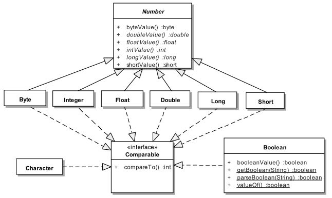

# Руководство по Java Core.
- [ООП](#ООП)
- [Основные понятия ООП](#Основные-понятия-ООП)
    - [ООП](#ООП)
    - [Объект](#Объект)
- [Приоритеты операторов](#Приоритеты-операторов)
- [Типы данных](#Типы-данных)
    - [autoboxing в Java](#Autoboxing-в-Java)
    - [Классы оболочки](#Классы-оболочки)
    - [Byte](#Byte)
    - [Short](#Short)
    - [Integer](#Integer)
    - [String](src/main/java/kovteba/string)
- [Чем различаются JRE, JVM и JDK?](#Чем-различаются-JRE,-JVM-и-JDK?)
- [Какие существуют модификаторы доступа?](#Какие-существуют-модификаторы-доступа?)
- [О чем говорит ключевое слово `final`?](#О-чем-говорит-ключевое-слово-final?)
- [Какими значениями инициализируются переменные по умолчанию?](#Какими-значениями-инициализируются-переменные-по-умолчанию?)
- [Что вы знаете о функции main()?](#Что-вы-знаете-о-функции-main()?)
- [Логические операции и операторы?](#Логические-операции-и-операторы)
- [Тернарный оператор](#Тернарный-оператор)
- [Побитовые операции](#Побитовые-операции)
- [Использование модификатора abstract](#Использование-модификатора-abstract)
- [Понятие «интерфейс». Какие модификаторы по умолчанию имеют поля и методы интерфейсов?](#Понятие-«интерфейс».-Какие-модификаторы-по-умолчанию-имеют-поля-и-методы-интерфейсов?)
- [Чем абстрактный класс отличается от интерфейса? В каких случаях следует использовать абстрактный класс, а в каких интерфейс?](#Чем-абстрактный-класс-отличается-от-интерфейса?-В-каких-случаях-следует-использовать-абстрактный-класс,-а-в-каких-интерфейс?)
- [Интерфейсы без методов](#Интерфейсы-без-методов)
- [Почему нельзя объявить метод интерфейса с модификатором final?](#Почему-нельзя-объявить-метод-интерфейса-с-модификатором-final?)
- [Что имеет более высокий уровень абстракции - класс, абстрактный класс или интерфейс?](#Что-имеет-более-высокий-уровень-абстракции:-класс,-абстрактный-класс-или-интерфейс?)
- [Может ли объект получить доступ к члену класса объявленному как private? Если да, то каким образом?](#Может-ли-объект-получить-доступ-к-члену-класса-объявленному-как-private?-Если-да,-то-каким-образом?)
- [Каков порядок вызова конструкторов и блоков инициализации с учётом иерархии классов?](#Каков-порядок-вызова-конструкторов-и-блоков-инициализации-с-учётом-иерархии-классов?)
- [Зачем нужны и какие бывают блоки инициализации?](#Зачем-нужны-и-какие-бывают-блоки-инициализации?)
- [Для чего в Java используются статические блоки инициализации?](#Для-чего-в-Java-используются-статические-блоки-инициализации?)
- [Что произойдёт, если в блоке инициализации возникнет исключительная ситуация?](#Что-произойдёт,-если-в-блоке-инициализации-возникнет-исключительная-ситуация?)
- [К каким конструкциям Java применим модификатор static?](#К-каким-конструкциям-Java-применим-модификатор-static?)
- [Может ли статический метод быть переопределён или перегружен?](#Может-ли-статический-метод-быть-переопределён-или-перегружен?)
- [Могут ли нестатические методы перегрузить статические?](#Могут-ли-нестатические-методы-перегрузить-статические?)
- [Возможно ли при переопределении метода изменить: модификатор доступа, возвращаемый тип, тип аргумента или их количество, имена аргументов или их порядок; убирать, добавлять, изменять порядок следования элементов секции throws?](#Возможно-ли-при-переопределении-метода-изменить:-модификатор-доступа,-возвращаемый-тип,-тип-аргумента-или-их-количество,-имена-аргументов-или-их-порядок;-убирать,-добавлять,-изменять-порядок-следования-элементов-секции-throws?)
- [Как получить доступ к переопределенным методам родительского класса?](#Как-получить-доступ-к-переопределенным-методам-родительского-класса?)
- [Можно ли объявить метод абстрактным и статическим одновременно?](#Можно-ли-объявить-метод-абстрактным-и-статическим-одновременно?)
- [В чем разница между членом экземпляра класса и статическим членом класса?](#В-чем-разница-между-членом-экземпляра-класса-и-статическим-членом-класса?)
- [Где разрешена инициализация статических/нестатических полей?](#Где-разрешена-инициализаци-статических/нестатических-полей?)
- [Какие типы классов бывают в java?](#Какие-типы-классов-бывают-в-java?)
    - [Top level class](#Top-level-class)
    - [Abstract class](#Abstract-class)
    - [Interfaces](#Interfaces)
- [Для чего используется оператор assert?](#Для-чего-используется-оператор-assert?)
- [Что такое _Heap_ и _Stack_ память в Java? Какая разница между ними?](#Что-такое-_Heap_-и-_Stack_-память-в-Java?-Какая-разница-между-ними?)
- [Верно ли утверждение, что примитивные типы данных всегда хранятся в стеке, а экземпляры ссылочных типов данных в куче?](#Верно-ли-утверждени,-что-примитивные-типы-данных-всегда-хранятся-в-стеке,-а-экземпляры-ссылочных-типов-данных-в-куче?)
- [Каким образом передаются переменные в методы, по значению или по ссылке?](#Каким-образом-передаются-переменные-в-методы,-по-значению-или-по-ссылке?)
- [Garbage Collector](src/main/java/kovteba/garbagecollector)
    - [Какие разновидности сборщиков мусора реализованы в виртуальной машине HotSpot?](src/main/java/kovteba/garbagecollector#Какие-разновидности-сборщиков-мусора-реализованы-в-виртуальной-машине-HotSpot?)
    - [Как работает сборщик мусора?](src/main/java/kovteba/garbagecollector#Как-работает-сборщик-мусора?)
    - [Для чего нужен сборщик мусора?](src/main/java/kovteba/garbagecollector#Для-чего-нужен-сборщик-мусора?)
    - [Что такое finalize()? Зачем он нужен?](src/main/java/kovteba/garbagecollector#Что-такое-finalize()?-Зачем-он-нужен?)
    - [Что произойдет со сборщиком мусора, если выполнение метода finalize() требует ощутимо много времени, или в процессе выполнения будет выброшено исключение?](src/main/java/kovteba/garbagecollector#Что-произойдет-со-сборщиком-мусора,-если-выполнение-метода-finalize()-требует-ощутимо-много-времени,-или-в-процессе-выполнения-будет-выброшено-исключение?)
- [Чем отличаются _final_, _finally_ и _finalize()_?](#Чем-отличаются-_final_,-_finally_-и-_finalize()_?)
- [Приведение типов. Что такое понижение и повышение типа?](#Приведение-типов.-Что-такое-понижение-и-повышение-типа?)
- [Можно ли использовать строки в конструкции switch?](#Можно-ли-использовать-строки-в-конструкции-switch?)
- [Что такое класс Object? Какие в нем есть методы?](#Что-такое-класс-Object?-Какие-в-нем-есть-методы?)- [«конструктор»](#«конструктор»)
    - [Что такое _«конструктор по умолчанию»_?](#Что-такое-_«конструктор-по-умолчанию»_?)
    - [Чем отличаются конструктор по-умолчанию, конструктор копирования и конструктор с параметрами?](#Чем-отличаются-конструктор-поумолчанию,-конструктор-копирования-и-конструктор-с-параметрами? )
    - [Где и как вы можете использовать приватный конструктор?](#Где-и-как-вы-можете-использовать-приватный-конструктор?)
- [Классы-загрузчики и про динамическая загрузка классов.](#Классы-загрузчики-и-про-динамическая-загрузка-классов.)
- [Что такое _Reflection_?](#Что-такое-_Reflection_?)
- [Зачем нужен equals(). Чем он отличается от операции ==?](#Зачем-нужен-equals().)
- [Если вы хотите переопределить equals(), какие условия должны выполняться?](#Если-вы-хотите-переопределить-equals(),-какие-условия-должны-выполняться?)
- [Правила переопределения метода Object.equals().](#Правила-переопределения-метода-Object.equals().)
- [Какая связь между hashCode() и equals()?](#Какая-связь-между-hashCode()-и-equals()?)
- [Что будет, если переопределить equals() не переопределяя hashCode()?](#Что-будет,-если-переопределить-equals()-не-переопределяя-hashCode()?)
- [Каким образом реализованы методы hashCode() и equals() в классе Object?](#Каким-образом-реализованы-методы-hashCode()-и-equals()-в-классе-Object?)
- [Для чего нужен метод hashCode()?](#Для-чего-нужен-метод-hashCode()?)
- [Каковы правила переопределения метода Object.hashCode()?](#Каковы-правила-переопределения-метода-Object.hashCode()?)
- [Могут ли у разных объектов быть одинаковые hashCode()?](#Могут-ли-у-разных-объектов-быть-одинаковые-hashCode()?)
- [Exception](src/main/java/kovteba/exception)
    - [](#)
- [Расскажите про клонирование объектов.](#Расскажите-про-клонирование-объектов.)
    - [В чем отличие между _поверхностным_ и _глубоким_ клонированием?](#В-чем-отличие-между-_поверхностным_-и-_глубоким_-клонированием?)
    - [Какой способ клонирования предпочтительней?](#Какой-способ-клонирования-предпочтительней?)
    - [Почему метод clone() объявлен в классе Object, а не в интерфейсе Cloneable?](#Почему-метод-clone()-объявлен-в-классе-Object,-а-не-в-интерфейсе-Cloneable?)
- [Опишите работу блока _try-catch-finally_.](#Опишите-работу-блока-_try-catch-finally_.)
    - [Что такое механизм _try with resources_?](#Что-такое-механизм-_try-with-resources_?)
    - [Возможно ли использование блока _try finally_ (без catch)?](#Возможно-ли-использование-блока-_try-finally_-(без-catch)?)
    - [Может ли один блок catch отлавливать сразу несколько исключений?](#Может-ли-один-блок-catch-отлавливать-сразу-несколько-исключений?)
    - [Предположим, есть метод, который может выбросить IOException и FileNotFoundException в какой последовательности должны идти блоки catch? Сколько блоков catch будет выполнено?](#Предположим,-есть-метод,-который-может-выбросить-IOException-и-FileNotFoundException-в-какой-последовательности-должны-идти-блоки-catch?-Сколько-блоков-catch-будет-выполнено?)
- [Что такое _generics_?](#Что-такое-_generics_?)
- [Что такое _«интернационализация»_, _«локализация»_?](#Что-такое-_«интернационализация»_,-_«локализация»_?)
- [Наследует ли класс конструкторы своего суперкласса? НЕТ](#Наследует-ли-класс-конструкторы-своего-суперкласса?-НЕТ)
- [В чем проблемы Random? ](#В-чем-проблемы-Random?)
- [Что такое Optinal](#Что-такое-Optinal)
- [type-erasure](#type-erasure)
- [Какие существуют типы ссылок (reference) на объекты в Java?](#Какие-существуют-типы-ссылок-(reference)-на-объекты-в-Java?)
- [Какими способами можно сконструировать объект в Java? ](#Какими-способами-можно-сконструировать-объект-в-Java? )
- [Serializable, serialVersionUID](#Serializable,-serialVersionUID)
- [-----](#-----)

## Введение
Язык программирования Java был разработан компанией и был представлен как ключевой компонент 
Sun Microsystems Java platform в 1995 году. Этот и год и считается годом выпуска Java 1.0.
На данный момент (Февраль 2015 года) крайней версией является Java SE 8.
С развитием Java были созданы её различные типы:

- J2SE – ключевой функционал языка Java.
- J2EE – для разработки корпоративных приложений
- J2ME – для разработки мобильных приложений

Девизом Java является: `"Write Once, Rune Anywhere"`. Другими словами, речь идёт о кроссплатформенности. 
Они достигается за счёт использования вирутальной машины Java (Java Virtual Machine – JVM).

Сильными сторонами можем назвать такие:

- __Платформо-независимость__
    Наш класс, написанный на Java компилируется в платформо-независимый байт-код, который интерпретируется 
    и исполняется JVM.
- __Простота__
    Синтаксис языка крайне прост в изучении. От нас требуется лишь понимание основ ООП, потому что Java является 
    полностью объекто-ориентированной.
- __Переносимость__
    Тот факт, что Java не реализовывает специфичных аспектов для каждого типа машин, делает программы, написанные 
    с её использованием переносимыми.
- __Объекто-ориентированность__
    Всё сущности в Java являются объектами, что позволяет нам использовать всю мощь ООП.
- __Безопасность__
    Безопасность Java позволяет разрабатывать ситсемы, защищённые от вирусов и взломов. Авторизация в Java основана 
    на шифровании открытого ключа.
- __Устойчивость__
    Защита от ошибок обеспечивается за счёт проверок во время компиляции и во время непосредственного 
    выполнения программ.
- __Интерпретируемость__
    Байт-код Java транслируется в машинные команды “на лету” и нигде не хранится.
- __Распределённость__
    Java разработана для распредёленного окружения Internet.
- __Многопоточность__
    Язык поддерживает многопоточность (одновременное выполнение нескольких задач), что позволяет нам создавать 
    хорошо отлаженные приложения
- __Производительность__
    Использование JIT (Just-In-Time) компилятора, позволяет достигать высоких показателей.

## Основные понятия ООП

### ООП 
Методология программирования, основанная на представлении программного продукта в виде совокупности объектов, каждый 
из которых является экземпляром конкретного класса. __ООП__ использует в качестве базовых элементов взаимодействие объектов.

- Инкапсуляции;
- Наследования;
- Полиморфизма;
- Абстракция;

__Инкапсуляция__ (_encapsulation_) — принцип, объединяющий данные и код, манипулирующий этими данными, а также 
защищающий данные от прямого внешнего доступа и неправильного использования. Другими словами, доступ к данным класса 
возможен только посредством методов этого же класса.

__Наследование__ (_inheritance_) — процесс, посредством которого один класс может наследовать свойства другого 
класса и добавлять к ним свойства и методы, характерные только для него.   
Наследование бывает двух видов:  
- _одиночное наследование_ — подкласс (производный класс) имеет один и только один суперкласс (предок);
- _множественное наследование_ — класс может иметь любое количество предков (в Java запрещено).

__Полиморфизм__ (_polymorphism_) — механизм, использующий одно и то же имя метода для решения похожих, но 
несколько отличающихся задач в различных объектах при наследовании из одного суперкласса. Целью полиморфизма 
является использование одного имени при выполнении общих для суперкласса и подклассов действий.

Механизм __«позднего или динамическое связывания»__ в процессе выполнения программы определяет принадлежность 
объекта конкретному классу и производит вызов метода, относящегося к классу, объект которого был использован. 
Механизм «позднего связывания» позволяет определять версию полиморфного (виртуального) метода во время 
выполнения программы.  
    
Краеугольным камнем наследования и полиморфизма предстает следующая парадигма: __«объект подкласса может 
использоваться всюду, где используется объект суперкласса»__.

### Объект 
- Именнованная модель реальной сущности, обладающая конкретными значениями свойств и проявляющая свое поведение.
- Обладающий именем набор данных (полей и свойств объекта), физически находящихся в памяти компьютера, и методов, 
    имеющих доступ к ним. Имя используется для работы с полями и методами объекта.
- Любой объект относится к определенному классу. В классе дается обобщенное описание некоторого набора родственных объектов.
- Конкретный экземпляр класса.

## Приоритеты операторов
 

## Типы данных
  
+ Byte (byte) : `8bit` : `min: -128 max: 127` 
+ Short (short) : `16bit` : `min: -32768 max: 32767`
+ Character (char) : `16bit`book
+ Integer (int) : `32bit` : `min: -2147483648 max: 2147483647`
+ Long (long) : `64bit` : `min -9223372036854775808L max 9223372036854775807L`
+ Float (float) : `32bit` : `min: 1.4e-45f max: 3.4e+38f`
+ Double (double) : `64nit` : `min: 4.9e-324 max: 1.7e+308`
+ Boolean (boolean)
+ String

### Autoboxing в Java
__Автоупаковка__ - это механизм неявной инициализации объектов классов-оберток (`Byte`, `Short`, `Integer`, `Long`, 
`Float`, `Double`, `Character`, `Boolean`) значениями соответствующих им исходных примитивных типов 
(`byte`, `short`, `int`...), без явного использования конструктора класса.   
+ Автоупаковка происходит при прямом присваивании примитива классу-обертке (с помощью оператора `=`), либо при 
    передаче примитива в параметры метода (типа класса-обертки).  
+ Автоупаковке в классы-обертки могут быть подвергнуты как переменные примитивных типов, так и константы времени 
    компиляции (литералы и `final`-примитивы). При этом литералы должны быть синтаксически корректными для 
    инициализации переменной исходного примитивного типа.  
+ Автоупаковка переменных примитивных типов требует точного соответствия типа исходного примитива типу класса-обертки. 
    Например, попытка упаковать переменную типа `byte` в `Short`, без предварительного явного приведения `byte` в 
    `short` вызовет ошибку компиляции.  
+ Автоупаковка констант примитивных типов допускает более широкие границы соответствия. В этом случае компилятор 
    способен предварительно осуществлять неявное расширение/сужение типа примитивов:  
    1) неявное расширение/сужение исходного типа примитива до типа примитива соответствующего классу-обертке 
        (для преобразования `int` в `Byte`, сначала компилятор самостоятельно неявно сужает `int` к `byte`)
    2) автоупаковку примитива в соответствующий класс-обертку. Однако, в этом случае существуют два дополнительных 
        ограничения:  
        a) присвоение примитива обертке может производится только оператором `=` (нельзя передать такой примитив в 
            параметры метода без явного приведения типов)
        b) тип левого операнда не должен быть старше чем `Character`, тип правого не дожен старше, чем `int`: 
            допустимо расширение/сужение `byte` в/из `short`, `byte` в/из `char`, `short` в/из `char` и только 
            сужение `byte` из `int`, `short` из `int`, `char` из `int`. Все остальные варианты требуют явного 
            приведения типов).   
Дополнительной особенностью целочисленных классов-оберток созданных автоупаковкой констант в 
диапазоне `-128 ... +127` я вляется то, что они кэшируются JVM. Поэтому такие обертки с одинаковыми значениями 
будут являться ссылками на один объект.  

### Классы оболочки
  

### Byte 
- `8 bit.	min: -128 max: 127`   
Класс __Byte__ является оболочкой для byte.
```java
byte x = Byte.parseByte("100");
```
Он лучше всего подходит для хранения произвольного потока байтов, загружаемого из сети или из файла.  
Если речь не идет о манипуляциях с битами, использования типа byte, как правило, следует избегать.  
Для нормальных целых чисел, используемых в качестве счетчиков и в арифметических выражениях, гораздо лучше подходит тип int.

Слово «байт» (byte) возникло в компании IBM примерно в 1956 году. Оно произошло от слова bite («кусок»), но его было 
решено писать через букву y, чтобы не путать со словом «bit» («бит»). В течение некоторого времени слово «байт» 
обозначало просто число битов в конкретном потоке данных. Однако в середине 1960-х, в связи с разработкой семейства 
компьютеров System/360 в компании IBM, это слово стало обозначать группу из восьми бит.

### Short
- `16 bit min: -32768 max: 32767`   
Класс __Short__ является оболочкой для short.         

```java
short x = Short.parseShort("100");
```                 
В арифметических выражениях с переменными типа short вычисления выполняются как с типом int, т.е. с помощью 32-битовой 
арифметики, а полученный результат будет 32-битовым. Например, такой код не пройдёт.
```java
// накорми кота
short fishNumber = 3; // три рыбки
short beefNumber = 2; // два кусочка говядины
short breakfast = 0;
breakfast = fishNumber + beefNumber; // завтрак чемпиона
```
Java будет ругаться на последнюю строчку, так как итоговый результат не может быть short. Как вариант, вам нужно 
преобразовать результат снова в 16-битовое число.
```java
breakfast = (short) (fishNumber + beefNumber); // завтрак чемпиона
```

### Integer
- `32bit MIN: -2147483648 MAX: 2147483647`

## Чем различаются JRE, JVM и JDK?
__JVM__, Java Virtual Machine (Виртуальная машина Java) — основная часть среды времени исполнения Java (JRE). 
    Виртуальная машина Java исполняет байт-код Java, предварительно созданный из исходного текста Java-программы 
    компилятором Java. JVM может также использоваться для выполнения программ, написанных на других языках п
    рограммирования.

__JRE__, Java Runtime Environment (Среда времени выполнения Java) - минимально-необходимая реализация виртуальной 
    машины для исполнения Java-приложений. Состоит из JVM и стандартного набора библиотек классов Java.

__JDK__, Java Development Kit (Комплект разработки на Java) - JRE и набор инструментов разработчика приложений на 
    языке Java, включающий в себя компилятор Java, стандартные библиотеки классов Java, примеры, документацию, 
    различные утилиты.

Коротко: __JDK__ - среда для разработки программ на Java, включающая в себя __JRE__ - среду для обеспечения запуска 
    Java программ, которая в свою очередь содержит __JVM__ - интерпретатор кода Java программ.


## Какие существуют модификаторы доступа?
__private__ (приватный): члены класса доступны только внутри класса. Для обозначения используется служебное 
    слово `private`.

__default__, package-private, package level (доступ на уровне пакета): видимость класса/членов класса только 
    внутри пакета. Является модификатором доступа по умолчанию - специальное обозначение не требуется.

__protected__ (защищённый): члены класса доступны внутри пакета и в наследниках. Для обозначения используется   
    служебное слово `protected`.

__public__ (публичный): класс/члены класса доступны всем. Для обозначения используется служебное слово `public`.

Последовательность модификаторов по возрастанию уровня закрытости: public, protected, default, private.  
Во время наследования возможно изменения модификаторов доступа в сторону большей видимости 
(для поддержания соответствия _принципу подстановки Барбары Лисков_).

## О чем говорит ключевое слово final?
Модификатор `final` может применяться к переменным, параметрам методов, полям и методам класса или самим классам.

+ Класс не может иметь наследников;
+ Метод не может быть переопределен в классах наследниках;
+ Поле не может изменить свое значение после инициализации; (Инициализировано один раз, в логическом блоке 
    инициализации, при объявлении или в конструкторе класса)
+ Параметры методов не могут изменять своё значение внутри метода;
+ Локальные переменные не могут быть изменены после присвоения им значения.

## Какими значениями инициализируются переменные по умолчанию?
+ Числа инициализируются `0` или `0.0`; 
+ `char` — `\u0000`;
+ `boolean` — `false`;
+ Объекты (в том числе `String`) — `null`.

## Что вы знаете о функции main()?

Метод `main()` — точка входа в программу. В приложении может быть несколько таких методов. Если метод отсутствует, 
то компиляция возможна, но при запуске будет получена ошибка `Error: Main method not found`.

```java 
public static void main(String[] args) {}
public static void main(Strinп... args) {}

```

## Логические операции и операторы
+ `&`: Логическое _AND_ (И);
+ `&&`: Сокращённое _AND_;
+ `|`: Логическое _OR_ (ИЛИ);
+ `||`: Сокращённое _OR_;
+ `^`: Логическое _XOR_ (исключающее _OR_ (ИЛИ));
+ `!`: Логическое унарное _NOT_ (НЕ);
+ `&=`: _AND_ с присваиванием;
+ `|=`: _OR_ с присваиванием;
+ `^=`: _XOR_ с присваиванием;
+ `==`: Равно;
+ `!=`: Не равно;
+ `?:`: Тернарный (троичный) условный оператор.


## Тернарный оператор
Тернарный условный оператор `?:` - оператор, которым можно заменить некоторые конструкции операторов `if-then-else`.

Выражение записывается в следующей форме:
>условие ? выражение1 : выражение2

Если `условие` выполняется, то вычисляется `выражение1` и его результат становится результатом выполнения всего 
оператора. Если же `условие` равно `false`, то вычисляется `выражение2` и его значение становится результатом работы 
оператора. Оба операнда `выражение1` и `выражение2` должны возвращать значение одинакового (или совместимого) типа.

## Побитовые операции
+ `~`: Побитовый унарный оператор NOT;
+ `&`: Побитовый AND;
+ `&=`: Побитовый AND с присваиванием;
+ `|`: Побитовый OR;
+ `|=`: Побитовый OR с присваиванием;
+ `^`: Побитовый исключающее XOR;
+ `^=`: Побитовый исключающее XOR с присваиванием;
+ `>>`: Сдвиг вправо (деление на 2 в степени сдвига);
+ `>>=`: Сдвиг вправо с присваиванием;
+ `>>>`: Сдвиг вправо без учёта знака;
+ `>>>=`: Сдвиг вправо без учёта знака с присваиванием;
+ `<<`: Сдвиг влево (умножение на 2 в степени сдвига);
+ `<<=`: Сдвиг влево с присваиванием.

## Использование модификатора abstract
Класс помеченный модификатором `abstract` называется абстрактным классом. Такие классы могут выступать только предками 
для других классов. Создавать экземпляры самого абстрактного класса не разрешается. При этом наследниками абстрактного 
класса могут быть как другие абстрактные классы, так и классы, допускающие создание объектов.

Метод помеченный ключевым словом `abstract` - абстрактный метод, т.е. метод, который не имеет реализации. Если в классе 
присутствует хотя бы один абстрактный метод, то весь класс должен быть объявлен абстрактным.

Использование абстрактных классов и методов позволяет описать некий шаблон объекта, который должен быть реализован в 
других классах. В них же самих описывается лишь некое общее для всех потомков поведение.

## Понятие «интерфейс». Какие модификаторы по умолчанию имеют поля и методы интерфейсов?
Ключевое слово `interface` используется для создания полностью абстрактных классов. Основное предназначение 
интерфейса - определять каким образом мы можем использовать класс, который его реализует. Создатель интерфейса 
определяет имена методов, списки аргументов и типы возвращаемых значений, но не реализует их поведение. 
Все методы неявно объявляются как `public`.

Начиная с Java 8 в интерфейсах разрешается размещать реализацию методов по умолчанию `default` и 
статических `static` методов.

Интерфейс также может содержать и поля. В этом случае они автоматически являются публичными `public`, 
статическими `static` и неизменяемыми `final`.

## Чем абстрактный класс отличается от интерфейса? В каких случаях следует использовать абстрактный класс, а в каких интерфейс?
+ В Java класс может одновременно реализовать несколько интерфейсов, но наследоваться только от одного класса.
+ Абстрактные классы используются только тогда, когда присутствует тип отношений «is a» (является). 
    Интерфейсы могут реализоваться классами, которые не связаны друг с другом.
+ Абстрактный класс - средство, позволяющее избежать написания повторяющегося кода, инструмент для частичной 
    реализации поведения. Интерфейс - это средство выражения семантики класса, контракт, описывающий возможности. 
    Все методы интерфейса неявно объявляются как `public abstract` или (начиная с Java 8) `default` - методами с 
    реализацией по-умолчанию, а поля - `public static final`.
+ Интерфейсы позволяют создавать структуры типов без иерархии.
+ Наследуясь от абстрактного, класс «растворяет» собственную индивидуальность. Реализуя интерфейс, он расширяет 
    собственную функциональность.

Абстрактные классы содержат частичную реализацию, которая дополняется или расширяется в подклассах. При этом все 
подклассы схожи между собой в части реализации, унаследованной от абстрактного класса и отличаются лишь в части 
собственной реализации абстрактных методов родителя. Поэтому абстрактные классы применяются в случае построения 
иерархии однотипных, очень похожих друг на друга классов. В этом случае наследование от абстрактного класса, 
реализующего поведение объекта по умолчанию может быть полезно, так как позволяет избежать написания повторяющегося кода. 
Во всех остальных случаях лучше использовать интерфейсы.

## Интерфейсы без методов
Это так называемые _маркерные интерфейсы_. Они просто указывают что класс относится к определенному типу. 
Примером может послужить интерфейс `Clonable`, который указывает на то, что класс поддерживает механизм клонирования.

## Почему нельзя объявить метод интерфейса с модификатором final?
В случае интерфейсов указание модификатора `final` бессмысленно, т.к. все методы интерфейсов неявно объявляются как 
абстрактные, т.е. их невозможно выполнить, не реализовав где-то еще, а этого нельзя будет сделать, если у метода 
идентификатор `final`.

## Что имеет более высокий уровень абстракции: класс, абстрактный класс или интерфейс?
Интерфейс.

## Может ли объект получить доступ к члену класса объявленному как private? Если да, то каким образом?
+ Внутри класса доступ к приватной переменной открыт без ограничений;
+ Вложенный класс имеет полный доступ ко всем (в том числе и приватным) членам содержащего его класса;
+ Доступ к приватным переменным извне может быть организован через отличные от приватных методы, которые предоставлены 
    разработчиком класса. Например: `getX()` и `setX()`.
+ Через механизм рефлексии `Reflection API`:

```java
class Victim { 
    private int field = 42;
}
//...
Victim victim = new Victim(); 
Field field = Victim.class.getDeclaredField("field"); 
field.setAccessible(true); 
int fieldValue = (int) field.get(victim);
//...
```

## Каков порядок вызова конструкторов и блоков инициализации с учётом иерархии классов?
Сначала вызываются все статические блоки в очередности от первого статического блока корневого предка и выше по 
цепочке иерархии до статических блоков самого класса. 

Затем вызываются нестатические блоки инициализации корневого предка, конструктор корневого предка и так далее вплоть 
до нестатических блоков и конструктора самого класса.

>Parent static block(s) → Child static block(s) → Grandchild static block(s)
>
> → Parent non-static block(s) → Parent constructor →
>
> → Child non-static block(s) → Child constructor →
>
> → Grandchild non-static block(s) → Grandchild constructor

Пример 1:

```java
public class MainClass {
    public static void main(String args[]) {
        System.out.println(TestClass.v);
        new TestClass().a();
    }
}
public class TestClass {
    public static String v = "Some val";
    {
        System.out.println("!!! Non-static initializer");
    }
    static {
        System.out.println("!!! Static initializer");
    }
    public void a() {
        System.out.println("!!! a() called");
    }
}
```
Результат выполнения:

```
!!! Static initializer
Some val
!!! Non-static initializer
!!! a() called
```

Пример 2:

```java
public class MainClass {
    public static void main(String args[]) {        
        new TestClass().a();
    }
}
public class TestClass {
    public static String v = "Some val";
    {
        System.out.println("!!! Non-static initializer");
    }
    static {
        System.out.println("!!! Static initializer");
    }
    public void a() {
        System.out.println("!!! a() called");
    }
}
```
Результат выполнения:

```
!!! Static initializer
!!! Non-static initializer
!!! a() called
```

## Зачем нужны и какие бывают блоки инициализации?
Блоки инициализации представляют собой код, заключенный в фигурные скобки и размещаемый внутри класса вне объявления методов или конструкторов. 

+ Существуют статические и нестатические блоки инициализации.
+ Блок инициализации выполняется перед инициализацией класса загрузчиком классов или созданием объекта класса с 
    помощью конструктора. 
+ Несколько блоков инициализации выполняются в порядке следования в коде класса. 
+ Блок инициализации способен генерировать исключения, если их объявления перечислены в `throws` всех конструкторов класса.
+ Блок инициализации возможно создать и в анонимном классе.

## Для чего в Java используются статические блоки инициализации?
Статические блоки инициализация используются для выполнения кода, который должен выполняться один раз при инициализации 
класса загрузчиком классов, в момент предшествующий созданию объектов этого класса при помощи конструктора. Такой блок 
(в отличие от нестатических, принадлежащих конкретном объекту класса) принадлежит только самому классу (объекту 
метакласса `Class`).

## Что произойдёт, если в блоке инициализации возникнет исключительная ситуация?
Для нестатических блоков инициализации, если выбрасывание исключения прописано явным образом требуется, чтобы 
объявления этих исключений были перечислены в `throws` всех конструкторов класса. Иначе будет ошибка компиляции. 
Для статического блока выбрасывание исключения в явном виде, приводит к ошибке компиляции.

В остальных случаях, взаимодействие с исключениями будет проходить так же как и в любом другом месте. Класс не будет 
инициализирован, если ошибка происходит в статическом блоке и объект класса не будет создан, если ошибка возникает в 
нестатическом блоке.

## К каким конструкциям Java применим модификатор static?
+ полям;
+ методам;
+ вложенным классам;
+ членам секции `import`.

## Может ли статический метод быть переопределён или перегружен?
Перегружен - да. Всё работает точно так же как и с обычными методами - 2 статических метода могут иметь одинаковое имя, 
если количество их параметров или типов различается. 

Переопределён - нет. Выбор вызываемого статического метода происходит при раннем связывании (на этапе компиляции, 
а не выполнения) и выполняться всегда будет родительский метод, хотя синтаксически переопределение статического метода 
это вполне корректная языковая конструкция.

В целом, к статическим полям и методам рекомендуется обращаться через имя класса, а не объект.

## Могут ли нестатические методы перегрузить статические?
Да. В итоге получится два разных метода. Статический будет принадлежать классу и будет доступен через его имя, 
а нестатический будет принадлежать конкретному объекту и доступен через вызов метода этого объекта.

## Возможно ли при переопределении метода изменить: модификатор доступа, возвращаемый тип, тип аргумента или их количество, имена аргументов или их порядок; убирать, добавлять, изменять порядок следования элементов секции throws?
При переопределении метода сужать модификатор доступа не разрешается, т.к. это приведёт к нарушению принципа 
подстановки Барбары Лисков. Расширение уровня доступа возможно.

Можно изменять все, что не мешает компилятору понять какой метод родительского класса имеется в виду:

+ Изменять тип возвращаемого значения при переопределении метода разрешено только в сторону сужения типа 
    (вместо родительского класса - наследника).
+ При изменении типа, количества, порядка следования аргументов вместо переопределения будет происходить 
    _overloading_ (перегрузка) метода.
+ Секцию `throws` метода можно не указывать, но стоит помнить, что она остаётся действительной, если уже определена 
    у метода родительского класса. Так же, возможно добавлять новые исключения, являющиеся наследниками от уже объявленных 
    или исключения `RuntimeException`. Порядок следования таких элементов при переопределении значения не имеет.

## Как получить доступ к переопределенным методам родительского класса?
С помощью ключевого слова `super` мы можем обратиться к любому члену родительского класса - методу или полю, 
если они не определены с модификатором `private`.
```java
super.method();
```

## Можно ли объявить метод абстрактным и статическим одновременно?
Нет. В таком случае компилятор выдаст ошибку: _"Illegal combination of modifiers: ‘abstract’ and ‘static’"_. 
Модификатор `abstract` говорит, что метод будет реализован в другом классе, а `static` наоборот указывает, 
что этот метод будет доступен по имени класса.

## В чем разница между членом экземпляра класса и статическим членом класса?
Модификатор `static` говорит о том, что данный метод или поле принадлежат самому классу и доступ к ним возможен 
даже без создания экземпляра класса. Поля помеченные `static` инициализируются при инициализации класса. 
На методы, объявленные как `static`, накладывается ряд ограничений:  
+ Они могут вызывать только другие статические методы.
+ Они должны осуществлять доступ только к статическим переменным.
+ Они не могут ссылаться на члены типа `this` или `super`.

В отличии от статических, поля экземпляра класса принадлежат конкретному объекту и могут иметь разные значения 
для каждого. Вызов метода экземпляра возможен только после предварительного создания объекта класса.

Пример:
```java
public class MainClass {
	public static void main(String args[]) {
		System.out.println(TestClass.v);
		new TestClass().a();
		System.out.println(TestClass.v);
	}
}
public class TestClass {
	public static String v = "Initial val";
	{
		System.out.println("!!! Non-static initializer");
		v = "Val from non-static";
	}
	static {
		System.out.println("!!! Static initializer");
		v = "Some val";
	}
	public void a() {
		System.out.println("!!! a() called");
	}
}
```
Результат:

```
!!! Static initializer
Some val
!!! Non-static initializer
!!! a() called
Val from non-static

```

## Где разрешена инициализация статических/нестатических полей?
+ Статические поля можно инициализировать при объявлении, в статическом или нестатическом блоке инициализации. 
+ Нестатические поля можно инициализировать при объявлении, в нестатическом блоке инициализации или в конструкторе.

## Какие типы классов бывают в java?
+ __Top level class__ (Обычный класс):
    + __Abstract class__ (Абстрактный класс);
    + __Final class__ (Финализированный класс).
+ __Interfaces__ (Интерфейс).
+ [__Enum__ (Перечисление).](src/main/java/kovteba/enumexample)
+ [__Nested class__ (Вложенный класс):](src/main/java/kovteba/nestedclass)
    + [__Static nested class__ (Статический вложенный класс);](src/main/java/kovteba/nestedclass#Static-nested-class)
    + [__Member inner class__ (Простой внутренний класс);](src/main/java/kovteba/nestedclass#Member-inner-class)
    + [__Local inner class__ (Локальный класс);](src/main/java/kovteba/nestedclass#Local-inner-class)
    + [__Anonymous inner class__ (Анонимный класс).](src/main/java/kovteba/nestedclass#Anonymous-inner-class)
    
### Top level class
К классам верхнего уровня модификатор `static` неприменим.
### Abstract class
### Final class
### Interfaces
Назначение интерфейса — описание или спецификация функциональности, которую должен реализовывать каждый класс, 
его имплементирующий. Класс, реализующий интерфейс, предоставляет к использованию объявленный интерфейс в виде 
набора `public`-методов в полном объеме.

В языке Java существует два вида интерфейсов: интерфейсы, определяющие функциональность для классов посредством 
описания методов, но не их реализации; и интерфейсы, реализация которых автоматически придает классу определенные 
свойства. К последним относятся, например, интерфейсы `Cloneable` и `Serializable`, отвечающие за клонирование и 
сохранение объекта в информа­ционном потоке соответственно.

Все объявленные в интерфейсе методы автоматически трактуются как `public` и `abstract`, а все поля — как `public`, 
`static` и `final`, даже если они так не объявлены.

Если по каким-либо причинам метод для данного класса не имеет реализации или его реализация нежелательна, 
рекомендуется генерация исключения в теле метода, а именно:
```java
public boolean blocking() {
    throw new UnsupportedOperationException(); // лучше собственное исключение
}
```
#### Параметризация интерфейсов
```java
public interface IShapeAction <T extends AbstractShape> {
    double computeSquare(T shape);
    double computePerimeter(T shape);
}
```

## Для чего используется оператор assert?
__Assert__ (Утверждение) — это специальная конструкция, позволяющая проверять предположения о значениях произвольных 
данных в произвольном месте программы. Утверждение может автоматически сигнализировать об обнаружении некорректных 
данных, что обычно приводит к аварийному завершению программы с указанием места обнаружения некорректных данных.

Утверждения существенно упрощают локализацию ошибок в коде. Даже проверка результатов выполнения очевидного кода может 
оказаться полезной при последующем рефакторинге, после которого код может стать не настолько очевидным и в него может 
закрасться ошибка. 

Обычно утверждения оставляют включенными во время разработки и тестирования программ, но отключают в релиз-версиях программ.

Т.к. утверждения могут быть удалены на этапе компиляции либо во время исполнения программы, они не должны менять 
поведение программы. Если в результате удаления утверждения поведение программы может измениться, то это явный признак 
неправильного использования _assert_. Таким образом, внутри _assert_ нельзя вызывать методы, изменяющие состояние 
программы, либо внешнего окружения программы. 

В Java проверка утверждений реализована с помощью оператора `assert`, который имеет форму:

>`assert [Выражение типа boolean];` или `assert [Выражение типа boolean] : [Выражение любого типа, кроме void];`

Во время выполнения программы в том случае, если поверка утверждений включена, вычисляется значение булевского выражения, 
и если его результат `false`, то генерируется исключение `java.lang.AssertionError`. В случае использования второй формы 
оператора `assert` выражение после двоеточия задаёт детальное сообщение о произошедшей ошибке (вычисленное выражение будет 
преобразовано в строку и передано конструктору `AssertionError`).

## Что такое _Heap_ и _Stack_ память в Java? Какая разница между ними?


__Heap (куча)__ используется `Java Runtime` для выделения памяти под объекты и классы. Создание нового объекта также 
происходит в куче. Это же является областью работы сборщика мусора. Любой объект, созданный в куче, имеет глобальный 
доступ и на него могут ссылаться из любой части приложения.

__Stack (стек)__ это область хранения данных также находящееся в общей оперативной памяти (_RAM_). Всякий раз, 
когда вызывается метод, в памяти стека создается новый блок, который содержит примитивы и ссылки на другие объекты 
в методе. Как только метод заканчивает работу, блок также перестает использоваться, тем самым предоставляя доступ 
для следующего метода.
Размер стековой памяти намного меньше объема памяти в куче. Стек в Java работает по схеме 
_LIFO_ (Последний-зашел-Первый-вышел)

Различия между _Heap_ и _Stack_ памятью:
+ Куча используется всеми частями приложения в то время как стек используется только одним потоком исполнения программы.
+ Всякий раз, когда создается объект, он всегда хранится в куче, а в памяти стека содержится лишь ссылка на него. 
    Память стека содержит только локальные переменные примитивных типов и ссылки на объекты в куче.
+ Объекты в куче доступны с любой точке программы, в то время как стековая память не может быть доступна для других потоков.
+ Стековая память существует лишь какое-то время работы программы, а память в куче живет с самого начала до конца 
    работы программы.
+ Если память стека полностью занята, то `Java Runtime` бросает исключение `java.lang.StackOverflowError`. Если 
    заполнена память кучи, то бросается исключение `java.lang.OutOfMemoryError: Java Heap Space`.
+ Размер памяти стека намного меньше памяти в куче. 
+ Из-за простоты распределения памяти, стековая память работает намного быстрее кучи.

Для определения начального и максимального размера памяти в куче используются `-Xms` и `-Xmx` опции JVM. Для стека 
определить размер памяти можно с помощью опции `-Xss`.

## Верно ли утверждение, что примитивные типы данных всегда хранятся в стеке, а экземпляры ссылочных типов данных в куче?
Не совсем. Примитивное поле экземпляра класса хранится не в стеке, а в куче. Любой объект (всё, что явно или неявно 
создаётся при помощи оператора `new`) хранится в куче.

## Каким образом передаются переменные в методы, по значению или по ссылке?
В Java параметры всегда передаются только по значению, что определяется как «скопировать значение и передать копию». 
С примитивами это будет копия содержимого. Со ссылками - тоже копия содержимого, т.е. копия ссылки. При этом внутренние 
члены ссылочных типов через такую копию изменить возможно, а вот саму ссылку, указывающую на экземпляр - нет.

## Чем отличаются _final_, _finally_ и _finalize()_?
Модификатор `final`:

+ Класс не может иметь наследников;
+ Метод не может быть переопределен в классах наследниках;
+ Поле не может изменить свое значение после инициализации;
+ Локальные переменные не могут быть изменены после присвоения им значения;
+ Параметры методов не могут изменять своё значение внутри метода.

Оператор `finally` гарантирует, что определенный в нём участок кода будет выполнен независимо от того, какие исключения 
были возбуждены и перехвачены в блоке `try-catch`.

Метод `finalize()` вызывается перед тем как сборщик мусора будет проводить удаление объекта.

Пример:
```java

public class MainClass {

	public static void main(String args[]) {
		TestClass a = new TestClass();
		System.out.println("result of a.a() is " + a.a());
		a = null;
		System.gc(); // Принудительно зовём сборщик мусора
		a = new TestClass();
		System.out.println("result of a.a() is " + a.a());
		System.out.println("!!! done");
	}

}
```

```java
public class TestClass {

	public int a() {
		try {
			System.out.println("!!! a() called");
			throw new Exception("");
		} catch (Exception e) {
			System.out.println("!!! Exception in a()");
			return 2;
		} finally {
			System.out.println("!!! finally in a() ");
		}
	}

	@Override
	protected void finalize() throws Throwable {
		System.out.println("!!! finalize() called");
		super.finalize();
	}
}
```

Результат выполнения:

```
!!! a() called
!!! Exception in a()
!!! finally in a() 
result of a.a() is 2
!!! a() called
!!! Exception in a()
!!! finally in a() 
!!! finalize() called
result of a.a() is 2
!!! done
```

## Приведение типов. Что такое понижение и повышение типа?
Java является строго типизированным языком программирования, а это означает, то что каждое выражение и каждая 
переменная имеет строго определенный тип уже на момент компиляции. Однако определен механизм _приведения типов 
(casting)_ - способ преобразования значения переменной одного типа в значение другого типа.   
В Java существуют несколько разновидностей приведения:  
+ __Тождественное (identity)__. Преобразование выражения любого типа к точно такому же типу всегда допустимо и 
    происходит автоматически.
+ __Расширение (повышение, upcasting) примитивного типа (widening primitive)__. Означает, что осуществляется переход 
    от менее емкого типа к более ёмкому. Например, от типа `byte` (длина 1 байт) к типу `int` (длина 4 байта). Такие 
    преобразование безопасны в том смысле, что новый тип всегда гарантировано вмещает в себя все данные, которые 
    хранились в старом типе и таким образом не происходит потери данных. Этот тип приведения всегда допустим и 
    происходит автоматически.  
+ __Сужение (понижение, downcasting) примитивного типа (narrowing primitive)__. Означает, что переход осуществляется 
    от более емкого типа к менее емкому. При таком преобразовании есть риск потерять данные. Например, если число 
    типа `int` было больше `127`, то при приведении его к `byte` значения битов старше восьмого будут потеряны. 
    В Java такое преобразование должно совершаться явным образом, при этом все старшие биты, не умещающиеся в новом 
    типе, просто отбрасываются - никакого округления или других действий для получения более корректного результата 
    не производится.
+ __Расширение объектного типа (widening reference)__. Означает неявное восходящее приведение типов или переход 
    от более конкретного типа к менее конкретному, т.е. переход от потомка к предку. Разрешено всегда и 
    происходит автоматически.
+ __Сужение объектного типа (narrowing reference)__. Означает нисходящее приведение, то есть приведение от предка 
    к потомку (подтипу). Возможно только если исходная переменная является подтипом приводимого типа. При 
    несоответствии типов в момент выполнения выбрасывается исключение `ClassCastException`. Требует 
    явного указания типа.
+ __Преобразование к строке (to String)__. Любой тип может быть приведен к строке, т.е. к экземпляру класса `String`.
+ __Запрещенные преобразования (forbidden)__. Не все приведения между произвольными типами допустимы. Например, к 
    запрещенным преобразованиям относятся приведения от любого ссылочного типа к примитивному и наоборот (кроме 
    преобразования к строке). Кроме того невозможно привести друг к другу классы находящиеся на разных ветвях 
    дерева наследования и т.п.  
При приведении ссылочных типов с самим объектом ничего не происходит, - меняется лишь тип ссылки, через которую 
происходит обращение к объекту.  
Для проверки возможности приведения нужно воспользоваться оператором `instanceof`:  
```java
Parent parent = new Child();
if (parent instanceof Child) {
    Child child = (Child) parent;
}
```

## Можно ли использовать строки в конструкции switch?
Да, начиная с Java 7 в операторе `switch` можно использовать строки, ранние версии Java не поддерживают этого. При этом:

+ участвующие строки чувствительны к регистру;
+ используется метод `equals()` для сравнения полученного значения со значениями `case`, поэтому во избежание `NullPointerException` стоит предусмотреть проверку на `null`.
+ согласно документации Java 7 для строк в `switch`, компилятор Java формирует более эффективный байткод для строк в конструкции `switch`, чем для сцепленных условий `if`-`else`.

## Что такое класс Object? Какие в нем есть методы?
`Object` это базовый класс для всех остальных объектов в Java. Любой класс наследуется от `Object` и, соответственно, 
наследуют его методы:  
`public boolean equals(Object obj)` – служит для сравнения объектов по значению;
`int hashCode()` – возвращает hash код для объекта;
`String toString()` – возвращает строковое представление объекта;
`Class getClass()` – возвращает класс объекта во время выполнения;
`protected Object clone()` – создает и возвращает копию объекта;
`void notify()` – возобновляет поток, ожидающий монитор;
`void notifyAll()` – возобновляет все потоки, ожидающие монитор;
`void wait()` – остановка вызвавшего метод потока до момента пока другой поток не вызовет метод `notify()` или 
    `notifyAll()` для этого объекта;
`void wait(long timeout)` – остановка вызвавшего метод потока на определённое время или пока другой поток не вызовет 
    метод `notify()` или `notifyAll()` для этого объекта;
`void wait(long timeout, int nanos)` – остановка вызвавшего метод потока на определённое время или пока другой поток 
    не вызовет метод `notify()` или `notifyAll()` для этого объекта;
`protected void finalize()` – может вызываться сборщиком мусора в момент удаления объекта при сборке мусора.

## «конструктор»
__Конструктор__ — это специальный метод у которого отсутствует возвращаемый тип и который имеет то же имя, что и класс, 
в котором он используется. Конструктор вызывается при создании нового объекта класса и определяет действия необходимые 
для его инициализации.  

### Что такое _«конструктор по умолчанию»_?
Если у какого-либо класса не определить конструктор, то компилятор сгенерирует конструктор без аргументов - так 
называемый __«конструктор по умолчанию»__.  
```java
public class ClassName() {}
```  
Если у класса уже определен какой-либо конструктор, то конструктор по умолчанию создан не будет и, если он необходим, 
его нужно описывать явно.    

### Чем отличаются конструктор поумолчанию, конструктор копирования и конструктор с параметрами?  
У конструктора по умолчанию отсутствуют какие-либо аргументы. Конструктор копирования принимает в качестве аргумента 
уже существующий объект класса для последующего создания его клона. Конструктор с параметрами имеет в своей сигнатуре 
аргументы (обычно необходимые для инициализации полей класса).  

### Где и как вы можете использовать приватный конструктор?
Приватный (помеченный ключевым словом `private`, скрытый) конструктор может использоваться публичным статическим 
методом генерации объектов данного класса. Также доступ к нему разрешён вложенным классам и может использоваться 
для их нужд.  

## Классы загрузчики и про динамическая загрузка классов.
Основа работы с классами в Java — классы-загрузчики, обычные Java-объекты, предоставляющие интерфейс для поиска и 
создания объекта класса по его имени во время работы приложения.  
В начале работы программы создается 3 основных загрузчика классов:  
+ __базовый загрузчик (bootstrap/primordial)__. Загружает основные системные и внутренние классы JDK 
    (_Core API_ - пакеты `java.*` (`rt.jar` и `i18n.jar`) . Важно заметить, что базовый загрузчик является 
    _«Изначальным»_ или _«Корневым»_ и частью JVM, вследствие чего его нельзя создать внутри кода программы.
+ __загрузчик расширений (extention)__. Загружает различные пакеты расширений, которые располагаются в 
    директории `<JAVA_HOME>/lib/ext` или другой директории, описанной в системном параметре `java.ext.dirs`. 
    Это позволяет обновлять и добавлять новые расширения без необходимости модифицировать настройки используемых 
    приложений. Загрузчик расширений реализован классом `sun.misc.Launcher$ExtClassLoader`.  
+ __системный загрузчик (system/application)__. Загружает классы, пути к которым указаны в переменной окружения 
    `CLASSPATH` или пути, которые указаны в командной строке запуска JVM после ключей `-classpath` или `-cp`. 
    Системный загрузчик реализован классом `sun.misc.Launcher$AppClassLoader`.  
Загрузчики классов являются иерархическими: каждый из них (кроме базового) имеет родительский загрузчик и в 
большинстве случаев, перед тем как попробовать загрузить класс самостоятельно, он посылает вначале запрос 
родительскому загрузчику загрузить указанный класс. Такое делегирование позволяет загружать классы тем загрузчиком, 
который находится ближе всего к базовому в иерархии делегирования. Как следствие поиск классов будет происходить в 
источниках в порядке их доверия: сначала в библиотеке _Core API_, потом в папке расширений, потом в локальных 
файлах `CLASSPATH`.   
Процесс загрузки класса состоит из трех частей:  
+ _Loading_ – на этой фазе происходит поиск и физическая загрузка файла класса в определенном источнике 
    (в зависимости от загрузчика). Этот процесс определяет базовое представление класса в памяти. На этом этапе 
    такие понятия как «методы», «поля» и т.д. пока не известны.
+ _Linking_ – процесс, который может быть разбит на 3 части:  
    + _Bytecode verification_ – проверка байт-кода на соответствие требованиям определенным в спецификации JVM.
    + _Class preparation_ – создание и инициализация необходимых структур, используемых для представления полей, 
        методов, реализованных интерфейсов и т.п., определенных в загружаемом классе.
    + _Resolving_ – загрузка набора классов, на которые ссылается загружаемый класс.
+ _Initialization_ – вызов статических блоков инициализации и присваивание полям класса значений по умолчанию.  
Динамическая загрузка классов в Java имеет ряд особенностей:  
+ _отложенная (lazy) загрузка и связывание классов_. Загрузка классов производится только при необходимости, 
    что позволяет экономить ресурсы и распределять нагрузку.
+ _проверка корректности загружаемого кода (type safeness)_. Все действия связанные с контролем использования 
    типов производятся только во время загрузки класса, позволяя избежать дополнительной нагрузки во время 
    выполнения кода.
+ _программируемая загрузка_. Пользовательский загрузчик полностью контролирует процесс получения запрошенного 
    класса — самому ли искать байт-код и создавать класс или делегировать создание другому загрузчику. 
    Дополнительно существует возможность выставлять различные атрибуты безопасности для загружаемых классов, 
    позволяя таким образом работать с кодом из ненадежных источников.
+ _множественные пространства имен_. Каждый загрузчик имеет своё пространство имён для создаваемых классов. 
    Соответственно, классы, загруженные двумя различными загрузчиками на основе общего байт-кода, в системе 
    будут различаться.   
Существует несколько способов инициировать загрузку требуемого класса:  
+ явный: вызов `ClassLoader.loadClass()` или `Class.forName()` (по умолчанию используется загрузчик, создавший 
    текущий класс, но есть возможность и явного указания загрузчика);
+ неявный: когда для дальнейшей работы приложения требуется ранее не использованный класс, JVM инициирует его загрузку.

`NoClassDefFoundError` может возникнуть, если нужной библиотеки с этим классом нет в `classpath`
`NoSuchMethodError` может возникнуть из-за несовместимости ваших библиотек, если зависимая библиотека A вызывает 
метод из старой версии библиотеки B, но в classpath есть более новая версия библиотеки B, c другой 
сигнатурой этого метода

## Что такое _Reflection_?
__Рефлексия (Reflection)__ - это механизм получения данных о программе во время её выполнения (runtime). 
В Java _Reflection_ осуществляется с помощью _Java Reflection API_, состоящего из классов пакетов 
`java.lang` и `java.lang.reflect`.  
Возможности Java Reflection API:   
+ Определение класса объекта;
+ Получение информации о модификаторах класса, полях, методах, конструкторах и суперклассах;
+ Определение интерфейсов, реализуемых классом;
+ Создание экземпляра класса;
+ Получение и установка значений полей объекта;
+ Вызов методов объекта;
+ Создание нового массива.

## Зачем нужен equals().
Метод `equals()` - определяет отношение эквивалентности объектов.  
При сравнение объектов с помощью `==` сравнение происходит лишь между ссылками. При сравнении по переопределённому 
разработчиком `equals()` - по внутреннему состоянию объектов. 

## Если вы хотите переопределить equals(), какие условия должны выполняться?
- Рефлексивность: a==a
- Симметричность: a==b, b==a
- Транзитивность: a==b, b==c, a==c
- Консистентность: Множественные вызовы equals должны возвращать один и тот же результат
+ _Рефлексивность_: для любой ссылки на значение `x`, `x.equals(x)` вернет `true`;
+ _Симметричность_: для любых ссылок на значения `x` и `y`, `x.equals(y)` должно вернуть `true`, тогда и только 
    тогда, когда `y.equals(x)` возвращает `true`.
+ _Транзитивность_: для любых ссылок на значения `x`, `y` и `z`, если `x.equals(y)` и `y.equals(z)` возвращают 
    `true`, тогда и `x.equals(z)` вернёт `true`;
+ _Непротиворечивость_: для любых ссылок на значения `х` и `у`, если несколько раз вызвать `х.equals(y)`, 
    постоянно будет возвращаться значение `true` либо постоянно будет возвращаться значение `false` при условии, 
    что никакая информация, используемая при сравнении объектов, не поменялась.  
Для любой ненулевой ссылки на значение `х` выражение `х.equals(null)` должно возвращать `false`.

## Правила переопределения метода Object.equals().
1. Использование оператора `==` для проверки, является ли аргумент ссылкой на указанный объект. Если является, 
    возвращается `true`. Если сравниваемый объект `== null`, должно вернуться `false`.
2. Использование оператор `instanceof` и вызова метода `getClass()` для проверки, имеет ли аргумент правильный тип. 
    Если не имеет, возвращается `false`.
3. Приведение аргумента к правильному типу. Поскольку эта операция следует за проверкой `instanceof` она 
    гарантированно будет выполнена.
4. Обход всех значимых полей класса и проверка того, что значение поля в текущем объекте и значение того же 
    поля в проверяемом на эквивалентность аргументе соответствуют друг другу. Если проверки для всех полей прошли 
    успешно, возвращается результат `true`, в противном случае - `false`.  
По окончанию переопределения метода `equals()` следует проверить: является ли порождаемое отношение эквивалентности 
рефлексивным, симметричным, транзитивным и непротиворечивым? Если ответ отрицательный, метод подлежит 
соответствующей правке.  

## Какая связь между hashCode() и equals()?
Равные объекты должны возвращать одинаковые хэш коды. При переопределении `equals()` нужно обязательно 
переопределять и метод `hashCode()`. 

## Что будет, если переопределить equals() не переопределяя hashCode()?
Классы и методы, которые используют правила этого контракта могут работать некорректно. Так для `HashMap` это 
может привести к тому, что пара «ключ-значение», которая была в неё помещена при использовании нового экземпляра 
ключа не будет в ней найдена.  

## Каким образом реализованы методы hashCode() и equals() в классе Object?
Реализация метода `Object.equals()` сводится к проверке на равенство двух ссылок:
```java
public boolean equals(Object obj) {
  return (this == obj);
}
```  
Реализация метода `Object.hashCode()` описана как `native`, т.е. определенной не с помощью Java кода и обычно 
возвращает адрес объекта в памяти:  
```java 
public native int hashCode();
```

## Для чего нужен метод hashCode()?
Метод `hashCode()` необходим для вычисления хэш кода переданного в качестве входного параметра объекта. В Java 
это целое число, в более широком смыле - битовая строка фиксированной длины, полученная из массива произвольной 
длины. Этот метод реализован таким образом, что для одного и того же входного объекта, хэш код всегда будет 
одинаковым. Следует понимать, что в Java множество возможных хэш кодов ограничено типом `int`, а множество объектов 
ничем не ограничено. Из-за этого, вполне возможна ситуация, что хэш коды разных объектов могут совпасть:  
+ если хэш коды разные, то и объекты гарантированно разные;
+ если хэш коды равны, то объекты могут не обязательно равны.

## Каковы правила переопределения метода Object.hashCode()?
Общий совет: выбирать поля, которые с большой долью вероятности будут различаться. Для этого необходимо 
использовать уникальные, лучше всего примитивные поля, например такие как `id`, `uuid`. При этом нужно следовать 
правилу, если поля задействованы при вычислении `hashCode()`, то они должны быть задействованы и 
при выполнении `equals()`.

## Могут ли у разных объектов быть одинаковые hashCode()?
Да, могут. Метод `hashCode()` не гарантирует уникальность возвращаемого значения. Ситуация, когда у разных 
объектов одинаковые хэш коды называется _коллизией_. Вероятность возникновения коллизии зависит от используемого 
алгоритма генерации хэш кода.   

## Расскажите про клонирование объектов.
Использование оператора присваивания не создает нового объекта, а лишь копирует ссылку на объект. Таким образом, 
две ссылки указывают на одну и ту же область памяти, на один и тот же объект. Для создания нового объекта с таким 
же состоянием используется клонирование объекта.   
Класс `Object` содержит `protected` метод `clone()`, осуществляющий побитовое копирование объекта производного 
класса. Однако сначала необходимо переопределить метод `clone()` как `public` для обеспечения возможности его 
вызова. В переопределенном методе следует вызвать базовую версию метода `super.clone()`, которая и выполняет 
собственно клонирование.   
Чтобы окончательно сделать объект клонируемым, класс должен реализовать интерфейс `Cloneable`. Интерфейс 
`Cloneable` не содержит методов относится к маркерным интерфейсам, а его реализация гарантирует, что метод 
`clone()` класса `Object` возвратит точную копию вызвавшего его объекта с воспроизведением значений всех его 
полей. В противном случае метод генерирует исключение `CloneNotSupportedException`. Следует отметить, что при 
использовании этого механизма объект создается без вызова конструктора.  
Это решение эффективно только в случае, если поля клонируемого объекта представляют собой значения базовых 
типов и их обёрток или неизменяемых (immutable) объектных типов. Если же поле клонируемого типа является 
изменяемым ссылочным типом, то для корректного клонирования требуется другой подход. Причина заключается в том, 
что при создании копии поля оригинал и копия представляют собой ссылку на один и тот же объект. В этой ситуации 
следует также клонировать и сам объект поля класса.  
Такое клонирование возможно только в случае, если тип атрибута класса также реализует интерфейс `Cloneable` 
и переопределяет метод `clone()`. Так как, если это будет иначе вызов метода невозможен из-за его недоступности. 
Отсюда следует, что если класс имеет суперкласс, то для реализации механизма клонирования текущего класса-потомка 
необходимо наличие корректной реализации такого механизма в суперклассе. При этом следует отказаться от 
использования объявлений `final` для полей объектных типов по причине невозможности изменения их значений 
при реализации клонирования.  
Помимо встроенного механизма клонирования в Java для клонирования объекта можно использовать:  
+ __Специализированный конструктор копирования__ - в классе описывается конструктор, который принимает 
    объект этого же класса и инициализирует поля создаваемого объекта значениями полей переданного.
+ __Фабричный метод__ - (Factory method), который представляет собой статический метод, возвращающий 
    экземпляр своего класса.  
+ __Механизм сериализации__ - сохранение и последующее восстановление объекта в/из потока байтов.

### В чем отличие между _поверхностным_ и _глубоким_ клонированием?
__Поверхностное копирование__ копирует настолько малую часть информации об объекте, насколько это возможно. 
По умолчанию, клонирование в Java является поверхностным, т.е. класс `Object` не знает о структуре класса, 
которого он копирует. Клонирование такого типа осуществляется JVM по следующим правилам:   
+ Если класс имеет только члены примитивных типов, то будет создана совершенно новая копия объекта и возвращена 
    ссылка на этот объект.
+ Если класс помимо членов примитивных типов содержит члены ссылочных типов, то тогда копируются ссылки на объекты 
    этих классов. Следовательно, оба объекта будут иметь одинаковые ссылки.  
__Глубокое копирование__ дублирует абсолютно всю информацию объекта:   
+ Нет необходимости копировать отдельно примитивные данные;
+ Все члены ссылочного типа в оригинальном классе должны поддерживать клонирование. Для каждого такого члена 
    при переопределении метода `clone()` должен вызываться `super.clone()`;
+ Если какой-либо член класса не поддерживает клонирование, то в методе клонирования необходимо создать новый 
    экземпляр этого класса и скопировать каждый его член со всеми атрибутами в новый объект класса, по одному.

### Какой способ клонирования предпочтительней?
Наиболее безопасным и следовательно предпочтительным способом клонирования является использование 
специализированного конструктора копирования:   
+ Отсутствие ошибок наследования (не нужно беспокоиться, что у наследников появятся новые поля, которые 
    не будут склонированы через метод `clone()`);
+ Поля для клонирования указываются явно;
+ Возможность клонировать даже `final` поля.

### Почему метод clone() объявлен в классе Object, а не в интерфейсе Cloneable?
Метод `clone()` объявлен в классе `Object` с указанием модификатора `native`, чтобы обеспечить доступ к 
стандартному механизму поверхностного копирования объектов. Одновременно он объявлен и как `protected`, 
чтобы нельзя было вызвать этот метод у не переопределивших его объектов. Непосредственно интерфейс `Cloneable` 
является маркерным (не содержит объявлений методов) и нужен только для обозначения самого факта, что данный объект 
готов к тому, чтобы быть клонированным. Вызов переопределённого метода `clone()` у не `Cloneable` объекта вызовет 
выбрасывание `CloneNotSupportedException`.  

## Опишите работу блока _try catch finally_.
`try` — данное ключевое слово используется для отметки начала блока кода, который потенциально может привести к ошибке.
`catch` — ключевое слово для отметки начала блока кода, предназначенного для перехвата и обработки исключений в 
    случае их возникновения.
`finally` — ключевое слово для отметки начала блока кода, который является дополнительным. Этот блок помещается 
    после последнего блока `catch`. Управление передаётся в блок `finally` в любом случае, было выброшено 
    исключение или нет.   
Общий вид конструкции для обработки исключительной ситуации выглядит следующим образом:  
```java
try { 
    //код, который потенциально может привести к исключительной ситуации 
} 
catch(SomeException e ) { //в скобках указывается класс конкретной ожидаемой ошибки  
    //код обработки исключительной ситуации
} 
finally {
    //необязательный блок, код которого выполняется в любом случае
}
```

### Что такое механизм _try with resources_?
Данная конструкция, которая появилась в Java 7, позволяет использовать блок _try-catch_ не заботясь о закрытии 
ресурсов, используемых в данном сегменте кода.  
Ресурсы объявляются в скобках сразу после `try`, а компилятор уже сам неявно создаёт секцию `finally`, в 
которой и происходит освобождение занятых в блоке ресурсов. Под ресурсами подразумеваются сущности, 
реализующие интерфейс `java.lang.Autocloseable`.   
Общий вид конструкции:  
```java
try(/*объявление ресурсов*/) {
    //...
} catch(Exception ex) {
    //...
} finally {
    //...
}
```  
Стоит заметить, что блоки `catch` и явный `finally` выполняются уже после того, как закрываются ресурсы в 
неявном `finally`.  

### Возможно ли использование блока _try finally_ (без catch)?
Такая запись допустима, но смысла в такой записи не так много, всё же лучше иметь блок `catch`, в котором 
будет обрабатываться необходимое исключение.  

### Может ли один блок catch отлавливать сразу несколько исключений?
исключений одним блоком `catch`:  
```java
try {  
    //...
} catch(IOException | SQLException ex) {
    //...
}
```

### Предположим, есть метод, который может выбросить IOException и FileNotFoundException в какой последовательности должны идти блоки catch? Сколько блоков catch будет выполнено?
Общее правило: обрабатывать исключения нужно от «младшего» к старшему. Т.е. нельзя поставить в первый блок 
`catch(Exception ex) {}`, иначе все дальнейшие блоки `catch()` уже ничего не смогут обработать, т.к. любое 
исключение будет соответствовать обработчику `catch(Exception ex)`.  
Таким образом, исходя из факта, что `FileNotFoundException extends IOException` сначала нужно обработать 
`FileNotFoundException`, а затем уже `IOException`:  
```java
void method() {
    try {
        //...
    } catch (FileNotFoundException ex) {
        //...
    } catch (IOException ex) {
        //...
    }
}

```

## Что такое _generics_?
__Generics__ - это технический термин, обозначающий набор свойств языка позволяющих определять и использовать 
обобщенные типы и методы. Обобщенные типы или методы отличаются от обычных тем, что имеют типизированные параметры.  
Примером использования обобщенных типов может служить _Java Collection Framework_. Так, 
класс `LinkedList<E>` - типичный обобщенный тип. Он содержит параметр `E`, который представляет тип элементов, 
которые будут храниться в коллекции. Создание объектов обобщенных типов происходит посредством замены 
параметризированных типов реальными типами данных. Вместо того, чтобы просто использовать `LinkedList`, 
ничего не говоря о типе элемента в списке, предлагается использовать точное указание типа `LinkedList<String>`, 
`LinkedList<Integer>` и т.п.  

## Что такое _«интернационализация»_, _«локализация»_?
__Интернационализация (internationalization)__ - способ создания приложений, при котором их можно легко 
    адаптировать для разных аудиторий, говорящих на разных языках.  
__Локализация (localization)__ -  адаптация интерфейса приложения под несколько языков. Добавление нового 
    языка может внести определенные сложности в локализацию интерфейса.
    
## Наследует ли класс конструкторы своего суперкласса? НЕТ
Класс-потомок явно или неявно вызывает конструкторы класса-предка, но не наследует их.

## В чем проблемы Random? 
`Random` возвращает псевдо-случайную числовую последовательность, основанную на линейном конгруэнтном методе и `seed'е`, 
основанном на `timestamp'е` создания `j.u.Random`.
Соотвественно, зная время создания, можно предсказать такую последовательность. Такой генератор является 
детерминированным, и криптографически нестойким. Для исправления этого лучше использовать `SecureRandom`
 
## Что такое Optinal
__Optional__ — интерфейс, предохраняющий пользовательский код от nullable ссылок. Оборачивает исходный nullable объект, 
и предоставляет возможность понять, хранит ли non-nullable объект или нет. 

## type-erasure
__type-erasure__ — это стирание информации о типе-параметре в runtime. Таким образом, в байт-коде мы увидим `List`, `Set` 
вместо `List<Integer>`, `Set<Integer>`, ну и type-cast'ы при необходимости
 
## Какие существуют типы ссылок (reference) на объекты в Java?
__В Java существует 4 типа ссылок на объекты:__

- strong reference
- soft reference
- weak reference
- phantom reference

В Java объекты, создаваемые через оператор new создаются по strong ссылке. Сборщик мусора `garbage collector` 
уничтожает такие объекты только тогда, когда на них больше не остается сильных (strong) ссылок.

В пакете java.lang.ref есть 3 класса, которые описывают оставшиеся 3 типа ссылок, 
соответственно `SoftReference`, `WeakReference`, `PhantomReference`.

Объекты, созданные через `SoftReference`, будут собраны в случае, если JVM требует память. То есть имеется гарантия, 
что все `softreference` объекты будут собраны перед тем, как `JVM` выбросит `OutOfMemoryError`. `SoftReference` часто 
используется для кешей, потребляющих большое количество памяти.

`WeakReference` не спасает объект от финализации, даже если имеется достаточное количество свободной памяти. 
Как только на объект не останется strong и soft ссылок, он может быть финализирован. Используется для кешей и 
для создания цепей связанных между собой объектов.

Объекты, созданные через `PhantomReference`, уничтожаются тогда, когда `GC` определяют, что ссылаемые объекты могут 
быть освобождены. Этот тип ссылок используется как альтернатива финализации (для более гибкого освобождения ресурсов). 
 
## Какими способами можно сконструировать объект в Java? 
- Через конструктор
- Через статический `factory-method`
- Через паттерн `Builder` 
 
## Serializable, serialVersionUID
Классы, чьи объекты подвергаются сериализации/десериализации должны реализовывать marker интерфейс `Serializable` 
(и иметь статическое поле serialVersionUID для указании при сериализации, с какой версией класса данный объект 
был сериализован. Если serialVersionUID из сериализованного представления не совпадает c serialVersionUID класса 
«на том конце провода» — то кидается exception)

На практике, уже довольно редко используется, т.к тем же `Jackson/GSON` не обязательно наличие данного интерфейса 
для сериализации
 
## «+» единственный в языке перегруженный оператор

## -----
## Если у класса `Point{int x, y;}` реализовать метод `equals(Object that) {(return this.x == that.x && this.y == that.y)}`, но сделать хэш код в виде `int hashCode() {return x;}`, то будут ли корректно такие точки помещаться и извлекаться из `HashSet`?
`HashSet` использует `HashMap` для хранения элементов. При добавлении элемента в `HashMap` вычисляется хэш код, 
по которому определяется позиция в массиве, куда будет вставлен новый элемент. У всех экземпляров класса `Point` 
хэш код будет одинаковым для всех объектов с одинаковым `x`, что приведёт к вырождению хэш таблицы в список.   
При возникновении коллизии в `HashMap` осуществляется проверка на наличие элемента в списке: 
`e.hash == hash && ((k = e.key) == key || key.equals(k))`. Если элемент найден, то его значение перезаписывается. 
В нашем случае для разных объектов метод `equals()` будет возвращать `false`. Соответственно новый элемент будет 
успешно добавлен в `HashSet`. Извлечение элемента также будет осуществляться успешно. Но производительность такого 
кода будет невысокой и преимущества хэш таблиц использоваться не будут.   

## Могут ли у разных объектов `(ref0 != ref1)` быть `ref0.equals(ref1) == true`?
Да, могут. Для этого в классе этих объектов должен быть переопределен метод `equals()`.  
Если используется метод `Object.equals()`, то для двух ссылок `x` и `y` метод вернет `true` тогда и только тогда, 
когда обе ссылки указывают на один и тот же объект (т.е. `x == y` возвращает `true`).  

## Могут ли у разных ссылок на один объект `(ref0 == ref1)` быть `ref0.equals(ref1) == false`?
В общем случае - могут, если метод `equals()` реализован некорректно и не выполняет свойство рефлексивности:   
для любых ненулевых ссылок `x` метод `x.equals(x)` должен возвращать `true`.  

## Можно ли так реализовать метод `equals(Object that) {return this.hashCode() == that.hashCode()}`?
Строго говоря нельзя, поскольку метод `hashCode()` не гарантирует уникальность значения для каждого объекта. 
Однако для сравнения экземпляров класса `Object` такой код допустим, т.к. метод `hashCode()` в классе `Object` 
возвращает уникальные значения для разных объектов (его вычисление основано на использовании адреса объекта в памяти).

## В `equals()` требуется проверять, что аргумент `equals(Object that)` такого же типа что и сам объект. В чем разница между `this.getClass() == that.getClass()` и `that instanceof MyClass`?
Оператор `instanceof` сравнивает объект и указанный тип. Его можно использовать для проверки является ли данный 
объект экземпляром некоторого класса, либо экземпляром его дочернего класса, либо экземпляром класса, который 
реализует указанный интерфейс.  
`this.getClass() == that.getClass()` проверяет два класса на идентичность, поэтому для корректной реализации 
контракта метода `equals()` необходимо использовать точное сравнение с помощью метода `getClass()`.  

## Можно ли реализовать метод `equals()` класса `MyClass` вот так: `class MyClass {public boolean equals(MyClass that) {return this == that;}}`?
Реализовать можно, но данный метод не переопределяет метод `equals()` класса `Object`, а перегружает его.

## Есть класс `Point{int x, y;}`. Почему хэш код в виде `31 * x + y` предпочтительнее чем `x + y`?
Множитель создает зависимость значения хэш кода от очередности обработки полей, что в итоге порождает лучшую хэш функцию.


## Документирование кода
  
 
 
# Источники
+ [Quizful](http://www.quizful.net/interview/java/)
+ [JavaStudy.ru](http://javastudy.ru/interview/java-oop2/)
+ [ggenikus.github.io](https://ggenikus.github.io/blog/2014/05/04/gc/)
+ [Санкт-Петербургская группа тестирования JVM](https://blogs.oracle.com/vmrobot/entry/основы_сборки_мусора_в_hotspot)
+ [Объектно-ориентированное программирование](http://oop-java.blogspot.ru/2006/02/blog-post_21.html)
+ [JavaRush](http://info.javarush.ru/)

[Вопросы для собеседования](README.md)
