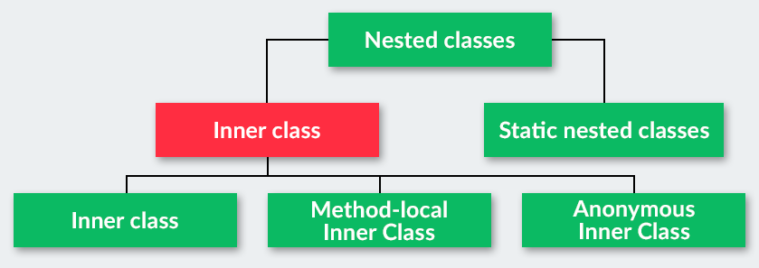
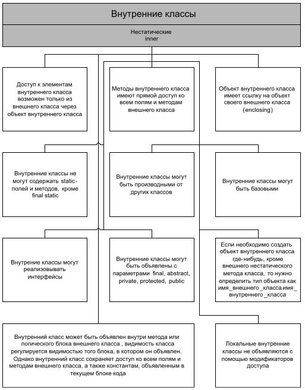
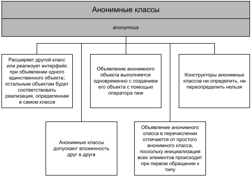
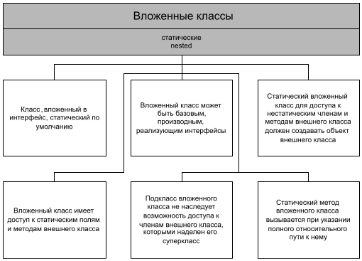

# Nested Class (Вложенные классы)
    
    
### Inner class
1. Объект внутреннего класса не может существовать без объекта «внешнего» класса. (`Compile error`)
2. У объекта внутреннего класса есть доступ к переменным «внешнего» класса.
3. Объект внутреннего класса нельзя создать в статическом методе «внешнего» класса.
4. Внутренний класс не может содержать статические переменные и методы.
5. При создании объекта внутреннего класса важную роль играет его модификатор доступа.  
    5.1.  Объекты `protected` внутреннего класса можно создавать:  
        - внутри «внешнего» класса;  
        - в его классах-наследниках;  
        - в тех классах, которые находятся в том же пакете.  
    5.2. Если у внутреннего класса нет модификатора доступа `package private`, объекты внутреннего класса можно создавать  
        - внутри «внешнего» класса;
        - в классах, которые находятся в том же пакете.
6. внутренние классы не могут реализовывать интерфейсы;
7. внутренние классы могут содержать static-поля;
8. внутренний локальный класс обладает доступом только к полям метода, в котором он объявлен;
9. внутренние классы могут быть производными классами, но не базовыми.
    
## Расскажите про вложенные классы. В каких случаях они применяются?
Класс называется вложенным `Nested class`, если он определен внутри другого класса. Вложенный класс должен создаваться 
только для того, чтобы обслуживать обрамляющий его класс. Если вложенный класс оказывается полезен в каком-либо ином 
контексте, он должен стать классом верхнего уровня. Вложенные классы имеют доступ ко всем (в том числе приватным) 
полям и методам внешнего класса, но не наоборот. Из-за этого разрешения использование вложенных классов приводит 
к некоторому нарушению инкапсуляции.

Существуют четыре категории вложенных классов:   
+ [__Member inner class__ (Простой внутренний класс);](#Member-inner-class)
+ [__Local inner class__ (Локальный класс);](#Local-inner-class)
+ [__Anonymous inner class__ (Анонимный класс);](#Anonymous-inner-class)
+ [__Static nested class__ (Статический вложенный класс);](#Static-nested-class)

Такие категории классов, за исключением первого, также называют внутренними __Inner class__. Внутренние классы 
ассоциируются не с внешним классом, а с экземпляром внешнего.

Каждая из категорий имеет рекомендации по своему применению. 

Если вложенный класс должен быть виден за пределами одного метода или он слишком длинный для того, чтобы его можно 
было удобно разместить в границах одного метода и если каждому экземпляру такого класса необходима ссылка на 
включающий его экземпляр, то используется нестатический внутренний класс. 

В случае, если ссылка на обрамляющий класс не требуется - лучше сделать такой класс статическим. 
Если класс необходим только внутри какого-то метода и требуется создавать экземпляры этого класса только в этом методе,
то используется локальный класс. 

А, если к тому же применение класса сводится к использованию лишь в одном месте и уже 
существует тип, характеризующий этот класс, то рекомендуется делать его анонимным классом.

## Member inner class


```java
public class Airplane {
    private String name, id, flight;
    private Wing leftWing = new Wing("Red", "X3"), rightWing = new Wing("Blue", "X3");

    public Airplane(String name, String id, String flight) {
        this.name = name;
        this.id = id;
        this.flight = flight;
    }

    private class Wing {
        private String color, model;

        private Wing(String color, String model) {
            this.color = color;
            this.model = model;
        }

    }
}
```
__Особенности нестатических вложенных классов Java:__
1. Они существуют только у объектов, потому для их создания нужен объект. Другими словами: мы укомплектовали наше 
    крыло так, чтобы оно было частью самолета, потому, чтобы создать крыло, нам нужен самолет, иначе оно нам не нужно.
2. Внутри Java класса не может быть статических переменных. Если вам нужны какие-то константы или что-либо еще 
    статическое, выносить их нужно во внешний класс. Это связано с тесной связью нестатического вложенного класса 
    с внешним классом.
3. У класса полный доступ ко всем приватным полям внешнего класса. Данная особенность работает в две стороны.
4. Можно получить ссылку на экземпляр внешнего класса. Пример: `Airplane.this` – ссылка на самолет, `this` – ссылка 
    на крыло.
5. При этом, вложенный внутренний класс не может содержать в себе статических методов или статических полей. Это 
    связано с тем что, внутренний класс неявно связан с объектом своего внешнего класса, поэтому он не может 
    объявлять никаких статических методов внутри себя.

```java
//Nested Inner classes
class Outer3 {
   // Простой вложенный класс
   class Inner {
      public void show() {
         System.out.println("Метод внутреннего класса");
      }
   }
   public static void main(String[] args) {
      Outer3.Inner inner = new Outer3().new Inner();
      inner.show();
   }
}
```

## Local inner class
## Method Local Inner classes

```java
//   Method Local Inner classes
class Outer1 {
   void outerMethod() {
      System.out.println("Метод внешнего класса");
      // Внутренний класс является локальным для метода outerMethod()
      class Inner {
         public void innerMethod() {
            System.out.println("Метод внутреннего класса");
         }
      }
      Inner inner = new Inner();
      inner.innerMethod();
   }
   public static void main(String[] args) {
      Outer1 outer1 = new Outer1();
      outer1.outerMethod();
   }
}
```

__Local inner class__ (Локальный класс) - это вложенный класс, который может быть декларирован в любом блоке, в котором 
разрешается декларировать переменные.  
Как и простые внутренние классы (__Member inner class__) локальные классы имеют имена и могут использоваться многократно.  
Как и анонимные классы, они имеют окружающий их экземпляр только тогда, когда применяются в нестатическом контексте.

Данные классы объявляются внутри других методов. По сути, они обладают всеми свойствами нестатического вложенного класса, 
только создавать их экземпляры можно только в методе, при чем метод не может быть статическим (для их создания нужен 
экземпляр внешнего класса, в нестатические методы неявно передается ссылка на экземпляр вызывающего объекта, а в 
статическом методе данной ссылки нет).  

__Но, свои особенности у них есть:__
1. Локальные классы способны работать только с `final` переменными метода. Все дело в том, что экземпляры локальных 
    классов способны сохраняться в «куче» после завершения работы метода, а переменная может быть стёрта. Если же 
    переменная объявлена `final`, то компилятор может сохранить копию переменной для дальнейшего использования объектом. 
    И еще: с `8+` версий Java можно использовать не `final` переменные в локальных классах, но только при условии, 
    что они не будут изменяться.
2. Не могут быть объявлены как `private`/`public`/`protected` или `static`;
3. Локальные классы обладают доступом к переменным метода.
4. Видны только в пределах блока, в котором объявлены;
5. Не могут иметь внутри себя статических объявлений методов и классов, но могут иметь финальные статические поля, 
    проинициализированные константой;
6. Имеют доступ к полям и методам обрамляющего класса;
7. Могут обращаться к локальным переменным и параметрам метода, если они объявлены с модификатором `final`.

Локальные классы можно встретить крайне редко, так как они затрудняют прочтение кода и не обладают никакими плюсами, 
кроме одного – доступ к переменным метода.  

Допустим, что у нас есть класс Person (будет считать, что это человек) со свойствами street (улица), house (дом). 
Нам бы хотелось возвращать какой-то объект для доступа только к местоположению человека. Для этого, мы создали интерфейс 
AddressContainer, который подразумевает собой хранилище данных об местоположении человека. 
```java
public class Person {
    private String name, street, house;

    public Person(String name, String street, String house) {
        this.name = name;
        this.street = street;
        this.house = house;
    }

    private interface AddressContainer {
        String getStreet();
        String getHouse();
    }

    public AddressContainer getAddressContainer() {
        class PersonAddressContainer implements AddressContainer {
            final String street = Person.this.street, house = Person.this.house;

            @Override
            public String getStreet() {
                return this.street;
            }

            @Override
            public String getHouse() {
                return this.house;
            }
        }

        return new PersonAddressContainer();
    }

    public static void main(String[] args) {
        Person person = new Person("Nikita", "Sholohova", "17");
        AddressContainer address = person.getAddressContainer();
        System.out.println("Address: street - " + address.getStreet() + ", house - " + address.getHouse());
    }
}
```

Внутренний класс в локальном методе не может использовать локальные переменные внешнего метода до тех пор, пока 
локальная переменная не будет объявлена как финальная `final`.
```java
public class Outer {
    void outerMethod() {
        int x = 98;  // <--- must be final
        System.out.println("Метод внешнего класса");
        class Inner {
            public void innerMethod() {
                System.out.println("x = " + x);
            }
        }
        Inner inner = new Inner();
        inner.innerMethod();
    }
    public static void main(String[] args) {
        Outer outer = new Outer();
        outer.outerMethod();
    }
}
```
>Error:(106, 42) java: local variable x is accessed from within inner class; needs to be declared final

Основная причина, по которой необходимо объявлять локальную переменную как финальную заключается в том что, 
локальная переменная живёт в стеке до тех пор, пока метод находится в стеке. А в случае использования внутреннего 
класса возможна ситуация, когда экземпляр внутреннего класса живёт в куче и после выхода из метода, но ему может 
быть необходим доступ к переменной, объявленной в методе. Для этого, компилятор может сохранить копию локальной 
переменной, которая объявлена как финальная, в поле внутреннего класса для дальнейшего использования.

## Anonymous inner class


```java
class Outer {
   // Анонимный класс наследуется от класса Demo
   static Demo demo = new Demo() {
      @Override
      public void show() {
         super.show();
         System.out.println("Метод внутреннего анонимного класса");
      }
   };
   public static void main(String[] args) {
      demo.show();
   }
}
class Demo {
   public void show() {
      System.out.println("Метод суперкласса");
   }
}
```

Это вложенный локальный класс без имени, который разрешено декларировать в любом месте обрамляющего класса, разрешающем 
размещение выражений. Создание экземпляра анонимного класса происходит одновременно с его объявлением. В зависимости 
от местоположения анонимный класс ведет себя как статический либо как нестатический вложенный класс - в нестатическом 
контексте появляется окружающий его экземпляр.

Конструктор анонимного класса определить невозможно.

Анониманые классы используются для для придания уникальной функциональности отдельно взятому экземпляру, для 
обработки событий, реализации блоков прослушивания, реализации интерфейсов, запуска потоков и т. д.

Анонимные классы эффективно используются, как правило, для реализации (переопределения) нескольких методов и 
создания собственных методов объекта. Этот прием эффективен в случае, когда необходимо переопределение
метода, но создавать новый класс нет необходимости из-за узкой области (или одноразового) применения метода.

Под капотом анонимные классы – просто обычные нестатические вложенные классы. Их особенность в удобстве их использования. 
Вы можете написать свой класс прямо при создании экземпляра другого класса.
```java
public class Animal {
    public void meow() {
        System.out.println("Meow!");
    }

    private class Tiger extends Animal {
        @Override
        public void meow() {
            System.out.println("Raaar!");
        }
    }

    public static void main(String[] args) {
        Animal anonTiger = new Animal() {
            @Override
            public void meow() {
                System.out.println("Raaar!");
            }
        };

        Animal notAnonTiger = new Animal().new Tiger();

        anonTiger.meow(); // будет выведено Raaar!
        notAnonTiger.meow(); // будет выведено Raaar!
    }
}
```
По сути, мы просто совмещаем в одном месте две вещи: создание экземпляра одного класса (Animal) и создание экземпляра 
его внутреннего-класса наследника (Tiger). Иначе нам нужно создавать класс отдельно и использовать более длинные 
конструкции, чтобы добиться того же самого результата.

__Использование анонимных классов оправдано во многих случаях, в частности когда:__
+ тело класса является очень коротким;
+ нужен только один экземпляр класса;
+ класс используется в месте его создания или сразу после него;
+ имя класса не важно и не облегчает понимание кода.

Часто анонимные классы используются в графических интерфейсах для создания обработчиков событий. Например для создания 
кнопки и реакции на её нажатие:
```java
JButton b2 = new JButton("Click");
b2.addActionListener(new ActionListener() {
    public void actionPerformed(ActionEvent e) {
        System.out.println("Кнопка нажата!");
    }
});
```
__Аналог с лямбдами:__
```java
JButton b2 = new JButton("Click");
b2.addActionListener(e -> System.out.println("Кнопка нажата!"));
```    
__Анонимные классы имеют несколько ограничений:__
+ Их использование разрешено только в одном месте программы - месте его создания;
+ Применение возможно только в том случае, если после порождения экземпляра нет необходимости на него ссылаться;
+ Реализует лишь методы своего интерфейса или суперкласса, т.е. не может объявлять каких-либо новых методов, так как 
    для доступа к ним нет поименованного типа.  
__Анонимные классы обычно применяются для:__ 
+ создания объекта функции (_function object_), например реализация интерфейса `Comparator`;
+ создания объекта процесса (_process object_), такого как экземпляры классов `Thread`, `Runnable` и подобных;
+ в статическом методе генерации;
+ инициализации открытого статического поля `final`, которое соответствует сложному перечислению типов, когда для 
    каждого экземпляра в перечислении требуется отдельный подкласс.

Анонимные внутренние классы объявляются без указания имени класса. Они могут быть созданы двумя путями:  
1. Как наследник определённого класса:   
```java
public class Outer {
    // Анонимный класс наследуется от класса Demo
    static Demo demo = new Demo() {
        @Override
        public void show() {
            super.show();
            System.out.println("Метод внутреннего анонимного класса");
        }
    };
    public static void main(String[] args) {
        demo.show();
    }
}
class Demo {
    public void show() {
        System.out.println("Метод суперкласса");
    }
}
```
Вывод:  
>Метод суперкласса
>Метод внутреннего анонимного класса

В коде выше, класс Demo является суперклассом, от которого наследуется анонимный класс, и оба они имеют метод show(). 
В анонимном классе метод show() будет переопределён.

2. Как реализация определённого интерфейса  
```java
public class Outer {
    // Анонимный класс, который реализует интерфейс Hello
    static Hello h = new Hello() {
        public void show() {
            System.out.println("Метод внутреннего анонимного класса");
        }
    };
    public static void main(String[] args) {
        h.show();
    }
}
interface Hello {
    void show();
}
```
Вывод:  
> Метод внутреннего анонимного класса

В коде выше мы создаём объект анонимного внутреннего класса, но этот анонимный внутренний класс является реализацией 
интерфейса Hello.

Любой анонимный внутренний класс может за один раз реализовать только один интерфейс. Так же, за один раз можно либо 
расширить класс, либо реализовать интерфейс, но не одновременно.


## Static nested class
  

```java
//Static Nested classes or Member of outer class
class Outer2 {
   // Статический внутренний класс
   static class Inner {
      public void show() {
         System.out.println("Метод внутреннего класса");
      }
   }

   public static void main(String[] args) {
      Outer2.Inner inner = new Outer2.Inner();
      inner.show();
   }
}
```

Если не существует жесткой необходимости в связи объекта внутреннего класса с объектом внешнего класса, то есть смысл 
сделать такой класс статическим.

Это вложенный класс, объявленный с использованием ключевого слова `static`. 

Статические классы используются для того, чтобы укомплектовать связанные классы рядышком, чтобы с логической 
структурой было работать проще.   
Например: мы можем создать внешний класс __Building__, где будет конкретный список классов, которые будут 
представлять из себя уже конкретную постройку.
```java
public abstract class Building {
    private String name, address, type;

    Building(String name, String address) {
        this.name = name;
        this.address = address;
    }

    public static class Platform extends Building {
        public Platform(String name, String address) {
            super(name, address);
            setType("Platform");
        }
    }

    public static class House extends Building {
        public House(String name, String address) {
            super(name, address);
            setType("House");
        }
    }

    public static class Shop extends Building {
        public Shop(String name, String address) {
            super(name, address);
            setType("Shop");
        }
    }
}
```
Данный вид классов не отличается ничем от обычного внешнего класса, кроме одного: для создания экземпляра такого класса, 
нужно через точку перечислить весь путь от внешнего класса до нужного.  
Например:  
```java
Building.Plaftorm platform = new Building.Platform();
Building.Shop myShop = new Building.Shop(“Food & Fun!”, “Kalyaeva 8/53”);
```
Плюсы такого подхода:  
1. Количество классов уменьшилось.
2. Все классы внутри их класса-родителя. Мы способны прослеживать всю иерархию без открытия каждого класса отдельно.
3. Мы можем обратиться к классу `Building`, а IDE уже будет подсказывать весь список всех подклассов данного класса. 
    Это будет упрощать поиск нужных классов и показывать всю картину более цело.
    
Хотелось бы еще отметить, что данная стратегия задействована в 2D классах `AWT` для описания фигур, таких, как `Line2D`, 
`Arc2D`, `Ellipse2D` и другие.  

## Какие существуют особенности использования вложенных классов: статических и внутренних? В чем заключается разница между ними?  
+ Вложенные классы могут обращаться ко всем членам обрамляющего класса, в том числе и приватным. 
+ Для создания объекта статического вложенного класса объект внешнего класса не требуется.
+ Из объекта статического вложенного класса нельзя обращаться к не статическим членам обрамляющего класса напрямую, 
    а только через ссылку на экземпляр внешнего класса.
+ Обычные вложенные классы не могут содержать статических методов, блоков инициализации и классов. Статические 
    вложенные классы - могут.
+ В объекте обычного вложенного класса хранится ссылка на объект внешнего класса. Внутри статического такой ссылки нет. 
    Доступ к экземпляру обрамляющего класса осуществляется через указание `.this` после его имени. Например: `Outer.this`.

## Каким образом из вложенного класса получить доступ к полю внешнего класса?
Статический вложенный класс имеет прямой доступ только к статическим полям обрамляющего класса.  
Простой внутренний класс, может обратиться к любому полю внешнего класса напрямую. В случае, если у вложенного класса 
уже существует поле с таким же литералом, то обращаться к такому полю следует через ссылку на его экземляр. 
Например: `Outer.this.field`.