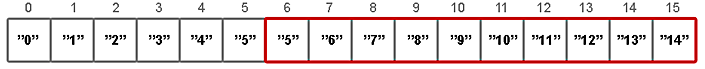
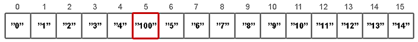

## Class ArrayList

- Быстрый доступ к элементам по индексу за время __O(1)__;  
- Доступ к элементам по значению за линейное время __O(n)__;  
- Вставка в ArrayList связана со сдвигом всех элементов, находящихся после точки вставки, поэтому алгоритмическая 
    сложность этой операции __O(n)__
- Медленный, когда вставляются и удаляются элементы из «середины» списка;  
- Позволяет хранить любые значения в том числе и null;  
- Не синхронизирован.  

```
get(index)        |   O(1)
add(E)            |   O(n)	
add(E, index)     |   O(n)	
remove(index)     |   O(n)	
Iterator.remove() |   O(n)
Iterator.add(E)   |   O(n)
```


Как и Vector является реализацией динамического массива объектов.  

Позволяет хранить любые данные, включая `null` в качестве элемента.  

Как можно догадаться из названия, его реализация основана на обычном массиве.  

Поскольку ArrayList реализует интерфейс Iterable, то мы можем пробежаться по списку в цикле `for-each: for(String person : people)`.  

Данную реализацию следует применять, если в процессе работы с коллекцией предплагается частое обращение к элементам по индексу. 

Но данную коллекцию рекомендуется избегать, если требуется частое __удаление/добавление__ элементов в середину коллекции. 

## Добавление элемента

1. Проверяется, достаточно ли места в массиве для вставки нового элемента;
2. Если нет места то массив увеличивается на `(oldCapacity * 3) / 2 + 1`;
3. Если проверка показывает что места в массиве нет. Соответственно создается новый массив и 
    вызывается `System.arraycopy()`;
    
## Добавление в «середину» списка

Добавление элемента на позицию с определенным индексом происходит в три этапа:  

1. проверяется, достаточно ли места в массиве для вставки нового элемента;  
    ```java
    ensureCapacity(size+1);
    ```
2. подготавливается место для нового элемента с помощью `System.arraycopy()`;
    ```java
    System.arraycopy(elementData, index, elementData, index + 1, size - index);
    ```
    

3. перезаписывается значение у элемента с указанным индексом.
    ```java
    elementData[index] = element;
    size++;
    ```
   
   
## Метод _removeIf()_

Раньше, если нужно было удалить элемент из списка по условию, приходилось проходить в цикле по всем элементам 
и сравнивать их с условием. В Java 8 появился новый метод `removeIf()`, позволяющий упростить код. Метод использует 
предикат - вы указываете условие, если оно выполняется, то происходит удаление элемента из списка.

```java
ArrayList<Integer> numList = new ArrayList<>();
numList.add(51);
numList.add(14);
numList.add(11);
numList.add(12);
numList.add(31);
numList.add(21);
System.out.println("Оригинал: " + numList.toString());
// удаляем элементы, которые больше 10 и меньше 20
numList.removeIf(i -> (i > 10 && i < 20));
```