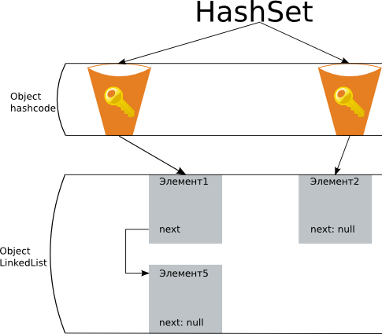

## Class HashSet

- [HashSet](#HashSet)
- [Конструкторы](#Конструкторы)
- 

---

## HashSet
- использует HashMap для хранения данных
- порядок элементов не гарантируется при добавлении.
- Class HashSet представляет хеш-таблицу. Он наследует свой функционал от`Class AbstractSet`, а также реализует `Interface Set`.
- Class HashSet не добавляет новых методов, реализуя лишь те, что объявлены в родительских классах и применяемых интерфейсах.

Хеш-таблица представляет такую структуру данных, в которой все объекты имеют уникальный ключ или хеш-код. 
Данный ключ позволяет уникально идентифицировать объект в таблице.

---

## Конструкторы
Для создания объекта __HashSet__ можно воспользоваться одним из следующих конструкторов:
- __HashSet()__: создает пустой список
- __HashSet(Collection<? extends E> col)__: создает хеш-таблицу, в которую добавляет все элементы коллекции `col`
- __HashSet(int capacity)__: параметр `capacity` указывает начальную емкость таблицы, которая по умолчанию равна `16`
- __HashSet(int capacity, float koef)__: параметр `koef` или коэффициент заполнения, значение которого должно быть 
    в пределах от 0.0 до 1.0, указывает, насколько должна быть заполнена емкость объектами прежде чем произойдет 
    ее расширение. Например, коэффициент 0.75 указывает, что при заполнении емкости на 3/4 произойдет ее расширение.
    
---

