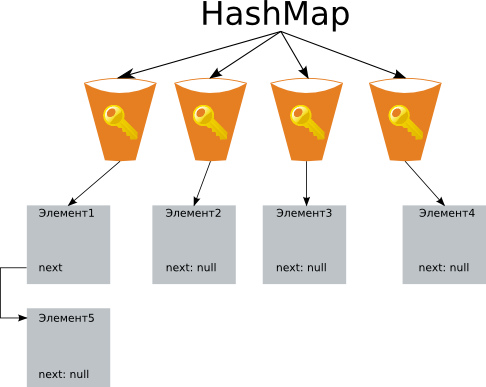

## Class HashMap

- [Начальное количество корзин в HashMap](#Начальное-количество-корзин-в-HashMap)
- [Добавление элементов в HashMap](#Добавление-элементов-в-HashMap)
- [Увеличение количества корзин](#Увеличение-количества-корзин)
- [В каком случае может быть потерян элемент в HashMap?](#В-каком-случае-может-быть-потерян-элемент-в-HashMap?)
- [Почему нельзя использовать byte[] в качестве ключа в HashMap?](#Почему-нельзя-использовать-byte[]-в-качестве-ключа-в-HashMap?)
- [](#)

Коллекция является альтернативой Hashtable. Двумя основными отличиями от Hashtable являются то, 
что HashMap не синхронизирована и HashMap позволяет использовать `null` как в качестве ключа, так и значения. 
Так же как и Hashtable, данная коллекция не является упорядоченной: порядок хранения элементов зависит от хэш-функции. 
Добавление элемента выполняется за константное время `O(1)`, но время удаления, получения 
зависит от распределения хэш-функции. В идеале является константным, но может быть и линейным `O(n)`.



__Корзины__ – массив
__Элементы__ – связной список. (это рассмотрим дальше)

HashMap реализован с использованием метода цепочек, т.е. каждой ячейке массива (корзине) соответствует свой связный 
список и при возникновении коллизии осуществляется добавление нового элемента в этот список.

Для метода цепочек коэффициент заполнения может быть больше 1 и с увеличением числа элементов производительность 
убывает линейно. Такие таблицы удобно использовать, если заранее неизвестно количество хранимых элементов, 
либо их может быть достаточно много, что приводит к большим значениям коэффициента заполнения.

Среди методов открытой реализации различают:   
- линейное пробирование;
- квадратичное пробирование;
- двойное хэширование.

__Недостатки структур с методом открытой адресации:__   
- Количество элементов в хэш-таблице не может превышать размера массива. По мере увеличения числа элементов и 
    повышения коэффициента заполнения производительность структуры резко падает, поэтому необходимо 
    проводить перехэширование.
- Сложно организовать удаление элемента.
- Первые два метода открытой адресации приводят к проблеме первичной и вторичной группировок.

__Преимущества хэш-таблицы с открытой адресацией:__  
- отсутствие затрат на создание и хранение объектов списка;
- простота организации сериализации/десериализации объекта.

## Начальное количество корзин в HashMap
16, используя конструкторы с параметрами: через параметр capacity задавать свое начальное количество корзин.


## Добавление элементов в HashMap
__HashMap__ — основан на хэш-таблицах, реализует интерфейс Map (что подразумевает хранение данных в виде пар 
ключ/значение). Ключи и значения могут быть любых типов, в том числе и null.

При добавлении элемента, последовательность шагов следующая:
1. Сначала ключ проверяется на равенство null. Если это проверка вернула true, будет вызван метод putForNullKey(value)

2. Далее генерируется хэш на основе ключа. Для генерации используется метод hash(hashCode), в который передается 
    key.hashCode().
```java
static int hash(int h) 
{ 
 h ^= (h >>> 20) ^ (h >>> 12); 
 return h ^ (h >>> 7) ^ (h >>> 4); 
} 
```
Комментарий из исходников объясняет, каких результатов стоит ожидать — метод hash(key) гарантирует что полученные 
хэш-коды, будут иметь только ограниченное количество коллизий (примерно 8, при дефолтном значении коэффициента 
загрузки).

3. С помощью метода indexFor(hash, tableLength), определяется позиция в массиве, куда будет помещен элемент.
```java
static int indexFor(int h, int length) 
{ 
 return h & (length - 1); 
} 
```

4. Теперь, зная индекс в массиве, мы получаем список (цепочку) элементов, привязанных к этой ячейке. Хэш и ключ 
нового элемента поочередно сравниваются с хэшами и ключами элементов из списка и, при совпадении этих параметров, 
значение элемента перезаписывается.
```java
if (e.hash == hash && (e.key == key || key.equals(e.key))) 
{ 
 V oldValue = e.value; 
 e.value = value; 
 
 return oldValue; 
} 
```

5. Если же предыдущий шаг не выявил совпадений, будет вызван метод addEntry(hash, key, value, index) для добавления 
нового элемента.   


Как было сказано выше, если при добавлении элемента в качестве ключа был передан null, действия будут отличаться. 
Будет вызван метод putForNullKey(value), внутри которого нет вызова методов hash() и indexFor() (потому как все 
элементы с null-ключами всегда помещаются в table[0]), но есть такие действия:   
- Все элементы цепочки, привязанные к table[0], поочередно просматриваются в поисках элемента с ключом null. Если 
    такой элемент в цепочке существует, его значение перезаписывается.
- Если элемент с ключом null не был найден, будет вызван уже знакомый метод addEntry().
```java
addEntry(0, null, value, 0); 
```
Kогда при добавлении элемента возникает коллизия, новый элемент добавляется в начало цепочки.

## Увеличение количества корзин
Помимо capacity в HashMap есть еще параметр loadFactor, на основании которого, вычисляется предельное количество 
занятых корзин (capacity*loadFactor). По умолчанию loadFactor = 0,75. По достижению предельного значения, число 
корзин увеличивается в 2 раза. Для всех хранимых элементов вычисляется новое «местоположение» с учетом нового 
числа корзин.

## В каком случае может быть потерян элемент в HashMap?
допустим в качестве ключа используется не примитив, а объект с несколькими полями. После добавления элемента в 
HashMap у объекта, который выступает в качестве ключа, изменяют одно поле, которое участвует в вычислении хеш-кода. 
В результате при попытке найти данный элемент по исходному ключу, будет происходить обращение к правильной корзине, 
а вот equals (ведь equals и hashCode должны работать с одним и тем же набором полей) уже не найдет указанный ключ 
в списке элементов. Тем не менее, даже если equals реализован таким образом, что изменение данного поля объекта не 
влияет на результат, то после увеличения размера корзин и пересчета хеш-кодов элементов, указанный элемент, с 
измененным значением поля, с большой долей вероятности попадет совсем в другую корзину и тогда он уже совсем потеряется.

## Почему нельзя использовать byte[] в качестве ключа в HashMap?
хеш-код массива не зависит от хранимых в нем элементов, а присваивается при создании массива (метод вычисления 
хеш-кода массива не переопределен и вычисляется по стандартному Object.hashCode() на основании адреса массива). 
Так же у массивов не переопределен equals и выполняет сравнение указателей. Это приводит к тому, что обратиться 
к сохраненному с ключом-массивом элементу не получится при использовании другого массива такого же размера и с 
такими же элементами, доступ можно осуществить лишь в одном случае — при использовании той же самой ссылки на 
массив, что использовалась для сохранения элемента. 