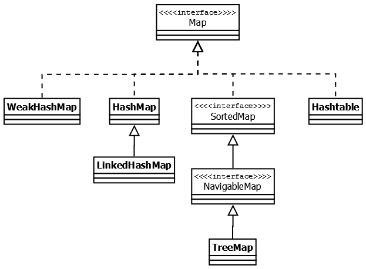

# Interface Map

Данный интерфейс также находится в составе `JDK 1.2` и предоставляет разработчику базовые методы для работы с 
данными вида «ключ — значение». Также как и Collection, он был дополнен дженериками в версии `Java 1.5`и 
в версии `Java 8` появились дополнительные методы для работы с лямбдами, а также методы, которые зачастую 
реализовались в логике приложения (`getOrDefault(Object key, V defaultValue)`, `putIfAbsent(K key, V value)`).