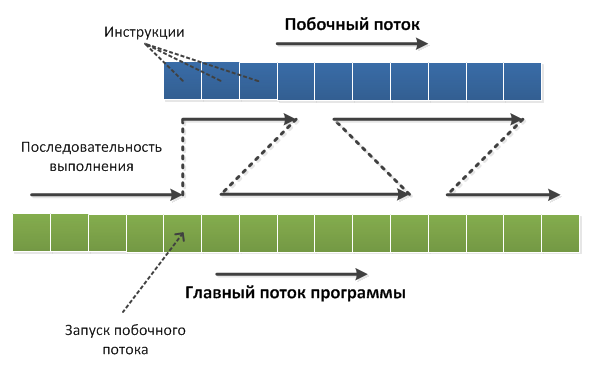
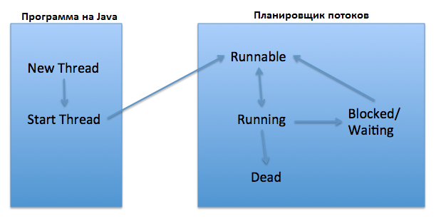

# Concurrency, Thread


- [Потоки](#Потоки)
- [Понятие процесс](#Понятие-процесс)
- [Понятие поток](#Понятие-поток)
- [Class Thread](#Class-Thread)
- [Thread life circle](#Thread-life-circle)
- [Понятие синхронизация потоков](#Понятие-синхронизация-потоков)
- [Способы запустить поток?](#Способы-запустить-поток?)
- [Как принудительно остановить поток?](#Как-принудительно-остановить-поток?)
- [Thread.yield()](#Thread.yield())
- [Thread.join()?](#Thread.join()?)
- [Thread.sleep()](#Thread.sleep())
- [Методы wait и notify](#Методы-wait-и-notify)
- [Что такое Semaphore?](#Что-такое-Semaphore?)
- [Class Exchanger](#Class-Exchanger)
- [Interruption](#Interruption)
- [Чем отличаются методы interrupt, interrupted, isInterrupted?](#Чем-отличаются-методы-interrupt,-interrupted,-isInterrupted?)
- [Synchronized](#Synchronized)
- [ReentrantLock](#ReentrantLock)
- [Interface Condition](#Interface-Condition)
- [Livelock](#Livelock)
- [Dead lock](#Dead-lock)

---

- [Дайте определение понятию “поток-демон”.](#Дайте-определение-понятию-“поток-демон”.)
- [Как создать поток-демон?](#Как-создать-поток-демон?)
- [Как получить текущий поток?](#Как-получить-текущий-поток?)
- [Дайте определение понятию “монитор”](#Дайте-определение-понятию-“монитор”)
- [Как приостановить выполнение потока?](#Как-приостановить-выполнение-потока?)
- [Что является монитором при вызове нестатического и статического метода?](#Что-является-монитором-при-вызове-нестатического-и-статического-метода?)
- [Что является монитором при выполнении участка кода метода?](#Что-является-монитором-при-выполнении-участка-кода-метода?)
- [Какие способы синхронизации в Java?](#Какие-способы-синхронизации-в-Java?)
- [Как работают методы wait и notify/notifyAll?](#Как-работают-методы-wait-и-notify/notifyAll?)
- [Как работает метод Thread.yield()? Чем отличаются методы Thread.sleep() и Thread.yield()?](#Как-работает-метод-Thread.yield()?-Чем-отличаются-методы-Thread.sleep()-и-Thread.yield()?)
- [На каком объекте происходит синхронизация при вызове static synchronized метода?](#На-каком-объекте-происходит-синхронизация-при-вызове-static-synchronized-метода?)
- [Для чего используется ключевое слово volatile, synchronized, transient, native?](#Для-чего-используется-ключевое-слово-volatile,-synchronized,-transient,-native?)
- [Что значит приоритет потока?](#Что-значит-приоритет-потока?)
- [Что значит усыпить поток?](#Что-значит-усыпить-поток?)
- [В каких состояниях может быть  поток в джава? Как вообще работает поток?](#В-каких-состояниях-может-быть-поток-в-джава?-Как-вообще-работает-поток?)
- [Чем отличаются два интерфейса для реализации задач Runnable и Callable?](#Чем-отличаются-два-интерфейса-для-реализации-задач-Runnable-и-Callable?)
- [Различия между CyclicBarrier и CountDownLatch?](#Различия-между-CyclicBarrier-и-CountDownLatch?)
- [Что такое состояние гонки (race condition)?](#Что-такое-состояние-гонки-(race-condition)?)
- [Как остановить нить?](#Как-остановить-нить?)
- [Что происходит, когда в нити появляется исключение?](#Что-происходит,-когда-в-нити-появляется-исключение?)
- [Что такое ThreadLocal переменная?](#Что-такое-ThreadLocal-переменная?)
- [Различие между interrupted и isInterrupted?](#Различие-между-interrupted-и-isInterrupted?)
- [Почему методы wait и notify вызываются в синхронизированном блоке?](#Почему-методы-wait-и-notify-вызываются-в-синхронизированном-блоке?)
- [Что такое пул нитей?](#Что-такое-пул-нитей?)
- [Различия между livelock и deadlock?](#Различия-между-livelock-и-deadlock?)
- [Как проверить, удерживает ли нить lock?](#Как-проверить,-удерживает-ли-нить-lock?)
- [Как получить дамп нити?](#Как-получить-дамп-нити?)
- [Какой JVM параметр используется для контроля размера стека нити?](#Какой-JVM-параметр-используется-для-контроля-размера-стека-нити?)
- [Что будет, если очередь пула нитей уже заполнена, а вы подадите задачу?](#Что-будет,-если-очередь-пула-нитей-уже-заполнена,-а-вы-подадите-задачу?)
- [Различия между методами submit() и execute() у пула нитей?](#Различия-между-методами-submit()-и-execute()-у-пула-нитей?)
- [Что такое блокирующий метод?](#Что-такое-блокирующий-метод?)
- [Что такое фреймворк Fork/Join?](#Что-такое-фреймворк-Fork/Join?)
- [Потоковое голодание](#Потоковое-голодание)
- [](#)
- [Examples](#Examples)

## Потоки
Следует отдельно обговорить фразу «параллельно с другими потоками». Известно, что на одно ядро процессора, в каждый 
момент времени, приходится одна единица исполнения. То есть одноядерный процессор может обрабатывать команды только 
последовательно, по одной за раз (в упрощенном случае). Однако запуск нескольких параллельных потоков возможен и в 
системах с одноядерными процессорами. В этом случае система будет периодически переключаться между потоками, 
поочередно давая выполняться то одному, то другому потоку. Такая схема называется псевдо-параллелизмом. Система 
запоминает состояние (контекст) каждого потока, перед тем как переключиться на другой поток, и восстанавливает его 
по возвращению к выполнению потока. В контекст потока входят такие параметры, как стек, набор значений регистров 
процессора, адрес исполняемой команды и прочее…  

Проще говоря, при псевдопараллельном выполнении потоков процессор мечется между выполнением нескольких потоков, 
выполняя по очереди часть каждого из них.  

Вот как это выглядит:

Цветные квадраты на рисунке – это инструкции процессора (зеленые – инструкции главного потока, синие – побочного). 
Выполнение идет слева направо. После запуска побочного потока его инструкции начинают выполняться вперемешку с 
инструкциями главного потока. Кол-во выполняемых инструкций за каждый подход не определено.

То, что инструкции параллельных потоков выполняются вперемешку, в некоторых случаях может привести к конфликтам 
доступа к данным. Проблемам взаимодействия потоков будет посвящена следующая статья, а пока о том, как 
запускаются потоки в Java…


## Понятие процесс
__Процесс__ — это совокупность кода и данных, разделяющих общее виртуальное адресное пространство. Процессы 
изолированы друг от друга, поэтому прямой доступ к памяти чужого процесса невозможен (взаимодействие между 
процессами осуществляется с помощью специальных средств). Для каждого процесса _ОС_ создает так называемое 
__«виртуальное адресное пространство»__, к которому процесс имеет прямой доступ. Это пространство принадлежит 
процессу, содержит только его данные и находится в полном его распоряжении. Операционная система же отвечает за то, 
как виртуальное пространство процесса проецируется на физическую память.

## Понятие поток
Один поток (_«нить»_ или _«трэд»_) – это одна единица исполнения кода. Каждый поток последовательно выполняет 
инструкции процесса, которому он принадлежит, параллельно с другими потоками этого процесса.

## Class Thread
- `getName()`: возвращает имя потока
- `setName(String name)`: устанавливает имя потока
- `getPriority()`: возвращает приоритет потока
- `setPriority(int proirity)`: устанавливает приоритет потока. Приоритет является одним из ключевых факторов для 
    выбора системой потока из кучи потоков для выполнения. В этот метод в качестве параметра передается числовое 
    значение приоритета - от 1 до 10. По умолчанию главному потоку выставляется средний приоритет - 5.
- `isAlive()`: возвращает true, если поток активен
- `isInterrupted()`: возвращает true, если поток был прерван
- `join()`: ожидает завершение потока
- `run()`: определяет точку входа в поток
- `sleep()`: приостанавливает поток на заданное количество миллисекунд
- `start()`: запускает поток, вызывая его метод run()

## Thread life circle
Поток может быть в следующем состоянии: созданный, запущенный, блокированный, остановленный, в режиме ожидания, 
в режиме ожидания по времени (`NEW`, `RUNNABLE`, `BLOCKED`, `TERMINATED`, `WAITING`, `TIMED_WAITING`).



1. Состояние потока: __New__   
    Когда мы создаем новый объект класса Thread, используя оператор new, то поток находится в состоянии New. В этом 
    состоянии поток еще не работает.

2. Состояние потока: __Runnable__    
    Когда мы вызываем метод `start()` созданного объекта Thread, его состояние изменяется на Runnable и управление 
    потоком передается Планировщику потоков (Thread scheduler). Ли запустить эту нить мгновенно или сохранить 
    его в работоспособный пула потоков перед запуском, это зависит от реализации ОС в планировщик потоков.

3. Состояние потока: __Running__    
    Когда поток будет запущен, его состояние изменится на Running. Планировщик потоков выбирает один поток из 
    своего общего пула потоков и изменяет его состояние на Running. Сразу после этого процессор начинает выполнение 
    этого потока. Во время выполнения состояние потока также может изменится на __Runnable__, __Dead__ или __Blocked__.

4. Состояние потока: __Blocked__ или __Waiting__   
    Поток может ждать другой поток для завершения своей работы, например, ждать освобождения ресурсов или 
    ввода-вывода. В этом случае его состояние изменяется на __Waiting__. После того, как ожидание потока закончилось, 
    его состояние изменяется на __Runnable__ и он возвращается общий пул потоков.

5. Состояние потока: __Dead__   
    После того, как поток завершает выполнение, его состояние изменяется на Dead, то есть он отработал свое и уже не нужен.

## Понятие синхронизация потоков
Синхронизация относится к многопоточности. Синхронизированный блок кода может быть выполнен только одним 
потоком одновременно.

Java поддерживает несколько потоков для выполнения. Это может привести к тому, что два или более потока получат доступ 
к одному и тому же полю или объекту. Синхронизация — это процесс, который позволяет выполнять все параллельные потоки 
в программе синхронно. Синхронизация позволяет избежать ошибок согласованности памяти, вызванных непоследовательным 
доступом к общей памяти.  
Когда метод объявлен как синхронизированный — нить держит монитор для объекта, метод которого исполняется. Если 
другой поток выполняет синхронизированный метод, ваш поток заблокируется до тех пор, пока другой поток не 
отпустит монитор.  
Синхронизация достигается в Java использованием зарезервированного слова `synchronized`. Вы можете использовать 
его в своих классах определяя синхронизированные методы или блоки. Вы не сможете использовать `synchronized` в 
переменных или атрибутах в определении класса.

## Способы запустить поток?
- С помощью класса, реализующего `Runnable`  
    - Создать объект класса `Thread`.
    - Создать объект класса, реализующего интерфейс `Runnable`
    - Вызвать у созданного объекта `Thread` метод `start()` (после этого запустится метод `run()` у переданного объекта, 
        реализующего `Runnable`)
```java
public class RunnableClass implements Runnable {
    @Override
    public void run() {
        System.out.println("run() " + localName + " running");
    }
    public static void main(String[] args) throws IOException {
        Thread thread = new Thread(new RunnableClass("Second"));
        Thread thread2 = new Thread(new RunnableClass("Third"));
        Thread thread3 = new Thread(new RunnableClass("Fourth"));
        thread.start(); //method RunnableClass.run()
        thread2.start(); //method RunnableClass.run()
        thread3.start(); //method RunnableClass.run()
    }
}
//Вывод
//run() Third running
//run() Fourth running
//run() Second running //обратите внимание, поменялись местами при выполнении.
```
- С помощью класса, расширяющего `Thread`   
    - Создать объект класса `ClassName extends Thread`.
    - Переопределить `run()` в этом классе  
```java
public class ThreadClass extends Thread {
    @Override
    public void run() {
         System.out.println("ThreadClass run() method " + "Thread name is: " + this.getName());
    }
    public static void main(String[] args) throws IOException {
        ThreadClass threadClass = new ThreadClass("First");
        threadClass.start();
    }
}
//Вывод
//ThreadClass run() method Thread name is: First
```
      
- С помощью класса, реализующего `java.util.concurrent.Callable`
    - Создать объект класса, реализующего интерфейс `Callable`
    - Создать объект `ExecutorService` с указанием пула потоков.
    - Создать объект Future. Запуск происходит через метод submit(); Сигнатура: <T> Future<T> submit(Callable<T> task)
```java
class Example implements Runnable {
    @Override
    public void run() { }

    public static void main(String[] args) throws IOException {
        ExecutorService executor = Executors.newFixedThreadPool(10);
        for (int i = 0; i < NUMBER_OF_THREADS; i++) {
            executor.execute(new Example());
        }
        executor.shutdownNow();
        System.out.println(getContent());
    }
}
```
## Как принудительно остановить поток?
В __Java 8__ нет метода, который бы принудительно останавливал поток. Никто не гарантирует, что нить можно остановить. 
Она может остановиться только сама. Java имеет встроенный механизм оповещения потока, который называется 
`Interruption` (прерывание, вмешательство). 
 
Класс `Thread` содержит в себе скрытое булево поле, которое называется флагом прерывания. Установить этот флаг можно 
вызвав метод `interrupt()` потока. Проверить же, установлен ли этот флаг, можно двумя способами:  
- Первый способ — вызвать метод bool `isInterrupted()` объекта потока
- Второй — вызвать статический метод bool `Thread.interrupted()`.  

Первый метод возвращает состояние флага прерывания и оставляет этот флаг нетронутым. Второй метод возвращает 
состояние флага и сбрасывает его. Заметьте что `Thread.interrupted()` — статический метод класса `Thread`, и его 
вызов возвращает значение флага прерывания того потока, из которого он был вызван. Поэтому этот метод вызывается 
только изнутри потока и позволяет потоку проверить своё состояние прерывания.
```java
public class MyRunnable implements Runnable {
    @Override
    public void run() {
        long millisOut = System.currentTimeMillis() + 1000;

        while (!Thread.interrupted()){
            System.out.println(currentThread().getName() + " MyThread");
            try {
                Thread.sleep(300);
            } catch (InterruptedException e) {
                System.out.println(currentThread().getName() + " is interrupted");
                break;
            }
            if (millisOut <= System.currentTimeMillis()){
                currentThread().interrupt();
            }
        }
    }
}
```   
У методов, приостанавливающих выполнение потока, таких как `sleep()`, `wait()` и `join()` есть одна 
особенность — если во время их выполнения будет вызван метод `interrupt()` этого потока, они, не дожидаясь 
конца времени ожидания, сгенерируют исключение `InterruptedException`.

## Thread.yield()
Статический метод `Thread.yield()` заставляет процессор переключиться на обработку других потоков системы. Метод 
может быть полезным, например, когда поток ожидает наступления какого-либо события и необходимо чтобы проверка 
его наступления происходила как можно чаще. В этом случае можно поместить проверку события и метод `Thread.yield()` 
в цикл:  
```java
//Ожидание поступления сообщения
while(!msgQueue.hasMessages()){//Пока в очереди нет сообщений
	Thread.yield();//Передать управление другим потокам
}
```

## Thread.join()?
В Java предусмотрен механизм, позволяющий одному потоку ждать завершения выполнения другого. Для этого используется 
метод `join()`. Например, чтобы главный поток подождал завершения побочного потока myThready, необходимо выполнить 
инструкцию `myThready.join()` в главном потоке. Как только поток myThready завершится, метод `join()` вернет 
управление, и главный поток сможет продолжить выполнение.

Метод `join()` имеет перегруженную версию, которая получает в качестве параметра время ожидания. В этом случае 
`join()` возвращает управление либо когда завершится ожидаемый поток, либо когда закончится время ожидания. 
Подобно методу `Thread.sleep()` метод join может ждать в течение миллисекунд и наносекунд – аргументы те же.

Метод `join()` вызывается для того, чтобы привязать текущий поток в конец потока для которого вызывается метод. 
    То есть второй поток будет в режиме блокировки пока первый поток не выполнится.
```java
class Accountant extends Thread {

   int x = 0;
   int y = 0;
   static int result = 0;
   static Accountant accountant = null;

   public Accountant(int x, int y) {
      this.x = x;
      this.y = y;
   }

   public static int sum(int x, int y) {
      accountant = new Accountant(x, y);
      accountant.start();
      System.out.println("Parallel evaluation: op1 " + x + ", op2 " + y);
      return result;
   }

   @Override
   public synchronized void start() {
      try {
         accountant.join();
      } catch (InterruptedException e) {
         e.printStackTrace();
      }
      result = x + y;
   }
}

class Main {
   public static void main(String[] args) {
      System.out.println(Accountant.sum(3, 4));
   }
}
```

## Thread.sleep()
`Thread.sleep()` — статический метод класса `Thread`, который приостанавливает выполнение потока, в котором он был 
вызван. Во время выполнения метода `sleep()` система перестает выделять потоку процессорное время, распределяя его 
между другими потоками. Метод `sleep()` может выполняться либо заданное кол-во времени (миллисекунды или наносекунды) 
либо до тех пор пока он не будет остановлен прерыванием (в этом случае он сгенерирует исключение `InterruptedException`).
```java
Thread.sleep(1500); 		//Ждет полторы секунды
Thread.sleep(2000, 100);  	//Ждет 2 секунды и 100 наносекунд
```

## Методы wait и notify
Иногда при взаимодействии потоков встает вопрос о извещении одних потоков о действиях других. Например, действия 
одного потока зависят от результата действий другого потока, и надо как-то известить один поток, что второй поток 
произвел некую работу. И для подобных ситуаций у класса __Object__ определено ряд методов:  
- `wait()`: освобождает монитор и переводит вызывающий поток в состояние ожидания до тех пор, пока другой поток не 
    вызовет метод `notify()`
- `notify()`: продолжает работу потока, у которого ранее был вызван метод `wait()`
- `notifyAll()`: возобновляет работу всех потоков, у которых ранее был вызван метод `wait()`

Все эти методы вызываются только из синхронизированного контекста - __синхронизированного блока__ или метода.

Рассмотрим, как мы можем использовать эти методы. Возьмем стандартную задачу из прошлой темы - 
"Производитель-Потребитель" ("Producer-Consumer"): пока производитель не произвел продукт, потребитель не 
может его купить. Пусть производитель должен произвести 5 товаров, соответственно потребитель должен их все 
купить. Но при этом одновременно на складе может находиться не более 3 товаров. Для решения этой задачи задействуем 
методы wait() и notify():
```java
public class Program {
    public static void main(String[] args) {
        Store store=new Store();
        Producer producer = new Producer(store);
        Consumer consumer = new Consumer(store);
        new Thread(producer).start();
        new Thread(consumer).start();
    }
}
// Класс Магазин, хранящий произведенные товары
class Store{
   private int product=0;
   public synchronized void get() {
      while (product<1) {
         try {
            wait();
         }
         catch (InterruptedException e) {
         }
      }
      product--;
      System.out.println("Покупатель купил 1 товар");
      System.out.println("Товаров на складе: " + product);
      notify();
   }
   public synchronized void put() {
       while (product>=3) {
         try {
            wait();
         }
         catch (InterruptedException e) { 
         } 
      }
      product++;
      System.out.println("Производитель добавил 1 товар");
      System.out.println("Товаров на складе: " + product);
      notify();
   }
}
// класс Производитель
class Producer implements Runnable{
  
    Store store;
    Producer(Store store){
       this.store=store; 
    }
    public void run(){
        for (int i = 1; i < 6; i++) {
            store.put();
        }
    }
}
// Класс Потребитель
class Consumer implements Runnable{
      
     Store store;
    Consumer(Store store){
       this.store=store; 
    }
    public void run(){
        for (int i = 1; i < 6; i++) {
            store.get();
        }
    }
}
```
Итак, здесь определен класс магазина, потребителя и покупателя. Производитель в методе run() добавляет в объект Store 
с помощью его метода put() 6 товаров. Потребитель в методе run() в цикле обращается к методу get объекта Store для 
получения этих товаров. Оба метода Store - put и get являются синхронизированными.

Для отслеживания наличия товаров в классе Store проверяем значение переменной product. По умолчанию товара нет, 
поэтому переменная равна 0. Метод get() - получение товара должен срабатывать только при наличии хотя бы одного 
товара. Поэтому в методе get проверяем, отсутствует ли товар:
```java
while (product<1)
```
Если товар отсутсвует, вызывается метод wait(). Этот метод освобождает монитор объекта Store и блокирует выполнение 
метода get, пока для этого же монитора не будет вызван метод notify().

Когда в методе put() добавляется товар и вызывается notify(), то метод get() получает монитор и выходит из конструкции 
while (product<1), так как товар добавлен. Затем имитируется получение покупателем товара. Для этого выводится 
сообщение, и уменьшается значение product: product--. И в конце вызов метода notify() дает сигнал методу put() 
продолжить работу.

В методе put() работает похожая логика, только теперь метод put() должен срабатывать, если в магазине не более 
трех товаров. Поэтому в цикле проверяется наличие товара, и если товар уже есть, то освобождаем монитор с помощью 
wait() и ждем вызова notify() в методе get().

## Что такое Semaphore?
__Semaphore__ - это новый тип синхронизатора. Это семафор со счётчиком. Концептуально, семафор управляет набором 
разрешений. Каждый `acquire()` блокируется, если необходимо, до того, как разрешение доступно, затем получает его. 
Каждый `release()` добавляет разрешение, потенциально освобождая блокирующий получатель (acquirer). Однако при этом 
не используются фактические объекты разрешений; Semaphore просто хранит количество доступных и действует 
соответственно. Semaphore используется для защиты дорогих ресурсов, которые доступны в ограниченном количестве, 
например подключение к базе данных в пуле.

Для управления доступом к ресурсу семафор использует счетчик, представляющий количество разрешений. Если значение 
счетчика больше нуля, то поток получает доступ к ресурсу, при этом счетчик уменьшается на единицу. После окончания 
работы с ресурсом поток освобождает семафор, и счетчик увеличивается на единицу. Если же счетчик равен нулю, то 
поток блокируется и ждет, пока не получит разрешение от семафора.

Установить количество разрешений для доступа к ресурсу можно с помощью конструкторов класса Semaphore:  
```java
Semaphore(int permits)
Semaphore(int permits, boolean fair)
```
Параметр _permits_ указывает на количество допустимых разрешений для доступа к ресурсу. Параметр _fair_ во втором 
конструкторе позволяет установить очередность получения доступа. Если он равен `true`, то разрешения будут 
предоставляться ожидающим потокам в том порядке, в каком они запрашивали доступ. Если же он равен `false`, 
то разрешения будут предоставляться в неопределенном порядке.

Для получения разрешения у семафора надо вызвать метод `acquire()`, который имеет две формы:
```java
void acquire() throws InterruptedException
void acquire(int permits) throws InterruptedВxception
```
Для получения одного разрешения применяется первый вариант, а для получения нескольких разрешений - второй вариант.

После вызова этого метода пока поток не получит разрешение, он блокируется.

После окончания работы с ресурсом полученное ранее разрешение надо освободить с помощью метода `release()`:
```java
void release()
void release(int permits)
```
Первый вариант метода освобождает одно разрешение, а второй вариант - количество разрешений, указанных в permits.
Используем семафор в простом примере:  
```java
import java.util.concurrent.Semaphore;
public class Program {
    public static void main(String[] args) {
        Semaphore sem = new Semaphore(1); // 1 разрешение
        CommonResource res = new CommonResource();
        new Thread(new CountThread(res, sem, "CountThread 1")).start();
        new Thread(new CountThread(res, sem, "CountThread 2")).start();
        new Thread(new CountThread(res, sem, "CountThread 3")).start();
    }
}
class CommonResource{
    int x=0;  
}
class CountThread implements Runnable{
    CommonResource res;
    Semaphore sem;
    String name;
    CountThread(CommonResource res, Semaphore sem, String name){
        this.res=res;
        this.sem=sem;
        this.name=name;
    }
    public void run(){
        try{
            System.out.println(name + " ожидает разрешение");
            sem.acquire();
            res.x=1;
            for (int i = 1; i < 5; i++){
                System.out.println(this.name + ": " + res.x);
                res.x++;
                Thread.sleep(100);
            }
        }
        catch(InterruptedException e){System.out.println(e.getMessage());}
        System.out.println(name + " освобождает разрешение");
        sem.release();
    }
}
```

## Class Exchanger
Класс __Exchanger__ предназначен для обмена данными между потоками. Он является типизированным и типизируется 
типом данных, которыми потоки должны обмениваться.

Обмен данными производится с помощью единственного метода этого класса `exchange()`:
```java
V exchange(V x) throws InterruptedException
V exchange(V x, long timeout, TimeUnit unit) throws InterruptedException, TimeoutException
```
Параметр x представляет буфер данных для обмена. Вторая форма метода также определяет параметр timeout - время 
ожидания и unit - тип временных единиц, применяемых для параметра timeout.

Данный класс очень просто использовать:
```java
import java.util.concurrent.Exchanger;
public class ExchangerExample {
    public static void main(String[] args) {
        Exchanger<String> ex = new Exchanger<String>();
        new Thread(new PutThread(ex)).start();
        new Thread(new GetThread(ex)).start();
    }
}
class PutThread implements Runnable{
    Exchanger<String> exchanger;
    String message;
    PutThread(Exchanger<String> ex){
        this.exchanger=ex;
        message = "Hello Java!";
    }
    public void run(){
        try{
            message=exchanger.exchange(message);
            System.out.println("PutThread has received: " + message);
        }
        catch(InterruptedException ex){
            System.out.println(ex.getMessage());
        }
    }
} 
class GetThread implements Runnable{
    Exchanger<String> exchanger;
    String message;
    GetThread(Exchanger<String> ex){
        this.exchanger=ex;
        message = "Hello World!";
    }
    public void run(){
        try{
            message=exchanger.exchange(message);
            System.out.println("GetThread has received: " + message);
        }
        catch(InterruptedException ex){
            System.out.println(ex.getMessage());
        }
    }
} 
```
В классе PutThread отправляет в буфер сообщение "Hello Java!":
```java
message=exchanger.exchange(message);
```
Причем в ответ метод exchange возвращает данные, которые отправил в буфер другой поток. То есть происходит обмен 
данными. Хотя нам необязательно получать данные, мы можем просто их отправить:
```java
exchanger.exchange(message);
```
Логика класса GetThread аналогична - также отправляется сообщение.
В итоге консоль выведет следующий результат:
```java
PutThread has received: Hello World!
GetThread has received: Hello Java!
```

## Interruption
Класс `Thread` содержит в себе скрытое булево поле, подобное полю mFinish в программе Incremenator, которое 
называется флагом прерывания. Установить этот флаг можно вызвав метод `interrupt()` потока. Проверить же, 
установлен ли этот флаг, можно двумя способами. Первый способ — вызвать метод `bool isInterrupted()` объекта потока, 
второй — вызвать статический метод `bool Thread.interrupted()`. Первый метод возвращает состояние флага прерывания и 
оставляет этот флаг нетронутым. Второй метод возвращает состояние флага и сбрасывает его.  

`Thread.interrupted()` — статический метод класса `Thread`, и его вызов возвращает значение флага прерывания 
того потока, из которого он был вызван. Поэтому этот метод вызывается только изнутри потока и позволяет потоку 
проверить своё состояние прерывания.

Механизм прерывания позволит нам решить проблему с засыпанием потока. У методов, приостанавливающих выполнение потока, 
таких как `sleep()`, `wait()` и `join()` есть одна особенность — если во время их выполнения будет вызван метод 
`interrupt()` этого потока, они, не дожидаясь конца времени ожидания, сгенерируют исключение `InterruptedException`.

## Чем отличаются методы interrupt, interrupted, isInterrupted?
- Метод `interrupt()` — устанавливает флаг прерывания потока.
- Метод bool `isInterrupted()` объекта потока возвращает состояние флага прерывания и оставляет этот флаг нетронутым.
- Статический метод bool `Thread.interrupted()` — возвращает состояние флага и сбрасывает его.

## Synchronized
При работе потоки нередко обращаются к каким-то общим ресурсам, которые определены вне потока, например, обращение 
к какому-то файлу. Если одновременно несколько потоков обратятся к общему ресурсу, то результаты выполнения 
программы могут быть неожиданными и даже непредсказуемыми.   
Например, определим следующий код:
```java
public class Program {
    public static void main(String[] args) {
        CommonResource commonResource= new CommonResource();
        for (int i = 1; i < 6; i++){
            Thread t = new Thread(new CountThread(commonResource));
            t.setName("Thread "+ i);
            t.start();
        }
    }
}
class CommonResource{
    int x=0;
}
class CountThread implements Runnable{
    CommonResource res;
    CountThread(CommonResource res){
        this.res=res;
    }
    public void run(){
        res.x=1;
        for (int i = 1; i < 5; i++){
            System.out.printf("%s %d \n", Thread.currentThread().getName(), res.x);
            res.x++;
            try{
                Thread.sleep(100);
            }
            catch(InterruptedException e){}
        }
    }
}
```
Здесь определен класс CommonResource, который представляет общий ресурс и в котором определено одно целочисленное поле x.

Этот ресурс используется классом потока CountThread. Этот класс просто увеличивает в цикле значение x на единицу. 
Причем при входе в поток значение x=1.

В главном классе программы запускается пять потоков. То есть мы ожидаем, что каждый поток будет увеличивать 
res.x с 1 до 4 и так пять раз. Но если мы посмотрим на результат работы программы, то он будет иным:
```java
Thread 1 1 
Thread 2 1 
Thread 3 1 
Thread 5 1 
Thread 4 1 
Thread 5 6 
Thread 2 6 
Thread 1 6 
Thread 3 6 
Thread 4 6 
Thread 4 11 
Thread 2 11 
Thread 5 11 
Thread 3 11 
Thread 1 11 
Thread 4 16 
Thread 1 16 
Thread 3 16 
Thread 5 16 
Thread 2 16
```
Чтобы избежать подобной ситуации, надо синхронизировать потоки. Одним из способов синхронизации является использование 
ключевого слова `synchronized`. Этот оператор предваряет блок кода или метод, который подлежит синхронизации.   
Для его применения изменим класс CountThread:  
```java
class CountThread implements Runnable{
    CommonResource res;
    CountThread(CommonResource res){
        this.res=res;
    }
    public void run(){
        synchronized(res){
            res.x=1;
            for (int i = 1; i < 5; i++){
                System.out.printf("%s %d \n", Thread.currentThread().getName(), res.x);
                res.x++;
                try{
                    Thread.sleep(100);
                }
                catch(InterruptedException e){}
            }
        }
    }
}
Thread 1 1 
Thread 1 2
Thread 1 3
Thread 1 4
Thread 3 1 
Thread 3 2
Thread 3 3
Thread 3 4
Thread 5 1 
Thread 5 2
Thread 5 3
Thread 5 4
Thread 4 1 
Thread 4 2
Thread 4 3
Thread 4 4
Thread 2 1 
Thread 2 2
Thread 2 3
Thread 2 4
```
При применении оператора `synchronized` к методу пока этот метод не завершит выполнение, монопольный доступ имеет 
только один поток - первый, который начал его выполнение. Для применения synchronized к методу, изменим 
классы программы:
```java
public class Program {
    public static void main(String[] args) {
        CommonResource commonResource= new CommonResource();
        for (int i = 1; i < 6; i++){
             
            Thread t = new Thread(new CountThread(commonResource));
            t.setName("Thread "+ i);
            t.start();
        }
    }
}
class CommonResource{
    int x;
    synchronized void increment(){
        x=1;
        for (int i = 1; i < 5; i++){
            System.out.printf("%s %d \n", Thread.currentThread().getName(), x);
            x++;
            try{
                Thread.sleep(100);
            }
            catch(InterruptedException e){}
        }
    }
}
class CountThread implements Runnable{
    CommonResource res;
    CountThread(CommonResource res){
        this.res=res;
    }
     
    public void run(){
        res.increment();
    }
}
```
Результат работы в данном случае будет аналогичен примеру выше с блоком `synchronized`. Здесь опять в дело вступает 
монитор объекта CommonResource - общего объекта для всех потоков. Поэтому синхронизированным объявляется не 
метод run() в классе CountThread, а метод increment класса CommonResource. Когда первый поток начинает 
выполнение метода increment, он захватывает монитор объекта CommonResource. А все потоки также продолжают 
ожидать его освобождения.

## ReentrantLock
Для управления доступом к общему ресурсу в качестве альтернативы оператору synchronized мы можем использовать 
блокировки. Функциональность блокировок заключена в пакете `java.util.concurrent.locks`.

Вначале поток пытается получить доступ к общему ресурсу. Если он свободен, то на него накладывает блокировку. 
После завершения работы блокировка с общего ресурса снимается. Если же ресурс не свободен и на него уже наложена 
блокировка, то поток ожидает, пока эта блокировка не будет снята.

Классы блокировок реализуют интерфейс Lock, который определяет следующие методы:  
- `void lock()`: ожидает, пока не будет получена блокировка
- `void lockInterruptibly() throws InterruptedException`: ожидает, пока не будет получена блокировка, если поток 
    не прерван
- `boolean tryLock()`: пытается получить блокировку, если блокировка получена, то возвращает true. Если блокировка 
    не получена, то возвращает false. В отличие от метода lock() не ожидает получения блокировки, если она недоступна
- `void unlock()`: снимает блокировку
- `Condition newCondition()`: возвращает объект Condition, который связан с текущей блокировкой

Организация блокировки в общем случае довольно проста: для получения блокировки вызывается метод lock(), а после 
окончания работы с общими ресурсами вызывается метод unlock(), который снимает блокировку.

Объект Condition позволяет управлять блокировкой.

Как правило, для работы с блокировками используется класс ReentrantLock из пакета java.util.concurrent.locks. 
Данный класс реализует интерфейс Lock.

Для примера возьмем код из темы про оператор synchronized и перепишем данный код с использованием 
заглушки ReentrantLock:
```java
import java.util.concurrent.locks.ReentrantLock;
public class Program {
    public static void main(String[] args) {
        CommonResource commonResource= new CommonResource();
        ReentrantLock locker = new ReentrantLock(); // создаем заглушку
        for (int i = 1; i < 6; i++){
              
            Thread t = new Thread(new CountThread(commonResource, locker));
            t.setName("Thread "+ i);
            t.start();
        }
    }
}
class CommonResource{
    int x=0;
}
class CountThread implements Runnable{
    CommonResource res;
    ReentrantLock locker;
    CountThread(CommonResource res, ReentrantLock lock){
        this.res=res;
        locker = lock;
    }
    public void run(){
        locker.lock(); // устанавливаем блокировку
        try{
            res.x=1;
            for (int i = 1; i < 5; i++){
                System.out.printf("%s %d \n", Thread.currentThread().getName(), res.x);
                res.x++;
                Thread.sleep(100);
            }
        }
        catch(InterruptedException e){
            System.out.println(e.getMessage());
        }
        finally{
            locker.unlock(); // снимаем блокировку
        }
    }
}
```
Здесь также используется общий ресурс CommonResource, для управления которым создается пять потоков. На входе в 
критическую секцию устанавливается заглушка:
```java
locker.lock();
```
После этого только один поток имеет доступ к критической секции, а остальные потоки ожидают снятия блокировки. 
В блоке finally после всей окончания основной работы потока эта блокировка снимается. Причем делается это 
обязательно в блоке finally, так как в случае возникновения ошибки все остальные потоки окажутся заблокированными.

## Interface Condition
Применение условий в блокировках позволяет добиться контроля над управлением доступом к потокам. Условие блокировки 
представлет собой объект интерфейса `Condition` из пакета `java.util.concurrent.locks`.

Применение объектов Condition во многом аналогично использованию методов `wait`/`notify`/`notifyAll` класса `Object`, 
которые были рассмотрены в одной из прошлых тем. В частности, мы можем использовать следующие методы 
интерфейса Condition:  
- `await`: поток ожидает, пока не будет выполнено некоторое условие и пока другой поток не вызовет методы 
    signal/signalAll. Во многом аналогичен методу wait класса Object
- `signal`: сигнализирует, что поток, у которого ранее был вызван метод await(), может продолжить работу. Применение 
    аналогично использованию методу notify класса Object
- `signalAll`: сигнализирует всем потокам, у которых ранее был вызван метод await(), что они могут продолжить работу. 
    Аналогичен методу notifyAll() класса Object
    
Эти методы вызываются из блока кода, который попадает под действие блокировки `ReentrantLock`. Сначала, используя 
эту блокировку, нам надо получить объект `Condition`:
```java
ReentrantLock locker = new ReentrantLock();
Condition condition = locker.newCondition();
```
Как правило, сначала проверяется условие доступа. Если соблюдается условие, то поток ожидает, пока условие не изменится:
```java
while (условие)
    condition.await();
```
После выполнения всех действий другим потокам подается сигнал об изменении условия:
```java
condition.signalAll();
```
Важно в конце вызвать метод signal/signalAll, чтобы избежать возможности взаимоблокировки потоков.

## Livelock
тип взаимной блокировки, при котором несколько потоков продолжают свою работу, но попадают в зацикленность при 
попытке получения каких-либо ресурсов. 
Фактической ошибки не возникает, но КПД системы падает до 0. Часто возникает в результате попыток предотвращения 
deadlock'а.

Пример:   
Метод пытается выполнить какую-либо работу, используя 2 внешних объекта. Сперва он получает блокировку по одному 
из объектов, а затем проверяет, свободен ли второй объект. Если объект свободен - получает блокировку по нему и 
выполняет работу, если занят - освобождает первый объект и ждёт, когда они оба освободятся. 2 потока одновременно 
вызывают этот метод. Поток 1 блокирует первый объект. Поток 2 блокирует второй объект. Оба проверяют, свободен ли 
второй ресурс - обнаруживают, что он занят и освобождают занятый ресурс. Оба потока обнаруживают, что оба ресурса 
свободны и начинают процесс блокировки сначала. Livelock.   

Способы борьбы:
1) Так же, как и в случае с deadlock'ом - блокировать объекты всегда в одинаковом порядке.
2) Метод может производить блокировку по своему внутреннему объекту и уже после этого пытаться получить внешние ресурсы.

## Dead lock
Это когда один поток А получил блокировку на объект А1, а поток В получил блокировку на объект В1. В то время как 
поток А пытается получит блокировку на объект В1, а поток В на А1.


## Дайте определение понятию “поток демон”.
__Потоками-демонами__ называются потоки, работающие в фоновом режиме для нашей программы.

В Java процесс завершается тогда, когда завершается последний его поток. Даже если метод `main()` уже завершился, 
но еще выполняются порожденные им потоки, система будет ждать их завершения.
Однако это правило не относится к особому виду потоков – демонам. Если завершился последний обычный поток процесса, 
и остались только потоки-демоны, то они будут принудительно завершены и выполнение процесса закончится. Чаще всего 
потоки-демоны используются для выполнения фоновых задач, обслуживающих процесс в течение его жизни.

## Как создать поток демон?
Объявить поток демоном достаточно просто — нужно перед запуском потока вызвать его метод `setDaemon(true)`;
Проверить, является ли поток демоном, можно вызвав его метод `boolean isDaemon()`;
```java
Thread thread = new Thread(new DaemonClass());
thread.setDaemon(true);
System.out.println(thread.isDaemon()); //true
```

## Как получить текущий поток?
Вызвать в коде статический метод `Thread.currentThread()`, который вернет текущий поток.

## Дайте определение понятию “монитор”
Несколько нитей могут мешать друг другу при обращении к одним и тем же данным. Для решения этой проблемы 
придуман _мьютекс_ (он же _монитор_). Он имеет два состояния — объект занят и объект свободен.  
__Монитор(мьютекс)__ — высокоуровневый механизм взаимодействия и синхронизации потоков, обеспечивающий доступ 
к неразделяемым ресурсам.  

__monitorenter__: Когда какой-то нити нужен общий для всех нитей объект, она проверяет _мьютекс_, связанный с этим объектом. 
Если _мьютекс_ свободен, то нить блокирует его (помечает как занятый) и начинает использование общего ресурса. 
После того, как она сделала свои дела, _мьютекс_ разблокируется (помечается как свободен).

Если же нить хочет использовать объект, а _мьютекс_ заблокирован, то нить засыпает в ожидании (`wait`: перемещение 
текущего потока в так называемый wait set монитора и ожидание того, как произойдёт notify.). Когда _мьютекс_, 
освободится занятой нитью, наша нить тут же заблокирует его и приступит к работе. _Мьютекс_ встроен в класс `Object` 
и следовательно он есть у каждого объекта.

Когда одна нить заходит внутрь блока кода, помеченного словом `synchronized`, то Java-машина тут же блокирует _мьютекс_ 
у объекта, который указан в круглых скобках после слова `synchronized`. Больше ни одна нить не сможет зайти в этот 
блок, пока наша нить его не покинет. Как только наша нить выйдет из блока, помеченного `synchronized`, то _мьютекс_ 
тут же автоматически разблокируется и будет свободен для захвата другой нитью. Если же _мьютекс_ был занят, то 
наша нить будет стоять на месте и ждать когда он освободится.

>__contention__ — ситуация, когда несколько сущностей одновременно пытаются владеть одним и тем же ресурсом, который 
>   предназначен для монопольного использования

От того, есть ли contention на владение монитором, очень сильно зависит то, как производится его захват. Монитор 
может находиться в следующих состояниях:   
- `init`: монитор только что создан, и пока никем не был захвачен
- `biased`: (умная оптимизация, появившаяся далеко не сразу) Монитор _«зарезервирован»_ под первый поток, который 
    его захватил. В дальнейшем для захвата этому потоку не нужны дорогие операции, и захват происходит очень быстро. 
    Когда захват пытается произвести другой поток, либо монитор перерезервируется для него (`rebias`), либо монитор 
    переходит в состояние `thin (revoke bias)`. Также есть дополнительные оптимизации, которые действуют сразу на все 
    экземпляры класса объекта, монитор которого пытаются захватить `(bulk revoke/rebias)`
- `thin`: монитор пытаются захватить несколько потоков, но `contention` нет (т.е. они захватывают его не одновременно, 
    либо с очень маленьким нахлёстом). В таком случае захват выполняется с помощью сравнительно дешёвых `CAS`. 
    Если возникает `contention`, то монитор переходит в состояние `inflated`
- `fat/inflated`: синхронизация производится на уровне операционной системы. Поток паркуется и спит до тех пор, 
    пока не настанет его очередь захватить монитор. Даже если забыть про стоимость смены контекста, то когда поток 
    получит управление, зависит ещё и от системного шедулера, и потому времени может пройти существенно больше, 
    чем хотелось бы. При исчезновении contention монитор может вернуться в состояние `thin`

## Как приостановить выполнение потока?
`Thread.sleep()` — статический метод класса `Thread`, который приостанавливает выполнение потока, в котором он был 
вызван. Во время выполнения метода `sleep()` система перестает выделять потоку процессорное время, распределяя его 
между другими потоками.   
Метод `sleep()` может выполняться либо заданное кол-во времени (миллисекунды или наносекунды) либо до тех пор пока 
он не будет остановлен прерыванием (в этом случае он сгенерирует исключение `InterruptedException`).  
`suspend`, `stop` и `resume` — они deprecated.

## Что является монитором при вызове нестатического и статического метода?
Для нестатического метода — текущий объект `this`. Для статического метода — объекта типа `Class`, соответствующий 
классу, в котором определен этот метод.

## Что является монитором при выполнении участка кода метода?
Монитором является объект, указанный в блоке `synchronized` участка кода:  
```java
synchronized (synchedList) {
    synchedList.wait();
}
```

## Какие способы синхронизации в Java?
Ниже приведены некоторые способы синхронизации в Java:
- Поток, который ждет выполнения каких-либо условий, вызывает у этого объекта метод `wait`, предварительно захватив 
    его монитор. На этом его работа приостанавливается. Другой поток может вызвать на этом же самом объекте метод 
    `notify` (опять же, предварительно захватив монитор объекта), в результате чего, ждущий на объекте поток 
    "просыпается" и продолжает свое выполнение. 
- Метод `join`, вызванный у экземпляра класса Thread, позволяет текущему потоку остановиться до того момента, 
    как поток, связаный с этим экземпляром, закончит работу. 
- Использование классов из пакета java.util.concurrent, который предоставляет набор классов для организации 
    межпоточного взаимодействия. Примеры таких классов - Lock, семафор (Semaphore), etc. Концепция данного подхода 
    заключается в использовании атомарных операций и переменных.
    
## Как работают методы wait и notify/notifyAll?
Эти методы предназначены для межпоточной синхронизации, для взаимодействия потоков между собой.  
Как работают эти методы. Во-первых они могут вызваны только потоком, который захватил монитор объекта, для которого 
эти методы вызываются. То есть они вызываются внутри блока `synchronized` и для объекта, монитор которого этим 
`synchronized` захвачен. Если внутри synchronized метода - то для класса, к которому относятся эти методы.   
Метод `wait()` отдает (освобождает) монитор объекта, так что другие потоки теперь могут его (монитор) захватить, 
то есть войти в блок `synchronized` для этого объекта. Затем метод `wait()` переходит в состояние ожидания, до тех 
пор пока другой поток не вызывет метод `notify()` или `notifyAll()` для этого же объекта. После чего поток, в котором 
был вызван `wait()`, пытается снова захватить монитор объекта и когда монитор становится свободным, то есть когда 
другой поток освобождает его, захватывает монитор и продолжает выполнение со следующего после `wait()` оператора. 
Причем у потока вызвашего `wait()` нет никакого преимущества перед другими потоками, ожидающими захвата того же монитора.   
Что делают методы `notify()`, `notifyAll()`. Они "пробуждают" поток, ожидающий методом `wait()` (если такой есть), 
и переводят его в состояние ожидания освобождения монитора. Разница между `notify()` и `notifyAll()` в том, что 
`notify()` пробуждает только один поток , ожидающий методом `wait()`, какой именно будет пробужден - определить нельзя, 
а `notifyAll()` - все такие потоки.

## Как работает метод Thread.yield()? Чем отличаются методы Thread.sleep() и Thread.yield()?
Основные отличия:  
- метод `yield()` - пытается сказать планировщику потоков, что нужно выполнить другой поток, что ожидает в очереди 
    на выполнение. Метод не пытается перевести текущий поток в состояние блокировки, сна или ожидания. Он просто 
    пытается его перевести из состояние "работающий" в состояние "работоспособный". Однако выполнение метода может 
    вообще не произвести никакого эффекта. состояние потока остатается RUNNABLE 
- метод `sleep()` - приостанавливает поток на указанное. состояние меняется на TIMED_WAITING, по истечению - RUNNABLE
- метод `wait()` - меняет состояние потока на WAITING может быть вызвано только у объекта владеющего блокировкой, 
    в противном случае выкинется исключение `IllegalMonitorStateException`. при срабатывании метода блокировка 
    отпускается, что позволяет продолжить работу другим потокам ожидающим захватить ту же самую блокировку . 
    в случае wait(int) с аргументом состояние будет TIMED_WAITING.


## На каком объекте происходит синхронизация при вызове static synchronized метода?
Представьте себе ситуацию что два потока одновременно изменяют состояние какого-то объекта, это недопустимо. 
Для этого необходимо синхронизировать потоки. Как это сделать? Ключевое слово synchronized позволяет это сделать 
установив в сигнатуре метода. Или же в методе можно описать блок synchronized, только в качестве параметра необходимо 
передать объект, который будет блокироватся.
Представьте себе ситуацию когда один поток ждет пока разблокируется объект… а если это ждут несколько потоков? 
Нет гарантии что тот объект что больше всех ждал снятия блокировки будет выполнятся первым. 
Статические синхронизированные методы и нестатические  синхронизированные методы не будет  блокировать друг друга, 
никогда. Статические  методы блокируются на экземпляре класса Class в то время как нестатические методы блокируются 
на текущем экземпляре (this). Эти действия не мешают друг другу.

## Для чего используется ключевое слово volatile, synchronized, transient, native?
- `volatile` - указывает на то, что поле синхронизировано для нескольких потоков
- `synchronized` - указывает на то что метод синхронизированный или же в методе может находится такой блок синхронизации.
- `transient` - указывает на то, что переменная не подлежит сериализации
- `native` - говорит о том, что реализация метода написана на другой программной платформе

## Что значит приоритет потока?
__Приоритет потока__ - это число от 1 до 10, в  зависимости от которого, планировщик потоков выбирает какой поток 
запускать. Однако полагаться на приоритеты для предсказуемого выполнения многопоточной  программы нельзя!

## Что значит усыпить поток?
Перевести поток в спящее состояние можно с помощью метода `sleep(long ms)` ms - время в миллисекундах. 
При вызове этого метода, поток переходит в спящее состояние, после сна, поток переходит в пул потоков и находится в 
состоянии "работоспособный", т.е. не гарантируется что после пробуждения он будет сразу выполняться. Также поток 
не может усыпить другой поток, так как метод sleep - это статический метод! Вы просто усыпите текущий поток и не 
более того! Также метод `sleep()` может возбуждать `InterruptedException()`.

## В каких состояниях может быть поток в джава? Как вообще работает поток? 
У нас есть текущий поток, в котором  выполняется метод main. Этот поток имеет свой стек и этот стек начинается с 
вызова метода main.    
Далее в методе main мы создаем новый поток, что происходит… создается новый поток и для него выделяется свой стек 
с первоначальным методом run().   
Когда мы запускаем несколько потоков, то мы не можем гарантировать определенный порядок их вызовов. Планированием 
потоков занимается планировщик  потоков `JVM`, выбирая из пулов потоков поток. Мы даже не можем гарантировать 
что если первый поток начался  выполнятся первым, то он и закончит выполнятся первым, он может закончить выполнятся 
последним.  
Еще такой ньюанс, что поток, который закончил свое выполнение, не может быть повторно запущен! Он находится в 
состоянии "мертвый", а для запуска потока нового потока, объект должен находится в состоянии "новый".
Потоки  имеют такие состояния:  
- новый(это когда только создали экземпляр класса Thread)
- живой  или работоспособный(переходит в это состояние после запуска метода `start()`, но это не означает что 
    поток уже работает! Или же он может перейти в это состояние из состояние работающий или блокированный)
- работающий(это когда метод `run()` начал выполнятся)
- ожидающий (`waiting`)/Заблокированный (`blocked`)/Спящий(`sleeping`). Эти состояния характеризуют поток как не 
    готовый к работе. Я объединил эти состояния т.к. все они имеют общую черту – поток еще жив (alive), но в 
    настоящее время не может быть выполнен. Другими словами поток уже не работает, но он может вернутся в 
    рабочее состояние. Поток может быть заблокирован, это может означать что он ждет освобождение каких-то 
    ресурсов. Поток может спать, если встретился метод sleep(long s) , или же он может ожидать, если встретился 
    метод wait(), он будет ждать пока не вызовится метод notify() или notifyall().
- мертвый(состояние когда метод run() завершил свою работу)

## Чем отличаются два интерфейса для реализации задач Runnable и Callable?
Основные различия:  
- Интерфейс `Runnable` появиля в `Java 1.0`, а интерфейс `Callable` был введен в `Java 5.0` в составе 
    библиотеки `java.util.concurrent`.
- Классы, реализующие  интерфейс `Runnable` должны реализовывать метод `run()` для выполнения задачи. Классы, 
    реализующие интерфейс `Callable` должны реализовывать метод `call()` для выполнения задачи.
- Метод `Runnable.run()` не возвращает никакого значения, его тип `void`, а метод `Callable.call()` может возвращать 
    значение типа `T`. Интерфейс `Callable` является параметризированным  `Callable<T>` и тип значения, которое 
    будет возвращаться в методе call() задается этим параметром `T`. 
- Метод `run()` не может бросить проверяемое исключение, в то время как метод `call()` может бросить проверяемое исключение.

## Различия между CyclicBarrier и CountDownLatch?
Хоть оба эти синхронизаторы позволяют нитям дожидаться друг друга, главное различие между ними в том, что вы не 
можете заново использовать CountDownLatch после того, как его счётчик достигнет нуля, но вы можете использовать 
CyclicBarrier снова, даже после того, как барьер сломается.

## Что такое состояние гонки (race condition)?
__Состояние гонки__ - причина трудноуловимых багов. Как сказано в самом названии, состояние гонки возникает 
из-за гонки между несколькими нитями, если нить, которая должна исполнятся первой, проиграла гонку и исполняется 
вторая, поведение кода изменяется, из-за чего возникают недетерменированные баги. Это одни из сложнейших к 
отлавливанию и воспроизведению багов, из-за беспорядочной природы гонок между нитями. Пример состояния гонки - 
беспорядочное исполнение.

Ошибка проектирования многопоточной системы или приложения, при которой работа системы или приложения зависит от 
того, в каком порядке выполняются части кода.


## Как остановить нить?
Java предоставляет богатые API для всего, но, по иронии судьбы, не предоставляет удобных способов остановки нити. 
В `JDK 1.0` было несколько управляющих методов, например `stop()`, `suspend()` и `resume()`, которые были помечены 
как `deprecated` в будущих релизах из-за потенциальных угроз взаимной блокировки, с тех пор разработчики Java API 
не предприняли попыток представить стойкий, ните-безопасный и элегантный способ остановки нитей. Программисты в 
основном полагаются на факт того, что нить останавливается сама, как только заканчивает выполнять методы `run()` 
или `call()`. Для остановки вручную, программисты пользуются преимуществом volatile boolean переменной и проверяют 
её значение в каждой итерации, если в методе run() есть циклы, или прерывают нити методом `interrupt()` для 
внезапной отмены заданий.

## Что происходит, когда в нити появляется исключение?
Это один из хороших вопросов с подвохом. Простыми словами, если исключение не поймано - нить мертва, если установлен 
обработчик непойманных исключений, он получит колбек. `Thread.UncaughtExceptionHandler` – интерфейс, определённый 
как вложенный интерфейс для обработчиков, вызываемых, когда нить внезапно останавливается из-за непойманного 
исключения. Когда нить собирается остановится из-за непойманного исключения, `JVM` проверит её на наличие 
`UncaughtExceptionHandler`, используя `Thread.getUncaughtExceptionHandler()`, и вызовет у обработчика метод 
`uncaughtException()`, передав нить и исключение в виде аргументов.

## Что такое ThreadLocal переменная?
ThreadLocal переменные - специальный вид переменных, доступных Java программисту. Так же, как для состояний есть 
переменная состояния, для нитей есть ThreadLocal переменные. Это неплохой способ достичь ните-безопасности для 
затратных-для-создания объектов, например вы можете сделать SimpleDateFormat ните-безопасным, используя ThreadLocal. 
Так как это затратный класс, его нежелательно использовать в локальной области, которая требует отдельных экземпляров 
на каждый вызов. Предоставляя каждой нити её собственную копию, вы убиваете двух зайцев. Во-первых, вы уменьшаете 
количество экземпляров затратных объектов, используя по новой фиксированное количество экземпляров, и во-вторых, 
вы достигаете ните-безопасности, без потерь синхронизации и неизменяемости. Ещё один хороший пример локальной 
переменной у нити - класс ThreadLocalRandom, который уменьшает количество экземпляров затратных-для-создания 
объектов Random в много-нитиевой среде.

## Различие между interrupted и isInterrupted?
Основное различие между `interrupted()` и `isInterrupted()` в том, что первый сбрасывает статус прерывания, а 
второй нет. Механизм прерывания в Java реализован с использованием внутреннего флага, известного как статус 
прерывания. Прерывание нити вызовом `Thread.interrupt()` устанавливает этот флаг. Когда прерванная нить проверяет 
статус прерывания, вызывая статический метод `Thread.interrupted()`, статус прерывания сбрасывается. 
Нестатический метод `isInterrupted()`, который используется нитью для проверки статуса прерывания у другой нити, 
не изменяет флаг прерывания. Условно, любой метод, который завершается, выкинув `InterruptedException` сбрасывает 
при этом флаг прерывания. Однако, всегда существует возможность того, что флаг тут же снова установится, если 
другая нить вызовет `interrupt()`.

## Почему методы wait и notify вызываются в синхронизированном блоке?
Основная причина вызова `wait` и `notify` из синхронизированого блока или метода в том, что Java API обязательно 
требует этого. Если вы вызовете их не из синхронизированного блока, ваш код выбросит `IllegalMonitorStateException`. 
Более хитрая причина в том, чтобы избежать состояния гонки между вызовами wait и notify.

## Что такое пул нитей?
Создание нити затратно в плане времени и ресурсов. Если вы создаёте нить во время обработки запроса, это замедлит 
время отклика, также процесс может создать только ограниченное число нитей. Чтобы избежать этих проблем, во время 
запуска приложения создаётся пул нитей и нити повторно используются для обработки запросов. Этот пул нитей 
называется `thread pool`, а нити в нём – рабочая нить. Начиная с `Java 1.5 Java API` предоставляет фреймворк `Executor`, 
который позволяет вам создавать различные пулы нитей, например `single thread pool`, который обрабатывает только 
одно задание за единицу времени, `fixed thread pool`, пул с фиксированным количеством нитей, и `cached thread pool`, 
расширяемый пул, подходящий для приложений с множеством недолгих заданий.

## Различия между livelock и deadlock?
`Livelock` схож с `deadlock`, только в livelock состояния нитей или вовлечённых процессов постоянно изменяются в 
зависимости друг от друга. `Livelock` - особый случай нехватки ресурсов.   
Реальный пример livelock'а - когда два человека встречаются в узком коридоре и каждый, пытаясь быть вежливым, 
отходит в сторону, и так они бесконечно двигаются из стороны в сторону.  

## Как проверить, удерживает ли нить lock?
В `java.lang.Thread` есть метод `holdsLock()`, он возвращает `true`, тогда и только тогда, когда текущая нить 
удерживает монитор у определённого объекта.

## Как получить дамп нити?
Дамп нити позволяет узнать, чем нить занимается в данный момент. Существует несколько способов получения дампа нити, 
зависящих от операционной системы. В Windows вы можете использовать комбинацию ctrl + Break, в Linux - команду kill -3. 
Также вы можете воспользоваться утилитой jstack, она оперирует над id процесса, который вы можете узнать с помощью 
другой утилиты jps.

## Какой JVM параметр используется для контроля размера стека нити?
`-Xss` параметер используется для контроля размера стека нити в Java.

## Что будет, если очередь пула нитей уже заполнена, а вы подадите задачу?
Если очередь пула нитей заполнилась, то поданная задача будет "отклонена". Метод `submit()` у `ThreadPoolExecutor` 
выкидывает `RejectedExecutionException`, после чего вызывается `RejectedExecutionHandler`.

## Различия между методами submit() и execute() у пула нитей?
Оба метода являются способами подачи задачи в пул нитей, но между ними есть небольшая разница. `Execute(Runnable command)` 
определён в интерфейсе `Executor` и выполняет поданную задачу в будущем, но, что более важно, ничего не возвращает.   
С другой стороны `submit()` – перегруженный метод, он может принимать задачи типов `Runnable` и `Callable` и может 
возвращать объект `Future`, который можно использовать для отмены выполнения и/или ожидания результата вычислений. 
Этот метод определён в интерфейсе ExecutorService, который наследуется от интерфейса `Executor`, и каждый класс 
пула нитей, например `ThreadPoolExecutor` или `ScheduledThreadPoolExecutor`, наследует эти методы.

## Что такое блокирующий метод?
__Блокирующий метод__ - метод, который блокируется, до тех пор, пока не выполнится задание, например метод `accept()` 
у `ServerSocket` блокируется в ожидании подключения клиента. Здесь блокирование означает, что контроль не вернётся 
к вызывающему методу до тех пор, пока не выполнится задание. С другой стороны, существуют асинхронные или не 
блокирующиеся методы, которые завершаются до выполнения задачи.

## Что такое фреймворк Fork/Join?
Фреймворк `Fork/Join`, представленный в `JDK 7`, - это мощная утилита, позволяющая разработчику пользоваться 
преимуществами нескольких процессоров у современных серверов. Он разработан для работы, которую можно рекурсивно 
разбить на маленькие частицы. Цель - использовать всю доступную вычислительную мощь, для увеличения 
производительности вашего приложения. Одного значительное преимущество этого фреймворка в том, что он использует 
work-stealing алгоритм (от work - работа и steal - красть). Рабочие нити, у которых закончились свои задания, 
могут "своровать" задания у других нитей, которые всё ещё заняты.


## Потоковое голодание
Нехватка процесорного времени


## synchronized. wait/notify/notifyAll. Как есть примитивы аналоги из пакета j.u.c?
__Дальше тезисы:__
- `synchronized` — ключевое слово, обозначающее скоуп критической секции. Можно ставить напротив объявления 
    метода, или в виде блока в коде.  
- `wait()` — ожидание треда до тех пор, пока он не будет разбужен другим тредом через notify/notifyAll.
- У `wait()` есть перегруженные версии с таймаутами.
- Тред ставится в `wait-set` на объекте
- Перед вызовом `wait()` нужно захватить монитор на данном объекте (через synchronized)
- Магия `wait()` — он отпускает лок на мониторе объекта после вызова, так чтобы в дальнейшем другой тред мог 
    захватить монитор и вызвать `notify`/`notifyAll`  
- `notify()` — будит один из ожидающих тредов, но Важно! — лок на объекте не отпускает, т.е ожидающий тред 
    разбужен будет, но с ожиданием входа в критическую секцию объекта (т.к как будто остановился на `synchronized`). 
    Так что если после notify есть тяжелые операции, это затормозит ожидающий тред, т.к тред с notify еще не отпустил 
    монитор  
- `notifyAll()` — будут разбужены все треды в wait-set, но при этом далее между тредами происходит 
    contention («сражение») за монитор
- Тред на `wait()` может быть разбужен также через interrupt, или через spurious wake-up, или по таймауту
- Так что условие выполнения, которого ожидает тред, проверяется в цикле while, а не в if
- Примитив-аналог — Condition


## Examples
- [Simple Thread.start()](ThreadExample.java)
- [Join method](ThreadExampleJoin.java)
- [Runnable Functional Interface](RunnableFunctionalInterface.java)
- [Synchronized method wait nofify](StoreWaitNotify.java)
- [SemaphoreExample](SemaphoreExample.java)
- [ExchangerExample](ExchangerExample.java)