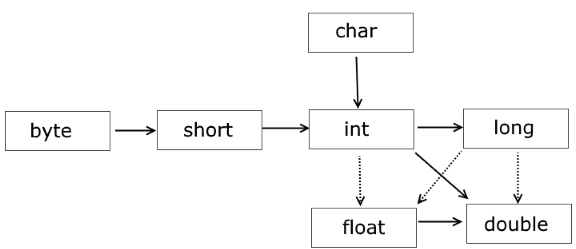
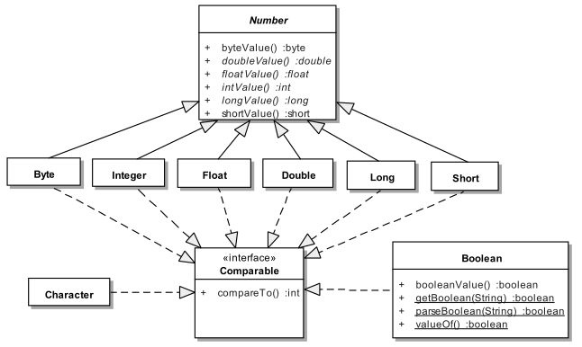

# Data types

- [Типы данных](#)
- [Классы оболочки](#Классы-оболочки)
- [Autoboxing в Java](#Autoboxing-в-Java)
- 

## Типы данных
  
+ Byte (byte) : `8bit` : `min: -128 max: 127` 
+ Short (short) : `16bit` : `min: -32768 max: 32767`
+ Character (char) : `16bit`book
+ Integer (int) : `32bit` : `min: -2147483648 max: 2147483647`
+ Long (long) : `64bit` : `min -9223372036854775808L max 9223372036854775807L`
+ Float (float) : `32bit` : `min: 1.4e-45f max: 3.4e+38f`
+ Double (double) : `64nit` : `min: 4.9e-324 max: 1.7e+308`
+ Boolean (boolean)
+ String

## Классы оболочки
  

## Autoboxing в Java
__Автоупаковка__ - это механизм неявной инициализации объектов классов-оберток (`Byte`, `Short`, `Integer`, `Long`, 
`Float`, `Double`, `Character`, `Boolean`) значениями соответствующих им исходных примитивных типов 
(`byte`, `short`, `int`...), без явного использования конструктора класса.   
+ Автоупаковка происходит при прямом присваивании примитива классу-обертке (с помощью оператора `=`), либо при 
    передаче примитива в параметры метода (типа класса-обертки).  
+ Автоупаковке в классы-обертки могут быть подвергнуты как переменные примитивных типов, так и константы времени 
    компиляции (литералы и `final`-примитивы). При этом литералы должны быть синтаксически корректными для 
    инициализации переменной исходного примитивного типа.  
+ Автоупаковка переменных примитивных типов требует точного соответствия типа исходного примитива типу класса-обертки. 
    Например, попытка упаковать переменную типа `byte` в `Short`, без предварительного явного приведения `byte` в 
    `short` вызовет ошибку компиляции.  
+ Автоупаковка констант примитивных типов допускает более широкие границы соответствия. В этом случае компилятор 
    способен предварительно осуществлять неявное расширение/сужение типа примитивов:  
    1) неявное расширение/сужение исходного типа примитива до типа примитива соответствующего классу-обертке 
        (для преобразования `int` в `Byte`, сначала компилятор самостоятельно неявно сужает `int` к `byte`)
    2) автоупаковку примитива в соответствующий класс-обертку. Однако, в этом случае существуют два дополнительных 
        ограничения:  
        a) присвоение примитива обертке может производится только оператором `=` (нельзя передать такой примитив в 
            параметры метода без явного приведения типов)
        b) тип левого операнда не должен быть старше чем `Character`, тип правого не дожен старше, чем `int`: 
            допустимо расширение/сужение `byte` в/из `short`, `byte` в/из `char`, `short` в/из `char` и только 
            сужение `byte` из `int`, `short` из `int`, `char` из `int`. Все остальные варианты требуют явного 
            приведения типов).   
Дополнительной особенностью целочисленных классов-оберток созданных автоупаковкой констант в 
диапазоне `-128 ... +127` я вляется то, что они кэшируются JVM. Поэтому такие обертки с одинаковыми значениями 
будут являться ссылками на один объект. 