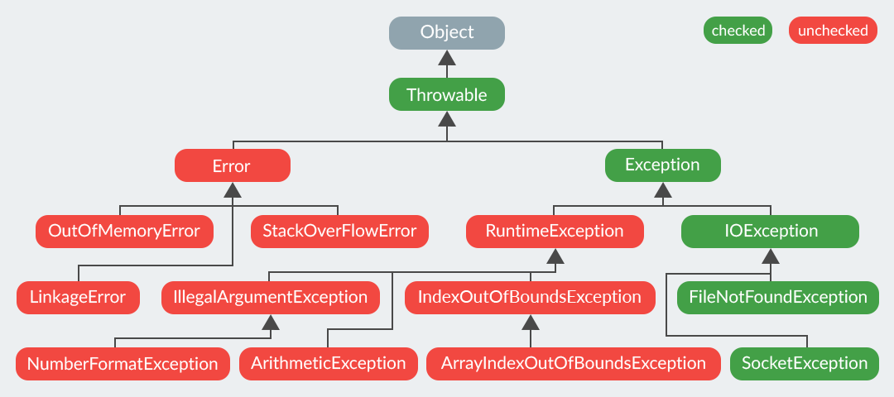

## Exception

- [Иерархия исключений](#Иерархия-исключений)
- [finally](#finally)
- [Может ли метод main() выбросить исключение во вне.](#Может-ли-метод-main()-выбросить-исключение-во-вне.)
- [Существуют ли ситуации, когда блок finally не будет выполнен?](#Существуют-ли-ситуации-когда-блок-finally-не-будет-выполнен?)
- [Когда в приложении может быть выброшено исключение ClassCastException?](#Когда-в-приложении-может-быть-выброшено-исключение-ClassCastException?)
- [Какое исключение выбрасывается при возникновении ошибки в блоке инициализации класса?](#Какое-исключение-выбрасывается-при-возникновении-ошибки-в-блоке-инициализации-класса?)
- [Какой оператор позволяет принудительно выбросить исключение?](#Какой-оператор-позволяет-принудительно-выбросить-исключение?)
- [О чем говорит ключевое слово throws?](#О-чем-говорит-ключевое-слово-throws?)
- [Как написать собственное исключение?](#Как-написать-собственное-исключение?)
- [Что представляет из себя ошибки класса Error?](#Что-представляет-из-себя-ошибки-класса-Error?)
- [Что вы знаете о OutOfMemoryError?](#Что-вы-знаете-о-OutOfMemoryError?)
- [Опишите работу блока try catch finally.](#Опишите-работу-блока-try-catch-finally.)
- [Что такое механизм try with resources?](#Что-такое-механизм-try-with-resources?)
- [Возможно ли использование блока try finally без catch?](#Возможно-ли-использование-блока-try-finally-без-catch?)
- [Может ли один блок catch отлавливать сразу несколько исключений?](#Может-ли-один-блок-catch-отлавливать-сразу-несколько-исключений?)
- [Предположим, есть метод, который может выбросить IOException и FileNotFoundException в какой последовательности должны идти блоки catch? Сколько блоков catch будет выполнено?](#Предположим,-есть-метод,-который-может-выбросить-IOException-и-FileNotFoundException-в-какой-последовательности-должны-идти-блоки-catch?-Сколько-блоков-catch-будет-выполнено?)
- [Если оператор return содержится и в блоке catch и в finally, какой из них главнее?](#Если-оператор-return-содержится-и-в-блоке-catch-и-в-finally,-какой-из-них-главнее?)
- [Что вы знаете о OutOfMemoryError?](#Что-вы-знаете-о-OutOfMemoryError?)
- [Что вы знаете о SQLException?](#Что-вы-знаете-о-SQLException?)
- [ConcurrentModificationException](#ConcurrentModificationException)
- [](#)



## Иерархия исключений
Исключения делятся на несколько классов, но все они имеют общего предка — класс `Throwable`, потомками которого 
являются классы `Exception` и `Error`.  
__Ошибки (Errors)__ представляют собой более серьёзные проблемы, которые, согласно спецификации Java, не следует 
    обрабатывать в собственной программе, поскольку они связаны с проблемами уровня JVM. Например, исключения такого рода 
    возникают, если закончилась память доступная виртуальной машине.  
__Исключения (Exceptions)__ являются результатом проблем в программе, которые в принципе решаемы, предсказуемы и 
    последствия которых возможно устранить внутри программы. Например, произошло деление целого числа на ноль.

__Исключение__ - это нештатная ситуация, ошибка во время выполнения программы. Самый простой пример - деление на ноль. 
Можно вручную отслеживать возникновение подобных ошибок, а можно воспользоваться специальным механизмом исключений, 
который упрощает создание больших надёжных программ, уменьшает объём необходимого кода и повышает уверенность в том, 
что в приложении не будет необработанной ошибки.  

Основными классами являются `Throwable`, `Error`, `Exception` и `RuntimeException`. 
В Java все исключения делятся на два типа:  
+ __checked (контролируемые/проверяемые исключения)__ должны обрабатываться блоком `catch` или описываться 
    в сигнатуре метода (например `throws IOException`). Наличие такого обработчика/модификатора сигнатуры 
    проверяются на этапе компиляции;  
+ __unchecked (неконтролируемые/непроверяемые исключения)__, к которым относятся ошибки `Error` 
    (например `OutOfMemoryError`), обрабатывать которые не рекомендуется и исключения времени выполнения, 
    представленные классом `RuntimeException` и его наследниками (например `NullPointerException`), 
    которые могут не обрабатываться блоком `catch` и не быть описанными в сигнатуре метода.  

`Error` - это подкласс, который показывает серьезные проблемы возникающие во время выполнения приложения. 
Большинство из этих ошибок сигнализируют о ненормальном ходе выполнения программы, т.е. о каких-то критических 
проблемах. Эти ошибки не рекомендуется отмечать в методах посредством throws-объявления, поэтому они также очень 
часто называются не проверяемые _unchecked_.

При программировании на Java основное внимание следует уделять иерархии `Exception`. Эта иерархия также разделяется 
на две ветви: исключения, производные от класса `RuntimeException`, и остальные. Исключения типа `RuntimeException` 
возникают вследствие ошибок программирования. Все другие исключения являются следствием непредвиденного стечения 
обстоятельств, например, ошибок ввода-вывода, возникающих при выполнении вполне корректных программ.

__Непроверяемых исключений:__
+ ArithmeticException - арифметическая ошибка, например, деление на нуль
+ ArrayIndexOutOfBoundsException - выход индекса за границу массива
+ ArrayStoreException - присваивание элементу массива объекта несовместимого типа
+ ClassCastException - неверное приведение
+ EnumConstantNotPresentException - попытка использования неопределённого значения перечисления
+ IllegalArgumentException - неверный аргумент при вызове метода
+ IllegalMonitorStateException - неверная операция мониторинга
+ IllegalStateException - некорректное состояние приложения
+ IllegalThreadStateException - запрашиваемая операция несовместима с текущим потоком
+ IndexOutofBoundsException - тип индекса вышел за допустимые пределы
+ NegativeArraySizeException - создан массив отрицательного размера
+ NullPointerException - неверное использование пустой ссылки
+ NumberFormatException - неверное преобразование строки в числовой формат
+ SecurityException - попытка нарушения безопасности
+ StringIndexOutOfBounds - попытка использования индекса за пределами строки
+ TypeNotPresentException - тип не найден
+ UnsupportedOperationException - обнаружена неподдерживаемая операция

__Проверяемые исключения:__
+ ClassNotFoundException - класс не найден
+ CloneNotSupportedException - попытка клонировать объект, который не реализует интерфейс Cloneable
+ IllegalAccessException - запрещен доступ к классу
+ InstantiationException - попытка создать объект абстрактного класса или интерфейса
+ InterruptedException - поток прерван другим потоком
+ NoSuchFieldException - запрашиваемое поле не существует
+ NoSuchMethodException - запрашиваемый метод не существует
+ ReflectiveOperationException - исключение, связанное с рефлексией

__Синтаксис__   
В Java есть пять ключевых слов для работы с исключениями:  
+ `try` - данное ключевое слово используется для отметки начала блока кода, который потенциально может привести к ошибке. 
+ `catch` - ключевое слово для отметки начала блока кода, предназначенного для перехвата и обработки исключений.
+ `finally` - ключевое слово для отметки начала блока кода, которое является дополнительным. Этот блок помещается 
    после последнего блока `catch`. Управление обычно передаётся в блок `finally` в любом случае. 
+ `throw` - служит для генерации исключений.
+ `throws` - ключевое слово, которое прописывается в сигнатуре метода, и обозначающее что метод потенциально может 
    выбросить исключение с указанным типом.
    
```java
try{ 
//здесь код, который потенциально может привести к ошибке 
} 
catch(SomeException e ){ //в скобках указывается класс конкретной ожидаемой ошибки  
//здесь описываются действия, направленные на обработку исключений 
} 
finally{ 
//выполняется в любом случае ( блок finnaly не обязателен) 
} 
```

То есть если в вашем коде есть участок который может бросить checked исключение то вы обязаны либо заключить его в 
конструкцию `try/catch` либо объявить в сигнатуре метода "throws SomeException" но в данном случае обработка 
исключения делегируется на уровень выше. В любом случае его нужно будет перехватить. В противном случае 
программа просто не скомпилируется.

## finally
Код в блоке `finally` будет выполнен всегда, независимо от того, выброшено исключение или нет.

Иногда требуется гарантировать, что определенный участок кода будет выполняться независимо от того, какие исключения 
были возбуждены и перехвачены. Для создания такого участка кода используется ключевое слово `finally`. Даже в тех 
случаях, когда в методе нет соответствующего возбужденному исключению раздела catch, блок finally будет выполнен до 
того, как управление перейдет к операторам, следующим за разделом `try`. У каждого раздела `try` должен быть по 
крайней мере или один раздел `catch` или блок `finally`. Блок `finally` очень удобен для закрытия файлов и 
освобождения любых других ресурсов, захваченных для временного использования в начале выполнения метода. 

### Может ли метод main() выбросить исключение во вне.
Может и оно будет передано в виртуальную машину Java (JVM).

### Существуют ли ситуации когда блок finally не будет выполнен?
+ принудительный системный выход из программы:
```java
try { 
    System.exit(0); 
} catch(Exception e) { 
    e.printStackTrace(); 
} finally { }
```
+ Если сначала произойдет сбой JVM;
+ Если JVM достигает бесконечного цикла (или другого не прерывающегося, не заканчивающегося оператора) в 
    блоке `try` или `catch`;
+ Если ОС принудительно завершает процесс JVM; например, "убить -9" в UNIX.
+ Если хост-система умирает; например, сбой питания, аппаратная ошибка, паника ОС и т.д.
+ Если, наконец, блок будет выполняться потоком демона, а все остальные не-демонные потоки выходят до того, 
    как, наконец, вызывается.
+ Существуют потоки-демоны - потоки предоставляющие некие сервисы, работая в фоновом режиме во время выполнения 
    программы, но при этом не являются ее неотъемлемой частью.Таким образом когда все потоки не демоны завершаются, 
    программа завершает свою работу. В потоках демонах блок finally не выполняется, они прерываются внезапно.
    
## Когда в приложении может быть выброшено исключение ClassCastException?
`ClassCastException` (потомок `RuntimeException`) - исключение, которое будет выброшено при ошибке приведения типа.

## Какое исключение выбрасывается при возникновении ошибки в блоке инициализации класса?
Если возникшее исключение - наследник `RuntimeException`: 
+ для статических блоков инициализации будет выброшено `java.lang.ExceptionInInitializerError`;
+ для нестатических будет проброшено исключение-источник.  

Если возникшее исключение - наследник `Error`, то в обоих случаях будет выброшено `java.lang.Error`. 
Исключение: `java.lang.ThreadDeath` - смерть потока. В этом случае никакое исключение выброшено не будет.

## Какой оператор позволяет принудительно выбросить исключение?
Это оператор `throw`:   
```java
throw new Exception();
```

## О чем говорит ключевое слово throws?
Модификатор `throws` прописывается в сигнатуре метода и указывает на то, что метод потенциально может выбросить 
исключение с указанным типом.  

## Как написать собственное исключение?
Необходимо унаследоваться от базового класса требуемого типа исключений (например от `Exception` или `RuntimeException`).
```java
class CustomException extends Exception {
    public CustomException() {
        super();
    }

    public CustomException(final String string) {
        super(string + " is invalid");
    }

    public CustomException(final Throwable cause) {
        super(cause);
    }
}
```

## Что представляет из себя ошибки класса Error?
Ошибки класса `Error` представляют собой наиболее серьёзные проблемы уровня JVM. Например, исключения такого 
рода возникают, если закончилась память доступная виртуальной машине. Обрабатывать такие ошибки не запрещается, 
но делать этого не рекомендуется.

## Что вы знаете о OutOfMemoryError?
`OutOfMemoryError` выбрасывается, когда виртуальная машина Java не может создать (разместить) объект из-за нехватки 
памяти, а сборщик мусора не может высвободить достаточное её количество.  
Область памяти, занимаемая java процессом, состоит из нескольких частей. Тип `OutOfMemoryError` зависит от того, 
в какой из них не хватило места:    
  
+ `java.lang.OutOfMemoryError: Java heap space`:  
    Не хватает места в куче, а именно, в области памяти в которую помещаются объекты, создаваемые в приложении 
    программно. Обычно проблема кроется в утечке памяти. Размер задается параметрами `-Xms` и `-Xmx`.  
+ `java.lang.OutOfMemoryError: PermGen space`:   
    (до версии Java 8) Данная ошибка возникает при нехватке места в _Permanent_ области, размер которой задается 
    параметрами `-XX:PermSize` и `-XX:MaxPermSize`.
+ `java.lang.OutOfMemoryError: GC overhead limit exceeded`:   
    Данная ошибка может возникнуть как при переполнении первой, так и второй областей. Связана она с тем, что памяти 
    осталось мало и сборщик мусора постоянно работает, пытаясь высвободить немного места. Данную ошибку можно 
    отключить с помощью параметра `-XX:-UseGCOverheadLimit`.
+ `java.lang.OutOfMemoryError: unable to create new native thread`:   
    Выбрасывается, когда нет возможности создавать новые потоки.

## Опишите работу блока try catch finally.
`try` — данное ключевое слово используется для отметки начала блока кода, который потенциально может привести к ошибке.
`catch` — ключевое слово для отметки начала блока кода, предназначенного для перехвата и обработки исключений в 
    случае их возникновения.
`finally` — ключевое слово для отметки начала блока кода, который является дополнительным. Этот блок помещается 
    после последнего блока `catch`. Управление передаётся в блок `finally` в любом случае, было выброшено 
    исключение или нет.   
Общий вид конструкции для обработки исключительной ситуации выглядит следующим образом:  
```java
try { 
    //код, который потенциально может привести к исключительной ситуации 
} 
catch(SomeException e ) { //в скобках указывается класс конкретной ожидаемой ошибки  
    //код обработки исключительной ситуации
} 
finally {
    //необязательный блок, код которого выполняется в любом случае
}
```

## Что такое механизм try with resources?
Данная конструкция, которая появилась в Java 7, позволяет использовать блок _try-catch_ не заботясь о закрытии 
ресурсов, используемых в данном сегменте кода.  
Ресурсы объявляются в скобках сразу после `try`, а компилятор уже сам неявно создаёт секцию `finally`, в 
которой и происходит освобождение занятых в блоке ресурсов. Под ресурсами подразумеваются сущности, 
реализующие интерфейс `java.lang.Autocloseable`.   
Общий вид конструкции:  
```java
try(/*объявление ресурсов*/) {
    //...
} catch(Exception ex) {
    //...
} finally {
    //...
}
```  
Стоит заметить, что блоки `catch` и явный `finally` выполняются уже после того, как закрываются ресурсы в 
неявном `finally`.  

## Возможно ли использование блока try finally без catch?
Такая запись допустима, но смысла в такой записи не так много, всё же лучше иметь блок `catch`, в котором 
будет обрабатываться необходимое исключение.  

try может быть в паре с finally, без catch. 
Работает это точно так же - после выхода из блока try выполняется блок finally. Это может быть полезно, например, в 
следующей ситуации. При выходе из метода вам надо произвести какое-либо действие. А return в этом методе стоит в 
нескольких местах. Писать одинаковый код перед каждым return нецелесообразно. Гораздо проще и эффективнее поместить 
основной код в try, а код, выполняемый при выходе - в finally.


## Может ли один блок catch отлавливать сразу несколько исключений?
исключений одним блоком `catch`:  
```java
try {  
    //...
} catch(IOException | SQLException ex) {
    //...
}
```

## Предположим, есть метод, который может выбросить IOException и FileNotFoundException в какой последовательности должны идти блоки catch? Сколько блоков catch будет выполнено?
Общее правило: обрабатывать исключения нужно от «младшего» к старшему. Т.е. нельзя поставить в первый блок 
`catch(Exception ex) {}`, иначе все дальнейшие блоки `catch()` уже ничего не смогут обработать, т.к. любое 
исключение будет соответствовать обработчику `catch(Exception ex)`.  
Таким образом, исходя из факта, что `FileNotFoundException extends IOException` сначала нужно обработать 
`FileNotFoundException`, а затем уже `IOException`:  
```java
void method() {
    try {
        //...
    } catch (FileNotFoundException ex) {
        //...
    } catch (IOException ex) {
        //...
    }
}
```

## Если оператор return содержится и в блоке catch и в finally, какой из них главнее?
```java
    public static void main(String[] args) {
       String what =  method();
        System.out.println(what);
    }
 
    public static String method() {
        try {
            return "SomeString";
        } catch(Exception ex) {
            return "Catch message";
        } finally {
            return "Finally message";
        }
    }
//Вывод
Finally message
```

## Что вы знаете о SQLException?
__SQLException__ предоставляет информацию об ошибках доступа к базе данных или других ошибках связанных с работой с 
базами данных.

`SQLException` относится к checked исключениям, а значит проверяется на этапе компиляции.

## ConcurrentModificationException
`ConcurrentModificationException` не всегда является следствием неверной синхронизации работы с коллекциями. 
`ConcurrentModificationException` возникает при изменении коллекции любыми средствами, отличными от итератора, 
при проходе по коллекции с помощью итератора. Изменение такое, как продемонстрировано выше может происходить и 
в одно-тредной среде. Не лишне также добавить, что исключение может возникать не только при удалении, но и при 
добавлении элемента, а также что модификация контейнера может возникать и в многотредной среде.
