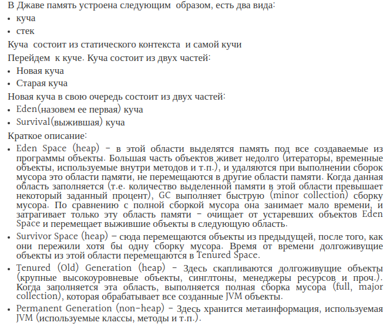

# Garbage Collector

- [Какие разновидности сборщиков мусора реализованы в виртуальной машине HotSpot?](#Какие-разновидности-сборщиков-мусора-реализованы-в-виртуальной-машине-HotSpot?)
- [Как работает сборщик мусора?](#Как-работает-сборщик-мусора?)
- [Для чего нужен сборщик мусора?](#Для-чего-нужен-сборщик-мусора?)
- [Serial Garbage Collector](#Serial-Garbage-Collector)
- [Что такое finalize()? Зачем он нужен?](#Что-такое-finalize()?-Зачем-он-нужен?)
- [Что произойдет со сборщиком мусора, если выполнение метода finalize() требует ощутимо много времени, или в процессе выполнения будет выброшено исключение?](#Что-произойдет-со-сборщиком-мусора,-если-выполнение-метода-finalize()-требует-ощутимо-много-времени,-или-в-процессе-выполнения-будет-выброшено-исключение?)

## Какие разновидности сборщиков мусора реализованы в виртуальной машине HotSpot?
Java HotSpot VM предоставляет разработчикам на выбор четыре различных сборщика мусора:

+ __Serial (последовательный)__ — самый простой вариант для приложений с небольшим объемом данных и не требовательных 
    к задержкам. На данный момент используется сравнительно редко, но на слабых компьютерах может быть выбран 
    виртуальной машиной в качестве сборщика по умолчанию. Использование Serial GC включается опцией `-XX:+UseSerialGC`.
+ __Parallel (параллельный)__ — наследует подходы к сборке от последовательного сборщика, но добавляет параллелизм в 
    некоторые операции, а также возможности по автоматической подстройке под требуемые параметры производительности. 
    Параллельный сборщик включается опцией `-XX:+UseParallelGC`.
+ __Concurrent Mark Sweep (CMS)__ — нацелен на снижение максимальных задержек путем выполнения части работ по сборке 
    мусора параллельно с основными потоками приложения. Подходит для работы с относительно большими объемами данных в 
    памяти. Использование CMS GC включается опцией `-XX:+UseConcMarkSweepGC`.
+ __Garbage-First (G1)__ — создан для замены CMS, особенно в серверных приложениях, работающих на многопроцессорных 
    серверах и оперирующих большими объемами данных. _G1_ включается опцией Java `-XX:+UseG1GC`.
    
## Как работает сборщик мусора?
Механизм сборки мусора - это процесс освобождения места в куче, для возможности добавления новых объектов.

Объекты создаются посредством оператора `new`, тем самым присваивая объекту ссылку. Для окончания работы с объектом 
достаточно просто перестать на него ссылаться, например присвоив переменной ссылку на другой объект или значение `null`; 
прекратить выполнение метода, чтобы его локальные переменные завершили свое существование естественным образом. 
Объекты, ссылки на которые отсутствуют, принято называть мусором (_garbage_), который будет удален.

Виртуальная машина Java, применяя механизм сборки мусора, гарантирует, что любой объект, обладающий ссылками, остается 
в памяти — все объекты, которые недостижимы из исполняемого кода, ввиду отсутствия ссылок на них, удаляются с 
высвобождением отведенной для них памяти. Точнее говоря, объект не попадает в сферу действия процесса сборки мусора, 
если он достижим посредством цепочки ссылок, начиная с корневой (_GC Root_) ссылки, т.е. ссылки, непосредственно 
существующей в выполняемом коде.

Память освобождается сборщиком мусора по его собственному «усмотрению». Программа может успешно завершить работу, 
не исчерпав ресурсов свободной памяти или даже не приблизившись к этой черте и поэтому ей так и не потребуются «услуги» 
сборщика мусора.

Мусор собирается системой автоматически, без вмешательства пользователя или программиста, но это не значит, что этот 
процесс не требует внимания вовсе. Необходимость создания и удаления большого количества объектов существенным образом 
сказывается на производительности приложений и если быстродействие программы является важным фактором, следует 
тщательно обдумывать решения, связанные с созданием объектов, — это, в свою очередь, уменьшит и объем мусора, 
подлежащего утилизации.

## Для чего нужен сборщик мусора?
Сборщик мусора __Garbage Collector__ должен делать всего две вещи:

+ Находить мусор - неиспользуемые объекты. (Объект считается неиспользуемым, если ни одна из сущностей в коде, 
    выполняемом в данный момент, не содержит ссылок на него, либо цепочка ссылок, которая могла бы связать объект с 
    некоторой сущностью приложения, обрывается);
+ Освобождать память от мусора.

Существует два подхода к обнаружению мусора:  
+ _Reference counting_;
+ _Tracing_

__Reference counting__ (подсчёт ссылок). Суть этого подхода состоит в том, что каждый объект имеет счетчик. Счетчик 
хранит информацию о том, сколько ссылок указывает на объект. Когда ссылка уничтожается, счетчик уменьшается. Если 
значение счетчика равно нулю, - объект можно считать мусором. Главным минусом такого подхода является сложность 
обеспечения точности счетчика. Также при таком подходе сложно выявлять циклические зависимости (когда два объекта 
указывают друг на друга, но ни один живой объект на них не ссылается), что приводит к утечкам памяти.

Главная идея подхода __Tracing__ (трассировка) состоит в утверждении, что живыми могут считаться только те объекты, 
до которых мы можем добраться из корневых точек (_GC Root_) и те объекты, которые доступны с живого объекта. 
Всё остальное - мусор.

Существует 4 типа корневых точки:
+ Локальные переменные и параметры методов;
+ Потоки;
+ Статические переменные;
+ Ссылки из JNI. __Java Native Interface__ — механизм для запуска кода под управлением виртуальной машины Java __JVM__

Самое простое java приложение будет иметь корневые точки:
+ Локальные переменные внутри `main()` метода и параметры `main()` метода;
+ Поток который выполняет `main()`;
+ Статические переменные класса, внутри которого находится `main()` метод.

Таким образом, если мы представим все объекты и ссылки между ними как дерево, то нам нужно будет пройти с корневых 
узлов (точек) по всем рёбрам. При этом узлы, до которых мы сможем добраться - не мусор, все остальные - мусор. 
При таком подходе циклические зависимости легко выявляются. HotSpot VM использует именно такой подход.


__Для очистки памяти от мусора существуют два основных метода:__
+ _Copying collectors_
+ _Mark-and-sweep_

При __copying collectors__ подходе память делится на две части «from-space» и «to-space», при этом сам принцип 
работы такой:  
+ Объекты создаются в «from-space»;
+ Когда «from-space» заполняется, приложение приостанавливается;
+ Запускается сборщик мусора. Находятся живые объекты в «from-space» и копируются в «to-space»;
+ Когда все объекты скопированы «from-space» полностью очищается;
+ «to-space» и «from-space» меняются местами.

Главный плюс такого подхода в том, что объекты плотно забивают память. Минусы подхода:
1. Приложение должно быть остановлено на время, необходимое для полного прохождения цикла сборки мусора;
2. В худшем случае (когда все объекты живые) «form-space» и «to-space» будут обязаны быть одинакового размера.

Алгоритм работы __mark-and-sweep__ можно описать так:
+ Объекты создаются в памяти;
+ В момент, когда нужно запустить сборщик мусора приложение приостанавливается;
+ Сборщик проходится по дереву объектов, помечая живые объекты;
+ Сборщик проходится по всей памяти, находя все не отмеченные куски памяти и сохраняя их в «free list»;
+ Когда новые объекты начинают создаваться они создаются в памяти доступной во «free list».

__Минусы этого способа:__
1. Приложение не работает пока происходит сборка мусора;
2. Время остановки напрямую зависит от размеров памяти и количества объектов;
3. Если не использовать «compacting» память будет использоваться не эффективно.

Сборщики мусора HotSpot VM используют комбинированный подход __Generational Garbage Collection__, который позволяет 
использовать разные алгоритмы для разных этапов сборки мусора.  

__Этот подход опирается на том, что:__
+ большинство создаваемых объектов быстро становятся мусором;
+ существует мало связей между объектами, которые были созданы в прошлом и только что созданными объектами.

## Serial Garbage Collector
__Последовательный сборщик мусора__ - был одним из первых сборщиков мусора в HotSpot VM. Во время работы этого сборщика 
приложения приостанавливается и продолжает работать только после прекращение сборки мусора. 




Память приложения делится на три пространства:
+ _Young generation_. Объекты создаются именно в этом участке памяти.
+ _Old generation_. В этот участок памяти перемещаются объекты, которые переживают «minor garbage collection».
+ _Permanent generation_. Тут хранятся метаданные об объектах, _Class data sharing (CDS)_, _пул строк (String pool)_. 
    Permanent область делится на две: только для чтения и для чтения-записи. Очевидно, что в этом случае область только 
    для чтения не чистится сборщиком мусора никогда.

Область памяти Young generation состоит из трёх областей: _Eden_ и двух меньших по размеру _Survivor spaces_ - _To space_ 
и _From space_. Большинство объектов создаются в области Eden, за исключением очень больших объектов, которые не могут 
быть размещены в ней и поэтому сразу размещаются в Old generation. В Survivor spaces перемещаются объекты, которые 
пережили по крайней мере одну сборку мусора, но ещё не достигли порога «старости» (_tenuring threshold_), чтобы быть 
перемещенными в Old generation.

Когда Young generation заполняется, то в этой области запускается процесс лёгкой сборки (_minor collection_), в отличие 
от процесса сборки, проводимого над всей кучей (_full collection_). Он происходит следующим образом: в начале работы 
одно из Survivor spaces - To space, является пустым, а другое - From space, содержит объекты, пережившие предыдущие 
сборки. Сборщик мусора ищет живые объекты в Eden и копирует их в To space, а затем копирует туда же и живые «молодые» 
(то есть не пережившие еще заданное число сборок мусора) объекты из From space. Старые объекты из From space 
перемещаются в Old generation. После лёгкой сборки From space и To space меняются ролями, область Eden становится 
пустой, а число объектов в Old generation увеличивается.

Если в процессе копирования живых объектов To space переполняется, то оставшиеся живые объекты из Eden и From space, 
которым не хватило места в To space, будут перемещены в Old generation, независимо от того, сколько сборок мусора они 
пережили.

Поскольку при использовании этого алгоритма сборщик мусора просто копирует все живые объекты из одной области памяти в 
другую, то такой сборщик мусора называется _copying_ (копирующий). Очевидно, что для работы копирующего сборщика мусора 
у приложения всегда должна быть свободная область памяти, в которую будут копироваться живые объекты, и такой алгоритм 
может применяться для областей памяти сравнительно небольших по отношению к общему размеру памяти приложения. 
Young generation как раз удовлетворяет этому условию (по умолчанию на машинах клиентского типа эта область занимает 
около 10% кучи (значение может варьироваться в зависимости от платформы)).

Однако, для сборки мусора в Old generation, занимающем большую часть всей памяти, используется другой алгоритм.

В Old generation сборка мусора происходит с использованием алгоритма _mark-sweep-compact_, который состоит из трёх фаз. 
В фазе _Mark_ (пометка) сборщик мусора помечает все живые объекты, затем, в фазе _Sweep_ (очистка) все не помеченные 
объекты удаляются, а в фазе _Сompact_ (уплотнение) все живые объекты перемещаются в начало Old generation, в результате 
чего свободная память после очистки представляет собой непрерывную область. Фаза уплотнения выполняется для того, чтобы 
избежать фрагментации и упростить процесс выделения памяти в Old generation.

Когда свободная память представляет собой непрерывную область, то для выделения памяти под создаваемый объект можно 
использовать очень быстрый (около десятка машинных инструкций) алгоритм _bump-the-pointer_: адрес начала свободной 
памяти хранится в специальном указателе, и когда поступает запрос на создание нового объекта, код проверяет, что для 
нового объекта достаточно места, и, если это так, то просто увеличивает указатель на размер объекта.

Последовательный сборщик мусора отлично подходит для большинства приложений, использующих до 200 мегабайт кучи, 
работающих на машинах клиентского типа и не предъявляющих жёстких требований к величине пауз, затрачиваемых на сборку 
мусора. В то же время модель «stop-the-world» может вызвать длительные паузы в работе приложения при использовании 
больших объёмов памяти. Кроме того, последовательный алгоритм работы не позволяет оптимально использовать 
вычислительные ресурсы компьютера и последовательный сборщик мусора может стать узким местом при работе приложения 
на многопроцессорных машинах.

## Что такое finalize()? Зачем он нужен?
Через вызов метода `finalize()` (который наследуется от `Java.lang.Object`) JVM реализуется функциональность аналогичная 
функциональности деструкторов в `С++`, используемых для очистки памяти перед возвращением управления операционной 
системе. Данный метод вызывается при уничтожении объекта сборщиком мусора (_garbage collector_) и 
переопределяя `finalize()` можно запрограммировать действия необходимые для корректного удаления экземпляра 
класса - например, закрытие сетевых соединений, соединений с базой данных, снятие блокировок на файлы и т.д. 

После выполнения этого метода объект должен быть повторно собран сборщиком мусора (и это считается серьезной проблемой 
метода `finalize()` т.к. он мешает сборщику мусора освобождать память). Вызов этого метода не гарантируется, 
т.к. приложение может быть завершено до того, как будет запущена сборка мусора.

Объект не обязательно будет доступен для сборки сразу же - метод `finalize()` может сохранить куда-нибудь ссылку 
на объект. Подобная ситуация называется «возрождением» объекта и считается антипаттерном. Главная проблема такого 
трюка - в том, что «возродить» объект можно только 1 раз.

Пример:
```java
public class MainClass {

	public static void main(String args[]) {
		TestClass a = new TestClass();
		a.a();
		a = null;
		a = new TestClass();
		a.a();
		System.out.println("!!! done");
	}
}
```
```java

public class TestClass {

	public void a() {
		System.out.println("!!! a() called");
	}

	@Override
	protected void finalize() throws Throwable {
		System.out.println("!!! finalize() called");
		super.finalize();
	}
}
```
Так как в данном случае сборщик мусора может и не быть вызван (в силу простоты приложения), то результат выполнения 
программы с большой вероятностью будет следующий:  
```
!!! a() called
!!! a() called
!!! done
```
Теперь несколько усложним программу, добавив принудительный вызов Garbage Collector:
```java
public class MainClass {

	public static void main(String args[]) {
		TestClass a = new TestClass();
		a.a();
		a = null;
		System.gc(); // Принудительно зовём сборщик мусора
		a = new TestClass();
		a.a();
		System.out.println("!!! done");
	}

}
```
Как и было сказано ранее, Garbage Collector может в разное время отработать, поэтому результат выполнения может 
разниться от запуска к запуску:  
Вариант а:
```
!!! a() called
!!! a() called
!!! done
!!! finalize() called
```
Вариант б:
```
!!! a() called
!!! a() called
!!! finalize() called
!!! done
```

## Что произойдет со сборщиком мусора, если выполнение метода finalize() требует ощутимо много времени, или в процессе выполнения будет выброшено исключение?
Непосредственно вызов `finalize()` происходит в отдельном потоке _Finalizer_ (`java.lang.ref.Finalizer.FinalizerThread`), 
который создаётся при запуске виртуальной машины (в статической секции при загрузке класса `Finalizer`). 
Методы `finalize()` вызываются последовательно в том порядке, в котором были добавлены в список сборщиком мусора. 
Соответственно, если какой-то `finalize()` зависнет, он подвесит поток _Finalizer_, но не сборщик мусора. Это в 
частности означает, что объекты, не имеющие метода `finalize()`, будут исправно удаляться, а вот имеющие будут 
добавляться в очередь, пока поток _Finalizer_ не освободится, не завершится приложение или не кончится память. 

То же самое применимо и выброшенным в процессе `finalize()` исключениям: метод `runFinalizer()` у потока _Finalizer_ 
игнорирует все исключения выброшенные в момент выполнения `finalize()`. Таким образом возникновение исключительной 
ситуации никак не скажется на работоспособности сборщика мусора.
