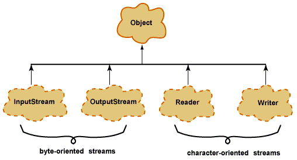
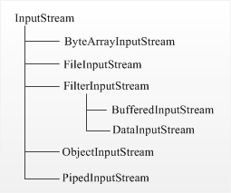
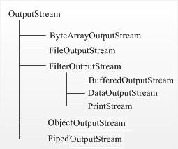

# IO-API

- [Виды потоков ввода/вывода](#Виды-потоков-ввода/вывода)
- [Предки потоков ввода/вывода](#Предки-потоков-ввода/вывода)
- [InputStream](#InputStream)
    - [ByteArrayInputStream](#ByteArrayInputStream)
    - [FileInputStream](#FileInputStream)
    - [FilterInputStream](#FilterInputStream)
        - [BufferedInputStream](#BufferedInputStream)
        - [DataInputStream](#DataInputStream)
    - [ObjectInputStream](#ObjectInputStream)
    - [PipedInputStream](#PipedInputStream)
- [OutputStream](#OutputStream)
    - [ByteArrayOutputStream](#ByteArrayOutputStream)
    - [FileOutputStream](#FileOutputStream)
    - [FilterOutPutStream](#FilterOutPutStream)
        - [BufferedOutputStream](#BufferedOutputStream)
        - [DataOutputStream](#DataOutputStream)
        - [PrintStream](#PrintStream)
    - [ObjectOutputStream](#ObjectOutputStream)
    - [PipedOutputStream](#PipedOutputStream)
- [File, FileFilter](#File,-FileFilter)
    - [Методы класса File](#Методы-класса-File)
    - [FileFilter](#FileFilter)
- [Abstract Reader](#Abstract-Reader)
    - [BufferedReader](#BufferedReader)
- [Abstract Writer](#Abstract-Writer)
    - [BufferedWriter](#BufferedWriter)
    
    
---
- [Что общего и чем отличаются следующие потоки: InputStream, OutputStream, Reader, Writer?](#Что-общего-и-чем-отличаются-следующие-потоки:-InputStream,-OutputStream,-Reader,-Writer?)
- [RandomAccessFile](#RandomAccessFile)
- [Режимы доступа к файлу](#Режимы-доступа-к-файлу)
- [Преобразовать байтовые потоки в символьные и обратно](#Преобразовать-байтовые-потоки-в-символьные-и-обратно)
- [Сериализация](#Сериализация)
- [Какие классы позволяют архивировать объекты?](#Какие-классы-позволяют-архивировать-объекты?)
- [](#)

## Виды потоков ввода/вывода
    
При работе с данными ввода/вывода вам будет часто попадаться термин `Stream`. _Поток_ - это абстрактное значение 
источника или приёмника данных, которые способны обрабатывать информацию.  
Разделяют два вида потоков ввода/вывода: байтовые и символьные.

## Предки потоков ввода/вывода
__Байтовые:__ java.io.InputStream, java.io.OutputStream;
__Символьные:__ java.io.Reader, java.io.Writer;

## InputStream
   
Базовый класс __InputStream__ - это абстрактный класс, определяющий входной поток данных, и является родителем для 
классов, получающих данные из различных источников : массив байтов, строки (String), файлы, каналы pipe, у 
которых одна из сторон является входом, а вторая сторона играет роль выхода, и т.д. Методы класса InputStream 
при возникновении ошибки вызывают исключение IOException. 

- `int read ()` чтение во входном потоке очередного доступного символа в виде целого
- `int read (byte b[])` чтение во входном потоке b.length байтов в массив b; возвращает количество прочитанных из 
    потока байтов
- `int read (byte b[], int off, int len)`	чтение len байтов в массиве b, начиная со смещения off; возвращает 
    количество прочитанных из потока байтов
- `int available ()`	получение количества доступных для чтения байтов
- `void close ()`	закрытие потока ввода; последующие попытки чтения из потока вызовут IOException
- `long skip(long n)`	пропуск во входном потоке n байтов. Возвращает количество пропущенных байтов
- `void mark(int readlimit)`	установка метки в текущей позиции входного потока, которую можно будет 
    использовать до тех пор, пока из потока не будет прочитано readlimit байтов
- `void reset()`	перевод указателя потока на установленную ранее метку
- `boolean markSupported()`	проверка поддержки потоком операции mark/reset

## ByteArrayInputStream
Класс __ByteArrayInputStream__ использует байтовый массив в качестве источника данных. 
Он имеет следующие конструкторы :   
```java
ByteArrayInputStream(byte[] buf);
ByteArrayInputStream(byte[] buf, int offset, int length);
```
В качестве параметров конструкторы __ByteArrayInputStream__ используют массив байтов _buf_ для чтения, смещение 
относительно начала массива _offset_ и количество считываемых символов _length_.   
Пример чтения массив байтов в консоль:
```java
import java.io.ByteArrayInputStream;
public class TestBIS {
    public static void main(String[] args) {
        byte[] array1 = new byte[]{1, 3, 5, 7};
        ByteArrayInputStream bis1;
        bis1 = new ByteArrayInputStream(array1);
        int b;
        while((b = bis1.read()) != -1)
            System.out.println(b);
         
        String text = "Hello world!";
        byte[] array2 = text.getBytes();
        ByteArrayInputStream bis2;
        bis2 = new ByteArrayInputStream(array2, 0, 5);
        while((b = bis2.read()) != -1)
            System.out.println((char)b);
    }
}
```
В отличие от других классов потоков для закрытия объекта __ByteArrayInputStream__ не требует вызывать метод `close()`.

## FileInputStream
Для чтения содержимого файла можно использовать класс FileInputStream, который является наследником класса InputStream 
и реализует все его методы. Конструктор класса FileInputStream :   
```java
FileInputStream(File file) throws FileNotFoundException;
FileInputStream(String name) throws FileNotFoundException;
```
Если файл не может быть открыт то генерируется исключение FileNotFoundException.

Пример считывания данных из файла и вывод содержимого в консоль:  
```java
import java.io.FileInputStream;
 
public class FilesApp
{
    public static void main(String[] args)
    {
        try { 
            FileInputStream fis;
            fis=new FileInputStream("C:\\test_dir\\test.txt");
            System.out.println("Размер файла: " + 
                                fis.available() + " байт(а)");
            int i = -1;
            while(( i = fis.read()) != -1){
                System.out.print((char)i);
            }
            fis.close();
        } catch(IOException e){
            System.out.println(e.getMessage());
        }
    }
}
```
Данные файла можно считать в массив байтов :   
```java
byte[] buffer = new byte[fis.available()];
// чтение файла в буфер
fis.read (buffer, 0, fis.available());
 
System.out.println ("Содержимое файла:");
for(int i = 0; i < buffer.length; i++){
    System.out.print((char)buffer[i]);
}
```
Класс FileInputStream предназначен прежде всего для работы с двоичными файлами. Его можно использовать для работы с 
текстовыми файлами, но все же для этой задачи больше подходят другие классы.

Пример использования FileInputStream для чтения файла свойств в кодировке UTF-8:

Файл свойств "data.properties" в кодировке UTF-8:
```java
#
# Параметры сервера SMTP
#
company=Рога и копыта
manager=Остап Бендер
```
```java
import java.io.Reader;
import java.io.IOException;
import java.io.InputStream;
import java.io.FileInputStream;
import java.io.InputStreamReader;

import java.util.Properties;

public class Main
{
    public static void main(String[] args)
    {
        try {
            InputStream is;
            is = new FileInputStream("data.properties");
            if (is != null) {
                Reader reader;
                reader = new InputStreamReader(is, "UTF-8");
                Properties props = new Properties();
                props.load(reader);

                System.out.println (
                         props.getProperty ("company") + ", "
                         props.getProperty ("manager"));

                is.close();
            }
        } catch (IOException e) {
            e.printStackTrace();
        }
    }
}
```

## FilterInputStream
__FilterInputStream__ - абстрактный класс, предоставляющий интерфейс для классов-надстроек, которые добавляют к 
существующим потокам полезные свойства. __FilterInputStream__ является базовым классом для двух других классов. 
Его единственный конструктор требует передачи в качестве параметра объекта класса InputStream, т.е. фактически 
объекта некоторого неабстрактного класса, порожденного от __InputStream__.

Прямое использование FilterInputStream в программе нецелесообразно.

## BufferedInputStream
__BufferedInputStream__ служит для организации более эффективного "буферизованного" ввода данных. Буферизация 
ввода-вывода является удобным способом оптимизации производительности, позволяя заключить в оболочку любой 
поток класса __InputStream__.
```java
import java.io.*;
public class TestBufferedInputStream {
    public static void main(String[] args) {
        String text = "Hello world!";
        byte[] buffer = text.getBytes();
        ByteArrayInputStream bais;
        bais = new ByteArrayInputStream(buffer);
        try {
            BufferedInputStream bis;
            bis = new BufferedInputStream(bais); 
            int c;
            while((c = bis.read()) != -1){
                System.out.print((char)c);
            }
        }
        catch(Exception e){
            System.out.println(e.getMessage());
        }
    } 
}
```
В конструкторе класса `BufferedInputStream` необходимо передать `InputStream`. В данном случае таким объектом является 
экземпляр класса `ByteArrayInputStream`.

Как и все потоки ввода `BufferedInputStream` обладает методом `read()`, который считывает данные с помощью метода 
`read()` из массива buffer.

Фактические все то же самое можно было сделать и с помощью одного `ByteArrayInputStream`, не прибегая к 
буферизированному потоку. Класс `BufferedInputStream` просто оптимизирует производительность при работе с 
потоком `ByteArrayInputStream`.

## DataInputStream
Для чтения байтовых данных (не строк) применяется класс `DataInputStream`. В этом случае необходимо использовать 
классы из группы `InputStream`. Для преобразования строки в массив байтов, пригодный для помещения в поток 
`ByteArrayInputStream`, в классе `String` предусмотрен метод `getBytes()`. Полученный `ByteArrayInputStream` 
представляет собой поток `InputStream`, подходящий для передачи `DataInputStream`.

При побайтовом чтении символов из форматированного потока `DataInputStream` методом `readByte()` любое полученное 
значение будет считаться действительным, поэтому возвращаемое значение неприменимо для идентификации конца потока. 
Вместо этого можно использовать метод available(), который сообщает, сколько еще осталось символов.

Класс `DataInputStream` позволяет читать элементарные данные из потока через интерфейс `DataInput`, который 
определяет методы, преобразующие элементарные значения в форму последовательности байтов. Такие потоки облегчают 
сохранение в файле двоичных данных.

Конструктор класса DataInputStream:   
```java
DataInputStream(InputStream stream)
```
__Методы DataInputStream__   
- `boolean readBoolean()`	байт булевого однобайтового значения
- `byte readByte()`	байт одного байта
- `char readChar()`	байт значения char
- `double readDouble()`	байт восьмибайтового значения double
- `float readFloat()`	чтение четырехбайтового значения float
- `int readInt()`	чтение целочисленного значения int
- `long readLong()`	чтение значения long
- `short readShort()`	чтение значения short
- `String readUTF()`	чтение строки в кодировке UTF-8
- `int skipBytes(int n)`	пропуск при чтении n байтов

Пример чтения из бинарного файла с использованием `DataInputStream`
```java
import java.io.*;
 
public class TestDataInputStream {
    public static void main(String[] args) {
        // Считывание из бинарного файла data.bin объекта 
        // типа Person
        try {
            DataInputStream dis;
            dis = new DataInputStream(
                            new FileInputStream("data.bin"));
            String name     = dis.readUTF();
            int    age      = dis.readInt();
            double height   = dis.readDouble();
            boolean married = dis.readBoolean();
            System.out.printf("Человека зовут: %s ; " +
                               "его возраст: %d , " +
                               "его рост: %f метров, " +
                               "женат/замужем: %b", 
                               name, age, height, married);
        } catch(IOException ex) {
            System.out.println(ex.getMessage());
        }
   } 
}
```

## ObjectInputStream
Класс __ObjectInputStream__ отвечает за чтение ранее сериализованных данных из потока. В конструкторе он принимает 
ссылку на поток ввода:   
```java
ObjectInputStream(InputStream in)
```
Основные методы класса __ObjectInputStream__ :   
- `int read()`	чтение одного байта; возвращает его целочисленное представление
- `boolean readBoolean()`	чтение одного значения boolean
- `byte readByte()`	чтение одного байта
- `char readChar()`	чтение одного символ char
- `double readDouble()`	чтение значения типа double
- `float readFloat()`	чтение значения типа float
- `int readInt()`	чтение целочисленного значения int
- `long readLong()`	чтение значения типа long
- `short readShort()`	чтение значения типа short
- `String readUTF()`	чтение строки в кодировке UTF-8
- `Object readObject()`	чтение объекта
- `int skipBytes(int len)`	пропуск при чтении нескольких байт, количество которых равно len
- `int available()`	чтение количества доступных для чтения байт
- `void close()`	закрытие потока

Пример чтения объекта Person из файла :
```java
import java.io.*;
 
public class TestObjectInputStream {
    public static void main(String[] args)     {
        try {
            ObjectInputStream ois;
            ois = new ObjectInputStream(
                        new FileInputStream("person.dat"));
            Person person = (Person) ois.readObject();
            System.out.printf("Имя: %s \t Возраст: %d \n",
                               person.name, person.age);
        }
        catch(Exception e) {
            System.out.println(e.getMessage());
        } 
    } 
    class Person implements Serializable {
        private static final long serialVersionUID = 1L;
		
        public String name;
        public int age;
        public double height;
        public boolean married;
         
        public Person(String n, int a, double h, boolean m) {
            this.name    = n;
            this.height  = h;
            this.age     = a;
            this.married = m;
        }
    }
}
```

## PipedInputStream
Класс __PipedInputStream__ - это специальный класс, используемый для связи отдельных программ (потоков) друг с д
ругом внутри одной JVM. Данный класс является важным инструментом организации синхронизации потоков.

Конструкторы __PipedInputStream__ :
```java
PipedInputStream()
PipedInputStream(int pipeSize)
PipedInputStream (PipedOutputStream src)
PipedInputStream (PipedOutputStream src, int pipeSize)
```
Методы __PipedInputStream__ :
- `available()`
- `close()`
- `connect (PipedOutputStream src)`
- `read()`
- `read(byte[] b, int off, int len)`
- `receive(int b)`

Пример простого использования PipedInputStream :
```java
InputStream input = new PipedInputStream (pipedOutputStream);

int data = input.read();
while(data != -1) {
    // обработка данных в отдельном 
    // методе doSomethingWithData
    doSomethingWithData(data);

    data = input.read();
}
input.close();
```

## OutputStream
Стандартная библиотека Java имеет весьма развитые средства вывода данных. Все возможности вывода данных 
сосредоточены в пакете `java.io`.   
Существуют две параллельные иерархии классов вывода : `OutputStream` и `Writer`. Класс `Writer` введен в последних 
версиях Java.    

   

Поток __Stream__ - это абстрактное значение источника или приёмника данных, которые способны обрабатывать информацию. 
Есть два типа потоков: байтовые и символьные. В некоторых ситуациях символьные потоки более эффективны, чем байтовые. 
Классы, производные от классов OutputStream или Writer, имеют методы с именами write() для записи одиночных байтов 
или массива байтов (отвечают за вывод данных).   

Класс __OutputStream__ - это абстрактный класс, определяющий байтовый поток вывода. Наследники данного класса 
определяют куда направлять данные: в массив байтов, в файл или канал. Из массива байт можно создать текстовую 
строку String.

Методы класса __OutputStream__ :
- `void write(int b)` записывает один байт в выходной поток. Аргумент этого метода имеет тип int, что позволяет 
    вызывать write, передавая ему выражение, при этом не нужно выполнять приведение его типа к byte.
- `void write(byte b[])` записывает в выходной поток весь указанный массив байтов.
- `void write(byte b[], int off, int len)` записывает в поток len байтов массива, начиная с элемента b[off].
- `void flush()` очищает любые выходные буферы, завершая операцию вывода.
- `void close()` закрывает выходной поток. Последующие попытки записи в этот поток будут возбуждать IOException.

## ByteArrayOutputStream
Класс __ByteArrayOutputStream__ представляет поток вывода, использующий массив байтов в качестве места вывода. 
Чтобы создать объект данного класса, можно использовать один из его конструкторов :
```java
ByteArrayOutputStream()
ByteArrayOutputStream(int size)
```
Первый конструктор создает массив данных для хранения байтов длиной в 32 байта, а второй конструктор создает массив длиной size.

Примеры использования класса ByteArrayOutputStream :
```java
import java.io.ByteArrayOutputStream;

public class TestBOS {
    public static void main(String[] args) {
        ByteArrayOutputStream bos;
        bos = new ByteArrayOutputStream();
        String text = "Hello World!";
        byte[] buffer = text.getBytes();
        try{
            bos.write(buffer);
        } catch(Exception e) {
            System.out.println(e.getMessage());
        }
        // Преобразование массива байтов в строку
        System.out.println(bos.toString());
         
        // Вывод в консоль по символьно
        byte[] array = bos.toByteArray();
        for (byte b: array) {
            System.out.print((char)b);
        }
        System.out.println();
    }
}
```
В классе ByteArrayOutputStream метод write записывает в поток некоторые данные (массив байтов). Этот массив байтов 
записывается в объекте ByteArrayOutputStream в защищенное поле buf, которое представляет также массив байтов 
(protected byte[] buf). Так как метод write может вызвать исключение, то вызов этого метода помещается в блок try..catch.

Используя методы toString() и toByteArray(), можно получить массив байтов buf в виде текста или непосредственно в 
виде массива байт.

С помощью метода writeTo можно перенаправить массив байт в другой поток. Данный метод в качестве параметра принимает 
объект OutputStream, в который производится запись массива байт :

Для ByteArrayOutputStream не надо явным образом закрывать поток с помощью метода close.

## FileOutputStream
Класс `FileOutputStream`, является производным от класса `OutputStream`, поэтому наследует всю его функциональность.

Класс __FileOutputStream__ создаёт объект класса OutputStream, который можно использовать для записи байтов в файл. 
Это основной класс для работы с файлами. Создание нового объекта не зависит от того, существует ли заданный файл 
или нет. Если файл отсутствует, то будет создан новый файл. В случае попытки открытия файла, доступного только для 
чтения, будет вызвано исключение.

FileOutputStream имеет следующий конструкторы:
```java
public FileOutputStream(File file) throws FileNotFoundException;
public FileOutputStream(String name) throws FileNotFoundException;
public FileOutputStream(String name, boolean append) throws FileNotFoundException;
```
Смысл конструкторов последнего понятен из их описания.   
Но имеется несколько нюансов :   
- При открытии файла на запись, если файл не существует, то он будет создан.
- Если файл существует, то он будет полностью обновлен. Т.е. если открыть и сразу закрыть файл, то содержимое файла 
    будет уничтожено; реальный файл на диске станет нулевой длины.
- Исключением для предыдущего правила является последний из конструкторов. Если третьему параметру append присвоить 
    значение true, то можно будет дописывать в конец файла.

Какой-либо дополнительной функциональности по сравнению с базовым классом FileOutputStream не добавляет.
```java
ByteArrayOutputStream bos = new ByteArrayOutputStream();
String text = "Hello Wolrd!";
byte[] buffer = text.getBytes();
try {
    bos.write(buffer);
} catch(Exception e){
    System.out.println(e.getMessage());
}

try {
    FileOutputStream fos = new FileOutputStream("hello.txt");
    bos.writeTo(fos);
} catch(IOException e){
    System.out.println(e.getMessage());
}
```

Пример записи строки в файл:
```java
import java.io.FileOutputStream;
 
public class FilesApp
{
    public static void main(String[] args)
    {         
        String text = "Hello world!"; // строка для записи
        try {
            FileOutputStream fos;
            fos=new FileOutputStream("C:\\test_dir\\test.txt");
            // перевод строки в байты
            byte[] buffer = text.getBytes();
            fos.write(buffer, 0, buffer.length);
        }
        catch(IOException e){
            System.out.println(e.getMessage());
        }
    }
}
```
Для создания объекта FileOutputStream используется конструктор, принимающий в качестве параметра путь к файлу для 
записи. Для записи строки ее сначала переводим в массив байт и с помощью метода write строка записывается в файл. 
Необязательно записывать весь массив байтов. Используя перегрузку метода write(), можно записать и одиночный байт:   
```java
fos.write(buffer[0]); // запись только первого байта
```
Пример перезаписи содержимого из одного файла в другой:  
```java
import java.io.FileInputStream;
import java.io.FileOutputStream;

public class FilesApp
{
    public static void main(String[] args)
    {
        try {
            FileInputStream  fis;
            FileOutputStream fos;
            fis=new FileInputStream("C:\\test_dir\\test.txt");
            fos=new FileOutputStream("C:\\test_dir\\new.txt");
            byte[] buffer = new byte[fis.available()];
            // считываем буфер
            fis.read(buffer, 0, buffer.length);
            // записываем из буфера в файл
            fos.write(buffer, 0, buffer.length);
            fis.close();
            fos.close();
        }
        catch(IOException e){
            System.out.println(e.getMessage());
        }
    }
}
```
Класс FileOutputStream предназначен прежде всего для записи двоичных файлов. Его можно использовать для работы с 
текстовыми файлами, но все же для этой задачи больше подходят другие классы.

## FilterOutPutStream
## BufferedOutputStream
Класс BufferedOutputStream создает буфер для потоков вывода. Этот буфер накапливает выводимые байты без постоянного 
обращения к устройству. И когда буфер заполнен, производится запись данных.
```java
import java.io.*;
...
String text = "Hello world!"; // строка для записи
FileOutputStream fos = new FileOutputStream("file.txt");
try { 
    BufferedOutputStream bos = new BufferedOutputStream(fos);
    // Переводим текст в байты
    byte[] buffer = text.getBytes();
    bos.write(buffer, 0, buffer.length);
} catch(IOException e) {
    System.out.println(e.getMessage());
} 
```
Класс BufferedOutputStream в конструкторе принимает в качестве параметра объект OutputStream - в примере это файловый 
поток вывода FileOutputStream.

BufferedOutputStream не добавляет много новой функциональности, он просто оптимизирует действие потока выводаи его 
следует использовать для организации более эффективного буферизованного вывода в поток.

## DataOutputStream
Класс __DataOutputStream__ позволяет писать данные в поток через интерфейс DataOutput, который определяет методы, 
преобразующие элементарные значения в форму последовательности байтов. Такие потоки облегчают сохранение в файле 
двоичных данных.

Для записи каждого из примитивных типов предназначен свой метод класса DataOutputStream:  
- `writeByte(int value)` - записывает в поток 1 байт
- `writeChar(int value)` - записывает 2х-байтовое значение char
- `writeInt(int value)` - записывает в поток целочисленное значение int
- `writeShort(int v)` - записывает в поток значение short
- `writeFloat(float value)` - записывает в поток 4-байтовое значение float
- `writeDouble(double value)` - записывает в поток 8-байтовое значение double
- `writeBoolean(boolean value)` - записывает в поток булевое однобайтовое значение
- `writeLong(long value)` - записывает в поток значение long
- `writeUTF(String value)` - записывает в поток строку в кодировке UTF-8

```java
import java.io.*;
...
FileOutputStream fos = new FileOutputStream("c://data.bin");
// запись в файл
try (DataOutputStream dos = new DataOutputStream(fos)) {
    // записываем значения
    dos.writeUTF("Киса Воробьянинов");
    dos.writeInt(30);
    dos.writeDouble(20.58);
    dos.writeBoolean(falss);
    System.out.println("Запись в файл выполнена");
} catch(IOException e){
    System.out.println(e.getMessage());
}
```

## PrintStream
PrintStream является именно тем классом, который используется для вывода информации в консоль. Когда мы с помощью 
вызова System.out.println() пишем в консоль некоторую информацию, то тем самым используется PrintStream, так как 
переменная out класса System представляет объект класса PrintStream, а метод println() - это метод класса PrintStream.

Но PrintStream можно использовать для записи информации в поток вывода. Например, запишем информацию в файл:  
```java
import java.io.*;
...
String text = "Hello, World!"; // строка для записи
FileOutputStream fos = new FileOutputStream("C:/data.txt");
try {
    PrintStream printStream = new PrintStream(fos));
    printStream.println(text);
    System.out.println("Запись в файл выполнена");
} catch(IOException e) {
    System.out.println(e.getMessage());
}
```
В данном примере используется конструктор PrintStream, который в качестве параметра принимает поток вывода 
FileOutputStream. Можно было бы также использовать конструктор с указанием названия файла для записи: 
PrintStream (String filename).

С помощью метода println() производится запись информации в выходной поток - то есть в объект FileOutputStream. 
В случае с выводом на консоль с помощью System.out.println() в качестве потока вывода выступает консоль.

Для вывода информации в выходной поток PrintStream использует следующие методы:
```java
println(): вывод строковой информации с переводом строки
print(): вывод строковой информации без перевода строки
printf(): форматированный вывод
```
Следующий код показывает возможности использования форматированного вывода класса PrintStream :
```java
int i = 15;
printStream.printf("Квадрат числа %d равен %d \n", i, i*i);
```

## ObjectOutputStream
Класс ObjectOutputStream используется для сериализации объектов в поток. Сериализация представляет процесс записи 
состояния объекта в поток, соответственно процесс извлечения или восстановления состояния объекта из потока 
называется десериализацией. Сериализация очень удобна, когда идет работа со сложными объектами.

Для создания объекта ObjectOutputStream необходимо в конструктор передать поток, в который будет производится 
запись объектов.

Для записи данных ObjectOutputStream использует ряд методов, среди которых можно выделить следующие:   
- `void close()`	закрывает поток
- `void flush()`	сбрасывает содержимое буфера в выходной поток и очищает его
- `void write(byte[] buf)`	записывает в поток массив байтов
- `void write(int val)`	записывает в поток один младший байт из val
- `void writeBoolean(boolean val)`	записывает в поток значение boolean
- `void writeByte(int val)`	записывает в поток один младший байт из val
- `void writeChar(int val)`	записывает в поток значение типа char, представленное целочисленным значением
- `void writeDouble(double val)`	записывает в поток значение типа double
- `void writeFloat(float val)`	записывает в поток значение типа float
- `void writeInt(int val)`	записывает целочисленное значение
- `void writeLong(long val)`	записывает значение типа long
- `void writeShort(int val)`	записывает значение типа short
- `void writeUTF(String str)`	записывает в поток строку в кодировке UTF-8
- `void writeObject(Object obj)`	записывает в поток отдельный объект

Представленные методы охватывают весь спектр данных, которые можно сериализовать.

Пример использования класса ObjectOutputStream :
```java
import java.io.*;
 
class Person implements Serializable
{
    private static final long serialVersionUID = 1L;
	
    public String  name   ;
    public int     age    ;
    public double  height ;
    public boolean married;
     
    Person(String name,int age,double height,boolean married)
    {
        this.name    = name;
        this.age     = age;
        this.height  = height;
        this.married = married;
    }
}

public class Example
{
    public static void main(String[] args)
    {
        FileOutputStream fos;
        fos = new FileOutputStream("c:/data/persons.dat");
        try {
            ObjectOutputStream oos;
            Person             person;
            oos = new ObjectOutputStream(fos);
            person = new Person("Остап Бендер",35,175,false);
            oos.writeObject (person);
        }
        catch(Exception e){
            System.out.println(e.getMessage());
        }
    }
}
```

Необходимо принимать во внимание, что сериализовать можно только те объекты, которые реализуют интерфейс Serializable.

## PipedOutputStream
Пакет java.io содержит класс PipedOutputStream, который может быть подключен к PipedInputStream, используемый для 
установления связи между двумя каналами. Данные в PipedOutputStream передаются в потоке Thread, который отправляет 
их в подключенный PipedInputStream, где данные также читаются, но в другом потоке.

То есть, класс PipedOutputStream предназначен для передачи информации между программами через каналы (pipes).

Наиболее часто используемые методы класса PipedOutputStream :   
- `void write(int b)` - запись байта в канал
- `void write(byte[] bytes, int off, int len)` - запись определенного количества len байт начиная со смещения off массив bytes
- `connect(PipedInputStream pis)` - установление связи в каналом ввода pis
- `close()` - закрытие канала
- `flush()` - сброс данных в канал

* Все методы класса могут вызвать исключение IOException.

Пример использования класса PipedOutputStream :
```java
import java.io.IOException;
import java.io.PipedInputStream;
import java.io.PipedOutputStream;

public class Example
{
    public static void main(String[] args)
    {
        PipedOutputStream pos = new PipedOutputStream();
        PipedInputStream  pis = new PipedInputStream();

        byte[] bytes = "Hello, World!".getBytes();
        try {
            // Установление связи между "трубами"
            pos.connect(pis);
            // Запись данных в PipedOutputStream
            for (int i = 0; i < bytes.length; i++)
                pos.write(bytes[i]);
            // Чтение данных из PipedInputStream
            int c;
            while((c = pis.read() ) != -1) {
                System.out.print((char) c);
            }              
        } catch (IOException ioe) {
                System.out.println(ioe);
        }
    }
}
```

## File, FileFilter
__Класс для работы с элементами файловой системы (ЭФС)__
В отличие от большинства классов ввода/вывода, класс `File` работает не с потоками, а непосредственно с файлами. 
Данный класс позволяет получить информацию о файле: права доступа, время и дата создания, путь к каталогу. А также 
осуществлять навигацию по иерархиям подкаталогов. Класс `java.io.File` может представлять имя определённого файла, 
а также имена группы файлов, находящихся в каталоге. Если класс представляет каталог, то его метод `list()` 
возвращает массив строк с именами всех файлов.

- фильтры файлов `FileFilter`
- чтение файлов `FileInputStream`
- запись в файл `FileOutputStream`

Класс `File` пакета `java.io` используется для управления информацией о файлах и каталогах. На уровне операционной 
системы файлы и каталоги имеют существенные отличия, но в Java они описываются одним классом `File`. Каталог в Java 
трактуется как обычный файл, но с дополнительным свойством — списком имен файлов, который можно просмотреть с помощью 
метода list.

В зависимости от назначения объект File - файл или каталог, можно использовать один из конструкторов для 
создания объекта:    
- __File(File dir, String name)__ — указывается объект класса File (каталог) и имя файла
- __File(String path)__ — указывается путь к файлу без указания имени файла
- __File(String dirPath, Sring name)__ — указывается путь к файлу и имя файла
- __File(URI uri)__ — указывается объекта URI, описывающий файл

## Методы класса File
- `String getName()` Наименование файла или каталога.
- `String getParent()` Наименование родительского каталога.
- `long length()`Функция определения размера файла в байтах.
- `String getAbsolutePath()` Функция определения абсолютного пути файла или каталога.
- `boolean delete()` Удаления файла или каталога.
- `boolean exists()` Проверка существования файла или каталога.
- `boolean isDirectory()` Проверка, является ли данный объект каталогом.
- `boolean isFile()` Проверка, является ли данный объект файлом.
- `long lastModified()`Функция определения даты последней модификации файла.
- `boolean canRead()` Проверка, можно ли читать данные из файла.
- `boolean canWrite()` Проверка, можно ли записывать данные в файл.
- `boolean isHidden()` Проверка, являются ли каталог или файл скрытыми.
- `String[] list()` Чтение массива наименований файлов и подкаталогов.
- `File[] listFiles()` Чтение массива файлов и подкаталогов.
- `boolean mkdir()` Создание нового каталога.
- `boolean renameTo(File dest)` Переименовывание файла или каталога.

## FileFilter
Класс File включает метод, позволяющий прочитать список только определенных файлов.
```java
public File[] listFiles(FileFilter filter) 
```
В отличие от одноименного метода, но без параметра, данный метод отбирает только те файлы каталога, которые 
удовлетворяют определенному условию. Параметр filter предназначен для задания этого условия. При этом тип параметра 
FileFilter — это не класс, а интерфейс, который имеет всего один метод, возвращающий true, если файл удовлетворяет 
определенным условиям, и false в противном случае.
```java
public boolean accept(File pathname) 
```
Метод listFiles будет вызывать метод accept для каждого файла в каталоге, и те, для которых accept вернет true, 
будут включены в результирующий список. Остальные будут проигнорированы.

Для использования FileFilter необходимо создать объект и определить в нем соответствующий метод accept.
```java
class Filter implements FileFilter
{
    String[] ext;

    Filter(String ext)
    {
        this.ext = ext.split(",");
    }
    private String getExtension(File pathname)
    {
        String filename = pathname.getPath();
        int i = filename.lastIndexOf('.');
        if ((i > 0) && (i < filename.length()-1)) {
            return filename.substring(i+1).toLowerCase();
        }
        return "";
    }
    public boolean accept(File pathname)
    {
        if (!pathname.isFile())
            return false;
        String extension = getExtension(pathname);
        for (String e : ext) {
            if (e.equalsIgnoreCase(extension))
                return true;
        }
        return false;
    }
}
import java.io.File;
import java.io.FileFilter;

public class FileTest
{
    public static void main(String args[])
    { 
        // Определение директории
        File dir = new File(".");
        // Чтение полного списка файлов каталога
        File[] lst1 = dir.listFiles(); 
        // Чтение списка файлов каталога 
        // с расширениями "png" и "jpg"
        File[] lst2 = dir.listFiles(new Filter("png,jpg"));
        System.out.println ("lst1.length = " + lst1.length 
                       + ", lst2.length = " + lst2.length);
    } 
}
```

## Abstract Reader
Класс Reader обеспечивает поддержку символьного потока чтения аналогично тому, как это делает InputStream, 
реализующий модель байтового потока ввода. Методы Reader схожи с теми, которые объявлены в составе InputStream.

__Методы класса Reader__  
- `abstract void close() throws IOException`	Закрытие ранее открытого потока чтения. Метод используется для 
    высвобождения ресурсов, связанных с потоком (таких как дескрипторы открытых файлов). Любые попытки обращения 
    к закрытому потоку приводят к выбрасыванию исключения типа IOException, но повторное закрытие потока эффектов 
    не вызывает.
- `void mark(int limit)`	Размещение метки в текущей позиции входного потока
- `boolean markSupported()`	Функция проверки поддержки потоком методов mark() и reset()
- `boolean ready()`	Функция проверки готовности объекта для чтения данных, т.е. в нем существует хотя бы один 
    доступный символ. Следует заметить, что результат, равный false, отнюдь не свидетельствует о том, что очередной 
    вызов read приведет к возникновению блокировки, поскольку в промежутке между обращениями к ready и read в поток 
    может поступить очередная порция данных.
- `void reset()`	Сброс указателя ввода в ранее установленную позицию метки.
- `long skip(long count)`	Функция пропуска указанного в параметре count количества символов ввода. Возвращает 
    количество действительно пропущенных символов. Значение count не должно быть отрицательным.
- `int read() throws lOException`	Чтение одного символа данных в виде целого числа в диапазоне от 0 до 65535. 
    Если символов, готовых для чтения, нет ввиду достижения конца потока, то возвращается значение -1. Метод 
    выполняет блокировку до тех пор, пока имеются доступные для чтения символы, не достигнут конец потока либо не 
    выброшено исключение.
- `abstract int read(char[] buf, int offset, int count) throws lOException`	Чтение символов и сохранение их в 
    массиве buf типа char. Максимальное количество читаемых символов определяется значением count. Символы 
    записываются в массив, начиная с смещение offset. Содержимое всех остальных элементов массива buf остается 
    неизменным. Метод возвращает количество фактически считанных символов. Если достигнут конец потока и не считан 
    ни один символ, возвращается -1. Если значение count равно нулю, чтение не производится и возвращается 0. Метод 
    выполняет блокировку до тех пор, пока имеются доступные для чтения символы не достигнут конец потока либо не 
    выброшено исключение.
- `int read(char[] buf) throws IOException`	Метод аналогичен предыдущему при условии, offset = 0, count = buf.length.

При реализации Reader требуется, чтобы производный класс (наследник) обеспечил практическое воплощение варианта 
метода read, осуществляющего чтение данных в массив символов, и версии метода close. Во многих случаях, однако, 
производительность операций может быть улучшена за счет переопределения в производных классах и других методов.

__Наследники класса Reader__   
- `BufferedReader` - буферизированный входной символьный поток; увеличивает производительность за счёт 
    буферизации ввода;
- `CharArrayReader` - входной поток чтения символьного массива;
- `FileReader` - входной поток чтения содержимого файла; в конструкторе класса нужно указать либо путь к файлу, либо 
    объект типа File;
- `FilterReader` - фильтрующий читатель;
- `InputStreamReader` - входной поток, транслирующий байты в символы;
- `LineNumberReader` - входной поток, подсчитывающий строки;
- `PipedReader` - входной канал;
- `PushbackReader` - входной поток, позволяющий возвращать символы обратно в поток;
- `StringReader` - входной поток, читающий из строки.

## BufferedReader
Широкораспространенный в использовании класс BufferedReader считывает текст из символьного потока ввода, 
буферизируя прочитанные символы. Использование буфера призвано увеличить производительность чтения данных из потока.

BufferedReader имеет следующие конструкторы :
```java
BufferedReader(Reader in) 
BufferedReader(Reader in, int sz) 
```

Примеры BufferedReader
```java
BufferedReader br;
br = new BufferedReader(new FileReader("foo.in"));
br = new BufferedReader(new InputStreamReader(System.in));
```

В качестве примера рассмотрим программу подсчета общего количества символов и числа пробелов в символьном 
потоке чтения:   
```java
import java.io.*;

class CountSpaces {
    public static void main(String[] args) throws IOException {
        int chr; 
        int total; 
        int spaces = 0;

        try {
            Reader in = null;
            if (args.length == 0)
                in = new InputStreamReader(System.in);
            else
                in = new FileReader(args[0]);
            for (total=0; (chr=in.read()) != -1; total++) {
                if (Character.isWhitespace((char) chr))
                    spaces++;
            }
            System.out.println("Количество символов : " + 
                total + "\nКоличество пробелов : "+spaces);
        } catch (FileNotFoundException e) {
            e.printStackTrace();
        } catch (IOException e) {
            e.printStackTrace();
        }
    }
}
```

Программе в качестве параметра передается имя файла в командной строке. Переменная in представляет символьный 
поток чтения. Если имя файла не задано, то используется стандартный поток ввода, System.in, после "вложения" 
его в объект типа InputStreamReader, который выполняет преобразование байтового потока ввода в символьный поток 
чтения. В противном случае создается объект типа FileReader, расширяющего класс Reader.

В цикле for подсчитывается общее количество символов в файле. Кроме этого, с использованием метода isWhitespace 
класса Character выявляются символы пробела и вычисляется их количество, а затем на экран выводится результат.

## Abstract Writer
Абстрактный класс Writer обеспечивает поддержку символьного потока записи аналогично тому, как это делает 
OutputStream, реализующий модель байтового потока вывода. Многие методы Writer схожи с теми, которые объявлены 
в OutputStream; помимо этого, в классе Writer предусмотрены некоторые другие полезные версии метода write.

Методы класса Writer
- `append(char c)`	Добавление символа в конец вызывающего выходного потока.
- `abstract void close()` throws lOException	Закрытие ранее открытого поток записи; при необходимости выполняется 
    сброс потока. Метод используется для высвобождения ресурсов, связанных с потоком (таких как дескрипторы открытых 
    файлов). Любые попытки обращения к закрытому потоку приводят к выбрасыванию исключения типа lOException, но 
    повторное закрытие потока эффектов не вызывает.
- `abstract void flush()`	Сброс потока. Если поток сохраняет в промежуточном буфере некоторое число символов, 
    переданных методами write различных версий, flush провоцирует выполнение операции непосредственной записи 
    данных в объект-получатель. Затем, если получателем является другой поток, тот в свою очередь также 
    сбрасывается. Таким образом, единственный вызов flush приводит к сбросу всех буферов в цепочке взаимосвязанных 
    потоков. Если поток не относится к категории буферизованных, никакие действия не выполняются.
- `void write(int char) throws lOException`	Запись символа в выходной поток. Метод выполняет блокировку потока 
    до тех пор, пока символ не будет записан.
- `abstract void write(char[] buf, int offset, int count) throws lOException`	Запись count символов массива 
    buf, начиная с элемента buf [offset]. Метод выполняет блокировку до тех пор, пока символы не будут записаны.
- `void write(char[] buf) throws lOException`	Метод аналогичен предыдущему при условии offset = 0 и count = buf.length.
- `void write(String string, int offset, int count) throws lOException`	Запись count символов строки string, 
    начиная с символа string.charAt(offset).
- `void write(String string) throws lOException`	Метод аналогичен предыдущему при условии offset = 0 и count = 
    string.length()).

* Все методы класса вызывают исключение IOException при возникновении ошибки.

Классы, производные от Writer, должны реализовать вариант метода write, связанного с записью символов из части 
массива, а также методов close и flush. Все остальные методы Writer основаны на трех методах, названных выше. 
Это отличает Writer от класса OutputStream, в котором в качестве базового метода вывода предусмотрен вариант write, 
осуществляющий вывод одного байта, а для методов flush и close предложены реализации по умолчанию.

Как и в случае с классом Reader, производительность операций может быть улучшена за счет переопределения в 
производных классах и других методов.

__Наследники класса Writer__   
- `BufferedWriter` - буферизированный выходной символьный поток; позволяет повысить производительность за счёт 
    снижения количества операций физической записи в выходное устройство;
- `CharArrayWriter` - выходной поток, который пишет в символьный массив;
- `FileWriter` - выходной поток, пишущий в файл; в конструкторе можно определить вывод в конец файла. Создание объекта 
    не зависит от наличия файла, он будет создан в случае необходимости. Если файл существует и он доступен только 
    для чтения, то передаётся исключение IOException
- `FilterWriter` - фильтрующий писатель
- `OutputStreamWriter` -выходной поток, транслирующий байты в символы
- `PipedWriter` - выходной канал
- `PrintWriter` - выходной поток, включающий методы print() и println()
- `StringWriter` - выходной поток, пишущий в строку

## BufferedWriter
Широкораспространенный в использовании класс BufferedWriter записывает текст в поток, предварительно буферизируя 
записываемые символы, тем самым снижая количество обращений к физическому носителю для записи данных.

BufferedWriter имеет следующие конструкторы :   
```java
BufferedWriter(Writer out) 
BufferedWriter(Writer out, int size)
```
В качестве параметра out конструктор BufferedWriter принимает поток вывода, в который надо осуществить запись. 
Второй параметр size указывает на размер буфера.

Пример использования классов FileWriter и BufferedWriter :
```java
package examples;

import java.io.File;
import java.io.FileWriter;
import java.io.IOException;
import java.io.BufferedWriter;

public class WriteToFileExample {
    public static void main(String[] args) {
        try {
            String content = "Данную строку запишем в файл";
            File file = new File("C:/someDir/filename.txt");

            // Если файл не существует, то создадим его
            if (!file.exists())
                file.createNewFile();

            FileWriter fw;
            fw = new FileWriter(file.getAbsoluteFile());
            BufferedWriter bw = new BufferedWriter(fw);
            bw.write(content);
            bw.close();

            System.out.println("Запись завершена");
        } catch (IOException e) {
            e.printStackTrace();
        }
    }
}
```


-----------------------------------------------------------

## Что общего и чем отличаются следующие потоки: InputStream, OutputStream, Reader, Writer?
Базовый класс `InputStream` представляет классы, которые получают данные из различных источников:  
- массив байтов
- строка (String)
- файл
- канал (pipe): данные помещаются с одного конца и извлекаются с другого
- последовательность различных потоков, которые можно объединить в одном потоке
- другие источники (например, подключение к интернету)  

Класс `OutputStream` — это абстрактный класс, определяющий потоковый байтовый вывод. В этой категории находятся 
классы, определяющие, куда направляются ваши данные: в массив байтов (но не напрямую в `String`; предполагается 
что вы сможете создать их из массива байтов), в файл или канал.

Символьные потоки имеют два основных абстрактных класса `Reader` и `Writer`, управляющие потоками символов _Unicode_. 
Класс `Reader` — абстрактный класс, определяющий символьный потоковый ввод. Класс `Writer` — абстрактный класс, 
определяющий символьный потоковый вывод. В случае ошибок все методы класса передают исключение `IOException`.

## RandomAccessFile
Класс `RandomAccessFile` наследуется напрямую от `Object` и не наследуется от базовых классов ввода\вывода. 
Предназначен для работы с файлами, поддерживая произвольный доступ к их содержимому.

Работа с классом `RandomAccessFile` напоминает использование совмещенных в одном классе потоков `DataInputStream` и 
`DataOutputStream` (они реализуют те же интерфейсы `DataInput` и `DataOutput`). Кроме того, метод `seek()` позволяет 
переместиться к определенной позиции и изменить хранящееся там значение.

При использовании `RandomAccessFile` необходимо знать структуру файла. Класс `RandomAccessFile` содержит методы для 
чтения и записи примитивов и строк _UTF-8_.

## Режимы доступа к файлу
`RandomAccessFile` может открываться в режиме чтения __«r»__ или чтения/записи __«rw»__. Также есть режим __«rws»__, 
когда файл открывается для операций чтения-записи и каждое изменение данных файла немедленно записывается 
на физическое устройство.

## Преобразовать байтовые потоки в символьные и обратно
`OutputStreamWriter` — мост между классом `OutputStream` и классом `Writer`. Символы, записанные в поток, 
преобразовываются в байты.
```java
OutputStream outputStream       = new FileOutputStream("c:\\data\\output.txt");
Writer       outputStreamWriter = new OutputStreamWriter(outputStream, "UTF-8");
outputStreamWriter.write("Hello World");
outputStreamWriter.close();
```
`InputStreamReader` — аналог для чтения. При помощи методов класса `Reader` читаются байты из потока `InputStream` 
и далее преобразуются в символы.
```java
InputStream inputStream = new FileInputStream("c:\\data\\input.txt");
Reader inputStreamReader = new InputStreamReader(inputStream, "UTF-8");
int data = inputStreamReader.read();
while(data != -1){
    char theChar = (char) data;
    data = inputStreamReader.read();
}
inputStreamReader.close();
```

## Сериализация
__Сериализация__ это процесс сохранения состояния объекта в последовательность байт;  
__десериализация__ это процесс восстановления объекта, из этих байт.  
_Java Serialization API_ предоставляет стандартный механизм для создания сериализуемых объектов.

## Какие классы позволяют архивировать объекты?
`DeflaterOutputStream`, `InflaterInputStream`, `ZipInputStream`, `ZipOutputStream`,  `GZIPInputStream`, `GZIPOutputStream`.


