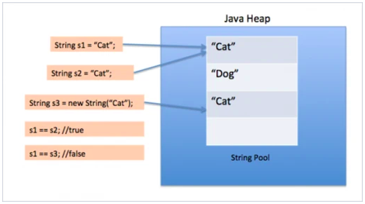

# String
- [Какие “строковые” классы вы знаете?](#Какие-строковые-классы-вы-знаете?)
- [StringBuffer](#StringBuffer)
- [StringBuilder](#StringBuilder)
- [Конкатенация строк](#Конкатенация-строк)
- [Как преобразовать строку в число?](#Как-преобразовать-строку-в-число?)
- [Как сравнить две строки](#Как-сравнить-две-строки)
- [Как обрезать пробелы в конце строки?](#Как-обрезать-пробелы-в-конце-строки?)
- [Как заменить символ в строке?](#Как-заменить-символ-в-строке?)
- [Как получить часть строки?](#Как-получить-часть-строки?)
- [Дайте определение понятию “пул строк”.](#Дайте-определение-понятию-“пул-строк”.)
- [Как разбить строку на подстроки по заданному разделителю?](#Как-разбить-строку-на-подстроки-по-заданному-разделителю?)
- [Можно ли синхронизировать доступ к строке?](#Можно-ли-синхронизировать-доступ-к-строке?)
- [Что делает метод intern()?](#Что-делает-метод-intern()?)
- [Почему строка неизменная и финализированная в Java](#Почему-строка-неизменная-и-финализированная-в-Java)
- [Почему массив строк предпочтительнее строки для хранения пароля?](#Почему-массив-строк-предпочтительнее-строки-для-хранения-пароля?)
- [Почему строка является популярным ключом в HashMap в Java?](#Почему-строка-является-популярным-ключом-в-HashMap-в-Java?)
- [Напишите метод удаления данного символа из строки.](#Напишите-метод-удаления-данного-символа-из-строки.)
- [](#)

Строка — объект, что представляет последовательность символов. Для создания и манипулирования строками Java 
платформа предоставляет общедоступный финальный (не может иметь подклассов) класс java.lang.String. Данный класс 
является неизменяемым __immutable__ — созданный объект класса String не может быть изменен.

Все строковые классы — __final__ (следовательно от них нельзя унаследоваться).

+ __Class String__ — это final класс, который не может иметь потомков.  
+ __Class String__ — `immutable` класс, то есть его объекты не могут быть изменены после создания. 
    Любые операции над объектом String, результатом которых должен быть объект класса String, 
    приведут к созданию нового объекта.
+ Java есть специальные классы `StringBuffer` и `StringBuilder`, который допускают изменения в строке.  
+ Благодаря своей неизменности, объекты класса String являются потокобезопасными и могут быть использованы в 
    многопоточной среде.
+ Каждый объект в Java может быть преобразован в строку через метод `toString`, унаследованный всеми Java-классами 
    от класса `Object`.
+ Классы `String`, `StringBuffer`, `StringBuilder` определены в пакете `java.lang` и доступны автоматически 
  без объявления импорта. Все три класса реализуют интерфейс `CharSequence` и `Serializable`.  
+ Начиная с Java 7 строки можно использовать в конструкции `switch`.
  
```java
String str = new String("abc");
String str1 = "abc";
```
Когда мы создаем строку используя двойные кавычки, виртуальная машина Java ищет в __пуле строк__ другую строку
с таким же значением. Если строка найдена, то возвращается только ссылка на существующий объект класса `String`, 
иначе создается новый объект с полученным значением, и сохраняется в пул.

Когда мы используем оператор `new`, виртуальная машина создает объект `String`, но не хранит его в пуле строк. 
Мы можем использовать метод `intern()` для сохранения строки в пуле строк, или получения ссылки, 
если такая строка уже находится в пуле.

Основные операции со строками раскрывается через методы класса __String__, среди которых можно выделить следующие:
+ `concat()`: объединяет строки
+ `valueOf()`: преобразует объект в строковый вид
+ `join(CharSequence delimiter, CharSequence... elements)`
+ `join(CharSequence delimiter, Iterable<? extends CharSequence> elements)`: соединяет строки с учетом разделителя.
    Где `delimiter` — разделитель элементов, а `elements` — массив строк / экземпляр коллекции строк. 
+ `сompare()`: сравнивает две строки
+ `charAt()`: возвращает символ строки по индексу
+ `getChars()`: возвращает группу символов
+ `equals()`: сравнивает строки с учетом регистра
+ `equalsIgnoreCase()`: сравнивает строки без учета регистра
+ `regionMatches()`: сравнивает подстроки в строках
+ `startsWith()`: определяет, начинается ли строка с подстрок
+ `endsWith()`: определяет, заканчивается ли строка на определенную подстроку
+ `replace()`: заменяет в строке одну подстроку на другую
+ `trim()`: удаляет начальные и конечные пробелы
+ `toLowerCase()`: переводит все символы строки в нижний регистр
+ `toUpperCase()`: переводит все символы строки в верхний регистр
+ `split(String regex)` разбиение строки на массив строк, где `regex` - регулярное выражение
+ `indexOf(int ch)`где `ch` — искомый символ (char), (возвращают позицию первого найденного элемента)
+ `indexOf(int ch, int fromIndex)` где `ch` — искомый символ (char), `fromIndex` — позиция с которой нужно искать элемент
    (возвращают позицию первого найденного элемента), (Если искомый элемент не найден, метод вернет в строке `-1`.)
+ `indexOf(String str)` где `str` — искомая строка, (возвращают позицию первого найденного элемента), 
    (Если искомый элемент не найден, метод вернет в строке -1.)
+ `indexOf(String str, int fromIndex)` `str` — искомая строка, `fromIndex` — позиция с которой нужно искать элемент
    (возвращают позицию первого найденного элемента), (Если искомый элемент не найден, метод вернет в строке `-1`.)
+ `lastIndexOf(int ch)` где `ch` — искомый символ (char), (возвращают позицию последнего найденного элемента), 
    (Если искомый элемент не найден, метод вернет в строке `-1`.)
+ `lastIndexOf(int ch, int fromIndex)` где `ch` — искомый символ (char), `fromIndex` — позиция с которой нужно искать элемент
    (возвращают позицию последнего найденного элемента), (Если искомый элемент не найден, метод вернет в строке `-1`.)
+ `lastIndexOf(String str)` где `str` — искомая строка, (возвращают позицию последнего найденного элемента), 
    (Если искомый элемент не найден, метод вернет в строке `-1`.)
+ `lastIndexOf(String str, int fromIndex)` где `str` — искомая строка, `fromIndex` — позиция с которой нужно искать элемент
    (возвращают позицию последнего найденного элемента), (Если искомый элемент не найден, метод вернет в строке `-1`.)
+ `substring(int beginIndex)`: Извлечение подстроки из строки.
+ `substring(int beginIndex, int endIndex)`: Извлечение подстроки из строки.

C __Java 7__ возможно использовать `Sting` в `switch`. Ключевые моменты использования switch для строк в Java:
+ использование строк в конструкции `switch` делает код читабельнее, убирая множественные цепи условий `if-else`.
+ строки в `switch` чувствительны к регистру.
+ оператор `switch` использует метод `String.equals()` для сравнения полученного значения со значениями `case`, 
    поэтому добавьте проверку на `NULL` во избежание `NullPointerException`.
+ согласно документации __Java 7__ для строк в `switch`, компилятор Java формирует более эффективный байткод для 
    строк в конструкции `switch`, чем для сцепленных условий `if-else`.
+ убедитесь, что это будет использоваться с Java 7 или поздней версии, иначе получите `exception`.

## Какие строковые классы вы знаете? 
public final class `String` implements java.io.Serializable, Comparable<String>, CharSequence
Манипуляции со строками ресурсоемкие, поэтому Java обеспечивает два полезных класса для манипуляций со 
строками:
public final class `StringBuffer` extends AbstractStringBuilder implements java.io.Serializable, CharSequence
public final class `StringBuilder` extends AbstractStringBuilder implements java.io.Serializable, CharSequence

## StringBuffer
Строки являются неизменными, поэтому частая их модификация приводит к созданию новых объектов, что в свою очередь 
расходует драгоценную память. Для решения этой проблемы был создан класс `java.lang.StringBuffer`, который позволяет 
более эффективно работать над модификацией строки. Класс является __mutable__, то есть изменяемым — используйте его, 
если Вы хотите изменять содержимое строки. `StringBuffer` может быть использован в многопоточных средах, так как 
все необходимые методы являются синхронизированными.

## StringBuilder
__StringBuilder__ — класс, что представляет изменяемую последовательность символов. Класс был введен в __Java 5__ 
и имеет полностью идентичный `API` с `StringBuffer`. Единственное отличие — `StringBuilder` не синхронизирован. 
Это означает, что его использование в многопоточных средах нежелательно. Следовательно, если вы работаете 
с многопоточностью, Вам идеально подходитStringBuffer, иначе используйте `StringBuilder`, который работает 
намного быстрее в большинстве реализаций.

## Конкатенация строк
>В Java знак плюс `+` означает конкатенацию строк `concatenation`, иными словами - объединение строк.   

__Конкатенация__ — операция объединения строк, что возвращает новую строку, что является результатом объединения 
второй строки с окончанием первой. Операции конкатенации могут быть выполнены так:  


Если один из операндов в выражении содержит строку, то другие операнды также должны быть строками. Поэтому Java 
сама может привести переменные к строковому представлению, даже если они не являются строками.  
```java
int digit = 4;
String paws = " лапы";
String aboutcat = digit + paws; 
// хотя мы складываем число и строку, но все равно получим строку
//За кулисами Java за нас преобразовало число 4 в строку "4".
```  

## Как преобразовать строку в число?
У каждой обертки для примитивов есть свой метод `valueOf(String s)`, который возвращает преобразованное численное 
значение из строки. При этом форматы строки и принимаемого типа должны совпадать.  
Например:  
```java
String x = "523.5";
Double xd = Double.valueOf(x);
Integer xy = Integer.valueOf(x); //java.lang.NumberFormatException: For input string: "523.5"
System.out.println(xd); //523.5
```

## Как сравнить две строки
Оператор `==` работает с ссылками объекта `String`. Если две переменные `String` указывают на один и тот же 
объект в памяти, сравнение вернет результат `true`. В противном случае результат будет `false`, несмотря на то 
что текст может содержать в точности такие же символы. Оператор `==` не сравнивает сами данные типа `char`. 
Для сравнения посимвольно необходимо использовать метод `equals()`;
```java
String s1 = new String("ABC");
String s2 = new String("ABC");
String s3 = "ABC";
String s4 = "ABC";
System.out.println(s1==s2); //false
System.out.println(s3==s4); //true. Т.к. один набор литералов будет указывать на одну область памяти
System.out.println(s1.equals(s2));//true

s1=s2;
System.out.println(s1==s2); //true
if("someString" == "someString") { //true
    System.out.println("true"); 
}
System.out.println(s1.compareTo(s2)); //0
System.out.println("C".compareTo("A")); //2
System.out.println("A".compareTo("C")); //-2
```

Класс `String` наследует интерфейс `Comparable` и имеет два варианта метода `compareTo()`.  
Метод `compareTo(String anotherString)` сравнивает объект String с полученным аргументом String лексикографически.  
Если текущая строка предшествует полученной строке, метод возвращает отрицательное значение типа `integer`, 
и если строка следует за полученным аргументом, то возвращает положительное значение `integer`. 
Если метод возвращает 0, значит строка имеет то же значение, в таком случае метод `equals(String str)` так же вернет true.

`compareToIgnoreCase(String str)`: этот метод подобен предыдущему, за исключением того, что он игнорирует регистр символов. 
Он использует `CASE_INSENSITIVE_ORDER` `Comparator` для регистронезависимого сравнения. Если возвращаемое значение 
равно нулю, тогда метод `equalsIgnoreCase(String str)` так же вернет true.

Так же возможностью проверить являются ли две строки эквивалентными – используя оператор `==`, или используя метод `equals`. 
Когда мы используем оператор `==`, он проверяет значение строки, как ссылки, но в программировании большую часть 
времени мы проверяем эквивалентность строки только для значения. Поэтому мы должны использовать метод `equals` для 
проверки двух строк на эквивалентность.  
Еще есть метод `equalsIgnoreCase`, который мы можем использовать для игнорирования регистра.

```java
String a = "text";
String b = "text";
a += "1";
b += "1";
System.out.println(a == b); // false
a = "text1";
b = "text1";
System.out.println(a == b); //true
```
__Объяснение:__  
Во-первых, нужно помнить, что строковые литералы в Java - это, фактически, объекты (String). При этом, если в программе 
несколько раз встречается один и тот же строковый литерал, то ему будет соответствовать один и тот же объект.  
Поэтому во втором случае strA == strB (и, соответственно, выводится `true`). Во-вторых, нужно помнить,
что строки (String) в Java - это неизменяемые объекты. Поэтому, когда к объекту strA "приклеивается" другая
строка (strA += "1"), на самом деле создаётся новый объект, содержащий "text1". И когда приклеиваем к объекту
strB - создаётся ещё один (другой!) объект, также содержащий "text1".  
Следовательно, strA == strB, и в первом случае выводится `false`. Фактически, команда strA += "1"
разворачивается в strA = new StringBuilder().append(strA).append("1").toString(); И если это выполнится два раза,
то получится два разных объекта, пусть и с одинаковым содержимым.

```java
String s1 = "abc";
String s2 = "abc";
String s3= new String("abc");
System.out.println("s1 == s2 ? "+(s1==s2)); //true
System.out.println("s1 == s3 ? "+(s1==s3)); //false
System.out.println("s1 equals s3 ? "+(s1.equals(s3))); //true
```

## Как обрезать пробелы в конце строки?
```java
String s = "a    ";
System.out.println(s.trim() + "b");//ab
System.out.println(s + "b");//a    b
```

## Как заменить символ в строке?
Можно использовать метод `replace(CharSequence target, CharSequence replacement)`, который меняет символы в строке. 
Можно преобразовать в массив символов и заменить символ там. Можно использовать `StringBuilder` и метод 
`setCharAt(int index, char ch)`   
```java
String sb = "AABAA";
String s = "ABCDEF".replace("C", "**");
 
String sb2 = sb.replace(sb, "##");
System.out.println(s + " " + sb2); //AB**DEF and ##
 
String fs = "123456789";
char[] charSequence = fs.toCharArray();
charSequence[3] = '$';
String nStr = String.valueOf(charSequence);
System.out.println(nStr); //123$56789
 
StringBuilder str = new StringBuilder("AMIT"); //0-A, 1-M, 2-I, 3-T
str.setCharAt(3, 'L');
//AMIL
```

## Как получить часть строки?
Метод `substring(int beginIndex, int lastIndex)` — возвращает часть строки по указанным индексам, не включая 
последний символ.  
```java
String fs = "123456789";
String sub = fs.subSequence(3,6).toString();
String sub2 = fs.substring(3,6);
System.out.println(sub2); //456
```

## Дайте определение понятию “пул строк”.
__Пул строк__ – это набор строк, который хранится в памяти Java `heap`. Мы знаем, что `String` это специальный 
класс в Java, и мы можем создавать объекты этого класса, используя оператор `new` точно так же, как и создавать 
объекты, предоставляя значение строки в двойных кавычках.  

__Пул строк__ – это набор строк хранящийся в `Heap`.  
+ Пул строк возможен благодаря неизменяемости строк в Java и реализации идеи интернирования строк;
+ Пул строк помогает экономить память, но по этой же причине создание строки занимает больше времени;
+ Когда для создания строки используются `"`, то сначала ищется строка в пуле с таким же значением, если находится, 
    то просто возвращается ссылка, иначе создается новая строка в пуле, а затем возвращается ссылка на неё;
+ При использовании оператора `new` создаётся новый объект `String`. Затем при помощи метода `intern()` эту строку 
    можно поместить в пул или же получить из пула ссылку на другой объект `String` с таким же значением;
+ Пул строк является примером паттерна _«Приспособленец» (Flyweight)_.

Диаграмма ниже объясняет, как пул строк размещается в памяти Java `heap` и что происходит, когда мы используем 
различные способы создания строк.  
    
Ниже приведен пример, показывающий работу пула строк.  
```java
String s1 = "Cat";
String s2 = "Cat";
String s3 = new String("Cat");
 
System.out.println("s1 == s2 :"+(s1==s2)); //s1 == s2 :true
System.out.println("s1 == s3 :"+(s1==s3)); //s1 == s3 :false
```

## Как разбить строку на подстроки по заданному разделителю?
Мы можем использовать метод `split(String regex)` для разделения строки на массив символов, используя в качестве 
разделителя регулярное выражение. Метод `split(String regex, int numOfStrings)` является перегруженным методом 
для разделения строки на заданное количество строк. Мы можем использовать обратную черту для использования 
специальных символов регулярных выражений в качестве обычных символов.  
```java
String line = "I am a java developer";
String[] words = line.split(" ");
String[] twoWords = line.split(" ", 2);
 
System.out.println("String split with delimiter: "+Arrays.toString(words));//String split with delimiter: [I, am, a, java, developer]
System.out.println("String split into two: "+Arrays.toString(twoWords));//String split into two: [I, am a java developer]
 
//split string delimited with special characters
 
String wordsWithNumbers = "I|am|a|java|developer";
String[] numbers = wordsWithNumbers.split("\\|");
 
System.out.println("String split with special character: "+ Arrays.toString(numbers));//String split with special character: [I, am, a, java, developer]
```

## Можно ли синхронизировать доступ к строке?
`String` сам по себе потокобезопасный класс. Если мы работаем с изменяемыми строками, то нужно использовать `StringBuffer`.

## Что делает метод intern()?
Когда метод `intern()` вызван, если пул строк уже содержит строку, эквивалентную к нашему объекту, что подтверждается 
методом `equals(Object)`, тогда возвращается ссылка на строку из пула. В противном случае объект строки добавляется 
в пул и ссылка на этот объект возвращается.  
Этот метод всегда возвращает строку, которая имеет то же значение, что и текущая строка, но гарантирует что это 
будет строка из пула уникальных строк.  
Ниже приведен пример работы метода `intern()`
```java
String a = "string a";
String b = new String("string a");
String c = b.intern();
 
System.out.println(a == b); //false
System.out.println(b == c); //false
System.out.println(a == c); //true
```

## Почему строка неизменная и финализированная в Java
Есть несколько преимуществ в неизменности строк:
+ Строковый пул возможен только потому, что строка неизменна в Java, таким образом виртуальная машина сохраняет 
    много места в памяти `heap space`, поскольку разные строковые переменные указывают на одну переменную в пуле. 
    Если бы строка не была неизмененяемой, тогда бы интернирование строк не было бы возможным, потому что если какая-либо 
    переменная изменит значение, это отразится также и на остальных переменных, ссылающихся на эту строку.
+ Если строка будет изменяемой, тогда это станет серьезной угрозой безопасности приложения. Например, имя пользователя 
    базы данных и пароль передаются строкой для получения соединения с базой данных и в программировании сокетов 
    реквизиты хоста и порта передаются строкой. Так как строка неизменяемая, её значение не может быть изменено, 
    в противном случае любой хакер может изменить значение ссылки и вызвать проблемы в безопасности приложения.
+ Так как строка неизменная, она безопасна для много поточности и один экземпляр строки может быть совместно использован 
    различными нитями. Это позволяет избежать синхронизации для потокобезопасности, строки полностью потокобезопасны.
+ Строки используются в `Java classloader` и неизменность обеспечивает правильность загрузки класса при помощи `Classloader`. 
    К примеру, задумайтесь об экземпляре класса, когда вы пытаетесь загрузить `java.sql.Connection` класс, но значение 
    ссылки изменено на `myhacked.Connection` класс, который может осуществить нежелательные вещи с вашей базой данных.
+ Поскольку строка неизменная, её `hashcode` кэшируется в момент создания и нет необходимости рассчитывать его снова. 
    Это делает строку отличным кандидатом для ключа в Map и его обработка будет быстрее, чем других ключей HashMap. 
    Это причина, почему строка наиболее часто используемый объект, используемый в качестве ключа `HashMap`.  
+ Неизменяемость позволяет избежать синхронизации: строки безопасны для многопоточности и один экземпляр строки 
    может быть совместно использован различными потоками.
+ Поскольку строка неизменяемая, её `hashCode()` кэшируется в момент создания и нет необходимости рассчитывать 
    его снова. Это делает строку отличным кандидатом для ключа в `HashMap` т.к. его обработка происходит быстрее.

## Почему массив строк предпочтительнее строки для хранения пароля?
Строка неизменяемая в Java и хранится в пуле строк. С тех пор, как она была создана, она остается в пуле, пока не будет 
удалена сборщиком мусора, поэтому, когда мы думаем, что закончили работу с паролем, он остается доступным в памяти 
некоторое время, и нет способа избежать этого. Это риск безопасности, поскольку кто-либо, имеющий доступ к дампу памяти 
сможет найти пароль в виде чистого текста.  

Если мы используем массив символов для хранения пароля, мы можем очистить его после того, как закончим с ним работать. 
Таким образом, мы можем контролировать, как долго он находится в памяти, что позволяет избежать риска безопасности, 
свойственного строке.  

Авторы рекомендуют использовать метод `getPassword()` из класса `JPasswordField`, который возвращает `char[]`. 
Можно также попробовать устаревший `@deprecated` метод `getText()`. 

## Почему строка является популярным ключом в HashMap в Java?
Поскольку строки неизменны, их хэшкод кэшируется в момент создания, и не требует повторного пересчета. Это делает 
строки отличным кандидатом для ключа в `Map` и они обрабатываются быстрее, чем другие объекты-ключи `HashMap`. Вот 
почему строки преимущественно используются в качестве ключей `HashMap`.
  
## Напишите метод удаления данного символа из строки.
Мы можем использовать метод `replaceAll` для замены всех вхождений в строку другой строкой. Обратите внимание 
на то, что метод получает в качестве аргумента строку, поэтому мы используем класс `Character` для создания 
строки из символа, и используем её для замены всех символов на пустую строку.
```java
public static String removeChar(String str, char ch) {
        if (str == null)
            return null;
        return str.replaceAll(Character.toString(ch), "");
}
```