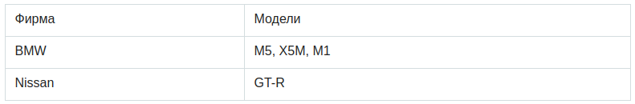
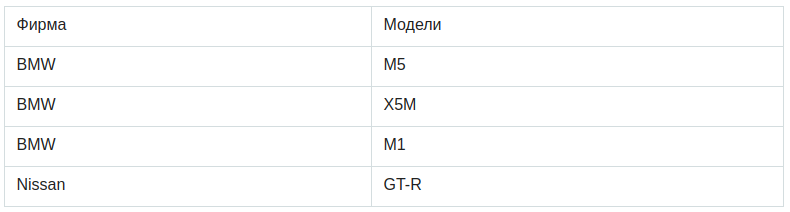
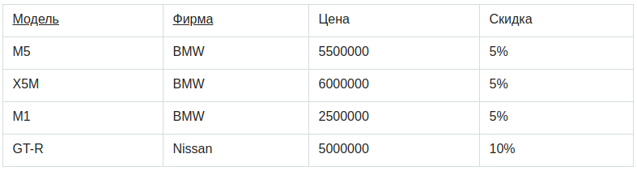
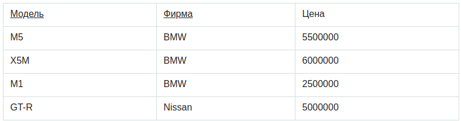
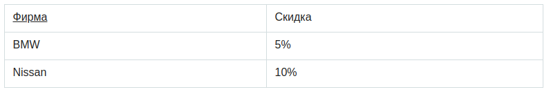
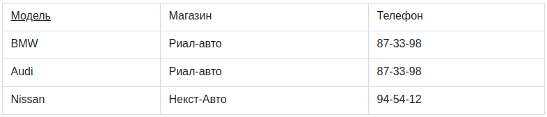
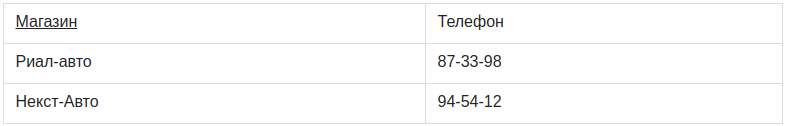
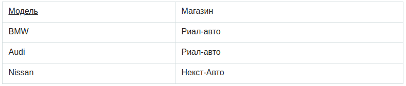

# DATA BASE

- [ANSI SQL](#ANSI-SQL)
- [Основные элементы баз данных](#Основные-элементы-баз-данных)
- [DDL](#DDL)
- [DML](#DML)
- [TCL](#TCL)
- [DCL](#DCL)
- [NULL в базах данных](#NULL-в-базах-данных)
- [Нормализация](#Нормализация)
- [Первая нормальная форма](#Первая-нормальная-форма)
- [Вторая нормальная форма](#Вторая-нормальная-форма)
- [Третья нормальная форма](#Третья-нормальная-форма)
- [Index](#Index)
- [](#)
- [PRACTICE](src/main/java/kovteba/practice)

## ANSI SQL
__SQL__ (_structured query language_ — «язык структурированных запросов») — формальный непроцедурный язык 
программирования, применяемый для создания, модификации и управления данными в произвольной реляционной базе данных, 
управляемой соответствующей системой управления базами данных (СУБД). SQL основывается на исчислении __кортежей__. 
Стандарт SQL определяется с помощью кода `ANSI`.

## Основные элементы баз данных
__Поле__ — это минимальный элемент базы данных, содержащий один неделимый квант информации. Каждое поле 
характеризуется _именем_ и _типом_ хранящихся в нем данных.  

__Запись__ — это совокупность нескольких разнородных полей, описывающая некоторую сущность предметной области.
Таблица базы данных — это набор однородных записей.  

__Хранимая процедура__ — объект базы данных, представляющий собой набор _SQL_-инструкций, который компилируется 
один раз и хранится на сервере. Хранимые процедуры очень похожи на обыкновенные процедуры языков высокого уровня, 
у них могут быть входные и выходные параметры и локальные переменные, в них могут производиться числовые вычисления 
и операции над символьными данными, результаты которых могут присваиваться переменным и параметрам. В хранимых 
процедурах могут выполняться стандартные операции с базами данных (как `DDL`, так и `DML`). Кроме того, в хранимых 
процедурах возможны циклы и ветвления, то есть в них могут использоваться инструкции управления процессом исполнения.
```sql
CREATE [OR REPLACE] PROCEDURE имя_процедуры
[ (параметр [, параметр, …]) ] IS
            [локальные объявления]
        BEGIN
            исполняемые предложения
        [EXCEPTION
            обработчики исключений]
        END [имя_процедуры];
```
__Функция__ – это подпрограмма, которая вычисляет значение. Существует большое количество встроенных функций 
(могут разниться для разных БД).
```sql
CREATE [OR REPLACE] FUNCTION имя_функции
[ (параметр [, параметр, …]) ]
RETURN тип_данных IS | AS
            [локальные объявления]
        BEGIN
            исполняемые предложения
        [EXCEPTION
            обработчики исключений]
        END [имя_функции];
```
__Констрейнты__ (constraints) — объявление правил (ограничения), которым должны соответствовать данные в таблице.
```sql
CREATE TABLE table_name
(
column_name1 data_type(size) constraint_name,
column_name2 data_type(size) constraint_name,
column_name3 data_type(size) constraint_name,
....
);
Например для задания первичного ключа, можно использовать такую запись:
CONSTRAINT <имя ограничения> PRIMARY KEY (<список столбцов, являющихся первичным ключом>)
```
__Типы констрейнтов:__  
- `NOT NULL` -колонка не может содержать NULL значений.
- `UNIQUE` — каждая строка в колонке должна иметь уникальное значение.
- `PRIMARY KEY` — комбинация NOT NULL и UNIQUE.
- `FOREIGN KEY` — обеспечивает ссылочную целостность. Означает что ссылающиеся данные имеют соответствие в другой таблице.
- `CHECK` — проверка на определенное выполнение правил.
- `DEFAULT` — задает значение по умолчанию для колонки

## DDL
__Data Definition Language__ (DDL) (язык описания данных) — это семейство компьютерных языков, используемых в 
компьютерных программах для описания структуры баз данных. Функции языков DDL определяются первым словом в 
предложении (часто называемом запросом), которое почти всегда является глаголом. В случае с SQL это 
глаголы — «create» («создать»), «alter» («изменить»), «drop» («удалить»).

## DML
__Data Manipulation Language__ (DML) (язык управления (манипулирования) данными) — это семейство компьютерных языков, 
используемых в компьютерных программах или пользователями баз данных для получения, вставки, удаления или изменения 
данных в базах данных. Функции языков DML определяются первым словом в предложении (часто называемом запросом), 
которое почти всегда является глаголом. В случае с SQL эти глаголы — «select» («выбрать»), «insert» («вставить»), 
«update» («обновить»), и «delete» («удалить»). Это превращает природу языка в ряд обязательных утверждений 
(команд) к базе данных.

## TCL
__TCL(Transaction Control Language)__ - TCL-команды используются для управления изменениями данных, производимыми 
DML-командами. С их помощью несколько DML-команд могут быть объединены в единое логическое целое, называемое 
транзакцией. При этом все команды на изменение данных в рамках одной транзакции либо завершаются успешно, либо 
все могут быть отменены в случае возникновения каких-либо проблем с выполнением любой из них.
TCL-команды: `commit`, `rollback`, `set transaction`

## DCL
__DCL(Data Control Language)__ - Команды управления доступом. DCL-команды управляют доступом пользователей к БД и 
отдельным объектам:   
- `GRANT` - Разрешить доступ
- `REVOKE`- Отменить доступ 

## NULL в базах данных
Смысл `NULL`-значения — это отсутствие информации или неприменимость данного атрибута в данном кортеже.   
NULL-значение может означать неприменимость значения к этому столбцу (например в колонке «скорость полета» 
для таблицы животные и записи «Слон»)   
`NULL`-значение так же может означать отсутствие информации. Заменять отсутствующие значения, например на `-1`, `‘ ‘` 
или что-то такое, не корректно.

## Нормализация
Нормализацией схемы базы данных называется процедура, производимая над базой данных с целью удаления в ней избыточности.
Нормализация несет с собой немало преимуществ. Очевидно, что в нормализованной базе данных уменьшается вероятность 
возникновения ошибок, она занимает меньше места на жестком диске и т.д.

## Первая нормальная форма
Отношение находится в __1НФ__, если все его атрибуты являются простыми, все используемые домены должны содержать только 
скалярные значения. Не должно быть повторений строк в таблице.   
Например, есть таблица «Автомобили»:
   
Нарушение нормализации 1НФ происходит в моделях BMW, т.к. в одной ячейке содержится список из 3 
элементов: M5, X5M, M1, т.е. он не является атомарным. Преобразуем таблицу к 1НФ:
   

## Вторая нормальная форма
Отношение находится во __2НФ__, если оно находится в __1НФ__ и каждый не ключевой атрибут неприводимо зависит от 
Первичного Ключа(ПК).

Неприводимость означает, что в составе потенциального ключа отсутствует меньшее подмножество атрибутов, от которого 
можно также вывести данную функциональную зависимость.

Например, дана таблица: 
    
Таблица находится в первой нормальной форме, но не во второй. Цена машины зависит от модели и фирмы. Скидка зависят 
от фирмы, то есть зависимость от первичного ключа неполная. Исправляется это путем декомпозиции на два отношения, 
в которых не ключевые атрибуты зависят от ПК.
   


## Третья нормальная форма
Отношение находится в __3НФ__, когда находится во __2НФ__ и каждый не ключевой атрибут нетранзитивно зависит от 
первичного ключа. Проще говоря, второе правило требует выносить все не ключевые поля, содержимое которых может 
относиться к нескольким записям таблицы в отдельные таблицы.

Рассмотрим таблицу:

Таблица находится во _2НФ_, но не в _3НФ_.
В отношении атрибут «Модель» является первичным ключом. Личных телефонов у автомобилей нет, и телефон зависит 
исключительно от магазина.  
Таким образом, в отношении существуют следующие функциональные зависимости: Модель → Магазин, Магазин → Телефон, 
Модель → Телефон.  
Зависимость Модель → Телефон является транзитивной, следовательно, отношение не находится в 3НФ.  
В результате разделения исходного отношения получаются два отношения, находящиеся в 3НФ:  



## Index
__Index__ - объект базы данных, создаваемый с целью повышения производительности поиска данных. Таблицы в базе данных 
могут иметь большое количество строк, которые хранятся в произвольном порядке, и их поиск по заданному критерию путем 
последовательного просмотра таблицы строка за строкой может занимать много времени. Индекс формируется из значений 
одного или нескольких столбцов таблицы и указателей на соответствующие строки таблицы и, таким образом, позволяет 
искать строки, удовлетворяющие критерию поиска. Ускорение работы с использованием индексов достигается в первую 
очередь за счёт того, что индекс имеет структуру, оптимизированную под поиск — например,сбалансированного дерева.


