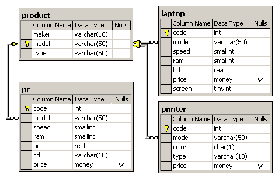

Схема БД состоит из четырех таблиц:
Product(maker, model, type)
PC(code, model, speed, ram, hd, cd, price)
Laptop(code, model, speed, ram, hd, price, screen)
Printer(code, model, color, type, price)
Таблица Product представляет производителя (maker), номер модели (model) и тип ('PC' - ПК, 'Laptop' - ПК-блокнот или 
'Printer' - принтер). Предполагается, что номера моделей в таблице Product уникальны для всех производителей и типов 
продуктов. В таблице PC для каждого ПК, однозначно определяемого уникальным кодом – code, указаны модель – model 
(внешний ключ к таблице Product), скорость - speed (процессора в мегагерцах), объем памяти - ram (в мегабайтах), 
размер диска - hd (в гигабайтах), скорость считывающего устройства - cd (например, '4x') и цена - price. Таблица 
Laptop аналогична таблице РС за исключением того, что вместо скорости CD содержит размер экрана -screen (в дюймах). 
В таблице Printer для каждой модели принтера указывается, является ли он цветным - color ('y', если цветной), тип 
принтера - type (лазерный – 'Laser', струйный – 'Jet' или матричный – 'Matrix') и цена - price.




---

## 1
Найдите среднюю скорость ПК, выпущенных производителем A. (Answer: 606)
```sql
SELECT avg(speed) AS Qty
FROM PC
WHERE model IN(SELECT model
 FROM Product
 WHERE maker = 'A'
 )

```

---

## Задание: 17 (Serge I: 2003-02-03)
Найдите модели ПК-блокнотов, скорость которых меньше скорости каждого из ПК.
Вывести: type, model, speed
```sql
SELECT DISTINCT p.type, l.model, l.speed
FROM Product p, Laptop l, PC c
WHERE l.speed < (SELECT MIN (speed) 
                 FROM PC
                 ) AND 
      p.type = 'laptop'
```