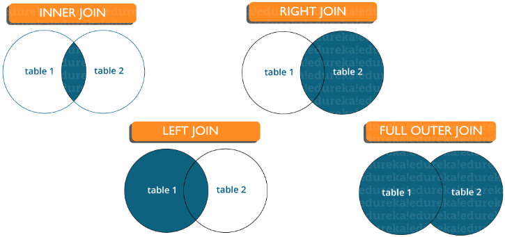

# SQL (structured query language — «язык структурированных запросов»)

- [Intro](#Intro)
- [Подмножества SQL](#Подмножества-SQL)
    - [DDL](#DDL)
    - [DML](#DML)
    - [TCL](#TCL)
    - [DCL](#DCL)
- [Joins](#Joins)
    - [INNER JOIN](#INNER-JOIN)
    - [LEFT JOIN](#LEFT-JOIN)
    - [RIGHT JOIN](#RIGHT-JOIN)
    - [FULL JOIN](#)
- [Primary key](#Primary-key)
- [Constraints](#Constraints)
- [Foreign key](#Foreign-key)
- [Index](#Index)
    - [Типы индексов](#Типы-индексов)
    - [Разница между кластеризованным и некластеризованным индексами в SQL](#Разница-между-кластеризованным-и-некластеризованным-индексами-в-SQL)
    - [](#)
- [Сущности и отношения](#Сущности-и-отношения)
- [DROP и TRUNCATE](#DROP-и-TRUNCATE)
- [Триггер](#Триггер)
- [Cross join vs Natural join](#Cross-join-vs-Natural-join)
- [Подзапрос в SQL](#Подзапрос-в-SQL)
    - [Типы подзапросов](#Типы-подзапросов)
- [](#)
- [](#)

---

## Intro
Таблицы состоят из строк и столбцов, на пересечении которых должны находиться __атомарные__ значения, которые нельзя 
разбить на более мелкие элементы без потери смысла.

В формальной теории реляционных баз данных эти таблицы называют __отношениями (relations)__

В терминах данной теории строки таблицы будут называться __кортежами (tuples)__, а колонки — __атрибутами__. 
Отношение имеет заголовок, который состоит из атрибутов, и тело, состоящее из кортежей. Количество атрибутов 
называется __степенью отношения__, а количество кортежей — __кардинальным числом__.

Потенциальный ключ — это комбинация атрибутов таблицы, позволяющая уникальным образом идентифицировать строки в ней.
Если ни один из атрибутов не может быть иникальным идентификатаром то ключ будет составным.

При наличии в таблице более одного потенциального ключа один из них выбирается в качестве так называемого
первичного ключа, а остальные будут являться альтернативными ключами.

Атрибут «Номер зачетной книжки» в таблице «Успеваемость» является примером того, что называется внешним ключом. 
Таблица, содержащая внешний ключ, называется ссылающейся таблицей (referencing table). Таблица, содержащая 
соответствующий потенциальный ключ, называется ссылочной (целевой) таблицей (referenced table). В таких случаях 
говорят, что внешний ключ ссылается на потенциальный ключ в ссылочной таблице. Внешний ключ может быть составным, 
т. е. может включать более одного атрибута. Внешний ключ не обязан быть уникальным. Проблема обеспечения того, 
чтобы база данных не содержала неверных значений внешних ключей, известна как проблема ссылочной целостности. 
Ограничение, согласно которому значения внешних ключей должны соответствовать значениям потенциальных ключей, 
называется ограничением ссылочной целостности (ссылочным ограничением).

При проектировании баз данных часто предусматривается, что при удалении строки из ссылочной таблицы соответствующие 
строки из ссылающейся таблицы должны быть также удалены, а при изменении значения столбца, на который ссылается 
внешний ключ, должны быть изменены значения внешнего ключа в ссылающейся таблице. Этот подход называется каскадным 
удалением (обновлением).

Иногда применяются и другие подходы. Например, вместо удаления строк из ссылающейся таблицы в этих строках 
просто заменяют значения атрибутов, входящих во внешний ключ, так называемыми NULL-значениями. Это специальные 
значения, означающие «ничто» или отсутствие значения, они не совпадают со значением «нуль» или «пустая строка». 
NULL-значение применяется в базах данных и в качестве значения по умолчанию, когда пользователь не ввел 
никакого конкретного значения. Первичные ключи не могут содержать NULL-значений. Транзакция — одно из важнейших 
понятий теории баз данных. Она означает набор операций над базой данных, рассматриваемых как единая и неделимая 
единица работы, выполняемая полностью или не выполняемая вовсе, если произошел какойто сбой в процессе выполнения 
транзакции. Таким образом, транзакции являются средством обеспечения согласованности данных. В нашей базе данных 
транзакцией могут быть, например, две операции: удаление строки из таблицы «Студенты» и удаление связанных по 
внешнему ключу строк из таблицы «Успеваемость».

Язык SQL — это непроцедурный язык, который является стандартным средством работы с данными во всех реляционных 
СУБД. Операторы (команды), написанные на этом языке, лишь указывают СУБД, какой результат должен быть получен, 
но не описывают процедуру получения этого результата.

## Подмножества SQL
## DDL
__Data Definition Language__ (DDL) (язык описания данных) — это семейство компьютерных языков, используемых в 
компьютерных программах для описания структуры баз данных. Функции языков DDL определяются первым словом в 
предложении (часто называемом запросом), которое почти всегда является глаголом. В случае с SQL это 
глаголы — «create» («создать»), «alter» («изменить»), «drop» («удалить»).

## DML
__Data Manipulation Language__ (DML) (язык управления (манипулирования) данными) — это семейство компьютерных языков, 
используемых в компьютерных программах или пользователями баз данных для получения, вставки, удаления или изменения 
данных в базах данных. Функции языков DML определяются первым словом в предложении (часто называемом запросом), 
которое почти всегда является глаголом. В случае с SQL эти глаголы — «select» («выбрать»), «insert» («вставить»), 
«update» («обновить»), и «delete» («удалить»). Это превращает природу языка в ряд обязательных утверждений 
(команд) к базе данных.

## TCL
__TCL(Transaction Control Language)__ - TCL-команды используются для управления изменениями данных, производимыми 
DML-командами. С их помощью несколько DML-команд могут быть объединены в единое логическое целое, называемое 
транзакцией. При этом все команды на изменение данных в рамках одной транзакции либо завершаются успешно, либо 
все могут быть отменены в случае возникновения каких-либо проблем с выполнением любой из них.
TCL-команды: `commit`, `rollback`, `set transaction`

## DCL
__DCL(Data Control Language)__ - Команды управления доступом. DCL-команды управляют доступом пользователей к БД и 
отдельным объектам:   
- `GRANT` - Разрешить доступ
- `REVOKE`- Отменить доступ 

## Joins
Существуют различные типы соединений, которые используются для извлечения данных между таблицами. Принципиально 
они делятся на четыре типа, а именно:    


__Inner join (Внутреннее соединение)__: в MySQL является наиболее распространенным типом. Оно используется 
для возврата всех строк из нескольких таблиц, для которых выполняется условие соединения.


__Left Join (Левое соединение)__: в MySQL используется для возврата всех строк из левой (первой) таблицы 
и только совпадающих строк из правой (второй) таблицы, для которых выполняется условие соединения.


__Right Join (Правое соединение)__: в MySQL используется для возврата всех строк из правой (второй) 
таблицы и только совпадающих строк из левой (первой) таблицы, для которых выполняется условие соединения.


__Full Join (Полное соединение)__: возвращает все записи, для которых есть совпадение в любой из таблиц. 
Следовательно, он возвращает все строки из левой таблицы и все строки из правой таблицы.

### INNER JOIN
```mysql
SELECT * FROM nomenclature;
+----+-----------+
| id | name      |
+----+-----------+
|  1 | Книга     |
|  2 | Табуретка |
|  3 | Карандаш  |
+----+-----------+
SELECT * FROM description;
+----+---------------------+
| id | description         |
+----+---------------------+
|  1 | Замечательная книга |
|  3 | Красный карандаш    |
|  5 | Зелёная машинка     |
+----+---------------------+
```
Этот тип объединения позволяет извлекать строки, которые обязательно присутствуют во всех объединяемых таблицах.

В простейшем случае (без указания условий отбора), выборка вернёт т.н. декартово произведение, в котором каждая строка 
одной таблицы будет сопоставлена с каждой строкой другой таблицы
```mysql
SELECT * FROM nomenclature INNER JOIN description;
+----+-----------+----+---------------------+
| id | name      | id | description         |
+----+-----------+----+---------------------+
|  1 | Книга     |  1 | Замечательная книга |
|  2 | Табуретка |  1 | Замечательная книга |
|  3 | Карандаш  |  1 | Замечательная книга |
|  1 | Книга     |  3 | Красный карандаш    |
|  2 | Табуретка |  3 | Красный карандаш    |
|  3 | Карандаш  |  3 | Красный карандаш    |
|  1 | Книга     |  5 | Зелёная машинка     |
|  2 | Табуретка |  5 | Зелёная машинка     |
|  3 | Карандаш  |  5 | Зелёная машинка     |
+----+-----------+----+---------------------+
```
Как правило, декартово произведение таблиц требуется нечасто, чаще требуется выбрать только те записи, которые 
сопоставлены друг другу. Сделать это можно, если задать условие отбора, используя `ON` или `USING`.
```mysql
SELECT * FROM nomenclature INNER JOIN description using(id);
+----+----------+---------------------+
| id | name     | description         |
+----+----------+---------------------+
|  1 | Книга    | Замечательная книга |
|  3 | Карандаш | Красный карандаш    |
+----+----------+---------------------+
```
Запрос вернул только две записи, поскольку именно столько строк имеют одинаковые идентификаторы в обеих таблицах.

Использование `USING` обусловлено тем, что в таблицах ключевой столбец имеет одно и тоже имя - id. В противном случае, 
надо было бы использовать `ON`.
Помимо конструкции `INNER JOIN` внутреннее объединение можно объявить так же через `CROSS JOIN`, `JOIN` и запятую в 
объявлении `FROM`. Следующие четыре запроса вернут одинаковый результат:
```mysql
SELECT * FROM nomenclature INNER JOIN description;
SELECT * FROM nomenclature CROSS JOIN description;
SELECT * FROM nomenclature JOIN description;
SELECT * FROM nomenclature, description;
```
Если объединять таблицы через запятую, то нельзя использовать конструкции `ON` и `USING`, поэтому условие может быть 
задано только в конструкции `WHERE`. Например, это может выглядеть так:
```mysql
SELECT * FROM nomenclature, description WHERE nomenclature.id = description.id;
+----+----------+----+---------------------+
| id | name     | id | description         |
+----+----------+----+---------------------+
|  1 | Книга    |  1 | Замечательная книга |
|  3 | Карандаш |  3 | Красный карандаш    |
+----+----------+----+---------------------+
```
Поскольку поле id не является однозначным, приходится доуточнять в каком контексте оно используется через указание 
имени таблицы.

### LEFT JOIN
```mysql
SELECT * FROM nomenclature;
+----+-----------+
| id | name      |
+----+-----------+
|  1 | Книга     |
|  2 | Табуретка |
|  3 | Карандаш  |
+----+-----------+
SELECT * FROM description;
+----+---------------------+
| id | description         |
+----+---------------------+
|  1 | Замечательная книга |
|  3 | Красный карандаш    |
|  5 | Зелёная машинка     |
+----+---------------------+
```
Левосторонние объединения позволяют извлекать данные из таблицы, дополняя их по возможности данными из другой таблицы.

К примеру, чтобы получить полный список наименований товаров вместе с их описанием, нужно выполнить следующий запрос:
```mysql
SELECT * FROM nomenclature LEFT JOIN description USING(id);
+----+-----------+---------------------+
| id | name      | description         |
+----+-----------+---------------------+
|  1 | Книга     | Замечательная книга |
|  2 | Табуретка | NULL                |
|  3 | Карандаш  | Красный карандаш    |
+----+-----------+---------------------+
```
Поскольку для наименования Табуретка в таблице описаний нет подходящей записи, то в поле description подставился `NULL`. 
Это справедливо для всех записей, у которых нет подходящей пары.

Если дополнить предыдущий запрос условием на проверку несуществования описания, то можно получить список записей, 
которые не имеют пары в таблице описаний:
```mysql
SELECT id, name FROM nomenclature LEFT JOIN description USING(id) WHERE description IS NULL;
+----+-----------+
| id | name      |
+----+-----------+
|  2 | Табуретка |
+----+-----------+
```
По сути это и есть основное назначение внешних запросов - показывать расхождение данных двух таблиц.

Кроме того, при таком объединении обязательным является условие, которое задаётся через `ON` или `USING`. Без него запрос 
будет выдавать ошибку.

### RIGHT JOIN
```mysql
SELECT * FROM nomenclature;
+----+-----------+
| id | name      |
+----+-----------+
|  1 | Книга     |
|  2 | Табуретка |
|  3 | Карандаш  |
+----+-----------+
SELECT * FROM description;
+----+---------------------+
| id | description         |
+----+---------------------+
|  1 | Замечательная книга |
|  3 | Красный карандаш    |
|  5 | Зелёная машинка     |
+----+---------------------+
```
Этот вид объединений практически ничем не отличается от левостороннего объединения, за тем исключением, что данные 
берутся из второй таблицы, которая находится справа от конструкции `JOIN`, и сравниваются с данными, которые находятся 
в таблице, указанной перед конструкцией.
```mysql
SELECT * FROM nomenclature RIGHT JOIN description USING(id);
+----+---------------------+----------+
| id | description         | name     |
+----+---------------------+----------+
|  1 | Замечательная книга | Книга    |
|  3 | Красный карандаш    | Карандаш |
|  5 | Зелёная машинка     | NULL     |
+----+---------------------+----------+
```
Как видно, теперь уже поле name содержит нулевые значения. Также поменялся и порядок расположения столбцов.

Однако, во всех случаях использования правосторонних объединений, запрос можно переписать, используя левостороннее 
объединение, просто поменяв таблицы местами, и наоборот.   
Следующие два запроса равнозначны:
```mysql
SELECT * FROM nomenclature LEFT JOIN description USING(id);
SELECT * FROM description RIGHT JOIN nomenclature USING(id);
```

## Primary key
__Первичный ключ__ — столбец или набор столбцов, которые однозначно идентифицируют каждую строку в таблице.

- Однозначно идентифицирует одну строку в таблице
- Нулевые (Null) значения не допускаются

## Constraints
__Ограничения (constraints)__ используются для указания ограничения на тип данных таблицы. Они могут быть 
указаны при создании или изменении таблицы. 

Пример ограничений:   
- `NOT NULL`
- `CHECK`
- `DEFAULT`
- `UNIQUE`
- `PRIMARY KEY`
- `FOREIGN KEY`

## Foreign key
- Внешний ключ поддерживает ссылочную целостность, обеспечивая связь между данными в двух таблицах.
- Внешний ключ в дочерней таблице ссылается на первичный ключ в родительской таблице.
- Ограничение внешнего ключа предотвращает действия, которые разрушают связи между дочерней и родительской таблицами.

## Index
__Index__ - объект базы данных, создаваемый с целью повышения производительности поиска данных. Таблицы в базе данных 
могут иметь большое количество строк, которые хранятся в произвольном порядке, и их поиск по заданному критерию путем 
последовательного просмотра таблицы строка за строкой может занимать много времени. Индекс формируется из значений 
одного или нескольких столбцов таблицы и указателей на соответствующие строки таблицы и, таким образом, позволяет 
искать строки, удовлетворяющие критерию поиска. Ускорение работы с использованием индексов достигается в первую 
очередь за счёт того, что индекс имеет структуру, оптимизированную под поиск — например,сбалансированного дерева.

### Типы индексов
Есть три типа индексов, а именно:     
- __Уникальный индекс (Unique Index)__: этот индекс не позволяет полю иметь повторяющиеся значения, если столбец 
    индексируется уникально. Если первичный ключ определен, уникальный индекс может быть применен автоматически.
- __Кластеризованный индекс (Clustered Index)__: этот индекс меняет физический порядок таблицы и выполняет поиск 
    на основе значений ключа. Каждая таблица может иметь только один кластеризованный индекс.
- __Некластеризованный индекс (Non-Clustered Index)__: не изменяет физический порядок таблицы и поддерживает 
    логический порядок данных. Каждая таблица может иметь много некластеризованных индексов.

### Разница между кластеризованным и некластеризованным индексами в SQL
1. Кластерный индекс используется для простого и быстрого извлечения данных из базы данных, тогда как чтение 
    из некластеризованного индекса происходит относительно медленнее.
2. Кластеризованный индекс изменяет способ хранения записей в базе данных — он сортирует строки по столбцу, 
    который установлен как кластеризованный индекс, тогда как в некластеризованном индексе он не меняет способ 
    хранения, но создает отдельный объект внутри таблицы, который указывает на исходные строки таблицы при поиске.
3. Одна таблица может иметь только один кластеризованный индекс, тогда как некластеризованных у нее может быть много.

## Сущности и отношения
__Сущности__: человек, место или объект в реальном мире, данные о которых могут храниться в базе данных. 
В таблицах хранятся данные, которые представляют один тип сущности. Например — база данных банка имеет 
таблицу клиентов для хранения информации о клиентах. Таблица клиентов хранит эту информацию в виде 
набора атрибутов (столбцы в таблице) для каждого клиента.

__Отношения__: отношения или связи между сущностями, которые имеют какое-то отношение друг к другу. 
Например — имя клиента связано с номером учетной записи клиента и контактной информацией, которая может 
быть в той же таблице. Также могут быть отношения между отдельными таблицами (например, клиент к счетам).

## DROP и TRUNCATE
Команда DROP удаляет саму таблицу, и нельзя сделать Rollback команды, тогда как команда TRUNCATE удаляет все 
строки из таблицы (прим. перевод.: в SQL Server Rollback нормально отработает и откатит DROP).

## Триггер
__Триггер в SQL__ — особый тип хранимых процедур, которые предназначены для автоматического выполнения в 
момент или после изменения данных. Это позволяет вам выполнить пакет кода, когда вставка, обновление или 
любой другой запрос выполняется к определенной таблице.

## Cross join vs Natural join
Перекрестное соединение создает перекрестное или декартово произведение двух таблиц, тогда как естественное 
соединение основано на всех столбцах, имеющих одинаковое имя и типы данных в обеих таблицах.

## Подзапрос в SQL
__Подзапрос__ — это запрос внутри другого запроса, в котором определен запрос для извлечения данных или информации 
из базы данных. В подзапросе внешний запрос называется основным запросом, тогда как внутренний запрос называется 
подзапросом. Подзапросы всегда выполняются первыми, а результат подзапроса передается в основной запрос. Он 
может быть вложен в SELECT, UPDATE или любой другой запрос. Подзапрос также может использовать любые 
операторы сравнения, такие как `>`, `<` или `=`.

### Типы подзапросов
Существует два типа подзапросов:  
- __Коррелированный подзапрос__: это запрос, который выбирает данные из таблицы со ссылкой на внешний запрос. 
    Он не считается независимым запросом, поскольку ссылается на другую таблицу или столбец в таблице.
- __Некоррелированный подзапрос__: этот запрос является независимым запросом, в котором выходные данные 
    подзапроса подставляются в основной запрос.


