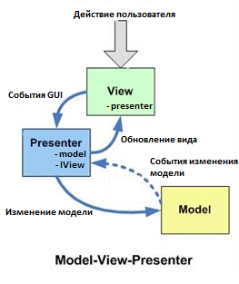
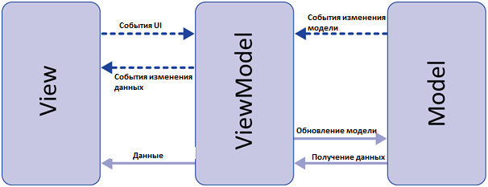
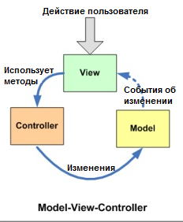

# Design Patterns

- [Паттерн](#Паттерн)
- [Классификация паттернов](#Классификация-паттернов)
- [Порождающие](#Порождающие)
    - [Фабричный метод](#Фабричный-метод)
    - [Abstract Factory](#Abstract-Factory)
    - [Builder](#Builder)
    - [Prototype](#Prototype)
    - 
- [MVC vs MVP vs MVVM](#MVC-vs-MVP-vs-MVVM)
    - [Модель](#Модель)
    - [Представление (View)](#Представление-(View))
    - [Различия MVC & MVVM & MVP](#Различия-MVC-&-MVVM-&-MVP)
    - [Model View Presenter](#Model-View-Presenter)
    - [Model View View Model](#Model-View-View-Model)
    - [Model View Controller](#Model-View-Controller)
    - [Общие правила выбора паттерна](#Общие-правила-выбора-паттерна)
- [Sources](#Sources)

## Паттерн
__Паттерн проектирования__ — это часто встречающееся решение определённой проблемы при проектировании архитектуры 
программ.

В отличие от готовых функций или библиотек, паттерн нельзя просто взять и скопировать в программу. Паттерн представляет 
собой не какой-то конкретный код, а общую концепцию решения той или иной проблемы, которую нужно будет ещё подстроить 
под нужды вашей программы.

## Классификация паттернов
__Группы паттернов:__  
- __Порождающие паттерны__ беспокоятся о гибком создании объектов без внесения в программу лишних зависимостей.
- __Структурные паттерны__ показывают различные способы построения связей между объектами.
- __Поведенческие паттерны__ заботятся об эффективной коммуникации между объектами.

## Порождающие
## Фабричный метод
[__Фабричный метод__](src/main/java/kovteba/creationalpatterns/factorymethod) — это порождающий паттерн проектирования, 
который решает проблему создания различных продуктов, без указания конкретных классов продуктов.

## Abstract Factory
[__Abstract Factory__](src/main/java/kovteba/creationalpatterns/abstractfactory) - это порождающий паттерн 
проектирования, который позволяет создавать семейства связанных объектов, не привязываясь к конкретным классам 
создаваемых объектов.
                                                            
## Builder
[__Builder__](src/main/java/kovteba/creationalpatterns/builder) - это порождающий паттерн проектирования, который 
позволяет создавать сложные объекты пошагово. Строитель даёт возможность использовать один и тот же код строительства 
для получения разных представлений объектов.

## Prototype
[__Prototype__](src/main/java/kovteba/creationalpatterns/prototype) - это порождающий паттерн проектирования, который 
позволяет копировать объекты, не вдаваясь в подробности их реализации.

## MVC vs MVP vs MVVM
__MVC(Model-View-Controller)__ — это фундаментальный паттерн, который нашел применение во многих технологиях, дал 
развитие новым технологиям и каждый день облегчает жизнь разработчикам.

### Модель
Под Моделью, обычно понимается часть содержащая в себе функциональную бизнес-логику приложения. Модель должна быть 
полностью независима от остальных частей продукта. Модельный слой ничего не должен знать об элементах дизайна, и 
каким образом он будет отображаться. Достигается результат, позволяющий менять представление данных, то как они 
отображаются, не трогая саму Модель.   

Модель обладает следующими признаками:  
- Модель — это бизнес-логика приложения;
- Модель обладает знаниями о себе самой и не знает о контроллерах и представлениях;
- Для некоторых проектов модель — это просто слой данных (DAO, база данных, XML-файл);
- Для других проектов модель — это менеджер базы данных, набор объектов или просто логика приложения;

### Представление (View)
В обязанности Представления входит отображение данных полученных от Модели. Однако, представление не может напрямую 
влиять на модель. Можно говорить, что представление обладает доступом «только на чтение» к данным.

Представление обладает следующими признаками:   
- В представлении реализуется отображение данных, которые получаются от модели любым способом;
- В некоторых случаях, представление может иметь код, который реализует некоторую бизнес-логику.

Примеры представления: HTML-страница, WPF форма, Windows Form.

### Различия MVC & MVVM & MVP
Наиболее распространенные виды MVC-паттерна, это:  
- __Model-View-Controller__
- __Model-View-Presenter__
- __Model-View-View Model__

### Model View Presenter

Данный подход позволяет создавать абстракцию представления. Для этого необходимо выделить интерфейс представления 
с определенным набором свойств и методов. Презентер, в свою очередь, получает ссылку на реализацию интерфейса, 
подписывается на события представления и по запросу изменяет модель.

__Признаки презентера:__    
- Двухсторонняя коммуникация с представлением;
- Представление взаимодействует напрямую с презентером, путем вызова соответствующих функций или событий экземпляра 
    презентера;
- Презентер взаимодействует с View путем использования специального интерфейса, реализованного представлением;
- Один экземпляр презентера связан с одним отображением.

__Реализация:__
Каждое представление должно реализовывать соответствующий интерфейс. Интерфейс представления определяет набор функций 
и событий, необходимых для взаимодействия с пользователем (например, IView.ShowErrorMessage(string msg)). 
Презентер должен иметь ссылку на реализацию соответствующего интерфейса, которую обычно передают в конструкторе.   
Логика представления должна иметь ссылку на экземпляр презентера. Все события представления передаются для обработки 
в презентер и практически никогда не обрабатываются логикой представления (в т.ч. создания других представлений).

### Model View View Model

Данный подход позволяет связывать элементы представления со свойствами и событиями View-модели. Можно утверждать, 
что каждый слой этого паттерна не знает о существовании другого слоя.

__Признаки View-модели:__   
- Двухсторонняя коммуникация с представлением;
- View-модель — это абстракция представления. Обычно означает, что свойства представления совпадают со свойствами 
    View-модели / модели
- View-модель не имеет ссылки на интерфейс представления (IView). Изменение состояния View-модели автоматически 
    изменяет представление и наоборот, поскольку используется механизм связывания данных (Bindings)
- Один экземпляр View-модели связан с одним отображением.

__Реализация:__  
При использовании этого паттерна, представление не реализует соответствующий интерфейс (IView).  
Представление должно иметь ссылку на источник данных (DataContex), которым в данном случае является View-модель. 
Элементы представления связаны (Bind) с соответствующими свойствами и событиями View-модели.  
В свою очередь, View-модель реализует специальный интерфейс, который используется для автоматического обновления 
элементов представления. Примером такого интерфейса в WPF может быть INotifyPropertyChanged.

### Model View Controller

Основная идея этого паттерна в том, что и контроллер и представление зависят от модели, но модель никак не зависит от этих двух компонент.

__Признаки контроллера__
- Контроллер определяет, какие представление должно быть отображено в данный момент;
- События представления могут повлиять только на контроллер.контроллер может повлиять на модель и определить 
    другое представление.
- Возможно несколько представлений только для одного контроллера;

__Реализация:__
Контроллер перехватывает событие извне и в соответствии с заложенной в него логикой, реагирует на это событие 
изменяя Mодель, посредством вызова соответствующего метода. После изменения Модель использует событие о том 
что она изменилась, и все подписанные на это события Представления, получив его, обращаются к Модели за 
обновленными данными, после чего их и отображают.

### Общие правила выбора паттерна
__MVVM__  
- Используется в ситуации, когда возможно связывание данных без необходимости ввода специальных интерфейсов 
    представления (т.е. отсутствует необходимость реализовывать IView);
- Частым примером является технология WPF.

__MVP__  
- Используется в ситуации, когда невозможно связывание данных (нельзя использовать Binding);
- Частым примером может быть использование Windows Forms.

__MVC__  
- Используется в ситуации, когда связь между представление и другими частями приложения невозможна 
    (и Вы не можете использовать MVVM или MVP);
- Частым примером использования может служить ASP.NET MVC.

## Sources
- [https://refactoring.guru/](https://refactoring.guru/)