# GIT


- [Основы Git](#Основы-Git)
    - [Снимки, а не различия](#Снимки,-а-не-различия)
    - [Три состояния](#Три-состояния)
- [Install GIT](#Install-GIT)
- [Show GIT config](#Show-GIT-config)
- [](#)

---

- [Create User](#Create-User)
- [git log](#git-log)
- [git fetch](#git-fetch)
- [git pull](#git-pull)
- [git push](#git-push)
- [Create branch](#Create-branch)
- [Checkout branch](#Checkout-branch)
    - [Create and checkout branch in one command](#Create-and-checkout-branch-in-one-command)
- [git merge](#git-merge)
- [Checkout on different commit](#Checkout-on-different-commit)
- [Cancel or change last commit](#Cancel-or-change-last-commit)
- [git show](#git-show)
- [type git reset](#type-git-reset)
- [git commit](#git-commit)
- [git rebase](#git-rebase)
- [git remote -v](#git-remote--v)
- [Относительные ссылки](#Относительные-ссылки)
- [git reset](#git-reset)
- [git revert](#git-revert)
- [git cherry pick](#git-cherry-pick)
- [Интерактивное редактирование](#Интерактивное-редактирование)
- [Несоответствие истории](#Несоответствие-истории)
- [git add](#git-add)
- [](#)

---

## Основы Git
### Снимки, а не различия
Основное отличие Git от любой другой СКВ (включая Subversion и её собратьев) — это подход к работе со своими 
данными. Концептуально, большинство других систем хранят информацию в виде списка изменений в файлах. Эти 
системы (CVS, Subversion, Perforce, Bazaar и т.д.) представляют хранимую информацию в виде набора файлов и 
изменений, сделанных в каждом файле, по времени (обычно это называют контролем версий, основанным на различиях).   

Хранение данных как набора изменений относительно первоначальной версии каждого из файлов.

Git не хранит и не обрабатывает данные таким способом. Вместо этого, подход Git к хранению данных больше 
похож на набор снимков миниатюрной файловой системы. Каждый раз, когда вы делаете коммит, то есть сохраняете 
состояние своего проекта в Git, система запоминает, как выглядит каждый файл в этот момент, и сохраняет 
ссылку на этот снимок. Для увеличения эффективности, если файлы не были изменены, Git не запоминает эти 
файлы вновь, а только создаёт ссылку на предыдущую версию идентичного файла, который уже сохранён. Git 
представляет свои данные как, скажем, поток снимков.    

Хранение данных как снимков проекта во времени.

Это очень важное отличие между Git и почти любой другой СКВ. Git переосмысливает практически все аспекты 
контроля версий, которые были скопированы из предыдущего поколения большинством других систем. Это делает 
Git больше похожим на миниатюрную файловую систему с удивительно мощными утилитами, надстроенными над ней, 
нежели просто на СКВ. Когда мы будем рассматривать управление ветками в [ch03-git-branching], мы увидим, 
какие преимущества вносит такой подход к работе с данными в Git.

### Три состояния
У Git есть три основных состояния, в которых могут находиться ваши файлы: __зафиксированное__ (committed), 
__изменённое__ (modified) и __подготовленное__ (staged).

- Зафиксированный значит, что файл уже сохранён в вашей локальной базе.
- К изменённым относятся файлы, которые поменялись, но ещё не были зафиксированы.
- Подготовленные файлы — это изменённые файлы, отмеченные для включения в следующий коммит.

Мы подошли к трём основным секциям проекта Git: __Git-директория__ (Git directory), __рабочая директория__ 
(working directory) и __область подготовленных файлов__ (staging area).   


__Git-директория__ — это то место, где Git хранит метаданные и базу объектов вашего проекта. Это самая важная 
часть Git, и это та часть, которая копируется при клонировании репозитория с другого компьютера.

__Рабочая директория__ является снимком версии проекта. Файлы распаковываются из сжатой базы данных в 
Git-директории и располагаются на диске, для того чтобы их можно было изменять и использовать.

__Область подготовленных файлов__ — это файл, обычно располагающийся в вашей Git-директории, в нём 
содержится информация о том, какие изменения попадут в следующий коммит. Эту область ещё называют 
“индекс”, однако называть её stage-область также общепринято.

__Базовый подход в работе с Git выглядит так:__   
1. Вы изменяете файлы в вашей рабочей директории.
2. Вы выборочно добавляете в индекс только те изменения, которые должны попасть в следующий коммит, добавляя 
    тем самым снимки только этих изменений в область подготовленных файлов.
3. Когда вы делаете коммит, используются файлы из индекса как есть, и этот снимок сохраняется в вашу Git-директорию.

Если определённая версия файла есть в Git-директории, эта версия считается зафиксированной. Если версия файла 
изменена и добавлена в индекс, значит, она подготовлена. И если файл был изменён с момента последнего 
распаковывания из репозитория, но не был добавлен в индекс, он считается изменённым. 

---

## Install GIT
```
sudo apt install git 
```

---

## Show GIT config
```
git config --list --show-origin
git config <key> (git config user.name)
```

---

## Create User
```
$ git config --global user.name `<name>
```

`<name>` - Имя пользователя 
```
$ git config --global user.email `<email>`
```

`<email>` - Email пользователя

---

## git log
>commit 256222386bd7a459a888331d8f05090e47332234 (HEAD -> master, origin/master)   
>Author: Kovteba <kovteba@gmail.com>   
>Date:   Mon Jun 22 17:20:59 2020 +0300       
>init commit   

__Параметры для удобного просмотра лога:__
- `--author="name"` — выводит коммиты, сделанные конкретным человеком
- `--name-only` — выводит только названия изменённых файлов
- `--oneline` — выводит сокращённые данные коммита (в виде одной строки)
- `--graph` — выводит дерево зависимостей для всех коммитов
- `--reverse` — выводит коммиты в обратном хронологическом порядке (сначала старые)
- `--after` — выводит коммиты, сделанные после определённой даты
- `--before` — выводит коммиты, сделанные до определённой даты
- `--patch` или `-p` - который показывает разницу (выводит патч), внесенную в каждый коммит
- `--stat` - печатает под каждым из коммитов список и количество измененных файлов, а также сколько строк в каждом 
    из файлов было добавлено и удалено

---

## git fetch
Команда `git fetch` связывается с удалённым репозиторием и забирает из него все изменения, которых у вас пока нет и 
сохраняет их локально.

---

## git pull
Команда `git pull` работает как комбинация команд `git fetch` и `git merge`, т.е. Git вначале забирает изменения из 
указанного удалённого репозитория, а затем пытается слить их с текущей веткой.

---

## git push
Команда `git push` используется для установления связи с удалённым репозиторием, вычисления локальных изменений 
отсутствующих в нём, и собственно их передачи в вышеупомянутый репозиторий. Этой команде нужно право на запись 
в репозиторий, поэтому она использует аутентификацию.

---

## Create branch
```
git branch `<branch_name>`
```

---

## Checkout branch
```
git checkout `<branch_name>
```

---

## Create and checkout branch in one command
```
git checkout -b `<branch_name>`
```

---

## git merge
```
git merge `<целевая ветка>`
```

Делать __merge__ из ветки с изменениями в целевую ветку

---

## Checkout on different commit
```
git checkout `<Commit number>`
```

---

## Cancel or change last commit
Добавить изменения в последний комит:  
```
git commit -a --amend
```

Ключ `--amend` (улучшить, в переводе с английского) позволяет добавить к последнему коммиту новые изменения.

```
git reset --soft HEAD^
```

Эта команда отменит последний коммит (но не изменения, которые вы внесли, они сохранятся).

```
git reset --hard HEAD^
```

Удалить комит (но не стоит забывать, что эта команда не просто удалит последний коммит, но и ВСЕ правки, которые 
не были закоммиченны)

Все это работает, если вы не опубликовали свои изменения.

---

# git show
```
git show
```

```
commit 03c9db53d5369667b5dfef2dad76468585d6a3a2 (HEAD -> master, origin/newBranch, origin/master, newBranch)
Author: kovtebaTest <d.v.kovteba@gmail.com>
Date:   Mon Jun 22 21:15:51 2020 +0300

    clean code in newBranch and print "userToken"

diff --git a/src/main/java/ua/nure/kovteba/finaltask/controller/car/ChangeCarInformation.java b/src/main/java/ua/nure/kovteba/finaltask/controller/car/ChangeCarInformation.java
index 9e84436..aeeaadc 100644
--- a/src/main/java/ua/nure/kovteba/finaltask/controller/car/ChangeCarInformation.java
+++ b/src/main/java/ua/nure/kovteba/finaltask/controller/car/ChangeCarInformation.java
@@ -31,7 +31,6 @@ import java.util.logging.Logger;
 )
 public class ChangeCarInformation  extends HttpServlet {
 
-    //Create logger
     private static Logger log = Logger.getLogger(ChangeCarInformation.class.getName());
 
 
@@ -52,10 +51,8 @@ public class ChangeCarInformation  extends HttpServlet {
     @Override
     protected void doPost(HttpServletRequest req, HttpServletResponse resp) throws ServletException, IOException {
 
-        //some commit
         String userToken = "0";
-        //new commit
-        //new commit in newBranch
+        System.out.println(userToken);
 
         if (req.getSession().getAttribute("userToken") != null){
             userToken = String.valueOf(req.getSession().getAttribute("userToken"));

```

---

## type git reset
- `git reset --hard {{some-commit-hash}}` — вернуться на определённый коммит в истории. Все изменения, сделанные 
    после этого коммита пропадут.
- `git reset {{some-commit-hash}}` — вернуться на определённый коммит в истории. Все изменения, сделанные после 
    этого коммита, получат состояние «Not staged for commit». Чтобы вернуть их обратно, нужно использовать 
    команды git add и git commit.
- `git reset --soft {{some-commit-hash}}` — вернуться на определённый коммит в истории. Все изменения, 
    сделанные после этого коммита, получат состояние «Staged for commit». Чтобы вернуть их обратно, нужно 
    использовать команду git commit.

---

## git commit
```
git commit -m {{Comment for commit}}
```

---

## git-rebase
```
git checkout bugFix
git rebase master
```
Переносит все коммиты из bugFIx в master создавая линейную последовательность коммитов

---

## git remote -v
Запустите в консоли команду `git remote -v` и посмотрите, через какой протокол у вас осуществляется доступ к репозиторию.

Если это https, то будет примерно следующий путь:   
>https://github.com/USERNAME/OTHERREPOSITORY.git

Для ssh будет такой:      
>git@github.com:USERNAME/OTHERREPOSITORY.git

---

## Относительные ссылки
Вернуться на один коммит назад
```
Находясь в master
git checkout master^
```

Относительная ссылка дала нам возможность просто сослаться на C1, а branch forcing (-f) позволил быстро переместить 
указатель ветки на этот коммит.    
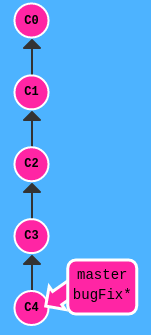
```
git branch -f master HEAD~3
```
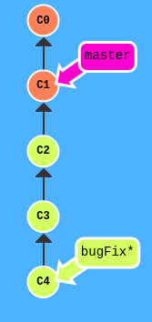


---

## git reset
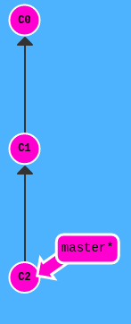   
```
git reset HEAD~1
```
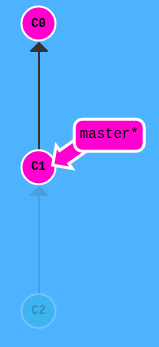    
Git просто перенёс ссылку на master обратно на коммит C1. Теперь наш локальный репозиторий в состоянии, как 
будто C2 никогда не существовал.


---

## git revert
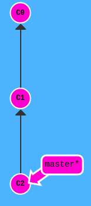   
```
git revert HEAD
```
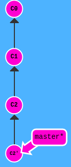   
появился новый коммит. Дело в том, что новый коммит C2' просто содержит изменения, полностью противоположные тем, ч
то сделаны в коммите C2.   
После revert можно сделать push и поделиться изменениями с остальными

---

## git cherry pick
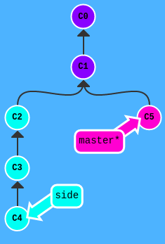   
```
git cherry-pick C2 C4
```
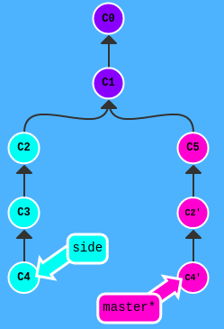   
Мы хотели перенести коммиты C2 и C4, Git дал нам их там, где они нужны. 

---

## Интерактивное редактирование
```
git rebase -i HEAD~4
```
Интерактивное редактирование комитов, при помощи редактора

---

## Несоответствие истории
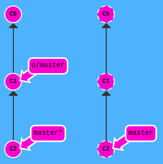   
```
git fetch
git rebase o/master
git push
```
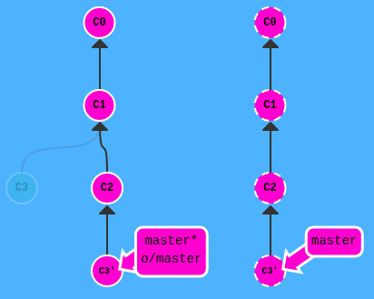    
Мы только что обновили наш локальный образ удалённого репозитория средствами git fetch. Ещё мы перебазировали 
наши наработки, чтобы они отражали все изменения с удалённого репозитория, и опубликовали их с помощью git push.

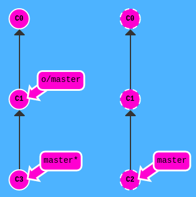   
```
git fetch
git merge o/master 
git push
```
или   
```
git pull
git push
```
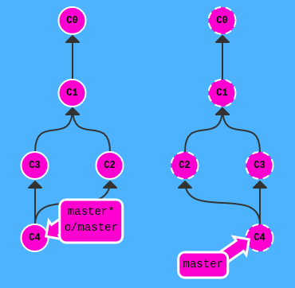   
Мы обновили наше локальное представление удалённого репозитория с помощью git fetch, объединили ваши новые 
наработки с нашими наработками (чтобы отразить изменения в удалённом репозитории) и затем опубликовали их с 
помощью git push.

__Более сокращенная версия__   
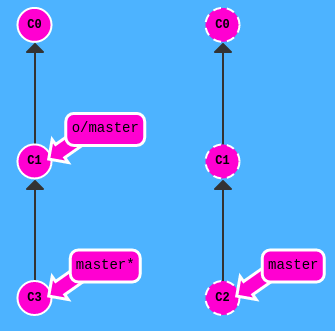   
```
git pull --rebase
git push
```
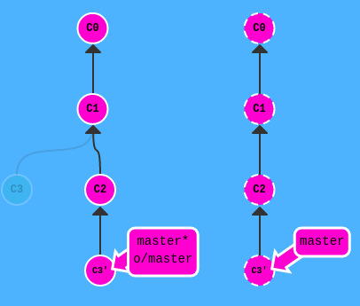   

---

## git add
Добавить все измененные\новые файлы
```
git add . 
```


