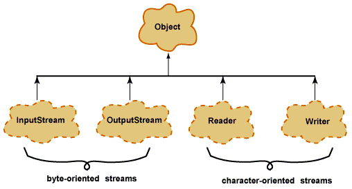

# IO-API
- [Какие существуют виды потоков ввода/вывода?](#Какие-существуют-виды-потоков-ввода/вывода?)
- [Предки потоков ввода/вывода](#Предки-потоков-ввода/вывода)
- [Что общего и чем отличаются следующие потоки: InputStream, OutputStream, Reader, Writer?](#Что-общего-и-чем-отличаются-следующие-потоки:-InputStream,-OutputStream,-Reader,-Writer?)
- [RandomAccessFile](#RandomAccessFile)
- [Режимы доступа к файлу](#Режимы-доступа-к-файлу)
- [Преобразовать байтовые потоки в символьные и обратно](#Преобразовать-байтовые-потоки-в-символьные-и-обратно)
- [Класс для работы с элементами файловой системы (ЭФС)](#Класс-для-работы-с-элементами-файловой-системы-(ЭФС))
- [Сериализация](#Сериализация)
- [Какие классы позволяют архивировать объекты?](#Какие-классы-позволяют-архивировать-объекты?)
- [](#)

## Какие существуют виды потоков ввода/вывода?

При работе с данными ввода/вывода вам будет часто попадаться термин `Stream`. __Поток_ - это абстрактное значение 
источника или приёмника данных, которые способны обрабатывать информацию.  
Разделяют два вида потоков ввода/вывода: байтовые и символьные.

## Предки потоков ввода/вывода
__Байтовые:__ java.io.InputStream, java.io.OutputStream;
__Символьные:__ java.io.Reader, java.io.Writer;

## Что общего и чем отличаются следующие потоки: InputStream, OutputStream, Reader, Writer?
Базовый класс `InputStream` представляет классы, которые получают данные из различных источников:  
- массив байтов
- строка (String)
- файл
- канал (pipe): данные помещаются с одного конца и извлекаются с другого
- последовательность различных потоков, которые можно объединить в одном потоке
- другие источники (например, подключение к интернету)  

Класс `OutputStream` — это абстрактный класс, определяющий потоковый байтовый вывод. В этой категории находятся 
классы, определяющие, куда направляются ваши данные: в массив байтов (но не напрямую в `String`; предполагается 
что вы сможете создать их из массива байтов), в файл или канал.

Символьные потоки имеют два основных абстрактных класса `Reader` и `Writer`, управляющие потоками символов _Unicode_. 
Класс `Reader` — абстрактный класс, определяющий символьный потоковый ввод. Класс `Writer` — абстрактный класс, 
определяющий символьный потоковый вывод. В случае ошибок все методы класса передают исключение `IOException`.

## RandomAccessFile
Класс `RandomAccessFile` наследуется напрямую от `Object` и не наследуется от базовых классов ввода\вывода. 
Предназначен для работы с файлами, поддерживая произвольный доступ к их содержимому.

Работа с классом `RandomAccessFile` напоминает использование совмещенных в одном классе потоков `DataInputStream` и 
`DataOutputStream` (они реализуют те же интерфейсы `DataInput` и `DataOutput`). Кроме того, метод `seek()` позволяет 
переместиться к определенной позиции и изменить хранящееся там значение.

При использовании `RandomAccessFile` необходимо знать структуру файла. Класс `RandomAccessFile` содержит методы для 
чтения и записи примитивов и строк _UTF-8_.

## Режимы доступа к файлу
`RandomAccessFile` может открываться в режиме чтения __«r»__ или чтения/записи __«rw»__. Также есть режим __«rws»__, 
когда файл открывается для операций чтения-записи и каждое изменение данных файла немедленно записывается 
на физическое устройство.

## Преобразовать байтовые потоки в символьные и обратно
`OutputStreamWriter` — мост между классом `OutputStream` и классом `Writer`. Символы, записанные в поток, 
преобразовываются в байты.
```java
OutputStream outputStream       = new FileOutputStream("c:\\data\\output.txt");
Writer       outputStreamWriter = new OutputStreamWriter(outputStream, "UTF-8");
outputStreamWriter.write("Hello World");
outputStreamWriter.close();
```
`InputStreamReader` — аналог для чтения. При помощи методов класса `Reader` читаются байты из потока `InputStream` 
и далее преобразуются в символы.
```java
InputStream inputStream = new FileInputStream("c:\\data\\input.txt");
Reader inputStreamReader = new InputStreamReader(inputStream, "UTF-8");
int data = inputStreamReader.read();
while(data != -1){
    char theChar = (char) data;
    data = inputStreamReader.read();
}
inputStreamReader.close();
```

## Класс для работы с элементами файловой системы (ЭФС)
В отличие от большинства классов ввода/вывода, класс `File` работает не с потоками, а непосредственно с файлами. 
Данный класс позволяет получить информацию о файле: права доступа, время и дата создания, путь к каталогу. А также 
осуществлять навигацию по иерархиям подкаталогов. Класс `java.io.File` может представлять имя определённого файла, 
а также имена группы файлов, находящихся в каталоге. Если класс представляет каталог, то его метод `list()` 
возвращает массив строк с именами всех файлов.

Для создания объектов класса File можно использовать один из следующих конструкторов:  
__File(File dir, String name)__ — указывается объект класса File (каталог) и имя файла
__File(String path)__ — указывается путь к файлу без указания имени файла
__File(String dirPath, Sring name)__ — указывается путь к файлу и имя файла
__File(URI uri)__ — указывается объекта URI, описывающий файл

## Сериализация
__Сериализация__ это процесс сохранения состояния объекта в последовательность байт;  
__десериализация__ это процесс восстановления объекта, из этих байт.  
_Java Serialization API_ предоставляет стандартный механизм для создания сериализуемых объектов.

## Какие классы позволяют архивировать объекты?
`DeflaterOutputStream`, `InflaterInputStream`, `ZipInputStream`, `ZipOutputStream`,  `GZIPInputStream`, `GZIPOutputStream`.


