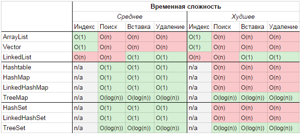

+ [Interface Collection](src/main/java/kovteba/interfacecollection)
    + [Interface List](src/main/java/kovteba/interfacecollection/interfacelist)
        + [Class ArrayList](src/main/java/kovteba/interfacecollection/interfacelist/classarraylist)
        + [Class LinkedList](src/main/java/kovteba/interfacecollection/interfacelist/classlinkedlist)
        + [Class Stack](src/main/java/kovteba/interfacecollection/interfacelist/classstack)
        + [Class Vector](src/main/java/kovteba/interfacecollection/interfacelist/classvector)
    + [Interface Set](src/main/java/kovteba/interfacecollection/interfaceset)
        + [Class HashSet](src/main/java/kovteba/interfacecollection/interfaceset/classhashset)
        + [Class LinkedHashSet](src/main/java/kovteba/interfacecollection/interfaceset/classlinkedhashset)
        + [Class TreeSet](src/main/java/kovteba/interfacecollection/interfaceset/classtreeset)
    + [Interface Queue](src/main/java/kovteba/interfacecollection/interfacequeue)
        + [Class ArrayDeque](src/main/java/kovteba/interfacecollection/interfacequeue/interfacedeque/classarraydeque)
        + [Class PriorityQueue](src/main/java/kovteba/interfacecollection/interfacequeue/classpriorityqueue)
+ [Interface Map](src/main/java/kovteba/interfacemap)
    + [Class HashMap](src/main/java/kovteba/interfacemap/classhashmap)
    + [Class HashTable](src/main/java/kovteba/interfacemap/classhashtable)
    + [Class LinkedHashMap](src/main/java/kovteba/interfacemap/classlinkedhashmap)
    + [Class TreeMap](src/main/java/kovteba/interfacemap/classtreemap)
    + [Class WeakHashMap](src/main/java/kovteba/interfacemap/classweakhashmap)

        
# Java Collection Framework
- __java.util.Collections__ - набор статических методов для работы с коллекциями.
- __java.util.Collection__ - один из основных интерфейсов Java Collections Framework.

На ввершине иерархи __Iterable__

На вершине иерархии в Java Collection Framework располагаются 2 интерфейса: 
1. __Collection__ - простые последовательные наборы элементов. 
2. __Map__ - наборы пар «ключ — значение».

## **Интерфейс "Collection" расширяют интерфейсы:**
+ __Interface List__ Реализации:
    + __ArrayList__
    + __LinkedList__
    + __Vector__
    + __Stack__ 
+ __Interface Set__ Реализации:
    + __HashSet__
    + __LinkedHashSet__ 
    + __TreeSet__
+ __Interface Queue__ Реализации:
    + __PriorityQueue__ 
    + __ArrayDeque__ 
    
## Interface "Map" реализован классами:
+ __Hashtable__
+ __HashMap__
+ __LinkedHashMap__
+ __TreeMap__ 
+ __WeakHashMap__

## Итератор по коллекции, его св-ва и интерфейс 
- Может только один раз проходить по коллекции. Для прохождения в двух направлениях есть `ListIterator`
- Если в foreach цикле структурно модифицировать коллекцию, при последующем обращению к элементу (неявно через итератор) 
    получим `ConcurrentModificationException` (fail-fast)
- `hasNext()`, `next()` — основные методы
    