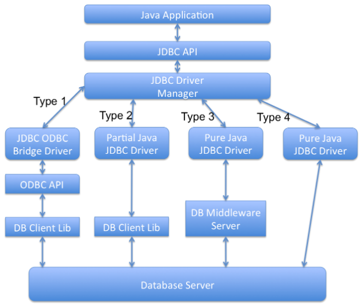

# JDBC

- [Что такое JDBC?](#Что-такое-JDBC?)
- [JDBC Drivers](#JDBC-Drivers)
- [В чем заключаются преимущества использования JDBC](#В-чем-заключаются-преимущества-использования-JDBC)
- [JDBC URL](#JDBC-URL)
- [Состав JDBC](#Состав-JDBC)
- [Классы и интерфейсы JDBC](#Классы-и-интерфейсы-JDBC)
- [Типы данных в JDBC. Связь с типами Java](#Типы-данных-в-JDBC.-Связь-с-типами-Java)
- [Этапы работы с базой данных при JDBC](#Этапы-работы-с-базой-данных-при-JDBC)
- [Регистрация драйвер JDBC](#Регистрация-драйвер-JDBC)
- [Соединение с базой данных](#Соединение-с-базой-данных)
- [Транзакция](#Транзакция)
- [Уровни изоляции транзакций в JDBC](#Уровни-изоляции-транзакций-в-JDBC)
- [Формирование запросов к БД](#Формирование-запросов-к-БД)
- [Отличия Statement от PreparedStatement](#Отличия-Statement-от-PreparedStatement)
- [Запрос и обработка результатов к базе данных](#Запрос-и-обработка-результатов-к-базе-данных)
- [Как вызвать хранимую процедуру?](#Как-вызвать-хранимую-процедуру?)
- [Закрыть соединение с базой данных](#Закрыть-соединение-с-базой-данных)
- [JDBC ResultSet](#JDBC-ResultSet)
- [setFetchSize() и SetMaxRows() в Statement](#setFetchSize,-SetMaxRows-в-Statement)
- [JDBC Batch Processing](#JDBC-Batch-Processing)
- [JDBC Transaction Management](#JDBC-Transaction-Management)
- [Откатить JDBC транзакцию](#Откатить-JDBC-транзакцию)
- [JDBC Savepoint](#JDBC-Savepoint)
- [JDBC пул соединений используя JDBC DataSource и JNDI в Apache Tomcat Server](#JDBC-пул-соединений-используя-JDBC-DataSource-и-JNDI-в-Apache-Tomcat-Server)
- [](#)

## Что такое JDBC?
__JDBC, Java DataBase Connectivity (соединение с базами данных на Java)__ — промышленный стандарт взаимодействия 
Java-приложений с различными СУБД. Реализован в виде пакета `java.sql`, `javax.sql` входящего в состав Java SE.

## JDBC Drivers
JDBC основан на концепции драйверов, которые позволяют получать соединение с базой данных по специально описанному URL. 
При загрузке драйвер регистрирует себя в системе и в дальнейшем автоматически вызывается, когда программа требует URL, 
содержащий протокол, за который этот драйвер отвечает.

Различают четыре типа драйверов.Java программа работает с БД в двух частях. Первая часть это __JDBC API__, 
а вторая — драйвер, который и выполняет всю работу. Каждый тип определяет реализацию JDBC драйвера по возрастающей 
степени независимости от платформы, производительности и легкости администрирования. Эти четыре типа следующие:  
- Тип 1: __JDBC-ODBC бридж__ (JDBC-ODBC Bridge plus ODBC Driver) — транслирует JDBC в ODBC и для взаимодействия с 
    базой данных использует драйвер ODBC. Компания Sun включила в состав JDK один такой драйвер — мост JDBC/ODBC. 
    Сейчас имеются более удачные реализации.
- Тип 2: Нативный API/частично Java драйвер (Native API partly Java technology-enabled driver) — переводит вызовы 
    JDBC в вызовы специфичные к СУБД таких как например SQL Server, Informix, Oracle или Sybase. Драйвер 2-го 
    типа общается напрямую с сервером базы данных, следовательно он требует, чтобы какой то бинарный код был 
    на стороне клиентской машины.
- Тип 3: Сетевой протокол/«чистый» Java драйвер (Pure Java Driver for Database Middleware) — использует 
    трехуровневую архитектуру, где вызовы JDBC посылаются на промежуточный т.н. сервер приложений, далее этот 
    сервер транслирует вызовы (явно или косвенно) в вызовы специфичного к СУБД нативного интерфейса для 
    дальнейшего обращения к базе данных. Если сервер среднего слоя написан на Java то он может использовать 
    для трансляции JDBC драйверы 1 и 2 типов.
- Тип 4: Нативный протокол/«чистый» Java драйвер (Direct-to-Database Pure Java Driver) — конвертирует вызовы 
    JDBC в специфический протокол вендора СУБД, так что клиентские приложения могут напрямую обращаться с сервером 
    базы данных. Драйверы 4-го типа полностью реализуются на Java с целью достижения платформенной независимости 
    и устранения проблем администрирования и развертывания.

## В чем заключаются преимущества использования JDBC
Преимуществами JDBC считают:   
+ Лёгкость разработки: разработчик может не знать специфики базы данных, с которой работает;
+ Код практически не меняется, если компания переходит на другую базу данных (количество изменений зависит 
    исключительно от различий между диалектами SQL);
+ Не нужно дополнительно устанавливать клиентскую программу;
+ К любой базе данных можно подсоединиться через легко описываемый URL.

## JDBC URL
__JDBC URL__ состоит из:  
+ `<protocol>:` (протокола) - всегда `jdbc:`.
+ `<subprotocol>:` (подпротокола) - это имя драйвера или имя механизма соединения с базой данных. Подпротокол может 
    поддерживаться одним или несколькими драйверами. Лежащий на поверхности пример подпротокола - это "odbc", 
    отведенный для URL, обозначающих имя источника данных ODBC. В случае необходимости использовать сервис имен 
    (т.е. имя базы данных в JDBC URL не будет действительным именем базы данных), то подпротоколом может выступать 
    сервис имен.
+ `<subname>` (подимени) - это идентификатор базы данных. Значение подимени может менятся в зависимости от 
    подпротокола, и может также иметь под-подимя с синтаксисом, определяемым разработчиком драйвера. Назначение 
    подимени - это предоставление всей информации, необходимой для поиска базы данных. Например, если база данных 
    находится в Интернет, то в состав подимени JDBC URL должен быть включен сетевой адрес, подчиняющийся следующим 
    соглашениям: `//<hostname>:<port>/<subsubname`.

Пример JDBC URL для подключения к MySQL базе данных «Test» расположенной по адресу localhost и ожидающей соединений 
по порту 3306: `jdbc:mysql://localhost:3306/Test`

## Состав JDBC
JDBC состоит из двух частей:  
+ __JDBC API__, который содержит набор классов и интерфейсов, определяющих доступ к базам данных. Эти классы и 
    методы объявлены в двух пакетах - `java.sql` и `javax.sql`;
+ __JDBC-драйвер__, компонент, специфичный для каждой базы данных. 

JDBC превращает вызовы уровня API в «родные» команды того или иного сервера баз данных.

## Классы и интерфейсы JDBC
+ `java.sql.DriverManager` - позволяет загрузить и зарегистрировать необходимый JDBC-драйвер, а затем получить 
    соединение с базой данных.
+ `javax.sql.DataSource` - решает те же задачи, что и _DriverManager_, но более удобным и универсальным образом. 
    Существуют также `javax.sql.ConnectionPoolDataSource` и `javax.sq1.XADataSource` задача которых - обеспечение 
    поддержки пула соединений.
+ `java.sql.Connection`  - обеспечивает формирование запросов к источнику данных и управление транзакциями. Также 
    предусмотрены интерфейсы `javax.sql.PooledConnection` и `javax.sql.XAConnection`.
+ `java.sql.Statement` , `java.sql.PreparedStatement` и `java.sql.CallableStatement`  - эти интерфейсы позволяют 
    отправить запрос к источнику данных.
+ `java.sql.ResultSet`  - объявляет методы, которые позволяют перемещаться по набору данных и считывать значения 
    отдельных полей в текущей записи.
+ `java.sql.ResultSetMetaData`  - позволяет получить информацию о структуре набора данных.
+ `java.sql.DatabaseMetaData` - позволяет получить информацию о структуре источника данных.

## Типы данных в JDBC. Связь с типами Java

| JDBC Type | Java Object Type |
|---------------:|---------------------------|
| __CHAR__ | `String` |
| __VARCHAR__ | `String` |
| __LONGVARCHAR__ | `String` |
| __NUMERIC__ | `java.math.BigDecimal` |
| __DECIMAL__ | `java.math.BigDecimal` |
| __BIT__ | `Boolean` |
| __TINYINT__ | `Integer` |
| __SMALLINT__ | `Integer` |
| __INTEGER__ | `Integer` |
| __BIGINT__ | `Long` |
| __REAL__ | `Float` |
| __FLOAT__ | `Double` |
| __DOUBLE__ | `Double` |
| __BINARY__ | `byte[]` |
| __VARBINARY__ | `byte[]` |
| __LONGVARBINARY__ | `byte[]` |
| __DATE__ | `java.sql.Date` |
| __TIME__ | `java.sql.Time` |
| __TIMESTAMP__ | `java.sql.Timestamp` |
| __CLOB__ | `Clob` |
| __BLOB__ | `Blob` |
| __ARRAY__ | `Array` |
| __STRUCT__ | `Struct`|
| __REF__ | `Ref` |
| __DISTINCT__ | сопоставление базового типа |
| __JAVA_OBJECT__ | базовый класс Java |

## Этапы работы с базой данных при JDBC
+ Регистрация драйверов;
+ Установление соединения с базой данных;
+ Создание запроса(ов) к базе данных;
+ Выполнение запроса(ов) к базе данных;
+ Обработка результата(ов);
+ Закрытие соединения с базой данных.

## Регистрация драйвер JDBC
Регистрацию драйвера можно осуществить несколькими способами:
+ `java.sql.DriverManager.registerDriver(%объект класса драйвера%)`.  
+ `Class.forName(«полное имя класса драйвера»).newInstance()`.
+ `Class.forName(«полное имя класса драйвера»)`;

## Соединение с базой данных
Для установки соединения с базой данных используется статический вызов `java.sql.DriverManager.getConnection(...)` .

В качестве параметра может передаваться:  
+ URL базы данных
    ```java
    static Connection getConnection(String url)
    ```
+ URL базы данных и набор свойств для инициализации
    ```java
    static Connection getConnection(String url, Properties info)
    ```
+ URL базы данных, имя пользователя и пароль
    ```java
    static Connection getConnection(String url, String user, String password)
    ```

В результате вызова будет установлено соединение с базой данных и создан объект класса `java.sql.Connection` - 
своеобразная «сессия», внутри контекста которой и будет происходить дальнейшая работа с базой данных.

## Транзакция
__Транза́кция (англ. transaction)__ — группа последовательных операций с базой данных, которая представляет собой 
логическую единицу работы с данными. Транзакция может быть выполнена либо целиком и успешно, соблюдая целостность 
данных и независимо от параллельно идущих других транзакций, либо не выполнена вообще и тогда она не должна 
произвести никакого эффекта. Транзакции обрабатываются транзакционными системами, в процессе работы которых 
создаётся история транзакций.

## Уровни изоляции транзакций в JDBC
__Уровень изолированности транзакций__ — значение, определяющее уровень, при котором в транзакции допускаются 
несогласованные данные, то есть степень изолированности одной транзакции от другой. Более высокий уровень 
изолированности повышает точность данных, но при этом может снижаться количество параллельно выполняемых транзакций. 
С другой стороны, более низкий уровень изолированности позволяет выполнять больше параллельных транзакций, но 
снижает точность данных.

Во время использования транзакций, для обеспечения целостности данных, СУБД использует блокировки, чтобы заблокировать 
доступ других обращений к данным, участвующим в транзакции. Такие блокировки необходимы, чтобы предотвратить:  
+ _«грязное» чтение (dirty read)_ — чтение данных, добавленных или изменённых транзакцией, которая впоследствии не 
    подтвердится (откатится);
+ _неповторяющееся чтение (non-repeatable read)_ — при повторном чтении в рамках одной транзакции ранее прочитанные 
    данные оказываются изменёнными;
+ _фантомное чтение (phantom reads)_ — ситуация, когда при повторном чтении в рамках одной транзакции одна и та же 
    выборка дает разные множества строк.

Уровни изоляции транзакций определены в виде констант интерфейса `java.sql.Connection`:
+ `TRANSACTION_NONE` – драйвер не поддерживает транзакции;
+ `TRANSACTION_READ_UNCOMMITTED` – позволяет транзакциям видеть несохраненные изменения данных: разрешает грязное, 
    непроверяющееся и фантомное чтения;
+ `TRANSACTION_READ_COMMITTED` – любое изменение, сделанное в транзакции, не видно вне неё, пока она не сохранена: 
    предотвращает грязное чтение, но разрешает неповторяющееся и фантомное;
+ `TRANSACTION_REPEATABLE_READ` – запрещает грязное и непроверяющееся, фантомное чтение разрешено;
+ `TRANSACTION_SERIALIZABLE` – грязное, непроверяющееся и фантомное чтения запрещены.

> __NB!__ Сервер базы данных может не поддерживать все уровни изоляции. Интерфейс `java.sql.DatabaseMetaData` 
>предоставляет информацию об уровнях изолированности транзакций, которые поддерживаются данной СУБД.

Уровень изоляции транзакции используемый СУБД можно задать с помощью метода `setTransactionIsolation()` объекта 
`java.sql.Connection`. Получить информацию о применяемом уровне изоляции поможет метод `getTransactionIsolation()`.

## Формирование запросов к БД
Для выполнения запросов к базе данных в Java используются три интерфейса:  
+ `java.sql.Statement` - для операторов SQL без параметров;
+ `java.sql.PreparedStatement` - для операторов SQL с параметрами и часто выполняемых операторов;
+ `java.sql.CallableStatement` -  для исполнения хранимых в базе процедур.

Объекты-носители интерфейсов создаются при помощи методов объекта `java.sql.Connection`:   
+ `java.sql.createStatement()` возвращает объект _Statement_;
+ `java.sql.prepareStatement()` возвращает объект _PreparedStatement_;
+ `java.sql.prepareCall()` возвращает объект _CallableStatement_;

## Отличия Statement от PreparedStatement
+ __Statement__: используется для простых случаев запроса без параметров.
+ __PreparedStatement__: предварительно компилирует запрос, который может содержать входные параметры и выполняться 
    несколько раз с разным набором этих параметров.

Перед выполнением СУБД разбирает каждый запрос, оптимизирует его и создает «план» (query plan) его выполнения. 
Если один и тот же запрос выполняется несколько раз, то СУБД в состоянии кэшировать план его выполнения и не 
производить этапов разборки и оптимизации повторно. Благодаря этому запрос выполняется быстрее.

Суммируя: _PreparedStatement_ выгодно отличается от _Statement_ тем, что при повторном использовании с одним 
или несколькими наборами параметров позволяет получить преимущества заранее прекомпилированного и кэшированного 
запроса, помогая при этом избежать SQL Injection.

## Запрос и обработка результатов к базе данных
Выполнение запросов осуществляется при помощи вызова методов объекта, реализующего интерфейс `java.sql.Statement`:  
+ __`executeQuery()`__ -  для запросов, результатом которых является один набор значений, например запросов `SELECT`. 
    Результатом выполнения является объект класса `java.sql.ResultSet`;
+ __`executeUpdate()`__ - для выполнения операторов `INSERT`, `UPDATE` или `DELETE`, а также для операторов 
    _DDL (Data Definition Language)_. Метод возвращает целое число, показывающее, сколько записей было модифицировано;
+ __`execute()`__ – исполняет SQL-команды, которые могут возвращать различные результаты. Например, может 
    использоваться для операции `CREATE TABLE`. Возвращает `true`, если первый результат содержит _ResultSet_ 
    и `false`, если первый результат - это количество модифицированных записей или результат отсутствует. 
    Чтобы получить первый результат необходимо вызвать метод `getResultSet()` или `getUpdateCount()`. Остальные 
    результаты доступны через вызов `getMoreResults()`, который при необходимости может быть произведён многократно.

Объект с интерфейсом `java.sql.ResultSet` хранит в себе результат запроса к базе данных - некий набор данных, внутри 
которого есть курсор, указывающий на один из элементов набора данных - текущую запись.

Используя курсор можно перемещаться по набору данных при помощи метода `next()`.

> __NB!__ Сразу после получения набора данных его курсор находится перед первой записью и чтобы сделать её текущей 
>необходимо вызвать метод `next()`.

Содержание полей текущей записи доступно через вызовы методов `getInt()`, `getFloat()`, `getString()`, `getDate()` и 
им подобных.

## Как вызвать хранимую процедуру?
__Хранимые процедуры__ – это именованный набор операторов SQL хранящийся на сервере. Такую процедуру можно вызвать 
из Java-класса с помощью вызова методов объекта реализующего интерфейс `java.sql.Statement`.

Выбор объекта зависит от характеристик хранимой процедуры:  
+ без параметров → `Statement`
+ с входными параметрами → `PreparedStatement`
+ с входными и выходными параметрами → `CallableStatement`

> Если неизвестно, как была определена хранимая процедура, для получения информации о хранимой процедуре (например, 
>имен и типов параметров) можно использовать методы `java.sql.DatabaseMetaData` позволяющие получить информацию о 
>структуре источника данных.

Пример вызова хранимой процедуры с входными и выходными параметрами:

```java
public vois runStoredProcedure(final Connection connection) throws Exception {
    // описываем хранимую процедуру
    String procedure = "{ call procedureExample(?, ?, ?) }";
    
    // подготавливаем запрос
    CallableStatement cs = connection.prepareCall(procedure);
    
    // устанавливаем входные параметры
    cs.setString(1, "abcd");
    cs.setBoolean(2, true);
    cs.setInt(3, 10);
    
    // описываем выходные параметры
    cs.registerOutParameter(1, java.sql.Types.VARCHAR);
    cs.registerOutParameter(2, java.sql.Types.INTEGER);
    
    // запускаем выполнение хранимой процедуры
    cs.execute();
    
    // получаем результаты
    String parameter1 = cs.getString(1);
    int parameter2 = cs.getInt(2);
    
    // заканчиваем работу с запросом
    cs.close();
}
```

## Закрыть соединение с базой данных
Соединение с базой данной закрывается вызовом метода `close()` у соответствующего объекта `java.sql.Connection` 
или посредством использования механизма try-with-resources при создании такого объекта, появившегося в Java 7.

> __NB!__ Предварительно необходимо закрыть все запросы созданные этим соединением.

## JDBC ResultSet
__JDBC ResultSet__ — интерфейс, объект которого создается в результате запроса к базе данных. Его можно представить 
в виде таблицы данных, которая была сформирована в ответ на запрос.
Объект ResultSet поддерживает курсор, который указывает на текущую строку данных. При инициализации курсор 
устанавливается до первой строки. Для движение по строкам используется метод `next()`. При наличии строк после 
текущей позиции, метод `next()` возвращает true, что можно использовать для итерации по таблице полученных результатов.

По умолчанию объект ResultSet не модифицируемый и поддерживает курсор, который способен только к движение вперед. 
Для обхода такого ограничения можно использовать следующую конструкцию, которая даст возможность двунаправленного 
движения по таблице, а так же возможности обновления:
```java
Statement stmt = con.createStatement(ResultSet.TYPE_SCROLL_INSENSITIVE,
                                   ResultSet.CONCUR_UPDATABLE);
```

Объект ResultSet автоматически закрывается при закрытии объекта, который его сгенерировал. Так же закрытие 
произойдет при повторном выполнении запроса или возврату результата из другого набора результатов.

Для использования геттера ResultSet можно использовать имя колонки или индекс, который начинается с 1.

## Типы JDBC ResultSet
При создании Statement можно задать различные типы получаемого ResultSet.

Три типа объектов ResultSet:    
- __ResultSet.TYPE_FORWARD_ONLY__: тип по умолчанию. Поддерживает движение курсора только в прямом направлении.
- __ResultSet.TYPE_SCROLL_INSENSITIVE__: Двунаправленный курсор. Объект не чувствителен к изменениям, которые 
    произошли с таблицей после получения результата.
- __ResultSet.TYPE_SCROLL_SENSITIVE__: Двунаправленный курсор. Объект чувствителен к изменениям, которые произошли 
    с базой данных после создания объекта ResultSet.

Два типа потокобезопасных объектов ResultSet:   
- __ResultSet.CONCUR_READ_ONLY__: Поддерживает только чтение (read only). Применяется по умолчанию.
- __ResultSet.CONCUR_UPDATABLE__: Поддерживает метод ResultSet update для обновления строк в таблице данных.

## setFetchSize, SetMaxRows в Statement
Для ограничения количества строк, которые может вернуть запрос, применяется метод `setMaxRows(int i)`. Конечно, этот 
результат можно получить используя SQL запрос (например для MySQL существует команда `LIMIT`).

Для понимания метода `setFetchSize()` необходимо разобраться с работой Statement и ResultSet. Когда выполняется запрос 
к базе данных, результат обрабатывается и сохраняется в кэше базы данных и возвращается в виде `ResultSet`. 
`ResultSet` является курсором, которые ссылается на результат в базе данных. Теперь допустим мы имеем запрос, 
который возвращает 100 строк и мы установили setFetchSize(10). Теперь для каждого обращения к базе данных выделено 
только 10 строк и понадобится 10 запросов, чтобы получить все данные. Выбор оптимального количества `fetchSize()` 
может улучшить производительность выполнения большого кол-ва обращений к каждой строке и в случае большого 
количества строк в выходном результате.

Значение fetchSize можно указать внутри объекта Statement, но оно может быть переопределено в объекте ResultSet с 
помощью `setFetchSize()`.

## JDBC Batch Processing
Бывает необходимо выполнить сразу группу похожих запросов, например при загрузке данных из CSV файлов реляционной 
базы данных. Это можно сделать просто используя Statement или PreparedStatement для пошагового выполнения этих 
запросов. В JDBC API существует другая возможность, которая предоставляет возможность выполнить группу запросов 
за один раз. Выполнение такого рода задачи происходит с помощью JDBC API Batch Processing.

JDBC API поддерживает пакетную обработку с помощью методов `addBatch()` и `executeBatch()` у `Statement` и 
`PreparedStatement`. К преимуществам такого подхода относится более быстрая работа, т.к. вызовов к базе данных 
может быть существенно меньше.

## JDBC Transaction Management
По умолчанию, при создании подключения к базе данных будет выбран `auto-commit mode`. Это означает, что при каждом 
выполнении запроса он будет подтвержден автоматически по завершению. Каждый SQL запрос является транзакционным и 
выполняя какие-либо DML или DDL запросы по их завершению изменения будут приняты (сохранены) базой данных. 
Если у нас есть необходимость отказываться от сохранения выполнения какого-либо запроса (или групп запросов) в 
случае, если что-то пошло не так, то мы можем воспользоваться поддержкой транзакций в JDBC API.

С помощью метода `setAutoCommit(boolean flag)` можно отключить авто коммит в конкретном соединении. Следует отметить, 
что при отключении auto-commit не одно изменение не будет сохранено в базе данных до вызова метода `commit()` и за 
этим необходимо следить. Сервер базы данных будет блокировать необходимую часть базы данных до подтверждения 
транзакции, а так как это ресурсоёмкая задача, то подтверждать транзакцию необходимо сразу после выполнения задачи.

## Откатить JDBC транзакцию
Для этого предусмотрен метод объекта Connection `rollback()`, который откатывает транзакцию. Будут отменены все 
изменения в транзакции и отменен `lock` базы данных от этого объекта Connection.

## JDBC Savepoint
__JDBC Savepoint__ позволяет создавать «чекпоинты» в транзакции с помощью которых мы можем откатить не всю 
транзакцию целиком, а только часть до точки сохранения. Любая точка сохранения автоматически освобождается и 
становится недоступной после подтверждения транзакции или её роллбека. Откат к точке сохранения делает все 
последующие сейвы недоступными и к ним уже нельзя будет вернуться.

## JDBC DataSource
JDBC DataSource является интерфейсом пакета javax.sql и является более продвинутым в сравнении с DriverManager 
для подключения к базе данных. Мы можем использовать DataSource для создания подключения к базе данных и реализацию 
класса драйвера, которая будет выполнять всю работу по поддержанию соединения. В дополнение к соединению через 
Database, DataSource предоставляет следующие дополнительные возможности:  
- Кэширование PreparedStatement для ускорения обработки запросов
- Настройки Connection timeout
- Возможности логирования
- Порог максимального размера ResultSet
- Поддержка Connection Pooling в контейнере сервлетов, использующий поддержку JNDI.

## JDBC пул соединений используя JDBC DataSource и JNDI в Apache Tomcat Server
Для создания пула соединений JDBC при использовании Tomcat необходимо выполнить несколько простых действий. 
Необходимо создать JDBC JNDI ресурс в файле конфигурации сервера (server.xml или context.xml).
```xml
server.xml
<Resource name="jdbc/MyDB"
      global="jdbc/MyDB"
      auth="Container"
      type="javax.sql.DataSource"
      driverClassName="com.mysql.jdbc.Driver"
      url="jdbc:mysql://localhost:3306/DataBaseName"
      username="root"
      password="admin"
        
      maxActive="100"
      maxIdle="20"
      minIdle="5"
      maxWait="10000"/>

context.xml:
<ResourceLink name="jdbc/MyLocalDB"
                global="jdbc/MyDB"
                auth="Container"
                type="javax.sql.DataSource" />
```
В веб приложении с использованием InitialContext используем следующую запись для поиска JNDI ресурса, указанного 
в настройке выше. А затем можно получать соединение.
```java
Context ctx = new InitialContext();
DataSource ds = (DataSource) ctx.lookup("java:/comp/env/jdbc/MyLocalDB");
```