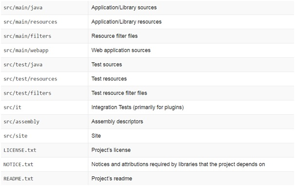

# MAVEN

- [Сборка проекта](#Сборка-проекта)
- [Автоматизация сборки](#Автоматизация-сборки)
- [Maven](#Maven)
- [Преимущества Maven](#Преимущества-Maven)
- [Структура каталогов Maven](#Структура-каталогов-Maven)
- [Pom.xml](#Pom.xml)
- [Dependency](#Dependency)
- [Артефакт в Maven](#Артефакт-в-Maven)
- [Архетип в Maven](#Архетип-в-Maven)
- [Репозиторий в Maven](#Репозиторий-в-Maven)
- [Поиск зависимостей Maven](#Поиск-зависимостей-Maven)
- [Жизненный цикл сборки в Maven](#Жизненный-цикл-сборки-в-Maven)
    - [mvn clean](#mvn-clean)
    - [build](#build)
- [Область видимости зависимостей](#Область-видимости-зависимостей)
- [Свойства в файле pom.xml](#Свойства-в-файле-pom.xml)
- [Собрать проект без запуска тестов](#Собрать-проект-без-запуска-тестов)
- [Запустить только один тест](#Запустить-только-один-тест)
- [Теги pom.xml](#Теги-pom.xml)
- 

## Сборка проекта
__Сборка (англ. assembly)__ - двоичный файл, содержащий исполняемый код программы или другой, подготовленный для 
использования информационный продукт.

## Автоматизация сборки
__Автоматизация сборки__ - этап написания скриптов или автоматизация широкого спектра задач применительно к ПО, 
применяемому разработчиками в их повседневной деятельности, включая такие действия, как:   
- Компиляция исходного кода в бинарный код
- Сборка бинарного кода
- Выполнение тестов
- Разворачивание программы на производственной платформе
- Написание сопроводительной документации или описание изменений новой версии

## Maven
__Apache Maven__ - это фреймворк для автоматизации сборки проектов, компиляции, создания jar, создания дистрибутива 
программы, генерации документации. Если собирать большие проекты с командной строки, то команда для сборки будет 
очень длинной, поэтому её иногда записывают в bat/sh скрипт. Но такие скрипты зависят от платформы. Для того 
чтобы избавиться от этой зависимостии и упростить написание скрипта используют инструменты для сборки проекта.    
Maven, обеспечивает декларативную, а не императивную сборку проекта. То есть, в файлах проекта pom.xml 
содержится его декларативное описание, а не отдельные команды. Все задачи по обработке файлов Maven 
выполняется через плагины.

## Преимущества Maven
- Независимость от OS. Сборка проекта происходит в любой операционной системе. Файл проекта один и тот же.
- Управление зависимостями. Редко какие проекты пишутся без использования сторонних библиотек(зависимостей). 
    Эти сторонние библиотеки зачастую тоже в свою очередь используют библиотеки разных версий. Maven позволяет 
    управлять такими сложными зависимостями. Что позволяет разрешать конфликты версий и в случае необходимости 
    легко переходить на новые версии библиотек.
- Возможна сборка из командной строки. Такое часто необходимо для автоматической сборки проекта на сервере 
    (Continuous Integration).
- Хорошая интеграция со средами разработки. Основные среды разработки на java легко открывают проекты которые 
    собираются c помощью maven. При этом зачастую проект настраивать не нужно - он сразу готов к дальнейшей разработке. 
- Как следствие - если с проектом работают в разных средах разработки, то maven удобный способ хранения настроек. 
    Настроечный файл среды разработки и для сборки один и тот же - меньше дублирования данных и соответственно ошибок.
- Декларативное описание проекта.
    
## Структура каталогов Maven
В Maven стандартная структура каталогов, благодаря ей отпадает необходимость прописывать пути к файлам проекта. 
В корневом каталоге проекта находится pom.xml и несколько текстовых файлов. Всё остальное хозяйство аккуратно 
разложено в подкаталогах. Главные из них - src и target. Однако, порядок сохраняется и вглубь:

    
## Pom.xml
__pom.xml__ - это XML-файл, который содержит информацию о деталях проекта, и  конфигурации используемых для 
создания проекта на Maven. Он всегда находится в базовом каталоге проекта. Этот файл также содержит задачи 
и плагины. Во время выполнения задач, Maven ищет файл pom.xml в базовой директории проекта. Он читает его 
и получает необходимую информацию, после чего выполняет задачи.   
Корневой элемент <project>, схема, которая облегчает редактирование и проверку, и версия pom.xml. Внутри 
тега project содержится основная и обязательная информация о проекте.

Среди информации которую содержит pom.xml мы можем выделить следующие:   
- Зависимости проекта (project dependencies)
- Плагины (plugins)
- Задачи/цели (goals)
- Профиль создания (build profiles)
- Версия проекта (project version)
- Разработчики (developers)
- Список рассылки (mailing list)

## Dependency
__Зависимость (dependency)__ - это те библиотеки, которые непосредственно используются в вашем проекте для 
компиляции кода или его тестирования.

## Артефакт в Maven
__Артефакт (artefact)__ - это, по сути, любая библиотека, хранящаяся в репозитории (месте хранения). Это может 
быть какая-то зависимость или плагин. Обычно артефактом является JAR-файл, который хранится в репозитории Maven. 
Каждый артефакт содержит group ID, artifact ID и версию.

## Архетип в Maven
__Архетип (archetype)__ - это некая стандартная компоновка файлов и каталогов в проектах различного рода 
(веб, swing-проекты и прочие). Другими словами, Maven знает, как обычно строятся проекты и в соответствии 
с архетипом создает структуру каталогов.

## Репозиторий в Maven
__Репозиторий (repository)__ - глобальное хранилище всех библиотек, доступных для Maven, это место где хранятся 
артефакты: jar файлы, pom-файлы, javadoc, исходники, плагины.

В Maven существуют три типы репозитория:    
- __Локальный (local) репозиторий__ - это директория, которая хранится на нашем компьютере. Она создаётся в 
    момент первого выполнения любой команды Maven. По умолчанию она расположена в <home директория>/.m2/repository - 
    персональная для каждого пользователя.
- __Центральный (central) репозиторий__ - это репозиториий, который обеспечивается сообществом Maven. Он 
    содержит огромное количество часто используемых библиотек. Который расположен в http://repo1.maven.org/maven2/ 
    и доступен на чтение для всех пользователей в интернете. Если Maven не может найти зависимости в локальном 
    репозитории, то автоматически начинается поиск необходимых файлов в центральном репозитории
- __Удалённые (remote) репозиторий__ - иногда, Maven не может найти необходимые зависимости в центральном 
    репозитории. В этом случае, процесс сборки прерывается и в консоль выводится сообщение об ошибке. Для 
    того, чтобы предотвратить подобную ситуацию, в Maven предусмотрен механизм Удалённого репозитория, 
    который является репозиторием, который определяется самим разработчиком. Там могут храниться все 
    необходимые зависимости.

## Поиск зависимостей Maven
Когда мы выполняем собрку проекта в Maven, автоматически начинается поиск необходимых зависимостей в следующем порядке:   
1. Поиск зависимостей в локальном репозитории Если зависимости не обнаружены, происходит переход к шагу 2.
2. Поиск зависимостей в центральном репозитории. Если они не обнаружены и удалённый репозиторий определён, 
    то происходит переход к шагу 4.
3. Если удалённый репозиторий не определён, то процесс сборки прекращается и выводится сообщение об ошибке.
4. Поиск зависимостей на удалённом репозитории, если они найдены, то происходит их загрузка в локальный репозиторий, 
    если нет - выводится сообщение об ошибке.

## Жизненный цикл сборки в Maven
Когда Maven начинает сборку проекта, он проходит через определённую последовательность фаз сборки, и выполняет 
определенные задачи, которые указаны в каждой из фаз.
В Maven есть следующие 3 стандартных жизненных цикла:     
- __Очистка (clean)__ - очищает артефакты, созданные до сборки.
- __Сборка (default or build)__ - используется для создания приложения.
- __Создание сайта проекта (site)__ - генерирует документацию сайта для проекта.

### mvn clean
__mvn clean__ - эта команда очищает целевую директорию от созданных в процессе сборки файлов.    
Жизненный цикл сборки Clean состоит из следующих этапов:   
- pre-clean
- clean
- post-clean

### build
__Default (Build)__ - это основной жизненный цикл Maven, который используется для сборки проектов. Он включает 
в себя 23 фазы:    
- __validate__  - проверяет корректность метаинформации о проекте, подтверждает, является ли проект  корректным и 
    вся ли необходимая информация доступа для завершения процесса сборки.
- __initialize__ - инициализирует состояние сборки, например, различные настройки.
- __generate-sources__ - включает любой исходный код в фазу компиляции.
- __process-sources__ - обрабатывает исходный код (подготавливает). Например, фильтрует определённые значения.
- __generate-resources__ - генерирует ресурсы, которые должны быть включены в пакет.
- __process-resources__ - копирует и отправляет ресурсы в указанную директори. Это фаза перед упаковкой.
- __compile__ - комплирует исходный код проекта.
- __process-classes__ - обработка файлов, полученных в результате компляции. Например, оптимизация байт-кода Java классов.
- __generate-test-sources__ - генерирует любые тестовые ресурсы, которые должны быть включены в фазу компиляции.
- __process-test-sources__ - обрабатывает исходный код тестов. Например, фильтрует значения.
- __test-compile__ - компилирует исходный код тестов в указанную директорию тестов.
- __process-test-classes__ - обрабатывает файлы, полученные в результате компиляции исходного кода тестов.
- __test__ - запускает тесты классов, используя приемлемый фреймворк юнит-тестирования (например, Junit).
- __prepare-package__ - выполняет все необходимые операции для подготовки пакета, непосредственно перед упаковкой.
- __package__ - преобразует скомпилированный код и пакет в дистрибутивный формат. Такие как JAR, WAR или EAR.
- __pre-integration-test__ - выполняет необходимые действия перед выполнением интеграционных тестов.
- __integration-test__ - обрабатывает и распаковывает пакет, если необходимо, в среду, где будут выполняться 
    интеграционные тесты.
- __post-integration-test__ - выполняет действия, необходимые  после выполнения интеграционных тестов. Например, 
    освобождение ресурсов.
- __verify__ - выполняет любые проверки для подтверждения того, что пакет пригоден и отвечает критериям качества.
- __install__ - переносит пакет в локальный репозиторий, откуда он будет доступен для использования как зависимость 
    в других проектах.
- __deploy__ - копирует финальный пакет (архив) в удалённый репозиторий для, того, чтобы сделать его доступным другим 
    разработчикам и проектам.

## Область видимости зависимостей
Существует 6 областей:   
- __compile__ - это область по умолчанию, использутся, если ничего больше не определено. Compile зависимости 
    доступны во всех classpath проекта. 
- __provided__ - это очень похоже на compile, но указывает на то, что вы ожидаете от JDK или контейнера предоставить 
    зависимость в ходе выполнения. Эта область доступна только на compilation и test classpath и не является транзитивной.
- __runtime__ - эта область указывает на то, что зависимость не обязательна для compilation, но для фаз выполнения. 
- __test__ - эта область указывает, что зависимость не обязательна для нормального использования приложения.
- __system__ - эта область похожа на provided за исключением того, что вы предоставляете JAR. Артефакт всегда 
    доступен и не смотрит в репозиторий.
- __import__ - эта область используется в зависимости типа pom в <dependencyManagement> разделе. Это указывает на 
    то, что определенный POM будет заменен зависимостями в этом POM <dependencyManagement> разделе.
    
    
## Свойства в файле pom.xml
На все свойства в pom.xml, можно сослаться с помощью префиксов "project." или "pom." Ниже приведёт пример некоторых 
часто используемых элементов.
- `${project.build.directory}` - "target" директория, или тоже самое `${pom.project.build.directory}`.
- `${project.build.outputDirectory}` - путь к директории куда компилятор складывает файлы по умолчанию "target/classes".
- `${project.name}` или `${pom.name}` - имя проекта.
- `${project.version}` или `${pom.version}` - версия проекта.

## Собрать проект без запуска тестов
Для запуска сборки без выполнения тестов добавьте `-Dmaven.test.skip=true` к команде в строке запуска maven:   

> mvn install -Dmaven.test.skip=true

## Запустить только один тест
Для запуска только одного теста добавьте `-Dtest=[Имя класса]` к команде в строке запуска maven. Например:

> mvn install -Dtest=org.apache.maven.utils.ConverterTest

## Теги pom.xml
- __project__ - описывает проект, это элемент верхнего уровня во всех файлах pom.xml.
- __groupId__ - по-сути, это имя пакета. Полностью отражается в структуре каталогов.
- __artifactId__ - название проекта. В структуре каталогов не отображается.
- __version__ - версия проекта.
- __packaging__ - определяет, какой тип файла будет собран. Варианты: `pom`, `jar`, `war`, `ear`.
- __dependencies__ - указываются зависимости.
- __build__ - информация о сборке проекта.
- __name__ - это уже необязательные описания проекта. В данном случае его название.
- __description__ - элемент представляет собой общее описание вашего проекта. Это часто используется в генерации 
    документации Maven.
- __url__ - интернет-страница проекта.
- __repositories__ - репозитории для артефактов.
- __pluginRepositories__ - репозитории для плагинов Maven.

