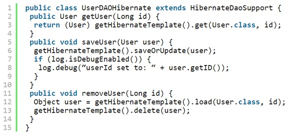
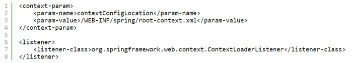
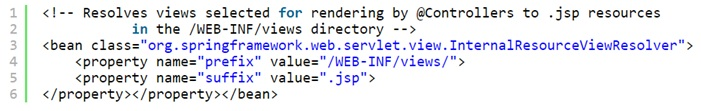
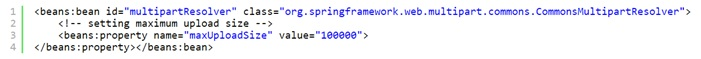
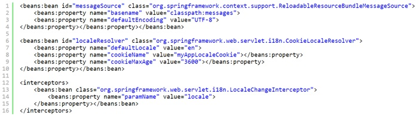
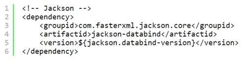
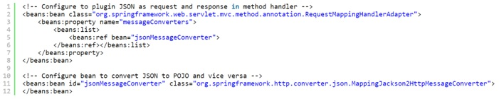
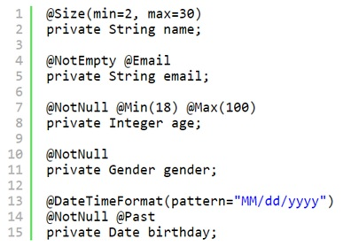

# Spring

- [Что такое Spring? Из каких частей состоит Spring Framework?](#Что-такое-Spring?-Из-каких-частей-состоит-Spring-Framework?)
- [Java Naming and Directory Interface](#Java-Naming-and-Directory-Interface)
- [Enterprise Java Beans](#Enterprise-Java-Beans)
- [Что такое Spring бин?](#Что-такое-Spring-бин?)
- [Dependency injection](#Dependency-injection)
- [Какие IoC контейнеры вы знаете?](#Какие-IoC-контейнеры-вы-знаете?)
- [Шаблоны проектирования используемые в Spring Framework](#Шаблоны-проектирования-используемые-в-Spring-Framework)
- [Некоторые из важных особенностей и преимуществ Spring Framework?](#Некоторые-из-важных-особенностей-и-преимуществ-Spring-Framework?)
- [Что такое AOP? Как это относиться к IoC?](#Что-такое-AOP?-Как-это-относиться-к-IoC?)
- [Что такое Aspect, Advice, Pointcut, JointPoint и Advice Arguments в АОП?](#Что-такое-Aspect,-Advice,-Pointcut,-JointPoint-и-Advice-Arguments-в-АОП?)
- [В чем разница между Spring AOP и AspectJ АОП?](#В-чем-разница-между-Spring-AOP-и-AspectJ-АОП?)
- [Как получить объекты ServletContext и ServletConfig внутри Spring Bean?](#Как-получить-объекты-ServletContext-и-ServletConfig-внутри-Spring-Bean?)
- [В чем роль ApplicationContext в Spring?](#В-чем-роль-ApplicationContext-в-Spring?)
- [Часто используемые аннотации Spring](#Часто-используемые-аннотации-Spring)
- [Является ли Spring bean потокобезопасным?](#Является-ли-Spring-bean-потокобезопасным?)
- [Как создать ApplicationContext в программе Java?](#Как-создать-ApplicationContext-в-программе-Java?)
- [Можем ли мы иметь несколько файлов конфигурации Spring?](#Можем-ли-мы-иметь-несколько-файлов-конфигурации-Spring?)
- [Каким образом можно управлять транзакциями в Spring?](#Каким-образом-можно-управлять-транзакциями-в-Spring?)
- [Каким образом Spring поддерживает DAO?](#Каким-образом-Spring-поддерживает-DAO?)
- [Что такое контроллер в Spring MVC?](#Что-такое-контроллер-в-Spring-MVC?)
- [Какая разница между аннотациями @Component, @Repository и @Service в Spring?](#Какая-разница-между-аннотациями-@Component,-@Repository-и-@Service-в-Spring?)
- [DispatcherServlet и ContextLoaderListener](#DispatcherServlet-и-ContextLoaderListener)
- [Что такое MultipartResolver и когда его использовать?](#Что-такое-MultipartResolver-и-когда-его-использовать?)
- [Как загрузить файл в Spring MVC?](#Как-загрузить-файл-в-Spring-MVC?)
- [Как обрабатывать исключения в Spring MVC Framework?](#Как-обрабатывать-исключения-в-Spring-MVC-Framework?)
- [Каковы минимальные настройки, чтобы создать приложение Spring MVC?](#Каковы-минимальные-настройки,-чтобы-создать-приложение-Spring-MVC?)
- [Как бы вы связали Spring MVC Framework и архитектуру MVC?](#Как-бы-вы-связали-Spring-MVC-Framework-и-архитектуру-MVC?)
- [Как добиться локализации в приложениях Spring MVC?](#Как-добиться-локализации-в-приложениях-Spring-MVC?)
- [Как мы можем использовать Spring для создания веб-службы RESTful, возвращающей JSON?](#Как-мы-можем-использовать-Spring-для-создания-веб-службы-RESTful,-возвращающей-JSON?)
- [Как проверить (валидировать) данные формы в Spring Web MVC Framework?](#Как-проверить-(валидировать)-данные-формы-в-Spring-Web-MVC-Framework?)
- [Что вы знаете Spring MVC Interceptor и как он используется?](#Что-вы-знаете-Spring-MVC-Interceptor-и-как-он-используется?)
- [Расскажите о Spring Security.](#Расскажите-о-Spring-Security.)
- [](#)

## Что такое Spring? Из каких частей состоит Spring Framework?
__Spring__ - фреймворк с открытым исходным кодом, предназначеный для упрощения разработки enterprise-приложений. 
Одним из главным преимуществом Spring является его слоистая архитектура, позволяющая вам самим определять какие 
компоненты будут использованы в вашем приложении. Модули Spring построены на базе основного контейнера, который 
определяет создание, конфигурация и менеджмент бинов.
Основные модули:  
- Основной контейнер - предоставляет основной функционал Spring. Главным компонентом контейнера является 
    __BeanFactory__ - реализация паттерна Фабрика. BeanFactory позволяет разделить конфигурацию приложения и 
    информацию о зависимостях от кода.
- __Spring context__ - конфигурационный файл, который предоставляет информация об окружающей среде для Spring. 
    Сюда входят такие enterprise-сервисы, как JNDI, EJB, интернационализация, валиадция и т.п.
- __Spring AOP__ - отвечает за интеграцию аспектно-ориентированного программирования во фреймворк. Spring AOP 
    обеспечивает сервис управления транзакциями для Spring-приложения.
- __Spring DAO__ - абстрактный уровень Spring JDBC DAO предоставляет иерархию исключений и множество сообщений об 
    ошибках для разных БД. Эта иерархия упрощает обработку исключений и значительно уменьшает количество кода, 
    которое вам нужно было бы написать для таких операций, как, например, открытие и закрытие соединения.
- __Spring ORM__ - отвечает за интеграцию Spring и таких популярных ORM-фреймворков, как Hibernate, iBatis и JDO.
- __Spring Web module__ - классы, которые помогают упростить разработку Web (авторизация, доступ к бинам Spring-а из web).
- __Spring MVC framework__ - реализация паттерна MVC для построения Web-приложений.
    
## Java Naming and Directory Interface
__Java Naming and Directory Interface (JNDI)__ — это набор Java API, организованный в виде службы каталогов, 
который позволяет Java-клиентам открывать и просматривать данные и объекты по их именам. Как любое другое Java API, 
как набор интерфейсов, JNDI не зависит от нижележащей реализации. В дополнению к этому, он предоставляет реализацию 
__service provider interface (SPI)__, которая позволяет службам каталогов работать в паре с каким-либо фреймворком. 
Это может быть сервер, файл или база данных.

Концепция JNDI основана на двух основных определениях: ассоциация и контекст.    
__Ассоциация__ (англ. binding) — это соответствие JNDI-имени и объекта.   
__Контекст__ (англ. context) — это среда, в которой хранится набор ассоциаций между объектами и именами.

## Enterprise Java Beans
__EJB (Enterprise Java Beans)__ – это фреймворк для построение бизнес-логики приложения.

## Что такое Spring бин?
Термин [__бин__](src/main/java/kovteba/dependencyinjectionbeans) (англ. Bean) - в Spring 
используется для ссылки на любой компонент, управляемый контейнером. 
Обычно бины на определенном уровне придерживаются спецификации JavaBean, но это не обязательно особенно если 
для связывания бинов друг с другом планируется применять Constructor Injection. Для получения экземпляра бина 
используется ApplicationContext. IoC контейнер управляет жизненным циклом спринг бина, областью видимости и внедрением.

## Dependency injection
[__Внедрение зависимости__](src/main/java/kovteba/dependencyinjectionbeans) (англ. Dependency injection, DI) — 
процесс предоставления внешней зависимости программному компоненту. Является специфичной формой «инверсии 
управления» (англ. Inversion of control, IoC), когда она применяется к управлению зависимостями. В полном 
соответствии с принципом единственной обязанности объект отдаёт заботу о построении требуемых ему зависимостей 
внешнему, специально предназначенному для этого общему механизму.
    
## Какие IoC контейнеры вы знаете?
Spring является IoC контейнером. Помимо него существуют HiveMind, Avalon, PicoContainer и т.д.

## Шаблоны проектирования используемые в Spring Framework
Spring Framework использует множество шаблонов проектирования, например:
- Singleton Pattern: Creating beans with default scope.
- Factory Pattern: Bean Factory classes
- Prototype Pattern: Bean scopes
- Adapter Pattern: Spring Web and Spring MVC
- Proxy Pattern: Spring Aspect Oriented Programming support
- Template Method Pattern: JdbcTemplate, HibernateTemplate etc
- Front Controller: Spring MVC DispatcherServlet
- Data Access Object: Spring DAO support
- Dependency Injection and Aspect Oriented Programming

## Некоторые из важных особенностей и преимуществ Spring Framework?
__Spring Framework__ обеспечивает решения многих задач, с которыми сталкиваются Java-разработчики и организации, 
которые хотят создать информационную систему, основанную на платформе Java. Из-за широкой функциональности трудно 
определить наиболее значимые структурные элементы, из которых он состоит. Spring Framework не всецело связан с 
платформой Java Enterprise, несмотря на его масштабную интеграцию с ней, что является важной причиной его популярности.
- Относительная легкость в изучении и применении фреймворка в разработке и поддержке приложения.
- Внедрение зависимостей (DI) и инверсия управления (IoC) позволяют писать независимые друг от друга компоненты, 
    что дает преимущества в командной разработке, переносимости модулей и т.д..
- Spring IoC контейнер управляет жизненным циклом Spring Bean и настраивается наподобие JNDI  lookup (поиска).
- Проект Spring содержит в себе множество подпроектов, которые затрагивают важные части создания софта, такие 
    как вебсервисы, веб программирование, работа с базами данных, загрузка файлов, обработка ошибок и многое другое. 
    Всё это настраивается в едином формате и упрощает поддержку приложения.
    
## Что такое AOP? Как это относиться к IoC?
__Аспектно-ориентированное программирование (АОП)__ - парадигма программирования, основанная на идее разделения 
функциональности для улучшения разбиения программы на модули. AOP и Spring - взаимодополняющие технологии, которые 
позволяют решать сложные проблемы путем разделения функционала на отдельные модули. АОП предоставляет возможность 
реализации сквозной логики - т.е. логики, которая применяется к множеству частей приложения - в одном месте и 
обеспечения автоматического применения этой логики по всему приложению. Подход Spring к АОП заключается в создании 
"динамических прокси" для целевых объектов и "привязывании" объектов к конфигурированному совету для выполнения 
сквозной логики.

## Что такое Aspect, Advice, Pointcut, JointPoint и Advice Arguments в АОП?
Основные понятия АОП:
- __Аспект__ (англ. aspect) - модуль или класс, реализующий сквозную функциональность. Аспект изменяет поведение 
    остального кода, применяя совет в точках соединения, определённых некоторым срезом.
- __Совет__ (англ. advice) - фрагмент кода, который должен выполняться в отдельной точке соединения. Существует 
    несколько типов советов, совет может быть выполнен до, после или вместо точки соединения.
- __Точка соединения__ (англ. joinpoint) - это четко определенная точка в выполняемой программе, где следует 
    применить совет. Типовые примеры точек соединения включают обращение к методу, собственно Method Invocation, и
    нициализацию класса и создание экземпляра объекта. Многие реализации АОП позволяют использовать вызовы методов 
    и обращения к полям объекта в качестве точек соединения.
- __Срез__ (англ. pointcut) - набор точек соединения. Срез определяет, подходит ли данная точка соединения к данному 
    совету. Самые удобные реализации АОП используют для определения срезов синтаксис основного языка (например, в 
    AspectJ применяются Java-сигнатуры) и позволяют их повторное использование с помощью переименования и комбинирования.
- __Связывание__(англ. weaving) представляет собой процесс действительной вставки аспектов в определенную точку 
    кода приложения. Для решений АОП времени компиляции это делается на этапе компиляции, обычно в виде 
    дополнительного шага процесса сборки. Аналогично, для решений АОП времени выполнения связывание происходит 
    динамически во время выполнения. В AspectJ поддерживается еще один механизм связывания под названием связывание 
    во время загрузки (load-time weaving - LTW), который перехватывает лежащий в основе загрузчик классов JVM и 
    обеспечивает связывание с байт-кодом, когда он загружается загрузчиком классов.
- __Цель__(англ. target) - это объект, поток выполнения которого изменяется каким-то процессом АОП. На целевой 
    объект часто ссылаются как на объект, снабженный советом.
- __Внедрение__ (англ. introduction, введение) - представляет собой процесс, посредством которого можно изменить 
    структуру объекта за счет введения в него дополнительных методов или полей, изменение иерархии наследования 
    для добавления функциональности аспекта в инородный код. Обычно реализуется с помощью некоторого метаобъектного 
    протокола (англ. metaobject protocol, MOP).
    
## В чем разница между Spring AOP и AspectJ АОП?
AspectJ де-факто является стандартом реализации АОП. Реализация АОП от Spring имеет некоторые отличия:
- Spring AOP немного проще, т.к. нет необходимости следить за процессом связывания.
- Spring AOP поддерживает аннотации AspectJ, таким образом мы можем работать в спринг проекте похожим образом с 
    AspectJ проектом.
- Spring AOP поддерживает только proxy-based АОП и может использовать только один тип точек соединения - Method 
    Invocation. AspectJ поддерживает все виды точек соединения.
- Недостатком Spring AOP является работа только со своими бинами, которые существуют в Spring Context.

## Как получить объекты ServletContext и ServletConfig внутри Spring Bean?
Доступны два способа для получения основных объектов контейнера внутри бина:
- Реализовать один из Spring*Aware (ApplicationContextAware, ServletContextAware, ServletConfigAware и др.) интерфейсов.
- Использовать автоматическое связывание @Autowired в спринг. Способ работает внутри контейнера спринг.
```java
@Autowired
ServletContext servletContext
```

## В чем роль ApplicationContext в Spring?
В то время, как BeanFactory используется в простых приложениях, Application Context - это более сложный контейнер. 
Как и BeanFactory он может быть использован для загрузки и связывания бинов, но еще он предоставляет:
- возможность получения текстовых сообщений, в том числе поддержку интернационализации;
- общий механизм работы с ресурсами;
- события для бинов, которые зарегестрированы как слушатели.  
Из-за большей функциональности рекомендуется использование Application Context вместо BeanFactory. Последний 
используется только в случаях нехватки ресурсов, например при разработке для мобильных устройств

## Часто используемые аннотации Spring
- `@Controller` - класс фронт контроллера в проекте Spring MVC.
- `@RequestMapping` - позволяет задать шаблон маппинга URI в методе обработчике контроллера.
- `@ResponseBody` - позволяет отправлять Object в ответе. Обычно используется для отправки данных формата XML или JSON.
- `@PathVariable` - задает динамический маппинг значений из URI внутри аргументов метода обработчика.
- `@Autowired` - используется для автоматического связывания зависимостей в spring beans.
- `@Qualifier` - используется совместно с @Autowired для уточнения данных связывания, когда возможны коллизии (например 
    одинаковых имен\типов).
- `@Service` - указывает что класс осуществляет сервисные функции.
- `@Scope` - указывает scope у spring bean.
- `@Configuration`, `@ComponentScan` и `@Bean` - для java based configurations.
- AspectJ аннотации для настройки aspects и advices, `@Aspect`, `@Before`, `@After`, `@Around`, `@Pointcut` и др.

## Является ли Spring bean потокобезопасным?
По умолчанию бин задается как синглтон в Spring. Таким образом все публичные переменные класса могут быть изменены 
одновременно из разных мест. Так что - нет, не является. Однако поменяв область действия бина на request, prototype, 
session он станет потокобезопасным, но это скажется на производительности.

## Как создать ApplicationContext в программе Java?
В независимой Java программе ApplicationContext можно создать следующим образом:
`AnnotationConfigApplicationContext` - при использовании Spring в качестве автономного приложения можно создать 
инициализировать контейнер с помощью аннотаций.   
Пример:
```java
ApplicationContext context = new ApplicationConfigApplicatoinContext("bean.xml");
```
`ClassPathXmlApplicationContext` - получает информацию из xml-файла, находящегося в classpath.   
Пример:
```java
ApplicationContext context = new ClassPathXmlApplicatoinContext("bean.xml");
```
`FileSystemXmlApplicationContext` - получает информацию из xml-файла, но с возможностью загрузки файла конфигурации 
из любого места файловой системы.   
Пример:
```java
ApplicationContext context = new FileSystemXmlApplicatoinContext("bean.xml");
```
`XmlWebApplicationContext` - получает информацию из xml-файла за пределами web-приложения.

## Можем ли мы иметь несколько файлов конфигурации Spring?
С помощью указания contextConfigLocation можно задать несколько файлов конфигурации Spring. Параметры указываются 
через запятую или пробел.

## Каким образом можно управлять транзакциями в Spring?
Транзакциями в Spring управляют с помощью __Declarative Transaction Management__ (программное управление). 
Используется аннотация `@Transactional` для описания необходимости управления транзакцией. В файле конфигурации 
нужно добавить настройку transactionManager для DataSource.

## Каким образом Spring поддерживает DAO?
Spring DAO предоставляет возможность работы с доступом к данным с помощью технологий вроде JDBC, Hibernate в 
удобном виде. Существуют специальные классы: JdbcDaoSupport, HibernateDaoSupport, JdoDaoSupport, JpaDaoSupport.  

Класс `HibernateDaoSupport` является подходящим суперклассом для Hibernate DAO. Он содержит методы для получения 
сессии или фабрики сессий. Самый популярный метод - getHibernateTemplate(), который возвращает HibernateTemplate. 
Этот темплейт оборачивает checked-исключения Hibernate в runtime-исключения, позволяя вашим DAO оставаться 
независимыми от исключений Hibernate.   


## Что такое контроллер в Spring MVC?
Ключевым интерфейсом в __Spring MVC__ является __Controller__. Контроллер обрабатывает запросы к действиям, 
осуществляемые пользователями в пользовательском интерфейсе, взаимодействуя с уровнем обслуживания, обновляя 
модель и направляя пользователей на соответствующие представления в зависимости от результатов выполнения.   
__Controller__ - управление, связь между моделью и видом.
  
Основным контроллером в __Spring MVC__ является `org.springframework.web.servlet.DispatcherServlet`. Задается 
аннотацией `@Controller` и часто используется с аннотацией `@RequestMapping`, которая указывает какие запросы 
будут обрабатываться этим контроллером.


## Какая разница между аннотациями @Component, @Repository и @Service в Spring?
- `@Component` - используется для указания класса в качестве компонента spring. При использовании поиска аннотаций, 
    такой класс будет сконфигурирован как spring bean.
- `@Controller` - специальный тип класса, применяемый в MVC приложениях. Обрабатывает запросы и часто используется 
    с аннотацией `@RequestMapping`.
- `@Repository` - указывает, что класс используется для работы с поиском, получением и хранением данных. Аннотация 
    может использоваться для реализации шаблона DAO.
- `@Service` - указывает, что класс является сервисом для реализации бизнес логики (на самом деле не отличается 
    от `@Component`, но просто помогает разработчику указать смысловую нагрузку класса).
- Для указания контейнеру на класс-бин можно использовать любую из этих аннотаций. Но различные имена позволяют 
    различать назначение того или иного класса.
    
## DispatcherServlet и ContextLoaderListener
`DispatcherServlet` - сервлет диспатчер. Этот сервлет анализирует запросы и направляет их соответствующему 
контроллеру для обработки. В __Spring MVC__ класс `DispatcherServlet` является центральным сервлетом, который 
получает запросы и направляет их соответствующим контроллерам. В приложении __Spring MVC__ может существовать 
произвольное количество экземпляров `DispatcherServlet`, предназначенных для разных целей (например, для 
обработки запросов пользовательского интерфейса, запросов веб-служб REST и т.д.). Каждый экземпляр `DispatcherServlet` 
имеет собственную конфигурацию `WebApplicationContext`, которая определяет характеристики уровня сервлета, 
такие как контроллеры, поддерживающие сервлет, отображение обработчиков, распознавание представлений, 
интернационализация, оформление темами, проверка достоверности, преобразование типов и форматирование и т.п.

`ContextLoaderListener` - слушатель при старте и завершении корневого класса Spring WebApplicationContext. 
Основным назначением является связывание жизненного цикла `ApplicationContext` и `ServletContext`, а так же 
автоматического создания `ApplicationContext`. Можно использовать этот класс для доступа к бинам из различных 
контекстов спринг.   
Настраивается в web.xml:   


## Что такое ViewResolver в Spring?
__ViewResolver__ - распознаватель представлений. Интерфейс ViewResolver в Spring MVC (из пакета 
`org.springframework.web.servlet`) поддерживает распознавание представлений на основе логического имени, 
возвращаемого контроллером. Для поддержки различных механизмов распознавания представлений предусмотрено 
множество классов реализации. Например, класс UrlBasedViewResolver поддерживает прямое преобразование логических 
имен в URL. Класс `ContentNegotiatingViewResolver` поддерживает динамическое распознавание представлений в 
зависимости от типа медиа, поддерживаемого клиентом (XML, PDF, JSON и т.д.). Существует также несколько 
реализаций для интеграции с различными технологиями представлений, такими как FreeMarker (FreeMarkerViewResolver), 
Velocity (VelocityViewResolver) и JasperReports (JasperReportsViewResolver).
   
__InternalResourceViewResolver__ - реализация ViewResolver, которая позволяет находить представления, которые 
возвращает контроллер для последующего перехода к нему. Ищет по заданному пути, префиксу, суффиксу и имени.

## Что такое MultipartResolver и когда его использовать?
Интерфейс `MultipartResolver` используется для загрузки файлов. Существуют две реализации: `CommonsMultipartResolver` 
и `StandardServletMultipartResolver`, которые позволяют фреймворку загружать файлы. По умолчанию этот интерфейс 
не включается в приложении и необходимо указывать его в файле конфигурации. После настройки любой запрос о 
загрузке будет отправляться этому интерфейсу.


## Как загрузить файл в Spring MVC?
Внутри спринг предусмотрен интерфейс `MultipartResolver` для обеспечения загрузки файлов. Фактически нужно настроить 
файл конфигурации для указания обработчика загрузки файлов, а затем задать необходимый метод в контроллере spring.

## Как обрабатывать исключения в Spring MVC Framework?
В Spring MVC интерфейс `HandlerExceptionResolver` (из пакета `org.springframework.web.servlet`) предназначен 
для работы с непредвиденными исключениями, возникающими во время выполнения обработчиков. По умолчанию 
`DispatcherServlet` регистрирует класс `DefaultHandlerExceptionResolver` (из пакета 
`org.springframework.web.servlet.mvc.support`). Этот распознаватель обрабатывает определенные стандартные 
исключения Spring MVC, устанавливая специальный код состояния ответа. Можно также реализовать собственный 
обработчик исключений, аннотировав метод контроллера с помощью аннотации @ExceptionHandler и передав ей в 
качестве атрибута тип исключения. В общем случае обработку исключений можно описать таким образом:
- __Controller Based__ - указать методы для обработки исключения в классе контроллере. Для этого нужно пометить 
    такие методы аннотацией `@ExceptionHandler`.
- __Global Exception Handler__ - для обработки глобальных исключений spring предоставляет аннотацию `@ControllerAdvice`.
- __HandlerExceptionResolver implementation__ – общие исключений большая часть времени обслуживают статические 
    страницы. Spring Framework предоставляет интерфейс `HandlerExceptionResolver`, который позволяет задать 
    глобального обработчика исключений. Реализацию этого интерфейса можно использовать для создания собственных 
    глобальных обработчиков исключений в приложении.
    
## Каковы минимальные настройки, чтобы создать приложение Spring MVC?
Для создания простого Spring MVC приложения необходимо пройти следующие шаги:
- Добавить зависимости spring-context и spring-webmvc в проект.
- Указать DispatcherServlet в web.xml для обработки запросов внутри приложения.
- Задать определение spring bean (аннотацией или в xml).
- Добавить определение view resolver для представлений.
- Настроить класс контроллер для обработки клиентских запросов.

## Как бы вы связали Spring MVC Framework и архитектуру MVC?
__Модель (Model)__ - выступает любой Java bean в Spring. Внутри класса могут быть заданы различные атрибуты и 
свойства для использования в представлении.

__Преставление (View)__ - JSP страница, HTML файл и т.п. служат для отображения необходимой информации пользователю. 
Представление передает обработку запросов к диспетчеру сервлетов (контроллеру).

__DispatcherServlet (Controller)__ - это главный контроллер в приложении Spring MVC, который обрабатывает все 
входящие запросы и передает их для обработки в различные методы в контроллеры.

## Как добиться локализации в приложениях Spring MVC?
Spring MVC предоставляет очень простую и удобную возможность локализации приложения. Для этого необходимо сделать 
следующее:  
- Создать файл resource bundle, в котором будут заданы различные варианты локализированной информации.
- Определить messageSource в конфигурации Spring используя классы ResourceBundleMessageSource или ResourceBundleMessageSource.
- Определить localceResolver класса CookieLocaleResolver для включения возможности переключения локали.
- С помощью элемента spring:message DispatcherServlet будет определять в каком месте необходимо подставлять 
    локализированное сообщение в ответе.


## Как мы можем использовать Spring для создания веб службы RESTful, возвращающей JSON?
Spring Framework позволяет создавать Resful веб сервисы и возвращать данные в формате JSON. Spring обеспечивает 
интеграцию с Jackson JSON API для возможности отправки JSON ответов в resful web сервисе. Для отправки ответа в 
формате JSON из Spring MVC приложения необходимо произвести следующие настройки:   
Добавить зависимости Jackson JSON. С помощью maven это делается так:   
   
Настроить бин RequestMappingHandlerAdapter в файле конфигурации Spring и задать свойство messageConverters на 
использование бина MappingJackson2HttpMessageConverter.  
  
В контроллере указать с помощью аннотации @ResponseBody возвращение Object:  


## Как проверить (валидировать) данные формы в Spring Web MVC Framework?
Spring поддерживает аннотации валидации из __JSR-303__, а так же возможность создания своих реализаций классов 
валидаторов.  
Пример использования аннотаций:  


## Что вы знаете Spring MVC Interceptor и как он используется?
Перехватчики в Spring (Spring Interceptor) являются аналогом Servlet Filter и позволяют перехватывать запросы 
клиента и обрабатывать их. Перехватить запрос клиента можно в трех местах: _preHandle_, _postHandle_ и _afterCompletion_.   
- __preHandle__ - метод используется для обработки запросов, которые еще не были переданы в метода обработчик 
    контроллера. Должен вернуть true для передачи следующему перехватчику или в handler method. False укажет на 
    обработку запроса самим обработчиком и отсутствию необходимости передавать его дальше. Метод имеет возможность 
    выкидывать исключения и пересылать ошибки к представлению.
- __postHandle__ - вызывается после handler method, но до обработки DispatcherServlet для передачи представлению. 
    Может использоваться для добавления параметров в объект ModelAndView.
- __afterCompletion__ - вызывается после отрисовки представления.

Для создания обработчика необходимо расширить абстрактный класс HandlerInterceptorAdapter или реализовать интерфейс 
HandlerInterceptor. Так же нужно указать перехватчики в конфигурационном файле Spring.

## Расскажите о Spring Security.
Проект Spring Security предоставляет широкие возможности для защиты приложения. Кроме стандартных настроек для 
аутентификации, авторизации и распределения ролей и маппинга доступных страниц, ссылок и т.п., предоставляет 
защиту от различных вариантов атак (например CSRF). Имеет множество различных настроек, но остается легким в 
использовании.


