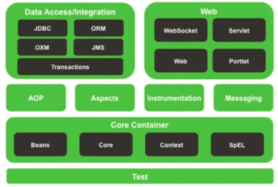
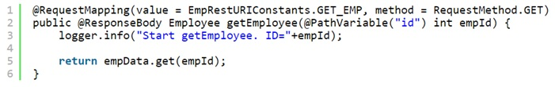

# Spring


---


- [Spring и его компоненты](#Spring-и-его-компоненты)
    - [AOP](src/main/java/kovteba/aop)
    - [Spring Data](src/main/java/kovteba/springdata)
    - [Spring MVC](src/main/java/kovteba/springmvc)
    - [Spring Security](src/main/java/kovteba/springsecurity)
- [Особенности и преимуществ Spring Framework](#Особенности-и-преимуществ-Spring-Framework)
- [Java Naming and Directory Interface](#Java-Naming-and-Directory-Interface)
- [Enterprise Java Beans](#Enterprise-Java-Beans)
- [Spring Bean](#Spring-Bean)
- [Dependency injection](#Dependency-injection)
- [ApplicationContext Spring](#ApplicationContext-Spring)
    - [Создание ApplicationContext](#Создание-ApplicationContext)
- [IoC контейнеры](#IoC-контейнеры)
- [Шаблоны проектирования в Spring Framework](#Шаблоны-проектирования-в-Spring-Framework)
- [Аннотации Spring](#Аннотации-Spring)
    - [@ResponceBody](#@ResponceBody)
    - [@RequestBody](#@RequestBody)
    - [@RestController](#@RestController)
    - [@ResponseStatus](#@ResponseStatus)
    - [Cache](#)
        - [@Cacheable](#@Cacheable)
        - [@CachePut](#@CachePut)
        - [@CacheEvict](#@CacheEvict)
        - [@Caching](#@Caching)
        - [@CacheConfig](#@CacheConfig)
- [Разница между аннотациями @Component, @Repository и @Service](#Разница-между-аннотациями-@Component,-@Repository-и-@Service)
- [MultipartResolver](#MultipartResolver)


- [Как получить объекты ServletContext и ServletConfig внутри Spring Bean?](#Как-получить-объекты-ServletContext-и-ServletConfig-внутри-Spring-Bean?)
- [Можем ли мы иметь несколько файлов конфигурации Spring?](#Можем-ли-мы-иметь-несколько-файлов-конфигурации-Spring?)
- [Каким образом можно управлять транзакциями в Spring?](#Каким-образом-можно-управлять-транзакциями-в-Spring?)
- [Каким образом Spring поддерживает DAO?](#Каким-образом-Spring-поддерживает-DAO?)
- [Как мы можем использовать Spring для создания веб-службы RESTful, возвращающей JSON?](#Как-мы-можем-использовать-Spring-для-создания-веб-службы-RESTful,-возвращающей-JSON?)
- [Как проверить (валидировать) данные формы в Spring Web MVC Framework?](#Как-проверить-(валидировать)-данные-формы-в-Spring-Web-MVC-Framework?)
- [Repository](#Repository)
- [](#)


---


## Spring и его компоненты
__Spring__ - фреймворк с открытым исходным кодом, предназначеный для упрощения разработки enterprise-приложений. 
Одним из главным преимуществом Spring является его слоистая архитектура, позволяющая вам самим определять какие 
компоненты будут использованы в вашем приложении. Модули Spring построены на базе основного контейнера, который 
определяет создание, конфигурация и менеджмент бинов.



Основные модули:  
- Основной контейнер - предоставляет основной функционал Spring. Главным компонентом контейнера является 
    __BeanFactory__ - реализация паттерна Фабрика. BeanFactory позволяет разделить конфигурацию приложения и 
    информацию о зависимостях от кода.
- __Spring context__ - конфигурационный файл, который предоставляет информация об окружающей среде для Spring. 
    Сюда входят такие enterprise-сервисы, как JNDI, EJB, интернационализация, валиадция и т.п.
- [__Spring AOP__](src/main/java/kovteba/aop) - отвечает за интеграцию аспектно-ориентированного программирования 
    во фреймворк. Spring AOP обеспечивает сервис управления транзакциями для Spring-приложения.
- __Spring DAO__ - абстрактный уровень Spring JDBC DAO предоставляет иерархию исключений и множество сообщений об 
    ошибках для разных БД. Эта иерархия упрощает обработку исключений и значительно уменьшает количество кода, 
    которое вам нужно было бы написать для таких операций, как, например, открытие и закрытие соединения.
- __Spring ORM__ - отвечает за интеграцию Spring и таких популярных ORM-фреймворков, как Hibernate, iBatis и JDO.
- __Spring Web module__ - классы, которые помогают упростить разработку Web (авторизация, доступ к бинам Spring-а из web).
- [__Spring MVC framework__](src/main/java/kovteba/springmvc) - реализация паттерна MVC для построения Web-приложений.

---

## Особенности и преимуществ Spring Framework
__Spring Framework__ обеспечивает решения многих задач, с которыми сталкиваются Java-разработчики и организации, 
которые хотят создать информационную систему, основанную на платформе Java. Из-за широкой функциональности трудно 
определить наиболее значимые структурные элементы, из которых он состоит. Spring Framework не всецело связан с 
платформой Java Enterprise, несмотря на его масштабную интеграцию с ней, что является важной причиной его популярности.
- Относительная легкость в изучении и применении фреймворка в разработке и поддержке приложения.
- Внедрение зависимостей (DI) и инверсия управления (IoC) позволяют писать независимые друг от друга компоненты, 
    что дает преимущества в командной разработке, переносимости модулей и т.д..
- Spring IoC контейнер управляет жизненным циклом Spring Bean и настраивается наподобие JNDI  lookup (поиска).
- Проект Spring содержит в себе множество подпроектов, которые затрагивают важные части создания софта, такие 
    как вебсервисы, веб программирование, работа с базами данных, загрузка файлов, обработка ошибок и многое другое. 
    Всё это настраивается в едином формате и упрощает поддержку приложения.
    
---
    
## Java Naming and Directory Interface
__Java Naming and Directory Interface (JNDI)__ — это набор Java API, организованный в виде службы каталогов, 
который позволяет Java-клиентам открывать и просматривать данные и объекты по их именам. Как любое другое Java API, 
как набор интерфейсов, JNDI не зависит от нижележащей реализации. В дополнению к этому, он предоставляет реализацию 
__service provider interface (SPI)__, которая позволяет службам каталогов работать в паре с каким-либо фреймворком. 
Это может быть сервер, файл или база данных.

Концепция JNDI основана на двух основных определениях: ассоциация и контекст.    
__Ассоциация__ (англ. binding) — это соответствие JNDI-имени и объекта.   
__Контекст__ (англ. context) — это среда, в которой хранится набор ассоциаций между объектами и именами.

---

## Enterprise Java Beans
__EJB (Enterprise Java Beans)__ – это фреймворк для построение бизнес-логики приложения.

---

## Spring Bean
Термин [__бин__](src/main/java/kovteba/dependencyinjectionbeans) (англ. Bean) - в Spring 
используется для ссылки на любой компонент, управляемый контейнером. 
Обычно бины на определенном уровне придерживаются спецификации JavaBean, но это не обязательно особенно если 
для связывания бинов друг с другом планируется применять Constructor Injection. Для получения экземпляра бина 
используется ApplicationContext. IoC контейнер управляет жизненным циклом спринг бина, областью видимости и внедрением.

---

## Dependency injection
[__Внедрение зависимости__](src/main/java/kovteba/dependencyinjectionbeans) (англ. Dependency injection, DI) — 
процесс предоставления внешней зависимости программному компоненту. Является специфичной формой «инверсии 
управления» (англ. Inversion of control, IoC), когда она применяется к управлению зависимостями. В полном 
соответствии с принципом единственной обязанности объект отдаёт заботу о построении требуемых ему зависимостей 
внешнему, специально предназначенному для этого общему механизму.

---

## ApplicationContext Spring
В то время, как BeanFactory используется в простых приложениях, Application Context - это более сложный контейнер. 
Как и BeanFactory он может быть использован для загрузки и связывания бинов, но еще он предоставляет:
- возможность получения текстовых сообщений, в том числе поддержку интернационализации;
- общий механизм работы с ресурсами;
- события для бинов, которые зарегестрированы как слушатели.  
Из-за большей функциональности рекомендуется использование Application Context вместо BeanFactory. Последний 
используется только в случаях нехватки ресурсов, например при разработке для мобильных устройств

---

## Создание ApplicationContext
В независимой Java программе ApplicationContext можно создать следующим образом:
`AnnotationConfigApplicationContext` - при использовании Spring в качестве автономного приложения можно создать 
инициализировать контейнер с помощью аннотаций.   
Пример:
```java
ApplicationContext context = new ApplicationConfigApplicatoinContext("bean.xml");
```
`ClassPathXmlApplicationContext` - получает информацию из xml-файла, находящегося в classpath.   
Пример:
```java
ApplicationContext context = new ClassPathXmlApplicatoinContext("bean.xml");
```
`FileSystemXmlApplicationContext` - получает информацию из xml-файла, но с возможностью загрузки файла конфигурации 
из любого места файловой системы.   
Пример:
```java
ApplicationContext context = new FileSystemXmlApplicatoinContext("bean.xml");
```
`XmlWebApplicationContext` - получает информацию из xml-файла за пределами web-приложения.

`AnnotationConfigApplicationContext` используется при конфигурировании приложения про помощи java code.
Пример:
```java
AnnotationConfigApplicationContext context = new AnnotationConfigApplicationContext(BeanConfig.class);
```
`GenericXmlApplicationContext` при конфигурации приложения аннотацияи.
Пример:
```java
GenericXmlApplicationContext context = new GenericXmlApplicationContext();
```

---
    
## IoC контейнеры
Spring является IoC контейнером. Помимо него существуют HiveMind, Avalon, PicoContainer и т.д.

---

## Шаблоны проектирования в Spring Framework
Spring Framework использует множество шаблонов проектирования, например:
- __Singleton Pattern__: Creating beans with default scope.
- __Factory Pattern__: Bean Factory classes
- __Prototype Pattern__: Bean scopes
- __Adapter Pattern__: Spring Web and Spring MVC
- __Proxy Pattern__: Spring Aspect Oriented Programming support
- __Template Method Pattern__: JdbcTemplate, HibernateTemplate etc
- __Front Controller__: Spring MVC DispatcherServlet
- __Data Access Object__: Spring DAO support
- __Dependency Injection and Aspect Oriented Programming__

---

## Аннотации Spring
- `@Controller` - класс фронт контроллера в проекте Spring MVC.
- `@RequestMapping` - позволяет задать шаблон маппинга URI в методе обработчике контроллера.
- `@ResponseBody` - позволяет отправлять Object в ответе. Обычно используется для отправки данных формата XML или JSON.
- `@PathVariable` - задает динамический маппинг значений из URI внутри аргументов метода обработчика.
- `@Autowired` - используется для автоматического связывания зависимостей в spring beans.
- `@Qualifier` - используется совместно с @Autowired для уточнения данных связывания, когда возможны коллизии (например 
    одинаковых имен\типов).
- `@Service` - указывает что класс осуществляет сервисные функции.
- `@Scope` - указывает scope у spring bean.
- `@Configuration`, `@ComponentScan` и `@Bean` - для java based configurations.
- AspectJ аннотации для настройки aspects и advices, `@Aspect`, `@Before`, `@After`, `@Around`, `@Pointcut` и др.

---

## @ResponceBody
__@ResponceBody__ - Указывает что возвращаемое значение метода должно быть связано с телом ответа

---

## @RequestBody
__@RequestBody__ - Указывает, что параметр метода должен быть свящан с телом запроса. Тело запроса пропускается 
через `HttpMessageConverter` для определения аргумента метода в зависимости от типа содержимого запроса.

---

## @RestController
__@RestController__– композиция аннотаций `@Controller` и `@ResponseBody`.   
Используя данную аннотацию `@ResponseBody` добавляется автоматически перед каждым методом класса, аннотированного 
аннотацией `@RestController`.

---

## @ResponseStatus
@ResponseStatus – помечает метод или класс исключения кодом статуса,
который должен быть возвращен.

---

## @Cacheable
`@Cacheable` - указывает, что результат выполнения аннотируемого метода кэшируется. Последующие вызовы метода 
с теми же аргументами по факту не вызывают метод, а результат возвращается из кэша. В параметрах аннотации 
указывается имя кэша.

---

## @CachePut
`@CachePut` - указывает, что нужно обновить кэш, не вмешиваясь в работу метода (вызова метода). Обычно 
используется при вызове метода, который меняет данные во внешнем источнике.

---

## @CacheEvict
`@CacheEvict` - аннотирует метод, который очищает кэш.

---

## @Caching
`@Caching`- если нужно использовать сразу несколько аннотаций (таких как `@CacheEvict`, `@CachePut`, `@Cacheable`), 
например, когда определение кэша, в который нужно положить результат вызова метода, зависит от условия ключа.

---

## @CacheConfig
`@CacheConfig` - предоставляет механизм распространения общих настроек для всех кэшируемых операций класса.

---

## Разница между аннотациями @Component, @Repository и @Service
- `@Component` - используется для указания класса в качестве компонента spring. При использовании поиска аннотаций, 
    такой класс будет сконфигурирован как spring bean.
- `@Controller` - специальный тип класса, применяемый в MVC приложениях. Обрабатывает запросы и часто используется 
    с аннотацией `@RequestMapping`.
- `@Repository` - указывает, что класс используется для работы с поиском, получением и хранением данных. Аннотация 
    может использоваться для реализации шаблона DAO.
- `@Service` - указывает, что класс является сервисом для реализации бизнес логики (на самом деле не отличается 
    от `@Component`, но просто помогает разработчику указать смысловую нагрузку класса).
- Для указания контейнеру на класс-бин можно использовать любую из этих аннотаций. Но различные имена позволяют 
    различать назначение того или иного класса.
    
---

## MultipartResolver
Интерфейс `MultipartResolver` используется для загрузки файлов. Существуют две реализации: `CommonsMultipartResolver` 
и `StandardServletMultipartResolver`, которые позволяют фреймворку загружать файлы. По умолчанию этот интерфейс 
не включается в приложении и необходимо указывать его в файле конфигурации. После настройки любой запрос о 
загрузке будет отправляться этому интерфейсу.


---


## Как получить объекты ServletContext и ServletConfig внутри Spring Bean?
Доступны два способа для получения основных объектов контейнера внутри бина:
- Реализовать один из Spring*Aware (ApplicationContextAware, ServletContextAware, ServletConfigAware и др.) интерфейсов.
- Использовать автоматическое связывание @Autowired в спринг. Способ работает внутри контейнера спринг.
```java
@Autowired
ServletContext servletContext
```


## Можем ли мы иметь несколько файлов конфигурации Spring?
С помощью указания contextConfigLocation можно задать несколько файлов конфигурации Spring. Параметры указываются 
через запятую или пробел.

## Каким образом можно управлять транзакциями в Spring?
Транзакциями в Spring управляют с помощью __Declarative Transaction Management__ (программное управление). 
Используется аннотация `@Transactional` для описания необходимости управления транзакцией. В файле конфигурации 
нужно добавить настройку transactionManager для DataSource.

## Каким образом Spring поддерживает DAO?
Spring DAO предоставляет возможность работы с доступом к данным с помощью технологий вроде JDBC, Hibernate в 
удобном виде. Существуют специальные классы: JdbcDaoSupport, HibernateDaoSupport, JdoDaoSupport, JpaDaoSupport.  

Класс `HibernateDaoSupport` является подходящим суперклассом для Hibernate DAO. Он содержит методы для получения 
сессии или фабрики сессий. Самый популярный метод - getHibernateTemplate(), который возвращает HibernateTemplate. 
Этот темплейт оборачивает checked-исключения Hibernate в runtime-исключения, позволяя вашим DAO оставаться 
независимыми от исключений Hibernate.   


## Как мы можем использовать Spring для создания веб службы RESTful, возвращающей JSON?
Spring Framework позволяет создавать Resful веб сервисы и возвращать данные в формате JSON. Spring обеспечивает 
интеграцию с Jackson JSON API для возможности отправки JSON ответов в resful web сервисе. Для отправки ответа в 
формате JSON из Spring MVC приложения необходимо произвести следующие настройки:   
Добавить зависимости Jackson JSON. С помощью maven это делается так:   
   
Настроить бин RequestMappingHandlerAdapter в файле конфигурации Spring и задать свойство messageConverters на 
использование бина MappingJackson2HttpMessageConverter.  
  
В контроллере указать с помощью аннотации @ResponseBody возвращение Object:  


## Как проверить (валидировать) данные формы в Spring Web MVC Framework?
Spring поддерживает аннотации валидации из __JSR-303__, а так же возможность создания своих реализаций классов 
валидаторов.  
Пример использования аннотаций:  


## Repository
```
Repository
    CrudRepository
        PagingAndSortingRepository
            JpaRepository extends QueryByExampleExecutor
```
- `Repository` - Центральный интерфейс Spring Data  выступает в роли маркера
- `CrudRepository` - репозтторий представляющий CRUD функционал
- `PagingAndSortedRepositpry` - доп функционал по сортировке и пагинации данных
- `JpaRepository` - представляющий специфический для Java Persistance API функционал


