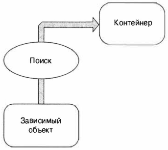
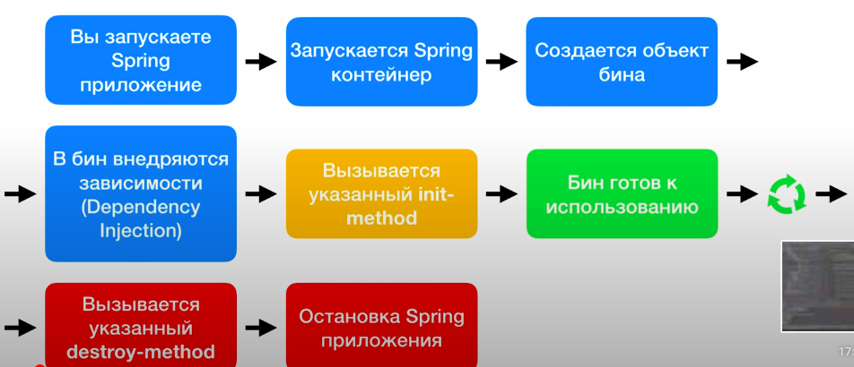

# Dependency injection, Bean, IoC


- [Концепции инверсии управления](#Концепции-инверсии-управления)
- [Dependency Lookup](#Dependency-Lookup)
    - [Dependency Pull](#Dependency-Pull)
    - [Contextualized Dependency](#Contextualized-Dependency)
- [Dependency lnjection](#Dependency-lnjection)
    - [Constructor Dependency lnjection](#Constructor Dependency lnjection)
    - [Setter Dependency lnjection](#Setter-Dependency-lnjection)
- [](#)
- [](#)

---
- [Объясните суть паттерна DI или IoC](#Объясните-суть-паттерна-DI-или-IoC)
- [Какие преимущества применения Dependency Injection (DI)?](#Какие-преимущества-применения-Dependency-Injection-(DI)?)
- [Что такое IoC контейнер Spring?](#Что-такое-IoC-контейнер-Spring?)
- [Что такое Spring бин?](#Что-такое-Spring-бин?)
- [Какое значение имеет конфигурационный файл Spring Bean?](#Какое-значение-имеет-конфигурационный-файл-Spring-Bean?)
- [Каковы различные способы настроить класс как Spring Bean?](#Каковы-различные-способы-настроить-класс-как-Spring-Bean?)
- [Какие вы знаете различные scope у Spring Bean?](#Какие-вы-знаете-различные-scope-у-Spring-Bean?)
- [Что такое жизненный цикл Spring Bean?](#Что-такое-жизненный-цикл-Spring-Bean?)
- [BeanFactory в Spring](#BeanFactory-в-Spring)
- [Как реализуется DI в Spring Framework?](#Как-реализуется-DI-в-Spring-Framework?)
- [Какие существуют виды DI? Приведите примеры.](#Какие-существуют-виды-DI?-Приведите-примеры.)
- [Что такое связывание в Spring и расскажите об аннотации @Autowired?](#Что-такое-связывание-в-Spring-и-расскажите-об-аннотации-@Autowired?)
- [Каковы различные типы автоматического связывания в Spring?](#Каковы-различные-типы-автоматического-связывания-в-Spring?)
- [Constructor](#Constructor)
- [Setter](#Setter)
- [Add list](#Add-list)
- [File Properties](#File-Properties)
- [@Component](#@Component)
- [@Autowired](#@Autowired)
    - [Поля](#Поля)
    - [Сетер](#Сетер)
    - [Конструктор](#Конструктор)
- [@Qualifier](#@Qualifier)
- [@PostConstruct](#@PostConstruct)
- [@PreDestroy](#@PreDestroy)
- [](#)


## Концепции инверсии управления
Разновидности LоС, включают пассивную инверсию зависимостей, или внедрение зависимостей (_Dependency Injection_), 
и активную инверсию зависимостей, или поиск зависимостей (_Dependency Lookup_).

## Dependency Lookup

- Dependency Pull (Извлечение зависимостей)
- Contextualized Dependency Lookup (Контекстуализированный поиск зависимостей), или CDL

### Dependency Pull
```java
import org.springframework.context.ApplicationContext;
import org.springframework.context.support.ClassPathXmlApplicationContext;
puЬlic class DependencyPull [
   puЬlic static void main (String [] args) {
      ApplicationContext ctx = new ClassPathXmlApplicationContext("META-INF/spring/app-context.xml");
      MessageRenderer mr = ctx.getBean ( "renderer", MessageRenderer. class);
      mr.render();
   }
}
```

### Contextualized Dependency

## Dependency lnjection

- Constructor Dependency Injection (Внедрение зависимостей через конструктор)
- Setter Dependency Injection (Внедрение зависимостей через метод установки).

### Constructor Dependency lnjection
### Setter-Dependency-lnjection


---

## Объясните суть паттерна DI или IoC
__Dependency injection (DI)__ - паттерн проектирования и архитектурная модель, так же известная как 
__Inversion of Control (IoC)__. DI описывает ситуацию, когда один объект реализует свой функционал через 
другой объект. Например, соединение с базой данных передается конструктору объекта через аргумент, 
вместо того чтобы конструктор сам устанавливал соединение. Существуют три формы внедрения (но не типа) 
зависимостей: сэттер, конструктор и внедрение путем интерфейса.   
DI - это способ достижения слабой связанности. IoC предоставляет возможность объекту получать ссылки на 
свои зависимости. Обычно это реализуется через lookup-метод. Преимущество IoC в том, что эта модель позволяет 
отделить объекты от реализации механизмов, которые он использует. В результате мы получаем большую гибкость 
как при разработке приложений, так и при их тестировании.

## Какие преимущества применения Dependency Injection (DI)?
К преимуществам DI можно отнести:  
- Сокращение объема связующего кода. Одним из самых больших плюсов DI является возможность значительного сокращения 
    объема кода, который должен быть написан для связывания вместе различных компонентов приложения. Зачастую 
    этот код очень прост - при создании зависимости должен создаваться новый экземпляр соответствующего объекта.
- Упрощенная конфигурация приложения. За счет применения DI процесс конфигурирования приложения значительно упрощается. 
    Для конфигурирования классов, которые могут быть внедрены в другие классы, можно использовать аннотации или XML-файлы.
- Возможность управления общими зависимостями в единственном репозитории. При традиционном подходе к управлению 
    зависимостями в общих службах, к которым относятся, например, подключение к источнику данных, транзакция, 
    удаленные службы и т.п., вы создаете экземпляры (или получаете их из определенных фабричных классов) 
    зависимостей там, где они нужны - внутри зависимого класса. Это приводит к распространению зависимостей 
    по множеству классов в приложении, что может затруднить их изменение. В случае использования DI вся информация 
    об общих зависимостях содержится в единственном репозитории (в Spring есть возможность хранить эту информацию 
    в XML-файлах или Java классах).
- Улучшенная возможность тестирования. Когда классы проектируются для DI, становится возможной простая замена 
    зависимостей. Это особенно полезно при тестировании приложения.
- Стимулирование качественных проектных решений для приложений. Вообще говоря, проектирование для DI означает 
    проектирование с использованием интерфейсов. Используя Spring, вы получаете в свое распоряжение целый ряд 
    средств DI и можете сосредоточиться на построении логики приложения, а не на поддерживающей DI платформе
    
## Что такое IoC контейнер Spring?
По своей сути __IoC__, а, следовательно, и __DI__, направлены на то, чтобы предложить простой механизм для 
предоставления зависимостей компонента (часто называемых коллабораторами объекта) и управления этими зависимостями 
на протяжении всего их жизненного цикла. Компонент, который требует определенных зависимостей, зачастую называют 
зависимым объектом или, в случае IoC, целевым объектом. IoC предоставляет службы, через которые компоненты могут 
получать доступ к своим зависимостям, и службы для взаимодействия с зависимостями в течение их времени жизни. 
В общем случае IoC может быть расщеплена на два подтипа: инверсия управления (Dependency Injection) и инверсия 
поиска (Dependency Lookup).   
__Инверсия управления__ — это крупная часть того, что делает Spring, и ядро реализации Spring основано на инверсии 
управления, хотя также предоставляются и средства Dependency Lookup. Когда платформа Spring предоставляет 
коллабораторы зависимому объекту автоматически, она делает это с использованием инверсии управления 
(Dependency Injection). В приложении, основанном на Spring, всегда предпочтительнее применять Dependency Injection 
для передачи коллабораторов зависимым объектам вместо того, чтобы заставлять зависимые объекты получать 
коллабораторы через поиск.

## Что такое Spring бин?
Термин __бин__ (англ. Bean) - в Spring используется для ссылки на любой компонент, управляемый контейнером. 
Обычно бины на определенном уровне придерживаются спецификации JavaBean, но это не обязательно особенно если 
для связывания бинов друг с другом планируется применять Constructor Injection. Для получения экземпляра бина 
используется ApplicationContext. IoC контейнер управляет жизненным циклом спринг бина, областью видимости и внедрением.

## Какое значение имеет конфигурационный файл Spring Bean?
Конфигурационный файл спринг определяет все бины, которые будут инициализированы в Spring Context. При создании 
экземпляра Spring ApplicationContext будет прочитан конфигурационный xml файл и выполнены указанные в нем 
необходимые инициализации. Отдельно от базовой конфигурации, в файле могут содержаться описание перехватчиков 
(interceptors), view resolvers, настройки локализации и др...

## Каковы различные способы настроить класс как Spring Bean?
Существует несколько способов работы с классами в Spring:
XML конфигурация:
```xml
<bean name="myBean" class="kovteba.beans.MyBean"></bean>
```
Java based конфигурация. Все настройки и указания бинов прописываются в java коде:
```java
@Configuration
@ComponentScan
public class MyConfiguration {
   
   @Bean
   public MyService getService(){
      return new MyService();
   }
}
```
Для извлечения бина из контекста используется следующий подход:
```java
AnnotationConfigApplicationContext ctx = new AnnotationConfigApplicationContext(MyConfiguration.class );
MyService service = ctx.getBean(MyService.class );
```
Annotation based конфигурация. Можно использовать внутри кода аннотации @Component, @Service, @Repository, 
@Controller для указания классов в качестве спринг бинов. Для их поиска и управления контейнером прописывается 
настройка в xml файле:
```xml
<context:component-scan base-package="kovteba.beans"/>
```

## Какие вы знаете различные scope у Spring Bean?
В Spring предусмотрены различные области времени действия бинов:
- __Singleton__  может быть создан только один экземпляр бина. Этот тип используется спрингом по умолчанию, если 
    не указано другое. Следует осторожно использовать публичные свойства класса, т.к. они не будут потокобезопасными.
- __prototype__  создается новый экземпляр при каждом запросе.
    destroy метод не вызывается
- __request__   аналогичен prototype, но название служит пояснением к использованию бина в веб приложении. 
    Создается новый экземпляр при каждом HTTP request.
- __session__  новый бин создается в контейнере при каждой новой HTTP сессии.
- __global-session__: используется для создания глобальных бинов на уровне сессии для Portlet  приложений.

## Что такое жизненный цикл Spring Bean?
  
__Жизненный цикл Spring бина__  время существования класса. Spring бины инициализируются при инициализации Spring 
контейнера и происходит внедрение всех зависимостей. Когда контейнер уничтожается, то уничтожается и всё содержимое. 
Если нам необходимо задать какое-либо действие при инициализации и уничтожении бина, то нужно воспользоваться 
методами `init()` и `destroy()`. Для этого можно использовать аннотации `@PostConstruct` и `@PreDestroy`.
```java
@PostConstruct
public void init(){
   System.out.println("INIT")
}
@PreDestroy
public void destroy(){
   System.out.println("DESTROY")
}
```
Или через xml конфигурацию:
```xml
<bean name="myBean" class="kovteba.MyBean" init-method="init" destroy-method="destroy">
    <property name="someProp" ref="someProp"></property>
</bean>
```

## BeanFactory в Spring
__BeanFactory__ - это реализация паттерна Фабрика, его функицональность покрывает создание бинов. Так как эта 
фабрика знает многие об объектах приложения, то она может создавать связи между объектами на этапе создания 
экземпляра. Существует несколько реализаций BeanFactory, самая используемся -  
"org.springframework.beans.factory.xml.XmlBeanFactory". Она загружает бины на основе конфигурационного XML-файла. 
Чтобы создать XmlBeanFactory передайте конструктору InputStream, например:
```java
BeanFactory factory = new XmlBeanFactory(new FileInputStream("myBean.xml"));
```
После этой строки фабрика знает о бинах, но их экземпляры еще не созданы. Чтобы инстанцировать бин нужно вызвать 
метод `getBean()`. Например:
```java
MyBean bean = (MyBean) factory.getBean("myBean"); 
```

## Как реализуется DI в Spring Framework?
Реализация __DI__ в __Spring__ основана на двух ключевых концепциях Java - компонентах JavaBean и интерфейсах. При 
использовании Spring в качестве поставщика DI вы получаете гибкость определения конфигурации зависимостей 
внутри своих приложений разнообразными путями (т.е. внешне в XML-файлах, с помощью конфигурационных Java 
классов Spring или посредством аннотаций Java в коде). Компоненты JavaBean (также называемые __POJO__ (Plain Old Java 
Object — простой старый объект Java)) предоставляют стандартный механизм для создания ресурсов Java, которые 
являются конфигурируемыми множеством способов. За счет применения DI объем кода, который необходим при 
проектировании приложения на основе интерфейсов, снижается почти до нуля. Кроме того, с помощью интерфейсов 
можно получить максимальную отдачу от DI, потому что бины могут использовать любую реализацию интерфейса для 
удовлетворения их зависимости.

## Какие существуют виды DI? Приведите примеры.
Существует два типа DI: через сэттер и через конструктор.
Через сэттер: обычно во всех java beans используются гэттеры и сэттеры для их свойств:  
```java
class NameBean {
   String name;
   public void setName(String s){
      name = a;
   }
   public String getName(){
      return name;
   }
}
```
Мы создаем экземпляр бина NameBean (например, bean1) и устанавливаем нужное свойство, например:
```java
bean1.setName("Marfa");
```
Используя Spring реализация была бы такой:
```xml
<bean id="bean1" class="NameBean">
    <property name="name">
        <value>Marfa</value>
    </property>
</bean>
```
Это и называет DI через сэттер.   
Пример внедрения зависимости между объектами:
```xml
<bean id="bean1" class="bean1impl">
    <property name="game">
        <ref bean="bean2"/>
    </property>
</bean>
<bean id="bean2" class="bean2impl"/>
```
Через конструктор: используется конструктор с параметрами. Например:
```java
class NameBean {
   String name;
   public NameBean(String name){
      this.name = name;
   }
}
bean1 = new NameBean("NAME");
```
Используя Spring это выглядело бы так:
```xml
<bean id="bean1" class="bean1impl">
    <constructor-arg>
        <value>Marfa</value>
    </constructor-arg>
</bean>
```

## Что такое связывание в Spring и расскажите об аннотации @Autowired?
Процесс внедрения зависимостей в бины при инициализации называется Spring Bean Wiring. Считается хорошей практикой 
задавать явные связи между зависимостями, но в Spring предусмотрен дополнительный механизм связывания @Autowired. 
Аннотация может использоваться над полем или методом для связывания по типу. Чтобы аннотация заработала, необходимо 
указать небольшие настройки в конфигурационном файле спринг с помощью элемента context:annotation-config.

## Каковы различные типы автоматического связывания в Spring?
Существует четыре вида связывания в спринг:
- autowire byName
- autowire byType
- autowire by constructor
- autowiring by @Autowired and @Qualifier annotations

## Constructor
```java
public class MusicPlayer {

   private Music music;
   private int value;

   // IoC
   public MusicPlayer(Music music, int value) {
      this.music = music;
      this.value = value;
   }

   public void playMusic(){
      System.out.println("Playing: " + music.getSong());
   }

   public int getValue() {
      return value;
   }

   public void setValue(int value) {
      this.value = value;
   }
}
```
```xml
<?xml version="1.0" encoding="UTF-8"?>
<beans xmlns="http://www.springframework.org/schema/beans"
       xmlns:xsi="http://www.w3.org/2001/XMLSchema-instance"
       xmlns:context="http://www.springframework.org/schema/context"
       xmlns:util="http://www.springframework.org/schema/util"
       xsi:schemaLocation="http://www.springframework.org/schema/beans
        http://www.springframework.org/schema/beans/spring-beans.xsd
        http://www.springframework.org/schema/context
        http://www.springframework.org/schema/context/spring-context.xsd
        http://www.springframework.org/schema/util
        http://www.springframework.org/schema/util/spring-util-2.5.xsd">

    <bean id="classicMusicBean" class="kovteba.dependencyinjectionbeans.xmlexamples.example1constructor.ClassicalMusic"/>

    <bean id="musicPlayer" class="kovteba.dependencyinjectionbeans.xmlexamples.example1constructor.MusicPlayer">
        <constructor-arg index="0" ref="classicMusicBean"/>
        <constructor-arg index="1" value="120"/>
    </bean>
    
</beans>
```
```java
public class Lesson1App {
   public static void main(String[] args) {
      ClassPathXmlApplicationContext context = new ClassPathXmlApplicationContext("applicationContext.xml");
      MusicPlayer musicPlayer = context.getBean("musicPlayer", MusicPlayer.class);
      musicPlayer.playMusic();
      System.out.println(musicPlayer.getVolume());
      context.close();
   }
}
```

## Setter
```java
public class MusicPlayer {

   private Music music;
   private int volume;

   public void playMusic(){
      System.out.println("Playing: " + music.getSong());
   }

   public Music getMusic() { return music; }

   public void setMusic(Music music) { this.music = music; }

   public int getVolume() { return volume; }

   public void setVolume(int volume) { this.volume = volume; }
}
```
```xml
<?xml version="1.0" encoding="UTF-8"?>
<beans xmlns="http://www.springframework.org/schema/beans"
       xmlns:xsi="http://www.w3.org/2001/XMLSchema-instance"
       xmlns:context="http://www.springframework.org/schema/context"
       xmlns:util="http://www.springframework.org/schema/util"
       xsi:schemaLocation="http://www.springframework.org/schema/beans
        http://www.springframework.org/schema/beans/spring-beans.xsd
        http://www.springframework.org/schema/context
        http://www.springframework.org/schema/context/spring-context.xsd
        http://www.springframework.org/schema/util
        http://www.springframework.org/schema/util/spring-util-2.5.xsd">

    <bean id="classicMusicBean" class="kovteba.dependencyinjectionbeans.xmlexamples.example2setter.ClassicalMusic"/>
    <bean id="musicPlayer" class="kovteba.dependencyinjectionbeans.xmlexamples.example2setter.MusicPlayer">
        <property name="volume" value="130"/>
        <property name="music" ref="classicMusicBean"/>
    </bean>

</beans>
```
```java
public class Lesson1App {
   public static void main(String[] args) {
      ClassPathXmlApplicationContext context = new ClassPathXmlApplicationContext("applicationContext.xml");
      MusicPlayer musicPlayer = context.getBean("musicPlayer", MusicPlayer.class);
      musicPlayer.playMusic();
      System.out.println(musicPlayer.getVolume());
      context.close();
   }
}
```

## Add list
```java
public class MusicPlayer {

   private List<Music> musicList = new ArrayList<>();

   public void playMusicList(){
      for (Music s : musicList){
         System.out.println("Playing: " + s.getSong());
      }
   }

   public List<Music> getMusicList() { return musicList; }

   public void setMusicList(List<Music> musicList) { this.musicList = musicList; }
}
```
```xml
<?xml version="1.0" encoding="UTF-8"?>
<beans xmlns="http://www.springframework.org/schema/beans"
       xmlns:xsi="http://www.w3.org/2001/XMLSchema-instance"
       xmlns:context="http://www.springframework.org/schema/context"
       xmlns:util="http://www.springframework.org/schema/util"
       xsi:schemaLocation="http://www.springframework.org/schema/beans
        http://www.springframework.org/schema/beans/spring-beans.xsd
        http://www.springframework.org/schema/context
        http://www.springframework.org/schema/context/spring-context.xsd
        http://www.springframework.org/schema/util
        http://www.springframework.org/schema/util/spring-util-2.5.xsd">

    <bean id="classicMusicBean" class="kovteba.dependencyinjectionbeans.xmlexamples.example3addlist.ClassicalMusic"/>
    <bean id="rockMusicBean" class="kovteba.dependencyinjectionbeans.xmlexamples.example3addlist.RockMusic"/>

    <bean id="musicPlayer" class="kovteba.dependencyinjectionbeans.xmlexamples.example3addlist.MusicPlayer">
        <property name="musicList">
            <list value-type="kovteba.dependencyinjectionbeans.xmlexamples.example3addlist.Music">
                <ref bean="classicMusicBean"/>
                <ref bean="rockMusicBean"/>
            </list>
        </property>
    </bean>

</beans>
```
```java
public class Example3App {
   public static void main(String[] args) {
      ClassPathXmlApplicationContext context = new ClassPathXmlApplicationContext("applicationContext.xml");
      MusicPlayer musicPlayer = context.getBean("musicPlayer", MusicPlayer.class);
      musicPlayer.playMusicList();
      context.close();
   }
}
```

## File Properties
```xml
<?xml version="1.0" encoding="UTF-8"?>
<beans xmlns="http://www.springframework.org/schema/beans"
       xmlns:xsi="http://www.w3.org/2001/XMLSchema-instance"
       xmlns:context="http://www.springframework.org/schema/context"
       xmlns:util="http://www.springframework.org/schema/util"
       xsi:schemaLocation="http://www.springframework.org/schema/beans
        http://www.springframework.org/schema/beans/spring-beans.xsd
        http://www.springframework.org/schema/context
        http://www.springframework.org/schema/context/spring-context.xsd
        http://www.springframework.org/schema/util
        http://www.springframework.org/schema/util/spring-util-2.5.xsd">

    <context:property-placeholder location="classpath:musicPlayer.properties"/>

    <bean id="musicPlayer" class="kovteba.dependencyinjectionbeans.xmlexamples.example2setter.MusicPlayer">
        <property name="volume" value="${music.Player.volume}"/>
    </bean>

</beans>
```

## @Component
`@Component` - сканирует выделеный пакет в поисках данной анотоции и инициализирует Beans

Добавить в ApplicationContext.xml
```xml
<context:component-scan base-package="kovteba"/>
```

## @Autowired
Применимо к :
- Полям
- Сетерам
- Конструкторам

### Поля
Анотация `@Autowired` внедряет зависимости в `private` поля, даже если нет конструктора или сетера. (Reflection)

Но внедрение через поля является Bad Practice. 

При внедрении прямо в поля вы не предоставляете прямого способа создания экземпляра класса со всеми 
необходимыми зависимостями. Это означает, что:    
- Существует способ (путем вызова конструктора по-умолчанию) создать объект с использованием new в состоянии, 
    когда ему не хватает некоторых из его обязательных зависимостей, и использование приведет к NullPointerException
- Такой класс не может быть использован вне DI-контейнеров (тесты, другие модули) и нет способа кроме рефлексии 
    предоставить ему необходимые зависимости
    
__Неизменность__     
В отличие от способа с использованием конструктора, внедрение через поля не может использоваться для присвоения 
зависимостей `final`-полям, что приводит к тому, что ваши объекты становятся изменяемыми

### Сетер
Сеттеры следует использовать для инъекций опциональных зависимостей. Класс должен быть способен функционировать, 
даже если они не были предоставлены. Зависимости могут быть изменены в любое время после создания объекта. 

Официальная рекомендация из документации по Spring 3.x поощряет использование сеттеров над конструкторами:  
>Команда Spring главным образом выступает за инъекцию через сеттеры, потому что большое количество аргументов 
>конструктора может стать громоздким, особенно если свойства являются необязательными. Сеттеры также делают 
>объекты этого класса пригодными для реконфигурации или повторной инъекции позже. Управление через JMX MBeans 
>является ярким примером
>
>Некоторые пуристы предпочитают инъекцию на основе конструктора. Предоставление всех зависимостей означает, 
>что объект всегда возвращается в вызывающий код в полностью инициализированном состоянии. Недостатком является 
>то, что объект становится менее поддающимся реконфигурации и повторной инъекции 

### Конструктор
Инъекция через конструкторы хороша для обязательных зависимостей — тех, которые требуются для корректной 
функциональности объекта. Передавая их через конструктор, вы можете быть уверенными в том, что объект 
полностью готов к использованию с момента создания. Поля, присвоенные в конструкторе, также могут быть 
`final`, что позволяет объекту быть полностью неизменным или как минимум защищает необходимые поля.

Одно из следствий использования внедрения через конструктор — это то что теперь невозможна циклическая 
зависимость между двумя объектами, созданными таким образом (в отличие от внедрения через сеттер). Это 
скорее плюс, чем ограничение, поскольку следует избегать циклических зависимостей, что обычно является 
признаком плохой архитектуры. Таким образом предотвращается подобная практика.

Еще одним преимуществом является то, что при использовании __Spring 4.3+__ вы можете полностью отвязать 
ваш класс от конкретного DI-фреймворка. Причина в том, что Spring теперь поддерживает __неявное внедрение 
через конструктор__ для сценариев использования с одним конструктором. Это означает, что вам больше не 
нужны DI-аннотации в вашем классе. Конечно, вы можете достигнуть того же результата с помощью явного 
конфигурирования DI в настройках Spring для данного класса; просто сейчас это сделать гораздо проще.

Что касается Spring 4.x, официальная рекомендация из документации изменилась и теперь инъекция через 
сеттер более не предпочтительна над конструктором:

>Команда Spring главным образом выступает за инъекцию через конструктор, поскольку она позволяет 
>реализовывать компоненты приложения как неизменяемые объекты и гарантировать, что требуемые 
>зависимости не null. Более того, компоненты, внедренные через через конструктор, всегда возвращаются 
>в клиентский код в полностью инициализированном состоянии. Как небольшое замечание, большое число 
>аргументов конструктора является признаком «кода с запашком» и подразумевает, что у класса, вероятно, 
>слишком много обязанностей, и его необходимо реорганизовать, чтобы лучше решать вопрос о разделении ответственности.
 
>Инъекция через сеттер должна использоваться в первую очередь для опциональных зависимостей, которым 
>могут быть присвоены значения по-умолчанию внутри класса. В противном случае, проверки на not-null 
>должны быть использованы везде, где код использует эти зависимости. Одно из преимуществ использования 
>внедрения через сеттеры заключается в том, что они делают объекты класса поддающимися реконфигурации 
>и повторному инжектированию позже

### Заключение    
В основном стоит избегать внедрения через поля. Как альтернативу для внедрения следует использовать 
сеттеры или конструкторы. У каждого из них есть свои преимущества и недостатки в зависимости от ситуации. 
Однако так как эти подходы можно смешивать, это не выбор «или-или» и вы можете в одном классе комбинировать 
инъекцию и через сеттер, и через конструктор. Конструкторы больше подходят для обязательных зависимостей 
и при нужде в неизменяемых объектах. Сеттеры лучше подходят для опциональных зависимостей.

## @Qualifier
В слечае когда два бина подходят возникает неопределенность, эта анотация использоуется какой бин нужно использовать
```java
   @Autowired
   public MusicPlayer(@Qualifier("rockMusic") Music music) {
      this.music = music;
   }
```

## @PostConstruct
При инициализации бина

## @PreDestroy
При уничтожении бина


