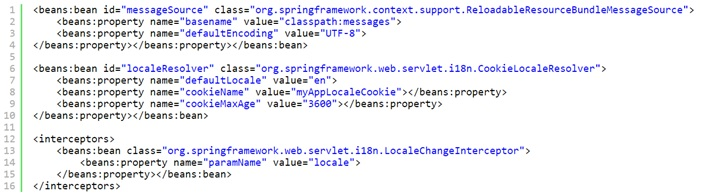
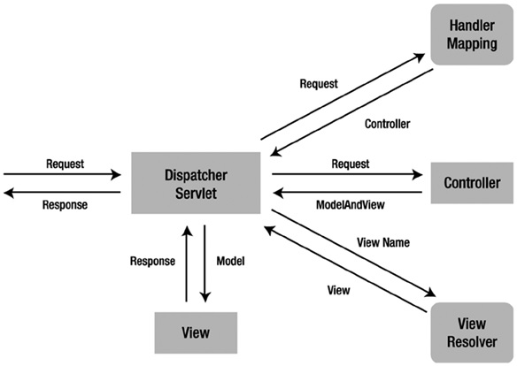
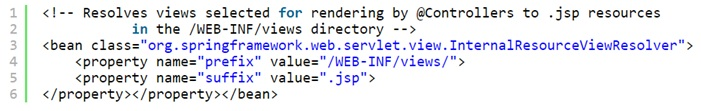
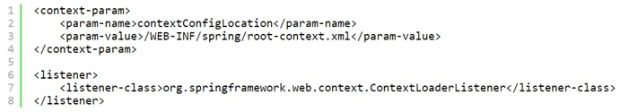

# Spring MVC

- [Как бы вы связали Spring MVC Framework и архитектуру MVC?](#Как-бы-вы-связали-Spring-MVC-Framework-и-архитектуру-MVC?)
- [Как добиться локализации в приложениях Spring MVC?](#Как-добиться-локализации-в-приложениях-Spring-MVC?)
- [Что вы знаете Spring MVC Interceptor и как он используется?](#Что-вы-знаете-Spring-MVC-Interceptor-и-как-он-используется?)
- [Как обрабатывать исключения в Spring MVC Framework?](#Как-обрабатывать-исключения-в-Spring-MVC-Framework?)
- [Каковы минимальные настройки, чтобы создать приложение Spring MVC?](#Каковы-минимальные-настройки,-чтобы-создать-приложение-Spring-MVC?)
- [Как загрузить файл в Spring MVC?](#Как-загрузить-файл-в-Spring-MVC?)
- [Что такое контроллер в Spring MVC?](#Что-такое-контроллер-в-Spring-MVC?)
- [Что такое ViewResolver в Spring?](#Что-такое-ViewResolver-в-Spring?)
- [ViewResolver](#ViewResolver)
- [ContentNegotiatingViewResolver](#ContentNegotiatingViewResolver)
- [HttpMessageConverter](#HttpMessageConverter)
- [DispatcherServlet и ContextLoaderListener](#DispatcherServlet-и-ContextLoaderListener)

---

## Как бы вы связали Spring MVC Framework и архитектуру MVC?
__Модель (Model)__ - выступает любой Java bean в Spring. Внутри класса могут быть заданы различные атрибуты и 
свойства для использования в представлении.

__Преставление (View)__ - JSP страница, HTML файл и т.п. служат для отображения необходимой информации пользователю. 
Представление передает обработку запросов к диспетчеру сервлетов (контроллеру).

__DispatcherServlet (Controller)__ - это главный контроллер в приложении Spring MVC, который обрабатывает все 
входящие запросы и передает их для обработки в различные методы в контроллеры.

---

## Как добиться локализации в приложениях Spring MVC?
Spring MVC предоставляет очень простую и удобную возможность локализации приложения. Для этого необходимо сделать 
следующее:  
- Создать файл resource bundle, в котором будут заданы различные варианты локализированной информации.
- Определить messageSource в конфигурации Spring используя классы ResourceBundleMessageSource или ResourceBundleMessageSource.
- Определить localceResolver класса CookieLocaleResolver для включения возможности переключения локали.
- С помощью элемента spring:message DispatcherServlet будет определять в каком месте необходимо подставлять 
    локализированное сообщение в ответе.


---

## Что вы знаете Spring MVC Interceptor и как он используется?
Перехватчики в Spring (Spring Interceptor) являются аналогом Servlet Filter и позволяют перехватывать запросы 
клиента и обрабатывать их. Перехватить запрос клиента можно в трех местах: _preHandle_, _postHandle_ и _afterCompletion_.   
- __preHandle__ - метод используется для обработки запросов, которые еще не были переданы в метода обработчик 
    контроллера. Должен вернуть true для передачи следующему перехватчику или в handler method. False укажет на 
    обработку запроса самим обработчиком и отсутствию необходимости передавать его дальше. Метод имеет возможность 
    выкидывать исключения и пересылать ошибки к представлению.
- __postHandle__ - вызывается после handler method, но до обработки DispatcherServlet для передачи представлению. 
    Может использоваться для добавления параметров в объект ModelAndView.
- __afterCompletion__ - вызывается после отрисовки представления.

Для создания обработчика необходимо расширить абстрактный класс HandlerInterceptorAdapter или реализовать интерфейс 
HandlerInterceptor. Так же нужно указать перехватчики в конфигурационном файле Spring.

---

## Как загрузить файл в Spring MVC?
Внутри спринг предусмотрен интерфейс `MultipartResolver` для обеспечения загрузки файлов. Фактически нужно настроить 
файл конфигурации для указания обработчика загрузки файлов, а затем задать необходимый метод в контроллере spring.

---

## Как обрабатывать исключения в Spring MVC Framework?
В Spring MVC интерфейс `HandlerExceptionResolver` (из пакета `org.springframework.web.servlet`) предназначен 
для работы с непредвиденными исключениями, возникающими во время выполнения обработчиков. По умолчанию 
`DispatcherServlet` регистрирует класс `DefaultHandlerExceptionResolver` (из пакета 
`org.springframework.web.servlet.mvc.support`). Этот распознаватель обрабатывает определенные стандартные 
исключения Spring MVC, устанавливая специальный код состояния ответа. Можно также реализовать собственный 
обработчик исключений, аннотировав метод контроллера с помощью аннотации @ExceptionHandler и передав ей в 
качестве атрибута тип исключения. В общем случае обработку исключений можно описать таким образом:
- __Controller Based__ - указать методы для обработки исключения в классе контроллере. Для этого нужно пометить 
    такие методы аннотацией `@ExceptionHandler`.
- __Global Exception Handler__ - для обработки глобальных исключений spring предоставляет аннотацию `@ControllerAdvice`.
- __HandlerExceptionResolver implementation__ – общие исключений большая часть времени обслуживают статические 
    страницы. Spring Framework предоставляет интерфейс `HandlerExceptionResolver`, который позволяет задать 
    глобального обработчика исключений. Реализацию этого интерфейса можно использовать для создания собственных 
    глобальных обработчиков исключений в приложении.
    
---
    
## Каковы минимальные настройки, чтобы создать приложение Spring MVC?
Для создания простого Spring MVC приложения необходимо пройти следующие шаги:
- Добавить зависимости spring-context и spring-webmvc в проект.
- Указать DispatcherServlet в web.xml для обработки запросов внутри приложения.
- Задать определение spring bean (аннотацией или в xml).
- Добавить определение view resolver для представлений.
- Настроить класс контроллер для обработки клиентских запросов.

---

## Что такое контроллер в Spring MVC?
Ключевым интерфейсом в __Spring MVC__ является __Controller__. Контроллер обрабатывает запросы к действиям, 
осуществляемые пользователями в пользовательском интерфейсе, взаимодействуя с уровнем обслуживания, обновляя 
модель и направляя пользователей на соответствующие представления в зависимости от результатов выполнения.   
__Controller__ - управление, связь между моделью и видом.
  
Основным контроллером в __Spring MVC__ является `org.springframework.web.servlet.DispatcherServlet`. Задается 
аннотацией `@Controller` и часто используется с аннотацией `@RequestMapping`, которая указывает какие запросы 
будут обрабатываться этим контроллером.

---

## Что такое ViewResolver в Spring?
__ViewResolver__ - распознаватель представлений. Интерфейс ViewResolver в Spring MVC (из пакета 
`org.springframework.web.servlet`) поддерживает распознавание представлений на основе логического имени, 
возвращаемого контроллером. Для поддержки различных механизмов распознавания представлений предусмотрено 
множество классов реализации. Например, класс UrlBasedViewResolver поддерживает прямое преобразование логических 
имен в URL. Класс `ContentNegotiatingViewResolver` поддерживает динамическое распознавание представлений в 
зависимости от типа медиа, поддерживаемого клиентом (XML, PDF, JSON и т.д.). Существует также несколько 
реализаций для интеграции с различными технологиями представлений, такими как FreeMarker (FreeMarkerViewResolver), 
Velocity (VelocityViewResolver) и JasperReports (JasperReportsViewResolver).
   
__InternalResourceViewResolver__ - реализация ViewResolver, которая позволяет находить представления, которые 
возвращает контроллер для последующего перехода к нему. Ищет по заданному пути, префиксу, суффиксу и имени.

## ViewResolver
При работе с Spring MVC этот интерфейс ищет представление по его названию.
Настройка ViewResolver:   
```xml
<bean class="org.springframework.web.servlet.view.InternalResourceViewResolver">
    <property name="prefix" value="WEB-INF/views/"/>
    <property name="suffix" value=".jsp"/>
</bean>
```

---

## ContentNegotiatingViewResolver
Определяет в каком представлении необходимо вернуть ресурс.

---

## HttpMessageConverter
Конвертирует ответ в необходимый формат.

Указать необходимый формат получения данных можно с помощью суффикса к запросу (напр.
`http://localhost:8080/employee/list.json`) или добавив заголовок Accept к запросу (напр. `Accept: “application/json”`); 
в случае если указан суффикс и хедер, суффикс формата имеет более высокий приоритет, нежели заголовок.

---

## DispatcherServlet и ContextLoaderListener
`DispatcherServlet` - сервлет диспатчер. Этот сервлет анализирует запросы и направляет их соответствующему 
контроллеру для обработки. В __Spring MVC__ класс `DispatcherServlet` является центральным сервлетом, который 
получает запросы и направляет их соответствующим контроллерам. В приложении __Spring MVC__ может существовать 
произвольное количество экземпляров `DispatcherServlet`, предназначенных для разных целей (например, для 
обработки запросов пользовательского интерфейса, запросов веб-служб REST и т.д.). Каждый экземпляр `DispatcherServlet` 
имеет собственную конфигурацию `WebApplicationContext`, которая определяет характеристики уровня сервлета, 
такие как контроллеры, поддерживающие сервлет, отображение обработчиков, распознавание представлений, 
интернационализация, оформление темами, проверка достоверности, преобразование типов и форматирование и т.п.

`ContextLoaderListener` - слушатель при старте и завершении корневого класса Spring WebApplicationContext. 
Основным назначением является связывание жизненного цикла `ApplicationContext` и `ServletContext`, а так же 
автоматического создания `ApplicationContext`. Можно использовать этот класс для доступа к бинам из различных 
контекстов спринг.   
Настраивается в web.xml:   


---