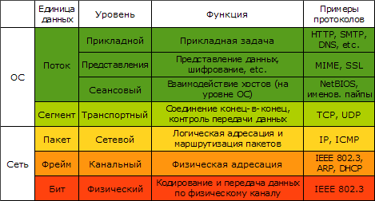

# WEB
- [Servlet](src/main/java/kovteba/servlet)
- [JSP](src/main/java/kovteba/jsp)
- [REST](src/main/java/kovteba/rest)
----

- [Что такое www?](#Что-такое-www?)
- [Что такое w3c?](#Что-такое-w3c?)
- [Что такое TCP/IP?](#Что-такое-TCP/IP?)
- [Что такое ftp?](#Что-такое-ftp?)
- [Чем отличаются http и https?](#Чем-отличаются-http-и-https?)
- [OSI model](#OSI-model)
- [TSP/IP model](#TSP/IP-model)
- [Сравнение TCP/IP OSI](#Сравнение-TCP/IP-OSI)
- [Что такое протокол передачи данных, какие вы знаете?](#Что-такое-протокол-передачи-данных,-какие-вы-знаете?)
- [web server](#web-server)
- [web приложение](#web-application)
- [application server](#application-server)
- [методы get и post](#methods-get-and-post)
- [Что такое html?](#Что-такое-html?)
- [Что такое xml?](#Что-такое-xml?)
- [Что такое css?](#Что-такое-css?)
- [Что такое MIME type?](#Что-такое-MIME-type?)
- [Что такое cookies?](#Что-такое-cookies?)
- [Что такое сессия?](#Что-такое-сессия?)
- [Понятия “авторизация” и “аутентификация”, в чем их различия?](#Понятия-“авторизация”-и-“аутентификация”,-в-чем-их-различия?)
- [Что такое Ajax? Как принципиально устроена эта технология?](#Что-такое-Ajax?-Как-принципиально-устроена-эта-технология?)
- [Какие есть методы отправки данных с клиента на сервер?](#Какие-есть-методы-отправки-данных-с-клиента-на-сервер?)
- [Какой метод HTTP не является неизменяемым?](#Какой-метод-HTTP-не-является-неизменяемым?)
- [В чем разница между методами GET и POST?](#В-чем-разница-между-методами-GET-и-POST?)
- 
- [Server response](#Server-response)

## Что такое www?
__Всемирная паутина__ (англ. _World Wide Web_) — распределённая система, предоставляющая доступ к связанным между 
собой документам, расположенным на различных компьютерах, подключённых к Интернету. Для обозначения Всемирной 
паутины также используют слово веб (англ. _web_ «паутина») и аббревиатуру _WWW_.

Всемирную паутину образуют сотни миллионов веб-серверов. Большинство ресурсов Всемирной паутины основаны на 
технологии гипертекста. Гипертекстовые документы, размещаемые во Всемирной паутине, называются веб-страницами. 
Несколько веб-страниц, объединённых общей темой, дизайном, а также связанных между собой ссылками и обычно 
находящихся на одном и том же веб-сервере, называются веб-сайтом. Для загрузки и просмотра веб-страниц используются 
специальные программы — браузеры (англ. _browser_).

## Что такое w3c?
Консорциум Всемирной паутины (англ. _World Wide Web Consortium_, _W3C_) — организация, разрабатывающая и внедряющая 
технологические стандарты для Всемирной паутины. Консорциум возглавляет сэр Тимоти Джон Бернерс-Ли, автор множества 
разработок в области информационных технологий.

## Что такое TCP/IP?
Стек протоколов __TCP/IP__ — набор сетевых протоколов передачи данных, используемых в сетях, включая сеть Интернет. 
Название __TCP/IP__ происходит из двух наиважнейших протоколов семейства — _Transmission Control Protocol (TCP)_ и 
_Internet Protocol (IP)_, которые были разработаны и описаны первыми в данном стандарте.

Стек протоколов TCP/IP включает в себя четыре уровня:  
- прикладной уровень (_application layer_),
- транспортный уровень (_transport layer_),
- сетевой уровень (_Internet layer_),
- канальный уровень (_link layer_).

## Что такое ftp?
__FTP__ (англ. _File Transfer Protocol_ — протокол передачи файлов) — стандартный протокол, предназначенный для 
передачи файлов по _TCP_-сетям (например, Интернет). Использует 21-й порт. FTP часто используется для загрузки 
сетевых страниц и других документов с частного устройства разработки на открытые сервера хостинга.

Протокол построен на архитектуре __«клиент-сервер»__ и использует разные сетевые соединения для передачи команд 
и данных между клиентом и сервером. Пользователи _FTP_ могут пройти аутентификацию, передавая логин и пароль открытым 
текстом, или же, если это разрешено на сервере, они могут подключиться анонимно. Можно использовать протокол _SSH_ 
для безопасной передачи, скрывающей (шифрующей) логин и пароль, а также шифрующей содержимое.

## Чем отличаются http и https?
__HTTP__ (англ. _HyperText Transfer Protocol_ — «протокол передачи гипертекста») — протокол прикладного уровня 
передачи данных (изначально — в виде гипертекстовых документов в формате HTML, в настоящий момент используется 
для передачи произвольных данных). Основой _HTTP_ является технология _«клиент-сервер»_, то есть предполагается 
существование потребителей (клиентов), которые инициируют соединение и посылают запрос, и поставщиков (серверов), 
которые ожидают соединения для получения запроса, производят необходимые действия и возвращают обратно сообщение 
с результатом.  

__HTTPS__ (аббр. от англ. _HyperText Transfer Protocol Secure_) — расширение протокола _HTTP_, поддерживающее 
шифрование. Данные, передаваемые по протоколу _HTTPS_, «упаковываются» в криптографический протокол _SSL_ или _TLS_. 
В отличие от _HTTP_, для _HTTPS_ по умолчанию используется _TCP-порт `443`_.

HTTPS – не самостоятельный протокол передачи данных, а HTTP с надстройкой шифрования. В этом ключевое и 
единственное отличие:  
__HTTP__ – непосредственно протокол передачи данных, __HTTPS__ – расширение этого протокола.
__HTTPS__ используется для защищенного посредством шифрования  обмена данными.
__HTTPS__ применяется в том числе и для авторизации на серверах, требующих повышенного внимания к безопасности данных.
__HTTP__ работает с портом `80`, __HTTPS__ – с портом `443`.

## OSI model
  

__Уровень приложений__
Уровень приложений модели OSI поддерживает компоненты, определяющие взаимодействие пользователей с компьютерами. 
Этот уровень ответствен за идентификацию и установление доступности предполагаемого партнера по диалогу. Здесь же 
определяется, достаточно ли ресурсов для взаимодействия.

__Уровень представлений__
Название этого уровня отражает его назначение. Здесь данные форматируются, или, как иногда говорят, транслируются 
для представления их на уровне приложений. Для удобства передачи данные перед пересылкой приводятся к стандартному 
формату. Компьютеры настраиваются на их получение; принятые данные преобразуются в формат, пригодный для чтения 
(например, транслируются из кода _EBCDIC_ в код _ASCII_). За счет службы преобразования на уровне представления 
можно гарантировать, что данные с уровня приложений одной системы попадут на этот же уровень другой системы.

__Сеансовый уровень__
Основная функция, выполняемая на сеансовом уровне, напоминает работу посредника или судьи — управление диалогом 
между устройствами, называемыми также узлами. Взаимодействие систем, организуемое на этом уровне, может происходить 
в трех различных режимах: симплексном (`simplex`), полудуплексном (`half-duplex`) и полнодуплексном (`full-duplex`). 
Сеансовый уровень обычно занимается отделением данных одного приложения от информации другого приложения.

__Транспортный уровень__
Службы транспортного уровня осуществляют сегментирование и сборку данных, поступающих от приложений более высоких 
уровней, и организуют единый поток данных. Они обеспечивают транспортировку данных между конечными точками и 
устанавливают логическое соединение межу хостами отправителя и получателя в объединенной сети.  
Читатели, знакомые с протоколами _TCP_ и _UPD_, знают, что _TCP_ обеспечивает гарантированную (надежную) доставку 
данных, а _UPD_ — этого не делает. 

__Сетевой уровень__
Сетевой уровень отвечает за маршрутизацию в объединенной сети и сетевую адресацию, т.е. за пересылку трафика между 
устройствами, которые не подключены локально. Маршрутизаторы (router) или иные устройства уровня 3 действуют на 
сетевом уровне и обеспечивают в объединенной сети службу маршрутизации. 

__Канальный уровень__
Канальный уровень (_Data Link Layer_ или уровень связи данных) обеспечивает доставку сообщения на правильное 
устройство и трансляцию содержимого сообщения с сетевого уровня в биты физического уровня для последующей 
пересылки по сети. Происходит форматирование сообщения в кадры данных и добавление настроенного заголовка, 
содержащего адреса источника и назначения. Эта добавленная информация является своеобразной капсулой, 
заключающей в себе исходное сообщение также как капсулы спутников вмещают в себя двигатели, навигационное 
оборудование и другие приборы.

__Физический уровень__
Физический уровень отвечает за передачу и прием битовых потоков. Биты могут иметь значение 0 или 1 подобно коду 
Морзе, но с числовыми значениями. Физический уровень взаимодействует с разными типами коммуникационных носителей, 
что приводит к различному представлению битовых значений. Иногда применяются тональные сигналы, но чаще битовые 
значения представлены переходами между состояниями — изменениями напряжения от низкого к высокому потенциалу или 
наоборот.Для каждого типа носителя используются специальные протоколы, определяющие используемые битовые шаблоны 
и метод их кодирования в сигналы носителя, а также различные физические характеристики интерфейса подключения 
носителя. Физический уровень специфицирует электрические, механические, процедурные и функциональные характеристики, 
необходимые в процессе активизации, обслуживания и деактивизации физических соединений между системами.

## TSP/IP model

## Сравнение TCP/IP OSI

## Что такое протокол передачи данных, какие вы знаете?
__Протокол передачи данных__ — набор соглашений интерфейса логического уровня, которые определяют обмен данными 
между различными программами.

Примеры сетевых протоколов: 
__TCP/IP__ — набор протоколов передачи данных, получивший название от двух принадлежащих ему 
протоколов: __TCP__ (_Transmission Control Protocol__) и __IP__ (_Internet Protocol_)

Наиболее известные протоколы, используемые в сети Интернет:  
- __HTTP__ (_Hyper Text Transfer Protocol_) — это протокол передачи гипертекста. Протокол HTTP используется при 
    пересылке Web-страниц между компьютерами, подключенными к одной сети.
- __FTP__ (_File Transfer Protocol_) — это протокол передачи файлов со специального файлового сервера на компьютер 
    пользователя. _FTP_ дает возможность абоненту обмениваться двоичными и текстовыми файлами с любым компьютером сети. 
    Установив связь с удаленным компьютером, пользователь может скопировать файл с удаленного компьютера на свой или 
    скопировать файл со своего компьютера на удаленный.
- __POP__ (_Post Office Protocol_) — это стандартный протокол почтового соединения. Серверы _POP_ обрабатывают входящую 
    почту, а протокол POP предназначен для обработки запросов на получение почты от клиентских почтовых программ.
- __SMTP__ (_Simple Mail Transfer Protocol_) — протокол, который задает набор правил для передачи почты. Сервер _SMTP_ 
    возвращает либо подтверждение о приеме, либо сообщение об ошибке, либо запрашивает дополнительную информацию.
- __TELNET__ — это протокол удаленного доступа. _TELNET_ дает возможность абоненту работать на любой ЭВМ находящейся 
    с ним в одной сети, как на своей собственной, то есть запускать программы, менять режим работы и так далее. 
    На практике возможности ограничиваются тем уровнем доступа, который задан администратором удаленной машины.

## web server
__Веб-сервер__ — сервер, принимающий _HTTP_-запросы от клиентов, обычно веб-браузеров, и выдающий им _HTTP_-ответы, 
как правило, вместе с _HTML_-страницей, изображением, файлом, медиа-потоком или другими данными.

__Веб-сервером__ называют как программное обеспечение, выполняющее функции веб-сервера, так и непосредственно 
компьютер (см.: Сервер (аппаратное обеспечение)), на котором это программное обеспечение работает.

## web application
__Веб-приложение__ — клиент-серверное приложение, в котором клиентом выступает браузер, а сервером — веб-сервер. 
Логика веб-приложения распределена между сервером и клиентом, хранение данных осуществляется, преимущественно, на 
сервере, обмен информацией происходит по сети.

## application server
__Сервер приложений__ (англ. _application server_) — это программная платформа (фреймворк), предназначенная для 
эффективного исполнения процедур (программ, скриптов), на которых построены приложения. Сервер приложений действует 
как набор компонентов, доступных разработчику программного обеспечения через API (Интерфейс прикладного 
программирования), определённый самой платформой.

Для веб-приложений основная задача компонентов сервера — обеспечивать создание динамических страниц. Однако современные 
серверы приложений включают в себя и поддержку кластеризации, повышенную отказоустойчивость, балансировку нагрузки, 
позволяя таким образом разработчикам сфокусироваться только на реализации бизнес-логики.

## Чем отличаются web server и application server?
__Сервер приложений__ (англ. _application server_) — сервер, исполняющий некоторые прикладные программы. 
Сервер-приложений — объект, который обрабатывает запросы, связанные с приложениями, точнее для выполнения прикладных 
процессов (выборка данных, поиск данных, работа с терминалами). По идее эта технология изначально вообще не была 
связана с Web’om, однако, сейчас чаще говорят сервер web приложений. Практически используется для работы с базами данных.

__Веб-сервер__ — это сервер, принимающий _HTTP_-запросы от клиентов, обычно веб-браузеров, и выдающий им _HTTP_-ответы. 
_Web-сервер_ — объект, который обрабатывает запросы, в частности http-запросы. Браузер в данном случае клиент, 
который делает запросы (`POST`, `GET`).

## methods get and post
__Метод GET__
Метод `GET` удобен тем, что прост в эксплуатации. Но у него есть недостатки. Во-первых, методом `GET` нельзя передавать 
большие объемы информации, потому что данные, передаваемые этим методом входят в состав `URL`, длина которого ограничена. 
Так как данные, передаваемые методом `GET` входят в состав `URL` документа, их может подсмотреть любой желающий. 
У этого есть преимущества и недостатки. Преимущество состоит в том, что можно послать ссылку вместе с данными другу. 
Недостаток в том, что в строке браузера отображается и ваш, только что введенный пароль. Это одна из причин, 
почему данные, представляющие ценность, всегда нужно передавать методом `POST`.

__Метод POST__
Как и метод `GET`, метод `POST` служит для передачи данных на сервер. Однако, данные, переданные таким образом, идут 
не в `URL` документа, а в теле запроса, после заголовков. Эти данные могут быть восприняты CGI-программой.

Плюсы метода `POST` очевидны: можно передавать неограниченные объемы информации, причем, никто не увидит эту 
информацию после того, как вы ее отправили (имеется ввиду, в строке браузера).

Но есть и недостатки:  
- Медленнее, чем `GET`, так как анализируются заголовки и тело запроса.
- Страницы, сгенерированные как результат запроса POST, нельзя добавить в закладки (`СЕО`-недружелюбен)
- Кроме того, если необходимо «протащить» данные через несколько форм или страниц, то это вызовет 
    дополнительные трудности.

## Что такое html?
__HTML__ – это язык разметки. Вы используете _HTML_ для разметки текстового документа, точно так же, как это делает 
редактор при помощи жирного красного карандаша. Эти пометки служат для определения формата (или стиля), который 
будет использован при выводе текста на экран монитора.

## Что такое xml?
__XML__, или Язык Расширяемой Маркировки — _eXtensible Markup Language_, — спроектирован для того, чтобы предоставить 
Web-разработчикам возможность определения содержания более сложных документов, причем с более корректным 
“отображением данных”, нежели ранее. _XML_ разрабатывался как язык с простым формальным синтаксисом, удобный для 
создания и обработки документов программам и одновременно удобный для чтения и создания документов человеком, 
с подчёркиванием нацеленности на использование в Интернете. Язык называется расширяемым, поскольку он не фиксирует 
разметку, используемую в документах: разработчик волен создать разметку в соответствии с потребностями к конкретной 
области, будучи ограниченным лишь синтаксическими правилами языка.

## Что такое css?
__CSS__ (_Cascading Style Sheets_ — каскадные таблицы стилей) – одна из базовых технологий в современном Интернете. 
Нечасто можно встретить сайт, свёрстанный без применения _CSS_. _CSS_-код – это список инструкций для браузера, 
– как и где отображать элементы веб-страницы, написанный особым образом.

## Что такое MIME type?
__MIME__ (_Multipurpose Internet Mail Extensions_, многоцелевые расширения интернет-почты) — стандарт Интернет, 
является частью протокола _HTTP_. Задача _MIME_ это идентификация типа содержимого документа по его заголовку. 
К примеру, текстовый файл имеет тип text/plain, а _HTML_-файл — `text/html`. Отправка заголовка обычно происходит 
на основе расширения файла веб-сервером.   
__Internet Media Types__ — типы данных, которые могут быть переданы посредством сети интернет с применением 
стандарта _MIME_. Ниже приведен список MIME-заголовков и расширений файлов.

Согласно RFC 2045, RFC 2046, RFC 4288, RFC 4289 и RFC 4855[2] выделяются следующие базовые типы передаваемых 
данных:application, audio, example, image, message, model, multipart, text, video.

## Что такое cookies?
__Куки__ (от англ. _cookie_ — печенье) — небольшой фрагмент данных, отправленный веб-сервером и хранимый на компьютере 
пользователя. Веб-клиент (обычно веб-браузер) всякий раз при попытке открыть страницу соответствующего сайта пересылает 
этот фрагмент данных веб-серверу в составе HTTP-запроса. Применяется для сохранения данных на стороне пользователя, 
на практике обычно используется для:   
- аутентификации пользователя;
- хранения персональных предпочтений и настроек пользователя;
- отслеживания состояния сеанса[en] доступа пользователя;
- ведения статистики о пользователях.

## Что такое сессия?
__Сессия__  - это сеанс связи между клиентом и сервером, устанавливаемый на определенное время. Сеанс устанавливается 
непосредственно между клиентом и веб-сервером в момент получения первого запроса к веб-приложению. Каждый клиент 
устанавливает с сервером свой собственный сеанс, который сохраняется до окончания работы с приложением.

__Сессия__ (от англ. _session_) – промежуток времени между первым и последним запросами, которые пользователь 
отправляет со своего устройства (компьютера, телефона) к серверу сайта. Во время одной сессии посетитель совершает 
какие-либо активные действия: переходит по ссылкам, заполняет формы, скачивает данные – вся подобная информация 
записывается и хранится в так называемом лог-файле сайта. Завершается сессия в случае, если со стороны пользователя 
не поступало запросов в течение определенного промежутка времени или же при обрыве связи.

## Понятия “авторизация” и “аутентификация”, в чем их различия?
__Авторизация__ (англ. _authorization_ — разрешение, уполномочивание) — предоставление определённому лицу или группе 
лиц прав на выполнение определённых действий; а также процесс проверки (подтверждения) данных прав при попытке 
выполнения этих действий. Часто можно услышать выражение, что какой-то человек «авторизован» для выполнения 
данной операции — это значит, что он имеет на неё право.

Аутентификация — процедура проверки подлинности, например:  
- проверка подлинности пользователя путём сравнения введённого им логина и пароля, сохранённым в базе данных пользователей;
- подтверждение подлинности электронного письма путём проверки цифровой подписи письма по открытому ключу отправителя;
- проверка контрольной суммы файла на соответствие сумме, заявленной автором этого файла.

_Авторизацию_ не следует путать с _аутентификацией_: __аутентификация__ — это процедура проверки легальности 
пользователя или данных, например, проверки соответствия введённого пользователем пароля к учётной записи паролю 
в базе данных, или проверка цифровой подписи письма по ключу шифрования, или проверка контрольной суммы файла на 
соответствие заявленной автором этого файла. __Авторизация__ же производит контроль доступа легальных пользователей 
к ресурсам системы после успешного прохождения ими аутентификации. Зачастую процедуры аутентификации и авторизации 
совмещаются.

## Что такое Ajax? Как принципиально устроена эта технология?
__AJAX_ — это аббревиатура, которая означает _Asynchronous Javascript and XML_. При использовании _AJAX_ нет 
необходимости обновлять каждый раз всю страницу, так как обновляется только ее конкретная часть.  
Достоинства AJAX:   
- Возможность создания удобного Web-интерфейса
- Активное взаимодействие с пользователем
- Частичная перезагрузка страницы, вместо полной
- Удобство использования

_AJAX_ использует два метода работы с веб-страницей: изменение Web-страницы не перезагружая её, и динамическое 
обращение к серверу. Второе может осуществляться несколькими способами, в частности, `XMLHttpRequest`, о чем мы и 
будем говорить, и использование техники скрытого фрейма. Для того, чтобы осуществлять обмен данными, на странице 
должен быть создан объект `XMLHttpRequest`, который является своеобразным посредником между браузером пользователя 
и сервером. С помощью XMLHttpRequest можно отправить запрос на сервер, а также получить ответ в виде различного 
рода данных.

## Какие есть методы отправки данных с клиента на сервер?
+ `GET` - используется для запроса содержимого указанного ресурса, изображения или гипертекстового документа. 
    Вместе с запросом могут передаваться дополнительные параметры как часть `URI`, значения могут выбираться из полей 
    формы или передаваться непосредственно через `URL`. При этом запросы кэшируются и имеют ограничения на размер. 
    Этот метод является основным методом взаимодействия браузера клиента и веб-сервера. 
+ `POST` - используется для передачи пользовательских данных в содержимом _HTTP_-запроса на сервер. Пользовательские 
    данные упакованы в тело запроса согласно полю заголовка `Content-Type` и/или включены в `URI` запроса. При 
    использовании метода `POST` под `URI` подразумевается ресурс, который будет обрабатывать запрос. 

## Какой метод HTTP не является неизменяемым?
HTTP метод называется неизменяемым, если он на один и тот же запрос всегда возвращает одинаковый результат. 
HTTP методы `GET`, `PUT`, `DELETE`, `HEAD` и `OPTIONS` являются неизменяемыми, поэтому необходимо реализовывать 
приложение так, чтобы эти методы возвращали одинаковый результат постоянно. К изменяемым методам относится метод 
`POST`, который и используется для реализации чего-либо, что изменяется при каждом запросе.  
К примеру, для доступа к статической _HTML_ странице используется метод `GET`, т.к. он всегда возвращает одинаковый 
результат. При необходимости сохранять какую-либо информацию, например в базе данных, нужно использовать `POST` метод.

## В чем разница между методами GET и POST?
+ `GET` передает данные серверу используя _URL_, тогда как `POST` передает данные, используя тело _HTTP_ запроса. 
    Длина `URL` ограничена 1024 символами, это и будет верхним ограничением для данных, которые можно отослать 
    через `GET`. `POST` может отправлять гораздо большие объемы данных. Лимит устанавливается _web-server_ и составляет 
    обычно около 2 Mb.
+ Передача данных методом `POST` более безопасна, чем методом `GET`, так как секретные данные (например пароль) 
    не отображаются напрямую в web-клиенте пользователя, в отличии от URL, который виден почти всегда. Иногда это 
    преимущество превращается в недостаток - вы не сможете послать данные за кого-то другого.
+ `GET`метод является неизменяемым, тогда как `POST` — изменяемый.

## Server response
+ 1xx: Informational (информационные):
    + `100` Continue («продолжай»);
    + `101` Switching Protocols («переключение протоколов»);
    + `102` Processing («идёт обработка»).
+ 2xx: Success (успешно):
    + `200` OK («хорошо»);
    + `201` Created («создано»);
    + `202` Accepted («принято»);
    + `203` Non-Authoritative Information («информация не авторитетна»);
    + `204` No Content («нет содержимого»);
    + `205` Reset Content («сбросить содержимое»);
    + `206` Partial Content («частичное содержимое»);
    + `207` Multi-Status («многостатусный»);
    + `208` Already Reported («уже сообщалось»);
    + `226` IM Used («использовано IM»).
+ 3xx: Redirection (перенаправление):
    + `300` Multiple Choices («множество выборов»);
    + `301` Moved Permanently («перемещено навсегда»);
    + `302` Moved Temporarily («перемещено временно»);
    + `302` Found («найдено»);
    + `303` See Other («смотреть другое»);
    + `304` Not Modified («не изменялось»);
    + `305` Use Proxy («использовать прокси»);
    + `306` — зарезервировано (код использовался только в ранних спецификациях);
    + `307` Temporary Redirect («временное перенаправление»);
    + `308` Permanent Redirect («постоянное перенаправление»).
+ 4xx: Client Error (ошибка клиента):
    + `400` Bad Request («плохой, неверный запрос»);
    + `401` Unauthorized («не авторизован (не представился)»);
    + `402` Payment Required («необходима оплата»);
    + `403` Forbidden («запрещено (не уполномочен)»);
    + `404` Not Found («не найдено»);
    + `405` Method Not Allowed («метод не поддерживается»);
    + `406` Not Acceptable («неприемлемо»);
    + `407` Proxy Authentication Required («необходима аутентификация прокси»);
    + `408` Request Timeout («истекло время ожидания»);
    + `409` Conflict («конфликт»);
    + `410` Gone («удалён»);
    + `411` Length Required («необходима длина»);
    + `412` Precondition Failed («условие ложно»);
    + `413` Payload Too Large («полезная нагрузка слишком велика»);
    + `414` URI Too Long («URI слишком длинный»);
    + `415` Unsupported Media Type («неподдерживаемый тип данных»);
    + `416` Range Not Satisfiable («диапазон не достижим»);
    + `417` Expectation Failed («ожидание не удалось»);
    + `418` I’m a teapot («я — чайник»);
    + `419` Authentication Timeout (not in RFC 2616) («обычно ошибка проверки CSRF»);
    + `421` Misdirected Request ;
    + `422` Unprocessable Entity («необрабатываемый экземпляр»);
    + `423` Locked («заблокировано»);
    + `424` Failed Dependency («невыполненная зависимость»);
    + `426` Upgrade Required («необходимо обновление»);
    + `428` Precondition Required («необходимо предусловие»);
    + `429` Too Many Requests («слишком много запросов»);
    + `431` Request Header Fields Too Large («поля заголовка запроса слишком большие»);
    + `449` Retry With («повторить с»);
    + `451` Unavailable For Legal Reasons («недоступно по юридическим причинам»).
    + `499` Client Closed Request (клиент закрыл соединение);
+ 5xx: Server Error (ошибка сервера):
    + `500` Internal Server Error («внутренняя ошибка сервера»);
    + `501` Not Implemented («не реализовано»);
    + `502` Bad Gateway («плохой, ошибочный шлюз»);
    + `503` Service Unavailable («сервис недоступен»);
    + `504` Gateway Timeout («шлюз не отвечает»);
    + `505` HTTP Version Not Supported («версия HTTP не поддерживается»);
    + `506` Variant Also Negotiates («вариант тоже проводит согласование»);
    + `507` Insufficient Storage («переполнение хранилища»);
    + `508` Loop Detected («обнаружено бесконечное перенаправление»);
    + `509` Bandwidth Limit Exceeded («исчерпана пропускная ширина канала»);
    + `510` Not Extended («не расширено»);
    + `511` Network Authentication Required («требуется сетевая аутентификация»);
    + `520` Unknown Error («неизвестная ошибка»);
    + `521` Web Server Is Down («веб-сервер не работает»);
    + `522` Connection Timed Out («соединение не отвечает»);
    + `523` Origin Is Unreachable («источник недоступен»);
    + `524` A Timeout Occurred («время ожидания истекло»);
    + `525` SSL Handshake Failed («квитирование SSL не удалось»);
    + `526` Invalid SSL Certificate («недействительный сертификат SSL»).