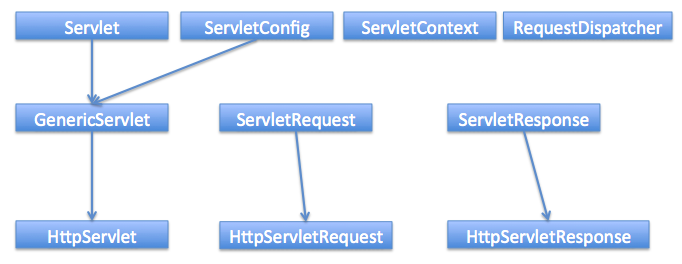

# Servlets


- [Что такое «сервлет»?](#Что-такое-«сервлет»?)
- [Что такое «контейнер сервлетов»?](#Что-такое-«контейнер-сервлетов»?)
- [Какова структура веб-проекта?](#Какова-структура-веб-проекта?)
- [Что вы знаете о _сервлетных фильтрах_?](#Что-вы-знаете-о-сервлетных-фильтрах?)
- [Зачем в сервлетах используются различные listener?](#Зачем-в-сервлетах-используются-различные-listener?)
- [Когда стоит использовать фильтры сервлетов, а когда слушателей?](#Когда-стоит-использовать-фильтры-сервлетов,-а-когда-слушателей?)
- [Как обработать в приложении исключения, выброшенные другим сервлетом?](#Как-обработать-в-приложении-исключения,-выброшенные-другим-сервлетом?)
- [Что такое «дескриптор развертывания»?](#Что-такое-«дескриптор-развертывания»?)
- [Как реализовать запуск сервлета одновременно с запуском приложения?](#Как-реализовать-запуск-сервлета-одновременно-с-запуском-приложения?)
- [Что представляет собой ServletConfig?](#Что-представляет-собой-ServletConfig?)
- [Что представляет собой ServletContext?](#Что-представляет-собой-ServletContext?)
- [В чем отличия ServletContext и ServletConfig?](#В-чем-отличия-ServletContext-и-ServletConfig?)
- [Что такое Request Dispatcher?](#Что-такое-Request-Dispatcher?)
- [Каким образом можно допустить в сервлете deadlock?](#Каким-образом-можно-допустить-в-сервлете-deadlock?)
- [Как получить реальное расположение сервлета на сервере?](#Как-получить-реальное-расположение-сервлета-на-сервере?)
- [Как получить информацию о сервере из сервлета?](#Как-получить-информацию-о-сервере-из-сервлета?)
- [Как получить IP адрес клиента на сервере?](#Как-получить-IP-адрес-клиента-на-сервере?)
- [Какие классы-обертки для сервлетов вы знаете?](#Какие-классы-обертки-для-сервлетов-вы-знаете?)
- [Как контейнер сервлетов управляет жизненным циклом сервлета, когда и какие методы вызываются?](#Как-контейнер-сервлетов-управляет-жизненным-циклом-сервлета,-когда-и-какие-методы-вызываются?)
- [Какие действия необходимо проделать при создании сервлетов?](#Какие-действия-необходимо-проделать-при-создании-сервлетов?)
- [В каком случае требуется переопределять метод service()?](#В-каком-случае-требуется-переопределять-метод-service()?)
- [Есть ли смысл определять для сервлета конструктор? Каким образом лучше инициализировать данные?](#Есть-ли-смысл-определять-для-сервлета-конструктор?-Каким-образом-лучше-инициализировать-данные?)
- [В чем отличия GenericServlet и HttpServlet?](#В-чем-отличия-GenericServlet-и-HttpServlet?)
- [Как из одного сервлета вызвать другой сервлет?](#Как-из-одного-сервлета-вызвать-другой-сервлет?)
- [Чем отличается sendRedirect() от forward()?](#Чем-отличается-sendRedirect()-от-forward()?)
- [Стоит ли волноваться о многопоточной безопасности работая с сервлетами?](#Стоит-ли-волноваться-о-многопоточной-безопасности-работая-с-сервлетами?)
- [Почему необходимо переопределить только init() метод без аргументов?](#Почему-необходимо-переопределить-только-init()-метод-без-аргументов?)
- [Зачем нужны сервера приложений, если есть контейнеры сервлетов?](#Зачем-нужны-сервера-приложений,-если-есть-контейнеры-сервлетов?)
- [В чем заключаются преимущества технологии сервлетов над CGI (Common Gateway Interface)?](#В-чем-заключаются-преимущества-технологии-сервлетов-над-CGI-(Common-Gateway-Interface)?)
- [Какие наиболее распространенные задачи выполняются в контейнере сервлетов?](#Какие-наиболее-распространенные-задачи-выполняются-в-контейнере-сервлетов?)
- [Для чего нужен интерфейс ServletRequest?](#Для-чего-нужен-интерфейс-ServletRequest?)
- [Для чего нужен интерфейс ServletResponse?](#Для-чего-нужен-интерфейс-ServletResponse?)
- [Для чего используются атрибуты сервлетов и как происходит работа с ними?](#Для-чего-используются-атрибуты-сервлетов-и-как-происходит-работа-с-ними?)
- [Почему HttpServlet класс объявлен как абстрактный?](#Почему-HttpServlet-класс-объявлен-как-абстрактный?)
- [Какие основные методы присутствуют в классе HttpServlet?](#Какие-основные-методы-присутствуют-в-классе-HttpServlet?)
- [В чем разница между PrintWriter и ServletOutputStream?](#В-чем-разница-между-PrintWriter-и-ServletOutputStream?)
- [Можно ли одновременно использовать в сервлете PrintWriter и ServletOutputStream?](#Можно-ли-одновременно-использовать-в-сервлете-PrintWriter-и-ServletOutputStream?)
- [Расскажите об интерфейсе SingleThreadModel](#Расскажите-об-интерфейсе-SingleThreadModel)
- [Какие методы для работы с cookies предусмотрены в сервлетах?](#Какие-методы-для-работы-с-cookies-предусмотрены-в-сервлетах?)
- [Какие различные методы управления сессией в сервлетах вы знаете?](#Какие-различные-методы-управления-сессией-в-сервлетах-вы-знаете?)
- [Что такое URL Rewriting?](#Что-такое-URL-Rewriting?)
- [Что означает URL encoding? Как это осуществить в Java?](#Что-означает-URL-encoding?-Как-это-осуществить-в-Java?)
- [Зачем нужны и чем отличаются методы encodeURL() и encodeRedirectURL()?](#Зачем-нужны-и-чем-отличаются-методы-encodeURL()-и-encodeRedirectURL()?)
- [Как уведомить объект в сессии, что сессия недействительна или закончилась?](#Как-уведомить-объект-в-сессии,-что-сессия-недействительна-или-закончилась?)
- [Какой существует эффективный способ удостоверится, что все сервлеты доступны только для пользователя с верной сессией?](#Какой-существует-эффективный-способ-удостоверится,-что-все-сервлеты-доступны-только-для-пользователя-с-верной-сессией?)
- [Как мы можем обеспечить transport layer security для нашего веб приложения?](#Как-мы-можем-обеспечить-transport-layer-security-для-нашего-веб-приложения?)
- [Как организовать подключение к базе данных, обеспечить журналирование в сервлете?](#Как-организовать-подключение-к-базе-данных,-обеспечить-журналирование-в-сервлете?)
- [Какие основные особенности появились в спецификации Servlet 3?](#Основные-особенности-появились-в-спецификации-Servlet3?)
- [Какие способы аутентификации доступны сервлету?](#Какие-способы-аутентификации-доступны-сервлету?)
- [Отправка запросов к сервдет из JAVA](#Отправка-запросов-к-сервдет-из-JAVA)
- [](#)


    
## Что такое «сервлет»?
__Сервлет__ является интерфейсом, реализация которого расширяет функциональные возможности сервера. Сервлет 
взаимодействует с клиентами посредством принципа запрос-ответ. Хотя сервлеты могут обслуживать любые запросы, 
они обычно используются для расширения веб-серверов.

Большинство необходимых для создания сервлетов классов и интерфейсов содержатся в 
пакетах `javax.servlet` и `javax.servlet.http`.

Основные методы сервлета:  
+ `public void init(ServletConfig config) throws ServletException` запускается сразу после загрузки сервлета в память;
+ `public ServletConfig getServletConfig()` возвращает ссылку на объект, который предоставляет доступ к информации о конфигурации сервлета;
+ `public String getServletInfo()` возвращает строку, содержащую информацию о сервлете, например: автор и версия сервлета;
+ `public void service(ServletRequest request, ServletResponse response) throws ServletException, java.io.IOException` вызывается для обработки каждого запроса;
+ `public void destroy()` выполняется перед выгрузкой сервлета из памяти.

Текущая спецификация - Servlet 3.1 описана в JSR-340 и принята в 2013 году.



## Что такое «контейнер сервлетов»?
__Контейнер сервлетов__ — программа, представляющая собой сервер, который занимается системной поддержкой сервлетов 
и обеспечивает их жизненный цикл в соответствии с правилами, определёнными в спецификациях. Может работать как 
полноценный самостоятельный веб-сервер, быть поставщиком страниц для другого веб-сервера, или интегрироваться 
в Java EE сервер приложений.

Контейнер сервлетов обеспечивает обмен данными между сервлетом и клиентами, берёт на себя выполнение таких функций, 
как создание программной среды для функционирующего сервлета, идентификацию и авторизацию клиентов, организацию 
сессии для каждого из них.

Наиболее известные реализации контейнеров сервлетов:  
+ _Apache Tomcat_
+ _Jetty_
+ _JBoss_
+ _WildFly_
+ _GlassFish_
+ _IBM WebSphere_
+ _Oracle Weblogic_

## Какова структура веб проекта?
`src/main/java` Исходники приложения/библиотеки  
`src/main/resources` Ресурсные файлы приложения/библиотеки  
`src/main/filters` Файлы сервлетных фильтров  
`src/main/webapp` Исходники веб-приложения  
`src/test/java` Исходники тестов  
`src/test/resources` Ресурсные файлы тестов  
`src/test/filters` Тесты сервлетных фильтров  
`src/it` Интеграционные тесты  
`src/assembly` Описание сборки  
`src/site` Сайт  
`LICENSE.txt` Лицензия проекта  
`NOTICE.txt` Замечания и определения библиотек зависимостей.  
`README.txt` Описание проекта  

## Что вы знаете о сервлетных фильтрах?
__Сервлетный фильтр__ - это Java-код, пригодный для повторного использования и позволяющий преобразовать содержание 
HTTP-запросов, HTTP-ответов и информацию, содержащуюся в заголовках HTML. Сервлетный фильтр занимается предварительной 
обработкой запроса, прежде чем тот попадает в сервлет, и/или последующей обработкой ответа, исходящего из сервлета.  
Сервлетные фильтры могут:  
+ перехватывать инициацию сервлета прежде, чем сервлет будет инициирован;
+ определить содержание запроса прежде, чем сервлет будет инициирован;
+ модифицировать заголовки и данные запроса, в которые упаковывается поступающий запрос;
+ модифицировать заголовки и данные ответа, в которые упаковывается получаемый ответ;
+ перехватывать инициацию сервлета после обращения к сервлету.  
Сервлетный фильтр может быть конфигурирован так, что он будет работать с одним сервлетом или группой сервлетов. 
Основой для формирования фильтров служит интерфейс `javax.servlet.Filter`, который реализует три метода:  
+ `void init(FilterConfig config) throws ServletException`;
+ `void destroy()`;
+ `void doFilter(ServletRequest request, ServletResponse response, FilterChain chain) throws IOException, ServletException`;

Метод `init()` вызывается прежде, чем фильтр начинает работать,и настраивает конфигурационный объект фильтра. 
Метод `doFilter()` выполняет непосредственно работу фильтра. Таким образом, сервер вызывает `init()` один раз, чтобы 
запустить фильтр в работу, а затем вызывает `doFilter()` столько раз, сколько запросов будет сделано непосредственно 
к данному фильтру. После того, как фильтр заканчивает свою работу, вызывается метод `destroy()`.  
Интерфейс `FilterConfig` содержит метод для получения имени фильтра, его параметров инициации и контекста активного в 
данный момент сервлета. С помощью своего метода `doFilter()` каждый фильтр получает текущий запрос `request` и ответ 
`response`, а также `FilterChain`, содержащий список фильтров, предназначенных для обработки. В `doFilter()` фильтр 
может делать с запросом и ответом всё, что ему захочется - собирать данные или упаковывать объекты для придания им 
нового поведения. Затем фильтр вызывает `chain.doFilter()`, чтобы передать управление следующему фильтру. После 
возвращения этого вызова фильтр может по окончании работы своего метода `doFilter()` выполнить дополнительную работу 
над полученным ответом. К примеру, сохранить регистрационную информацию об этом ответе.  
После того, как класс-фильтр откомпилирован, его необходимо установить в контейнер и _«приписать» (map)_ к одному 
или нескольким сервлетам. Объявление и подключение фильтра отмечается в дескрипторе развёртывания `web.xml` внутри 
элементов `<filter>` и `<filter-mapping>`. Для подключение фильтра к сервлету необходимо использовать вложенные 
элементы `<filter-name>` и `<servlet-name>`.  
__Объявление класс-фильтра `FilterConnect` с именем `FilterName`:__
```xml
  <filter>
        <filter-name>FilterName</filter-name>
        <filter-class>FilterConnect</filter-class>
        <init-param>
                <!--- фильтр имеет параметр инициализации `active`, которому присваивается значение `true`. -->
                <param-name>active</param-name>
                <param-value>true</param-true>
        </init-param>
  </filter>
```
__Подключение фильтра `FilterName` к сервлету `ServletName`:__
```xml
  <filter-mapping>
        <filter-name>FilterName</filter-name>
        <servlet-name>ServletName</servlet-name>
  </filter-mapping>
```
Для связи фильтра со страницами HTML или группой сервлетов необходимо использовать тег `<url-pattern>`:
__Подключение фильтра `FilterName` ко всем вызовам .html страниц__
```xml
  <filter-mapping>
          <filter-name>FilterName</filter-name>
          <url-pattern>*.html</url-pattern>
  </filter-mapping>
```   
Порядок, в котором контейнер строит цепочку фильтров для запроса определяется следующими правилами:  
+ цепочка, определяемая `<url-pattern>`, выстраивается в том порядке, в котором встречаются соответствующие описания 
    фильтров в `web.xml`;
+ последовательность сервлетов, определенных с помощью `<servlet-name>`, также выполняется в той последовательности, 
    в какой эти элементы встречаются в дескрипторе развёртывания `web.xml`.

## Зачем в сервлетах используются различные listener?
__Listener (слушатель)__ работает как триггер, выполняя определённые действия при наступлении какого-либо события в 
жизненном цикле сервлета.  
__Слушатели, разделённые по области видимости (scope):__  
+ _Request_:
    + `ServletRequestListener` используется для того, чтобы поймать момент создания и уничтожения запроса;
    + `ServletRequestAttributeListener` используется для прослушивании событий происходящих с атрибутами запроса.
+ _Context_:
    + `ServletContextListener` позволяет поймать момент, когда контекст инициализируется либо уничтожается;
    + `ServletContextAttributeListener` используется для прослушивании событий происходящих с атрибутами в контексте.
+ _Session_:
    + `HttpSessionListener` позволяет поймать момент создания и уничтожения сессии;
    + `HttpSessionAttributeListener` используется при прослушивании событий происходящих с атрибутами в сессии;
    + `HttpSessionActivationListener` используется в случае, если происходит миграция сессии между различными JVM в 
        распределённых приложениях;
    + `HttpSessionBindingListener` так же используется для прослушивания событий происходящих с атрибутами в сессии. 
        Разница между `HttpSessionAttributeListener` и `HttpSessionBindingListener` слушателями: первый декларируется 
        в `web.xml`; экземпляр класса создается контейнером автоматически в единственном числе и применяется ко всем 
        сессиям; второй: экземпляр класса должен быть создан и закреплён за определённой сессией «вручную», количество 
        экземпляров также регулируется самостоятельно.  
Подключение слушателей:
```xml
<web-app>
    ...
    <listener>
        <listener-class>xyz.company.ExampleListener</listener-class>
    </listener>
    ...
</web-app>
```
`HttpSessionBindingListener` подключается в качестве атрибута непосредственно в сессию, т.е., чтобы 
его подключить необходимо:  
+ создать экземпляр класса реализующего этот интерфейс;
+ положить созданный экземпляр в сессию при помощи `setAttribute(String, Object)`.

## Когда стоит использовать фильтры сервлетов, а когда слушателей?
Следует использовать фильтры, если необходимо обрабатывать входящие или исходящие данные (например: для аутентификации, 
преобразования формата, компрессии, шифрования и т.д.), в случае, когда необходимо реагировать на события - лучше 
применять слушателей.

## Как обработать в приложении исключения, выброшенные другим сервлетом?
Когда приложение выбрасывет исключение контейнер сервлетов обрабатывает его и создаёт ответ в формате HTML. Это 
аналогично тому что происходит при кодах ошибок вроде 404, 403 и т.д.  
В дополнении к этому существует возможность написания собственных сервлетов для обработки исключений и ошибок с 
указанием их в дескрипторе развертывания:  
```xml
<error-page>
    <error-code>404</error-code>
    <location>/AppExceptionHandler</location>
</error-page>

<error-page>
    <exception-type>javax.servlet.ServletException</exception-type>
    <location>/AppExceptionHandler</location>
</error-page>
```  
Основная задача таких сервлетов - обработать ошибку/исключение и сформировать понятный ответ пользователю. Например, 
предоставить ссылку на главную страницу или же описание ошибки.

## Что такое «дескриптор развертывания»?
Дескриптор развертывания — это конфигурационный файл артефакта, который будет развернут в контейнере сервлетов. 
В спецификации __Java Platform__, __Enterprise Edition__ дескриптор развертывания описывает то, как компонент, модуль 
или приложение (такое, как веб-приложение или приложение предприятия) должно быть развернуто.  
Этот конфигурационный файл указывает параметры развертывания для модуля или приложения с определенными настройками, 
параметры безопасности и описывает конкретные требования к конфигурации. Для синтаксиса файлов дескриптора развертывания 
используется язык XML.  
```xml
<?xml version="1.0" encoding="UTF-8"?>
<web-app xmlns="http://xmlns.jcp.org/xml/ns/javaee"
         xmlns:xsi="http://www.w3.org/2001/XMLSchema-instance"
         xsi:schemaLocation="http://xmlns.jcp.org/xml/ns/javaee http://xmlns.jcp.org/xml/ns/javaee/web-app_4_0.xsd"
         version="4.0">
    <servlet>
        <servlet-name>index</servlet-name>
        <servlet-class>kovteba.jspservlet.controller.WelcomeServlet</servlet-class>
        <load-on-startup>1</load-on-startup>
    </servlet>
    <servlet-mapping>
        <servlet-name>index</servlet-name>
        <url-pattern></url-pattern>
    </servlet-mapping>

</web-app>
```
Для веб-приложений дескриптор развертывания должен называться `web.xml` и находиться в директории `WEB-INF`, в корне 
веб-приложения. Этот файл является стандартным дескриптором развертывания, определенным в спецификации. Также есть и 
другие типы дескрипторов, такие, как файл дескриптора развертывания `sun-web.xml`, содержащий специфичные 
для _Sun GlassFish Enterprise Server_ данные для развертывания именно для этого сервера приложений или 
файл `application.xml` в директории `META-INF` для приложений _J2EE_.  

## Как реализовать запуск сервлета одновременно с запуском приложения?
Контейнер сервлетов обычно загружает сервлет по первому запросу клиента.  
Если необходимо загрузить сервлет прямо на старте приложения (например если загрузка сервлета происходит длительное 
время) следует использовать элемент `<load-on-startup>` в дескрипторе или аннотацию `@loadOnStartup` в коде сервлета, 
что будет указывать на необходимость загрузки сервлета при запуске.  
Если целочисленное значение этого параметра отрицательно, то сервлет будет загружен при запросе клиента. В противном 
случае - загрузится на старте приложения, при этом, чем число меньше, тем раньше в очереди на загрузку он окажется. 
```xml
<servlet>
    <servlet-name>ExampleServlet</servlet-name>
    <servlet-class>xyz.company.ExampleServlet</servlet-class>
    <load-on-startup>1</load-on-startup>
</servlet>
```
## Что представляет собой ServletConfig?
Интерфейс `javax.servlet.ServletConfig` используется для передачи сервлету конфигурационной информации. Каждый сервлет 
имеет свой собственный экземпляр объекта `ServletConfig`, создаваемый контейнером сервлетов.  
Для установки параметров конфигурации используются параметры `init-param` в `web.xml`:
```xml
<servlet>
    <servlet-name>ExampleServlet</servlet-name>
    <servlet-class>xyz.company.ExampleServlet</servlet-class>
    <init-param>
        <param-name>exampleParameter</param-name>
        <param-value>parameterValue</param-value>
    </init-param>
</servlet>
```   
или аннотации `@WebInitParam`:  
```java
@WebServlet(
    urlPatterns = "/example",
    initParams = {
        @WebInitParam(name = "exampleParameter", value = "parameterValue")
    }
)
public class ExampleServlet extends HttpServlet {
    //...
}
```  
Для получения `ServletConfig` сервлета используется метод `getServletConfig()`.

## Что представляет собой ServletContext?
Уникальный (в рамках веб-приложения) объект `ServletContext` реализует интерфейс `javax.servlet.ServletContext` и 
предоставляет сервлетам доступ к параметрам этого веб-приложения.  Для предоставления доступа используется 
элемент `<context-param>` в `web.xml`:  
```xml
<web-app>
    ...
    <context-param>
        <param-name>exampleParameter</param-name>
        <param-value>parameterValue</param-value>
    </context-param>
    ...
</web-app>
```  
Объект `ServletContext` можно получить с помощью метода `getServletContext()` у интерфейса `ServletConfig`. Контейнеры 
сервлетов так же могут предоставлять контекстные объекты, уникальные для группы сервлетов. Каждая из групп будет 
связана со своим набором URL-путей хоста. В спецификации Servlet 3 `ServletContext` был расширен и теперь предоставляет 
возможности программного добавления слушателей и фильтров в приложение. Так же у этого интерфейса имеется множество 
полезных методов таких как 	`getServerInfo()`, `getMimeType()`, `getResourceAsStream()` и т.д.  

## В чем отличия ServletContext и ServletConfig?
+ `ServletConfig` уникален для сервлета, а `ServletContext` - для приложения;
+ `ServletConfig` используется для предоставления параметров инициализации конкретному сервлету, а `ServletContext` 
    для предоставления параметров инициализации для всех сервлетов приложения;
+ для `ServletConfig` возможности модифицировать атрибуты отсутствуют, атрибуты в объекте `ServletContext` можно изменять.

## Что такое Request Dispatcher?
Интерфейс `RequestDispatcher` используется для передачи запроса другому ресурсу, при этом существует возможность 
добавления данных полученных из этого ресурса к собственному ответу сервлета. Так же этот интерфейс используется 
для внутренней коммуникации между сервлетами в одном контексте.  
В интерфейсе объявлено два метода:  
+ `void forward(ServletRequest var1, ServletResponse var2)` — передает запрос из сервлета к другому ресурсу 
    (сервлету, JSP или HTML файлу) на сервере.
+ `void include(ServletRequest var1, ServletResponse var2)` — включает контент ресурса (сервлет, JSP или HTML 
    страница) в ответ.

Доступ к интерфейсу можно получить с помощью метода интерфейса 
`ServletContext` - `RequestDispatcher getRequestDispatcher(String path)`, где путь начинающийся с `/`, 
интерпретируется относительно текущего корневого пути контекста.  

## Каким образом можно допустить в сервлете deadlock?
Можно получить блокировку, например, допустив циклические вызовы метода `doPost()` в методе `doGet()` и метода 
`doGet()` в методе `doPost()`.

## Как получить реальное расположение сервлета на сервере?
Реальный путь к расположению сервлета на сервере можно получить из объекта `ServletContext`:   
`getServletContext().getRealPath(request.getServletPath())`.

## Как получить информацию о сервере из сервлета?
Информацию о сервере можно получить из объекта `ServletContext`:   
`getServletContext().getServerInfo()`.

## Как получить IP адрес клиента на сервере?
IP адрес клиента можно получить вызвав `request.getRemoteAddr()`.

## Какие классы обертки для сервлетов вы знаете?
Собственные обработчики `ServletRequest` и `ServletResponse` можно реализовать добавив новые или переопределив 
существующие методы у классов-обёрток `ServletRequestWrapper` (`HttpServletRequestWrapper`) и `ServletResponseWrapper` 
(`HttpServletRequestWrapper`).

## Как контейнер сервлетов управляет жизненным циклом сервлета, когда и какие методы вызываются?
Контейнер сервлетов управляет четырьмя фазами жизненного цикла сервлета:  
+ Загрузка класса сервлета — когда контейнер получает запрос для сервлета, то происходит загрузка класса сервлета в 
    память и вызов его конструктора без параметров.
+ Инициализация класса сервлета — после того как класс загружен контейнер инициализирует объект `ServletConfig` для 
    этого сервлета и внедряет его через `init()` метод. Это и есть место где сервлет класс преобразуется из обычного 
    класса в сервлет.
+ Обработка запросов — после инициализации сервлет готов к обработке запросов. Для каждого запроса клиента сервлет 
    контейнер порождает новый поток и вызывает метод `service()` путем передачи ссылки на объекты ответа и запроса.
+ Удаление - когда контейнер останавливается или останавливается приложение, то контейнер сервлетов уничтожает классы 
    сервлетов путем вызова `destroy()` метода.

Таким образом, сервлет создаётся при первом обращении к нему и живёт на протяжении всего времени работы приложения 
(в отличии от объектов классов, которые уничтожаются сборщиком мусора после того как они уже не используются) и весь 
жизненный цикл сервлета можно описать как последовательность вызова методов:  
+ `public void init(ServletConfig config)` – используется контейнером для инициализации сервлета. Вызывается один раз 
    за время жизни сервлета.
+ `public void service(ServletRequest request, ServletResponse response)` – вызывается для каждого запроса. Метод не 
    может быть вызван раньше выполнения `init()` метода.
+ `public void destroy()` – вызывается для уничтожения сервлета (один раз за время жизни сервлета).

## Какие действия необходимо проделать при создании сервлетов?
Чтобы создать сервлет `ExampleServlet`, необходимо описать его в дескрипторе развёртывания:
```xml
<servlet-mapping>
    <servlet-name>ExampleServlet</servlet-name>
    <url-pattern>/example</url-pattern>
</servlet-mapping>
<servlet>
    <servlet-name>ExampleServlet</servlet-name>
    <servlet-class>xyz.company.ExampleServlet</servlet-class>
    <init-param>
        <param-name>config</param-name>
        <param-value>default</param-value>
    </init-param>       
</servlet>
```
Затем создать класс `xyz.company.ExampleServlet` путём наследования от `HttpServlet` и реализовать логику его работы 
в методе `service()` или методах `doGet()`/`doPost()`.

## В каком случае требуется переопределять метод service()?
Метод `service()` переопределяется, когда необходимо, чтобы сервлет обрабатывал все запросы (и `GET`, и `POST`) в 
одном методе.  
Когда контейнер сервлетов получает запрос клиента, то происходит вызов метода `service()`, который в зависимости от 
поступившего запроса вызывает или метод `doGet()` или метод `doPost()`.

## Есть ли смысл определять для сервлета конструктор? Каким образом лучше инициализировать данные?
Большого смысла определять для сервлета конструктор нет, т.к. инициализировать данные лучше не в конструкторе, а 
переопределив метод `init()`, в котором имеется возможность доступа к параметрам инициализации сервлета через 
использование объекта `ServletConfig`.

## В чем отличия GenericServlet и HttpServlet?
Абстрактный класс `GenericServlet` — независимая от используемого протокола реализация интерфейса `Servlet`, а 
абстрактный класс `HttpServlet` в свою очередь расширяет `GenericServlet` для протокола HTTP..

## Как из одного сервлета вызвать другой сервлет?
Для вызова сервлета из того же приложения необходимо использовать механизм внутренней коммуникации сервлетов 
(_inter-.servlet communication mechanisms_) через вызовы методов `RequestDispatcher`:   
+ `forward()` - передаёт выполнение запроса в другой сервлет;
+ `include()` - предоставляет возможность включить результат работы другого сервлета в возвращаемый ответ.  
Если необходимо вызывать сервлет принадлежащий другому приложению, то использовать `RequestDispatcher` уже не 
получится, т.к. он определен только для текущего приложения. Для подобных целей необходимо использовать 
метод `ServletResponse` - `sendRedirect()` которому предоставляется полный URL другого сервлета. Для передачи 
данных между сервлетами можно использовать `cookies`.  

## Чем отличается sendRedirect() от forward()?
__`forward()`__:  
+ Выполняется на стороне сервера;
+ Запрос перенаправляется на другой ресурс в пределах того же сервера;
+ Не зависит от протокола клиентского запроса, так как обеспечивается контейнером сервлетов;
+ Нельзя применять для внедрения сервлета в другой контекст;
+ Клиент не знает о фактически обрабатываемом ресурсе и URL в строке остается прежним;
+ Выполняется быстрее метода `sendRedirect()`;
+ Определён в интерфейсе `RequestDispatcher`.  

__`sendRedirect()`__: 
+ Выполняется на стороне клиента;
+ Клиенту возвращается ответ `302 (redirect)` и запрос перенаправляется на другой сервер;
+ Может использоваться только с клиентами HTTP;
+ Разрешается применять для внедрения сервлета в другой контекст;
+ URL адрес изменяется на адрес нового ресурса;
+ Медленнее `forward()` т.к. требует создания нового запроса;
+ Определён в интерфейсе `HttpServletResponse`.

## Стоит ли волноваться о многопоточной безопасности работая с сервлетами?
Методы `init()` и `destroy()` вызываются один раз за жизненный цикл сервлета — поэтому по поводу них беспокоиться 
не стоит.   
Методы `doGet()`, `doPost()`, `service()` вызываются на каждый запрос клиента и т.к. сервлеты используют 
многопоточность, то здесь задумываться о потокобезопасной работе обязательно. При этом правила использования 
многопоточности остаются теми же: локальные переменные этих методов будут созданы отдельно для каждого потока, 
а при использовании глобальных разделяемых ресурсов необходимо использовать синхронизацию или другие приёмы 
многопоточного программирования.

## Почему необходимо переопределить только `init()` метод без аргументов?
Метод `init()` переопределяется, если необходимо инициализировать какие-то данные до того как сервлет начнет 
обрабатывать запросы.   
При переопределении метода `init(ServletConfig config)`, первым должен быть вызван метод `super(config)`, который 
обеспечит вызов метода `init(ServletConfig config)` суперкласса. `GenericServlet` предоставляет другой 
метод `init()` без параметров, который будет вызываться в конце метода `init(ServletConfig config)`.  
Необходимо использовать переопределенный метод `init()` без параметров для инициализации данных во избежание 
каких-либо проблем, например ошибку, когда вызов `super()` не указан в переопределенном `init(ServletConfig config)`.

## Зачем нужны сервера приложений, если есть контейнеры сервлетов?
+ __Пулы соединений с БД__ 
    + Возможность периодического тестирования доступности СУБД и обновления соединения в случае восстановления после сбоев
    + Замена прав доступа при подключении
    + Балансировка нагрузки между несколькими СУБД, определение доступность или недоступность того или иного узла
    + Защита пула соединений от некорректного кода в приложении, которое по недосмотру не возвращает соединения, 
        просто отбирая его после какого-то таймаута.
+ __JMS__ 
    + Доступность сервера очередей сообщений "из-коробки". 
    + Возможность кластеризации очередей, т.е. доступность построения распределенных очередей, расположенных сразу на 
        нескольких серверах, что существенно увеличивает масштабируемость и доступность приложения 
    + Возможность миграции очередей - в случае падения одного из серверов, его очереди автоматически перемещаются на 
        другой, сохраняя необработанные сообщения. 
    + В некоторых серверах приложений поддерживается _Unit-of-Order_ - гарантированный порядок обработки сообщений, 
        удовлетворяющих некоторым критериям.
+ __JTA__ Встроенная поддержка распределенных транзакций для обеспечения согласованности данных в разные СУБД или очереди. 
+ __Безопасность__ 
    + Наличие множества провайдеров безопасности и аутентификации: 
        + во встроенном или внешнем _LDAP-сервере_
        + в базе данных
        + в различных _Internet-directory_ (специализированных приложениях для управления правами доступа)
    + Доступность _Single-Sign-On_ (возможности разделения пользовательской сессии между приложениями) посредством 
        _Security Assertion Markup Language (SAML) 1/2_ или _Simple and Protected Negotiate (SPNEGO)_ и _Kerberos_: 
        один из серверов выступает в роли базы для хранения пользователей, все другие сервера при аутентификации 
        пользователя обращаются к этой базе.
    + Возможность авторизации посредством протокола _eXtensible Access Control Markup Language (XACML)_, позволяющего 
        описывать довольно сложные политики (например, приложение доступно пользователю только в рабочее время). 
    + Кластеризация всего вышеперечисленного
+ __Масштабируемость и высокая доступность__ Для контейнера сервлетов обычно так же возможно настроить кластеризацию, 
    но она будет довольно примитивной, так как в случае его использования имееются следующие ограничения: 
    + Сложность передачи пользовательской сессии из одного _центра обработки данных (ЦоД)_ в другой через Интернет 
    + Отсутствие возможности эффективно настроить репликации сессий на большом (состоящем из 40-50 экземпляров серверов) 
        кластере
    + Невозможность обеспечения миграции экземпляров приложения на другой сервер
    + Недоступность механизмов автоматического мониторинга и реакции на ошибки
+ __Управляемость__ 
    + Присутствие единого центра управления, т.н. _AdminServer_ и аналога _NodeManager_’а, обеспечивающего
        + Возможность одновременного запуска нескольких экземпляров сервера
        + Просмотр состояния запущенных экземпляров сервера, обработчиков той или иной очереди, на том или ином сервере, 
            количества соединений с той или иной БД
+ __Административный канал и развертывание в промышленном режиме__ Некоторые сервера приложений позволяют включить так 
    называемый "административный канал" - отдельный порт, запросы по которому имеют приоритет.
    + Просмотр состояния (выполняющихся транзакций, потоков, очередей) в случае недоступности ("зависания") сервера
    + Обновление приложений "на-лету", без простоя: 
        + добавление на сервер новой версии приложения в "закрытом" режиме, пока пользователи продолжают работать со предыдущей
        + тестирование корректности развертывания новой версии
        + "скрытый" перевод на использование новой версии всех пользователей

## В чем заключаются преимущества технологии сервлетов над CGI (Common Gateway Interface)?
+ Сервлеты предоставляют лучшую производительность обработки запросов и более эффективное использование памяти за счет 
    использования преимущество многопоточности (на каждый запрос создается новая нить, что быстрее выделения памяти под 
    новый объект для каждого запроса, как это происходит в CGI).
+ Сервлеты, как платформа и система являются независимыми. Таким образом веб-приложение написанное с использованием 
    сервлетов может быть запущена в любом контейнере сервлетов, реализующим этот стандарт и в любой операционной системе.
+ Использование сервлетов повышает надежность программы, т.к. контейнер сервлетов самостоятельно заботится о жизненном 
    цикле сервлетов (а значит и за утечками памяти), безопасности и сборщике мусора.
+ Сервлеты относительно легки в изучении и поддержке, таким образом разработчику необходимо заботиться только о 
    бизнес-логике приложения, а не внутренней реализации веб-технологий.

## Какие наиболее распространенные задачи выполняются в контейнере сервлетов?
+ Поддержка обмена данными. Контейнер сервлетов предоставляет легкий способ обмена данными между веб клиентом 
    (браузером) и сервлетом. Благодаря контейнеру нет необходимости создавать слушателя сокета на сервере для 
    отслеживания запросов от клиента, а так же разбирать запрос и генерировать ответ. Все эти важные и комплексные 
    задачи решаются с помощью контейнера и разработчик может сосредоточиться на бизнес логике приложения.
+ Управление жизненным циклом сервлетов и ресурсов. Начиная от загрузки сервлета в память, инициализации, внедрения 
    методов и заканчивая уничтожением сервлета. Контейнер так же предоставляет дополнительные утилиты, например JNDI, 
    для управления пулом ресурсов.
+ Поддержка многопоточности. Контейнер самостоятельно создает новую нить для каждого запроса и предоставляет ей запрос 
    и ответ для обработки. Таким образом сервлет не инициализируется заново для каждого запроса и тем самым сохраняет 
    память и уменьшает время до обработки запроса.
+ Поддержка JSP. JSP классы не похожи на стандартные классы джавы, но контейнер сервлетов преобразует каждую JSP в 
    сервлет и далее управляется контейнером как обычным сервлетом.
+ Различные задачи. Контейнер сервлетов управляет пулом ресурсов, памятью приложения, сборщиком мусора. Предоставляются 
    возможности настройки безопасности и многое другое.

## Для чего нужен интерфейс ServletRequest?
Интерфейс `ServletRequest` используется для получения параметров соединения, запроса, а также заголовков, входящего 
потока данных и т.д.

## Для чего нужен интерфейс ServletResponse?
Интерфейс `ServletResponse` используется для отправки данных клиенту. Все методы данного инструмента служат 
именно этой цели:  
+ `String getCharacterEncoding()` - возвращает MIME тип кодировки (к примеру - UTF8), в которой будет выдаваться информация;
+ `void setLocale(Locale locale)`/`Locale getLocale()` - указывают на язык используемый в документе;
+ `ServletOutputStream getOutputStream()`/`PrintWriter getWriter()` - возвращают потоки вывода данных;
+ `void setContentLength(int len)` - устанавливает значение поля HTTP заголовка _Content-Length_;
+ `void setContentType(String type)` - устанавливает значение поля HTTP заголовка _Content-Type_.
+ `void reset()` - позволяет сбрасить HTTP заголовок к значениям по-умолчанию, если он ещё не был отправлен
+ и др.

## Для чего используются атрибуты сервлетов и как происходит работа с ними?
Атрибуты сервлетов используются для внутренней коммуникации сервлетов.  
В веб-приложении существует возможность работы с атрибутами используя методы `setAttribute()`, `getAttribute()`, 
`removeAttribute()`, `getAttributeNames()`, которые предоставлены интерфейсами `ServletRequest`, `HttpSession` и 
`ServletContext` (для областей видимости _request_, _session_, _context_ соответственно).

## Почему HttpServlet класс объявлен как абстрактный?
Класс `HTTPServlet` предоставляет лишь общую реализацию сервлета для HTTP протокола. Реализация ключевых методов 
`doGet()` и `doPost()`, содержащих основную бизнес-логику перекладывается на разработчика и по умолчанию возвращает 
`HTTP 405 Method Not Implemented error`.

## Какие основные методы присутствуют в классе HttpServlet?
+ `doGet()` - для обработки HTTP запросов `GET`;
+ `doPost()` - для обработки HTTP запросов `POST`;
+ `doPut()` - для обработки HTTP запросов `PUT`;
+ `doDelete()` - для обработки HTTP запросов `DELETE`;
+ `doHead()` - для обработки HTTP запросов `HEAD`;
+ `doOptions()` - для обработки HTTP запросов `OPTIONS`;
+ `doTrace()` - для обработки HTTP запросов `TRACE`.

## В чем разница между PrintWriter и ServletOutputStream?
`PrintWriter` — класс для работы с символьным потоком, экземпляр которого можно получить через 
метод `ServletResponse` `getWriter()`;  
`ServletOutputStream` — класс для работы байтовым потоком. Для получения его экземпляра используется 
метод `ServletResponse` `getOutputStream()`.

## Можно ли одновременно использовать в сервлете PrintWriter и ServletOutputStream?
Так сделать не получится, т.к. при попытке одновременного вызова `getWriter()` и `getOutputStream()` будет выброшено 
исключение `java.lang.IllegalStateException` с сообщением, что уже был вызван другой метод.

## Расскажите об интерфейсе SingleThreadModel
Интерфейс `SingleThreadModel` является маркерным - в нем не объявлен ни один метод, однако, если сервлет реализует 
этот интерфейс, то метод `service()` этого сервлета гарантированно не будет одновременно выполняться в двух потоках. 
Контейнер сервлетов либо синхронизирует обращения к единственному экземпляру, либо обеспечивает поддержку пула 
экземпляров и перенаправление запроса свободному сервлету.  
Другими словами, контейнер гарантирует отсутствие конфликтов при одновременном обращении к переменным или методам 
экземпляра сервлета. Однако существуют также и другие разделяемые ресурсы, которые даже при использовании этого 
интерфейса, остаются всё так же доступны обработчикам запросов в других потоках. Т.о. пользы от использования этого 
интерфейса немного и в спецификации Servlet 2.4 он был объявлен `deprecated`.

## Какие методы для работы с cookies предусмотрены в сервлетах?
Servlet API предоставляет поддержку cookies через класс `javax.servlet.http.Cookie`:  
+ Для получения массива cookies из запроса необходимо воспользоваться методом `HttpServletRequest.getCookies()`. 
    Методов для добавления cookies в `HttpServletRequest` не предусмотрено.
+ Для добавления cookie в ответ используется `HttpServletResponse.addCookie(Cookie c)`. Метода получения cookies 
    в `HttpServletResponse` отсутствует.

## Какие различные методы управления сессией в сервлетах вы знаете?
При посещении клиентом Web-ресурса и выполнении вариантов запросов, контекстная информация о клиенте не хранится.   
В протоколе HTTP нет возможностей для сохранения и изменения информации о предыдущих посещениях клиента.   
Сеанс (сессия) – соединение между клиентом и сервером, устанавливаемое на определенное время, за которое клиент может 
отправить на сервер сколько угодно запросов. Сеанс устанавливается непосредственно между клиентом и Web-сервером. 
Каждый клиент устанавливает с сервером свой собственный сеанс. Сеансы используются для обеспечения хранения данных во 
время нескольких запросов Web-страницы или на обработку информации, введенной в пользовательскую форму в результате 
нескольких HTTP-соединений (например, клиент совершает несколько покупок в интернет-магазине; студент отвечает на 
несколько тестов в системе дистанционного обучения).  
Существует несколько способов обеспечения уникального идентификатора сессии:   
+ __User Authentication__ – Предоставление учетных данных самим пользователем в момент аутентификации. Переданная 
    таким образом информация в дальнейшем используется для поддержания сеанса. Это метод не будет работать, если 
    пользователь вошёл в систему одновременно из нескольких мест.
+ __HTML Hidden Field__ – Присвоение уникального значения скрытому полю HTML страницы, в момент когда пользователь 
    начинает сеанс. Этот метод не может быть использован со ссылками, потому что нуждается в подтверждении формы со 
    скрытым полем каждый раз во время формирования запроса. Кроме того, это не безопасно, т.к. существует возможность 
    простой подмены такого идентификатора.
+ __URL Rewriting__ – Добавление идентификатора сеанса как параметра URL. Достаточно утомительная операция, потому 
    что требует постоянного отслеживания этого идентификатора при каждом запросе или ответе.
+ __Cookies__ – Использование небольших фрагментов данных, отправленных web-сервером и хранимых на устройстве 
    пользователя. Данный метод не будет работать, если клиент отключает использование cookies.
+ __Session Management API__ – Использование специального API для отслеживания сеанса, построенный на основе и на 
    методах описанных выше и который решает частные проблемы перечисленных способов:
    + Чаще всего недостаточно просто отслеживать сессию, необходимо ещё и сохранять какие-либо дополнительные данные о 
        ней, которые могут потребоваться при обработке последующих запросов. Осуществление такого поведения требует 
        много дополнительных усилий.
    + Все вышеперечисленные методы не являются универсальными: для каждого из них можно подобрать конкретный сценарий, 
        при котором они не будут работать.

## Что такое URL Rewriting?
__URL Rewriting__ - специальная перезапись (перекодирование) оригинального URL. Данный механизм может использоваться 
    для управления сессией в сервлетах, когда _cookies_ отключены.

## Что означает URL encoding? Как это осуществить в Java?
__URL Encoding__ — процесс преобразования данных в форму __CGI__ (_Common Gateway Interface_), не содержащую пробелов и 
нестандартных символов, которые заменяются в процессе кодирования на специальные escape-символы. В Java для 
кодирования строки используется метод `java.net.URLEncoder.encode(String str, String unicode)`. Обратная операция 
декодирования возможна через использование метода `java.net.URLDecoder.decode(String str, String unicode)`. 

> `Hello мир!` преобразовывается в `Hello%20%D0%BC%D0%B8%D1%80!`.

## Зачем нужны и чем отличаются методы encodeURL() и encodeRedirectURL()?
`HttpServletResponse.encodeURL()` предоставляет способ преобразования URL в HTML гиперссылку с преобразованием 
спецсимволов и пробелов, а так же добавления _session id_ к URL. Такое поведение аналогично 
`java.net.URLEncoder.encode()`, но с добавлением дополнительного параметра `jsessionid` в конец URL.  
Метод `HttpServletResponse.encodeRedirectURL()` преобразует URL для последующего использования в методе `sendRedirect()`.   
Таким образом для HTML гиперссылок при _URL rewriting_ необходимо использовать `encodeURL()`, а для URL при 
перенаправлении - `encodeRedirectUrl()`.

## Как уведомить объект в сессии, что сессия недействительна или закончилась?
Чтобы быть уверенным в том, что объект будет оповещён о прекращении сессии, нужно реализовать интерфейс 
`javax.servlet.http.HttpSessionBindingListener`. Два метода этого интерфейса: `valueBound()` и `valueUnbound()` 
используются при добавлении объекта в качестве атрибута к сессии и при уничтожении сессии соответственно.

## Какой существует эффективный способ удостоверится, что все сервлеты доступны только для пользователя с верной сессией?
Сервлет фильтры используются для перехвата всех запросов между контейнером сервлетов и сервлетом. Поэтому логично 
использовать соответствующий фильтр для проверки необходимой информации (например валидности сессии) в запросе.  

## Как мы можем обеспечить transport layer security для нашего веб приложения?
Для обеспечения _transport layer security_ необходимо настроить поддержку SSL сервлет контейнера. Как это сделать 
зависит от конкретной реализации сервлет-контейнера.

## Как организовать подключение к базе данных, обеспечить журналирование в сервлете?
При работе с большим количеством подключений к базе данных рекомендуется инициализировать их 
в _servlet context listener_, а также установить в качестве атрибута контекста для возможности использования 
другими сервлетами.   
Журналирование подключается к сервлету стандартным для логгера способом (например для _log4j_ это может быть 
property-файл или XML-конфигурация) , а далее эта информация используется при настройке 
соответствующего _context listener_.

## Основные особенности появились в спецификации Servlet3?
+ __Servlet Annotations__. До Servlet 3 вся конфигурация содержалась в `web.xml`, что приводило к ошибкам и неудобству 
    при работе с большим количестве сервлетов. Примеры аннотаций: `@WebServlet`, `@WebInitParam`, `@WebFilter`, 
    `@WebListener`.
+ __Web Fragments__. Одностраничное веб приложение может содержать множество модулей: все модули прописываются 
    в `fragment.xml` в папке `META-INF\`. Это позволяет разделять веб приложение на отдельные модули, собранные 
    как .jar-файлы в отдельной `lib\` директории.
+ __Динамическое добавление веб компонентов__. Появилась возможность программно добавлять фильтры и слушатели, 
    используя `ServletContext` объект. Для этого применяются методы `addServlet()`, `addFilter()`, `addListener()`. 
    Используя это нововведение стало доступным построение динамической системы, в которой необходимый объект будет 
    создан и вызван только по необходимости.
+ __Асинхронное выполнение__. Поддержка асинхронной обработки позволяет передать выполнение запроса в другой поток 
    без удержания всего сервера занятым.

## Какие способы аутентификации доступны сервлету?
Спецификация сервлетов определяет четыре типа проверки подлинности:  
+ __HTTP Basic Authentication__ - `BASIC`. При доступе к закрытым ресурсам появится окно, которое попросит ввести 
    данные для аутентификации.
+ __Form Based Login__ - `FORM`. Используется собственная html форма:
+ __HTTP Digest Authentication__ - `DIGEST`. Цифровая аутентификация с шифрованием.
+ __HTTPS Authentication__ - `CLIENT-CERT`. Аутентификация с помощью клиентского сертификата.
```xml
<login-config>
    <auth-method>FORM</auth-method>
    <form-login-config>
        <form-login-page>/login.html</form-login-page>
        <form-error-page>/error.html</form-error-page>
    </form-login-config>
</login-config>
```

## Отправка запросов к сервдет из JAVA
```java
import java.net.URL;
import java.net.URLConnection;
    public static void main(String[] args) {
        for (int i = 0; i < 100; i++) {
            new Thread(() -> {
                try {
                    URLConnection urlConnection = new URL("http://localhost:9090/..../").openConnection();
                    urlConnection.getInputStream();
                } catch (IOException e) {
                    e.printStackTrace();
                }
            }).start();
        }
    }
```


